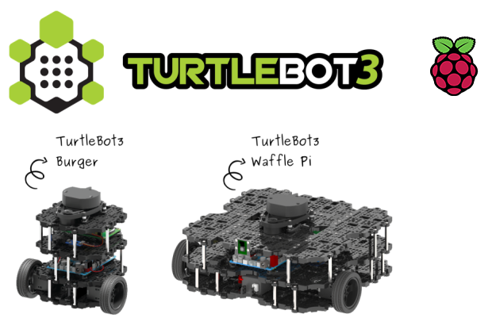

# 1. Overview

> **Source**: [https://emanual.robotis.com/docs/en/platform/turtlebot3/overview](https://emanual.robotis.com/docs/en/platform/turtlebot3/overview)

---

# Overview

> **Notice** : With the formation of the Platform Team in 2025, substantial resources will be dedicated to advancing the open platform.
> As a priority, **TurtleBot3** will receive full support for ROS 2 Humble, with **comprehensive example implementations** set for release in Q1 2025. In Q2, support will expand to **ROS 2 Jazzy** and **Gazebo Sim** , ensuring seamless integration with the latest advancements in the ROS ecosystem and simulation environments.

* The TurtleBot3 platform has been upgraded to include the Raspberry Pi 4 as the standard onboard SBC.

* TurtleBot3 Hardware also supports the use of the Nvidia Jetson Nano SBC.
* Please refer to the video below in order to set up a Jetson Nano for use with a TurtleBot3.
* The Jetson Nano Developer Kit setup instructions must be completed prior to preparation for TurtleBot3 useage.

https://youtu.be/fGEq_0aWpoA?si=04295vvKW_UPX5dP

**What is TurtleBot?**

[TurtleBot](https://www.turtlebot.com/) is a standardized robotic platform developed for [ROS](http://www.ros.org/about-ros/) education and research. The concept of the TurtleBot platform is derived from [Turtle robots](https://en.wikipedia.org/wiki/Turtle_(robot)) used to teach foundational robotics and computer science since the early 1940s. TurtleBot is designed as a simplified, easily upgradable platform to teach people who are new to ROS, and to provide a capable base system for more advanced development. Since it’s inception TurtleBot has become the standard educational ROS platform, as well as the most popular robotics platform among developers and students worldwide.

There are 4 versions of the [TurtleBot](https://www.turtlebot.com/) available now. TurtleBot1 was developed by Tully (Platform Manager at Open Robotics) and Melonee (CEO of Fetch Robotics) at Willow Garage on top of the iRobot’s Roomba-based research robot, Create, for ROS deployment. It was developed in 2010 and has been on sale since 2011. In 2012, TurtleBot2 was developed by Yujin Robot based on the research robot, iClebo Kobuki. In 2017, TurtleBot3 was developed by ROBOTIS as an improved modular design to supplement the function of its predecessors, and the demands of users. The TurtleBot4, developed by ClearPath Robotics features an iRobot Create3 base as a less modular alternative to the TurtleBot3 platform. For more information on the TurtleBot series, visit [the official TurtleBot Website](https://www.turtlebot.com/about/) for a full history of the platform.

The TurtleBot3 in specific is a small, affordable, and customizable, ROS-based mobile robot for use in education, research, hobby projects, and product prototyping. The goal of TurtleBot3 is to provide a low cost, highly flexible robotics development platform without having to sacrifice functionality and quality, while at the same time offering enough expandability to fit a wide variety of complex robotics applications. The TurtleBot3 can be customized in various ways using simple mechanical components and through the use of upgraded electronic components including custom computers and sensors. In addition, the TurtleBot3 has continued to evolve it’s out of the box performance by continually upgrading the included cost-effective and small-sized SBC suitable for robust embedded systems. The TurtleBot3’s core technology of [SLAM](https://en.wikipedia.org/wiki/Simultaneous_localization_and_mapping) , [Navigation](https://en.wikipedia.org/wiki/Robot_navigation) and [Manipulation](https://en.wikipedia.org/wiki/Robotic_manipulation) makes it suitable for a wide variety of research and service robotics applications.

**How to contribute to ROS and TurtleBot?**

TurtleBot3 is a collaborative project between Open Robotics, ROBOTIS, and many more partners including The Construct, Intel, Onshape, OROCA, AuTURBO, ROS in Robotclub Malaysia, Astana Digital, Polariant Experiment, Tokyo University of Agriculture and Technology, GVlab, Networked Control Robotics Lab at National Chiao Tung University, SIM Group at TU Darmstadt. Open Robotics is in charge of software and community activities, while ROBOTIS is in charge of manufacturing and global distribution.

The most important part of the TurtleBot3 collaboration project is the open source based software, hardware, and community around the platform. As such, ROBOTIS is always encouraging more partners and research collaborators to participate in this project to enrich the robotics field as a whole.

If you are interested in partnership with us to continue to further the development of open source robotics, please fill out this form to learn more about how we can work together.

TurtleBot3 Providers

TurtleBot3 Partners and Research Collaborators

* Each collaboration member’s web page can be found here.

TurtleBot3 Distributors

* Each collaboration member’s web page can be found here.

TurtleBot3 Map

## Notices

Notices
 Check out these ROS and TurtleBot3 Publications:

23/01/2025 Official resumption of TurtleBot3 maintenance and development!
09/06/2021 TurtleBot3 has been upgraded with Raspberry Pi 4!!!
05/28/2021 TurtleBot3 Autorace 2020 now runs with ROS Noetic
05/24/2021 ROS 2 Galactic Geochelone Release
12/20/2020 Webots supports TurtleBot3 with ROS 2 Foxy
10/15/2020 ROS 2 Foxy Release
08/21/2019 ROS 2 Dashing Release
08/20/2019 Navigation2 Dashing release - demo video
02/01/2019 Announcing new packages for TurtleBot3 in ROS2 (including Cartographer and Navigation2)
12/17/2018 ros2arduino released: Arduino library for communicating with ROS 2
09/21/2018 XEL Network first application + Distributing XEL devices 100 set for free in ROScon2018!
09/13/2018 Introducing the XEL Network : Modular H/W ecosystem over ROS2
09/05/2018 Introducing ROS2 Tutorials
08/08/2018 Machine Learning tutorial
08/08/2018 TurtleBot3 AutoRace in ROS Development Studio
08/07/2018 Tutorial for Task Mission in ROS Development Studio
07/18/2018 New ROS Online Course for Beginner
07/03/2018 TurtleBot3 AutoRace with Gazebo
05/25/2018 Announcing TurtleBot3 Software(v1.0.0) and Firmware(v1.2.0) Update
05/21/2018 Reinforcement Learning with TB3!
05/16/2018 1 Year of TurtleBot3: Call for Collaboration (by 23 MAY)
05/11/2018 TurtleBot3 with OpenMANIPULATOR is released
04/27/2018 Awesome TurtleBot3 Projects like BallBot Project
04/20/2018 TurtleBot3 Automatic Parking under AR detection
03/29/2018 TurtleBot3 AutoRace 2017 Tutorial & Source Codes released
03/17/2018 TurtleBot3 Auto project
03/15/2018 Gazebo Simulation
02/19/2018 Waffle Pi Launching Event!
02/08/2018 ROS Robot Programming, A Handbook is written by TurtleBot3 Developers
02/02/2018 How to use LDS-01 of TurtleBot3
01/30/2018 TurtleBot3 Basic operation demo
01/26/2018 TurtleBot3 projects in KAIST
01/18/2018 TurtleBot3 Software, Firware Update
01/17/2018 TurtleBot3 Automatic parking demo
11/07/2017 ARM TechCon: Best Contribution to an Open-Source Software Project
09/20/2017 TurtleBot3 AutoRace 2017 teaser #2
09/13/2017 TurtleBot3 AutoRace 2017 teaser #1
07/31/2017 TurtleBot3 Burger Assembly Video
06/07/2017 TurtleBot3 Follow Demo
05/29/2017 Exhibition, Party, and Tutorials with TurtleBot3 at ICRA2017
05/11/2017 TurtleBot3 Early-Bird Discount Offer (until May 29)
05/08/2017 Don’t miss FREE TB3 Burger event!
05/08/2017 Very informative and detailed review by Erico Guizzo and Evan Ackerman
04/24/2017 TurtleBot3 Friends
04/12/2017 TurtleBot3 with Laser Distance Sensor (LDS)
04/05/2017 Gazebo simulator
03/21/2017 TurtleBot3 official wiki site (technical information)
03/15/2017 TurtleBot3 with OpenCR
03/08/2017 TurtleBot3 Hardware: Free for YOU!
03/01/2017 TurtleBot3 Auto project
02/21/2017 TurtleBot3 RoadTrain
02/01/2017 TurtleBot3 Segway
01/25/2017 Assembling the TurtleBot3
01/17/2017 TurtleBot3 Tank
12/28/2016 TurtleBot3 Omni wheel and Mecanum wheel Example
12/23/2016 TurtleBot3 Autonomous Car
12/21/2016 The TurtleBot3 - The Journey of the Turtlebot with R2D2
12/13/2016 The TurtleBot3 Example #10 The Journey of the Turtlebot
12/05/2016 SLAM with the TurtleBot3
11/23/2016 The TurtleBot3 Teleoperation Example
11/21/2016 The TurtleBot3 Example #01 Parallel Translation with 4 Joints and 4 Wheels
11/16/2016 Payload Test of TurtleBot3
10/13/2016 Announcing TurtleBot3
 Click to expand recent news.

11/12/2020 ROS World 2020: ROBOTIS TurtleBot3 Parallel Session
07/22/2019 Top 10 ROS-based robotics companies in 2019, The Robot Report
12/10/2018 Robot Gift Guide 2018, IEEE Spectrum
11/26/2018 AWS RoboMaker – Develop, Test, Deploy, and Manage Intelligent Robotics Apps, AWS News Blog
10/01/2018 Microsoft Announces Experimental Release of ROS for Windows 10, IEEE Spectrum
09/29/2018 “XEL Network : modular H/W ecosystem using ROS2” on ROSCon2018, PDF, Video
09/14/2018 “Introduction of Open Robot Platform: mobile robot, manipulator, humanoid, hand” on ROSCon JP 2018, PDF, Video
07/06/2018 Video Friday: Roboy, AI Ethics, and Big Clapper
02/02/2018 Video Friday: Waffle Robots, Laser vs. Drone, and TurtleBot Tutorials, IEEE Spectrum
11/30/2017 Robot Gift Guide 2017, IEEE Spectrum
11/07/2017 10 Memorable ROS-based Robots, Robotics Trends
11/07/2017 TurtleBot 3 and Friends: A Lower Barrier of Entry for Exploring A.I. Robotics, ThomasNet
10/24/2017 Announcing the Arm TechCon Innovation Award Finalists, arm TechCon
10/13/2017 Top 10 Open Source Linux Robots, Linux.com
09/22/2017 “TurtleBot3 AutoRace” on ROSCon2017, PDF, Video
09/21/2017 “Introducing OpenMANIPULATOR; the full open robot platform” on ROSCon2017, PDF, Video
07/16/2017 The TurtleBot3 Teacher: Learn the ROS platform with this robot kit, IEEE Spectrum
06/16/2017 Turtlebot3, the Open Source Ubuntu/ROS-Based Robot Kit, Open Electronics
06/14/2017 Open Source TurtleBot 3 Robot Kit Runs Ubuntu and ROS on Raspberry Pi, Linux.com
06/09/2017 Ubuntu-driven TurtleBot gets a major rev with a Pi or Joule in the driver’s seat, LinuxGizmos.com
05/31/2017 The Turtlebot 3 has launched, Ubuntu
05/29/2017 All the Latest, Most Exciting Robotics Research From ICRA 2017, IEEE Spectrum
05/17/2017 The Silicon Valley Startup Creating Robot DNA, Bloomberg
05/02/2017 Hands-on With TurtleBot 3, a Powerful Little Robot for Learning ROS, IEEE Spectrum
12/28/2016 Celebrating 9 Years of ROS, ROBOHUB
10/13/2016 Advances in robotics made easier by forthcoming 3D printed TurtleBot, 3D Printing Industry
10/12/2016 Robotis and OSRF Announce TurtleBot 3: Smaller, Cheaper, and Modular, IEEE Spectrum
09/21/2016 “Introducing the Turtlebot3” on ROSCon2016, PDF, Video
03/26/2013 TurtleBot Inventors Tell Us Everything About the Robot, IEEE Spectrum

