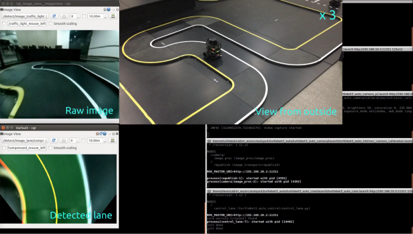
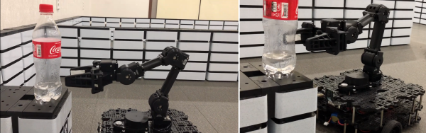
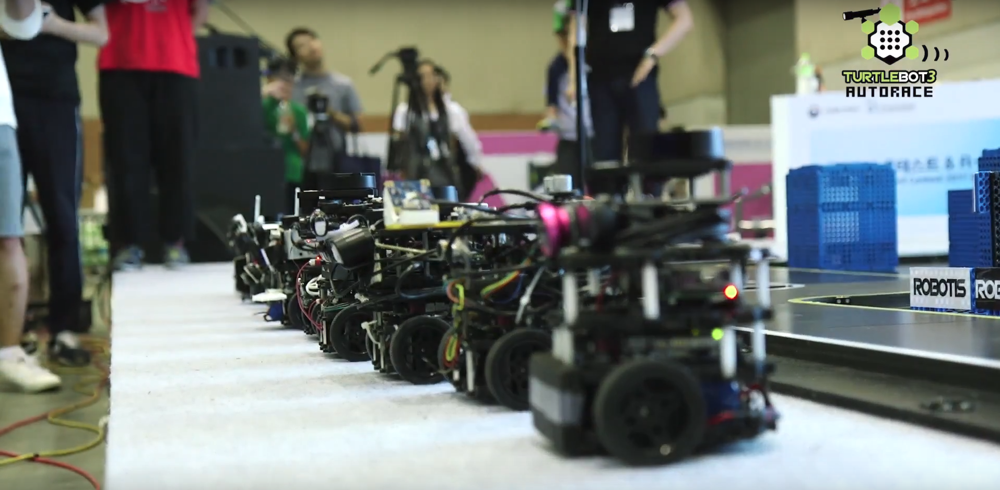

> **Source**: [https://emanual.robotis.com/docs/en/platform/turtlebot3/challenges](https://emanual.robotis.com/docs/en/platform/turtlebot3/challenges)
---

## 1.2 Events

### 1.2.1 Online Competition on RDS

#### 1.2.1.1 Online Competition using TurtleBot3

ROBOTIS has prepared an online competition on [ROS Development Studio (RDS)](http://www.theconstructsim.com/rds-ros-development-studio/) for the TurtleBot3 AutoRace and Task Mission using TurtleBot3 and OpenManipulator. You can participate free of charge in this online competition and learn about SLAM, Navigatin, Autonomous driving, Manipulation in a structured experimental environment.

- [ROS Development Studio Howto](https://www.youtube.com/playlist?list=PLK0b4e05LnzYGvX6EJN1gOQEl6aa3uyKS)

#### 1.2.1.2 TurtleBot3 AutoRace on RDS

- [TurtleBot3 AutoRace](https://rds.theconstructsim.com/tc_projects/use_project_share_link/21e00583-6e60-415a-aa66-bd2c78e0733a)

For more information or if you want to launch it in your remote PC, please visit [Autonomous Driving](https://emanual.robotis.com/docs/en/platform/turtlebot3/autonomous_driving/#autonomous-driving) section.

#### 1.2.1.3 Task Mission using TurtleBot3 and OpenManipulator on RDS

- [Task Mission using TurtleBot3 and OpenManipulator](https://rds.theconstructsim.com/tc_projects/use_project_share_link/b345dbb4-c806-4822-919e-84b7cf00c8c0)

For more information about it or if you want to launch it in your remote PC, please visit [Manipulation](https://emanual.robotis.com/docs/en/platform/turtlebot3/manipulation/#bringup) section.

#### 1.2.1.4 ROS Development Studio (RDS)

[ROS Development Studio (RDS)](http://www.theconstructsim.com/rds-ros-development-studio/) is an online IDE which allows you program and test any robot using only a web browser. With RDS, you will be able to: Develop ROS programs for robots in a faster way, with an already setup IDE environment that includes autocomplete. Test the programs in real time on the provided simulated robots. Use the provided simulations or upload your own. Quickly see the results of your programming. Debug using graphical ROS tools. Test what you have developed on RDS in the real robot (if you have it all of these are using ONLY a web browser without any installation and not limited by any operating system. DEVELOP FOR ROS USING WINDOWS, LINUX OR OSX. Please refer to the following link for further information on TurtleBot3 related [lectures and reference materials](https://emanual.robotis.com/docs/en/platform/turtlebot3/learn/#the-construct) provided by [The Construct](http://www.theconstructsim.com/) .

### 1.2.2 Offline Competition

#### 1.2.2.1 TurtleBot3 Maze Solving @ FIRA Malaysia 2018

https://youtu.be/5XERzM6ZfJg?si=iYM8Hwcg5P2yVncd

https://youtu.be/AamHifhvNMs?si=MHeZjNFvX88mbOnU

- Video#1 [https://youtu.be/5XERzM6ZfJg](https://youtu.be/5XERzM6ZfJg)
- Video#2 [https://youtu.be/AamHifhvNMs](https://youtu.be/AamHifhvNMs)
- Video#3 [https://youtu.be/72SDxhgmnBg](https://youtu.be/72SDxhgmnBg)
- SourceCode [https://github.com/arixrobotics/fira_maze](https://github.com/arixrobotics/fira_maze)

#### 1.2.2.2 Robosot (office task challenge) using TurtleBot3 @ FIRA Malaysia 2018

- For more information, please see the following [page](https://www.facebook.com/FiraPoliteknikMalaysia/videos/1409162685896584/) .

#### 1.2.2.3 GdR TurtleBot Challenge 2018 (TU Darmstadt)

https://youtu.be/OdLsbAMy7m0?si=gtBscBXyjaqX7rSE

- “Monka” vs. “Ninja Turtle” [https://youtu.be/OdLsbAMy7m0](https://youtu.be/OdLsbAMy7m0)
- “Turtle Machine” vs. “TurtleBot 6” [https://youtu.be/L8PHxUR54dM](https://youtu.be/L8PHxUR54dM)
- For more videos, please see the following [link](https://www.youtube.com/channel/UCqvqk6E7g4z5idx6yseR6Ug) .

#### 1.2.2.4 Autonomous Mobile Robot Competition (Dankook University)

### 1.2.3 AutoRace RBIZ Challenge

#### 1.2.3.1 AutoRace - RBIZ Challenge 2017

- For more information, please see the following [page](https://emanual.robotis.com/docs/en/platform/turtlebot3/autorace_rviz_challenge) .

#### 1.2.3.2 AutoRace - RBIZ Challenge 2018

- The competition will be held in Daegu, Korea on November 15-17.

#### 1.2.3.3 AutoRace RBIZ Challenge 2017

- Official release of TurtleBot3 AutoRace AutoRace Source CodeAutoRace TrackAutoRace Referee System
  - [AutoRace Source Code](http://wiki.ros.org/turtlebot3_autorace)
  - [AutoRace Track](https://github.com/ROBOTIS-GIT/autorace_track)
  - [AutoRace Referee System](https://github.com/ROBOTIS-GIT/autorace_referee)

- Participants sources

| Place | Team | Source link |
|:----------:|:----------:|:----------:|
| 1 | RealRiceThief | [Github](https://github.com/KoG-8/Turtlebot_RealRiceThief) | 
| 2 | IronHeart | [Github](https://github.com/kijongGil/Ironheart) | 
| 3 | Robit | [Github](https://github.com/ROBIT-GIT/turtlebot3_autoRace_2017) | 
| 4 | Loading | [Github](https://github.com/AuTURBO/autorace2017-team-loading) | 
| 5 | RunHoney | Github | 
| 6 | Sherlotics | Github | 
| 7 | FastAndFurious | Github | 
| 8 | BonoBono | Github | 
| 9 | BeginAgain | Github | 
| 10 | Hanzo | [Github](https://github.com/DeokYun/autorace) | 
| 11 | Codis | will be released soon | 
| 12 | Zero | [Github](https://github.com/dongwan123/zero_turtlebot_competition) | 
| 13 | CanDynamix| [Github](https://github.com/candynamix/can_dynamix) | 
| 14 | Cena | retire | 
| 15 | TogetherChaChaCha | retire | 

#### 1.2.3.4 TurtleBot3 AutoRace 2017 Teaser

- Official Teaser #1
https://youtu.be/9Wnu8If1eS4?si=7NcEL0F_5SDhsVNh

- Official Teaser #2
https://youtu.be/47YnSBAssOM?si=yI7T1vCR6DW6pQHz

- Official Final Video
https://youtu.be/DWDBAHHQi_k?si=F73ab5UEEqw8URfh

#### 1.2.3.5 TurtleBot3 AutoRace 2017 Challengers

- Video - Team RealRiceThief (1st Place)
https://youtu.be/szhllE1T_cg?si=S8wpNa9vKVE0eBQd

- TurtleBot3 was tested its driving autonomy under the open source from MIT DuckieTown engineering.
https://youtu.be/1V33iEu4ylw?si=n1MVRZzwEdAritU4

#### 1.2.3.6 AutoRace RBIZ Challenge 2018

https://youtu.be/6t6cyFiGLvs?si=Q5SJVTrkgKixcD7L

| Place | Team | Source link |
| --- | --- | --- |
| 1 | ROBIT | Github |
| 2 | Au-Di | Github |
| 3 | ROBIT2 | will be released soon |
| 4 | Wang Bam Ppang | Github |
| 5 | Four Leaf Clover | will be released soon |
| 6 | AuTURBO | Github |
| 7 | MATLABurger | will be released soon |
| 8 | Eung Chang Ho | Github |
| 9 | ZETIN | will be released soon |
| 10 | ROSMASTER | will be released soon |
