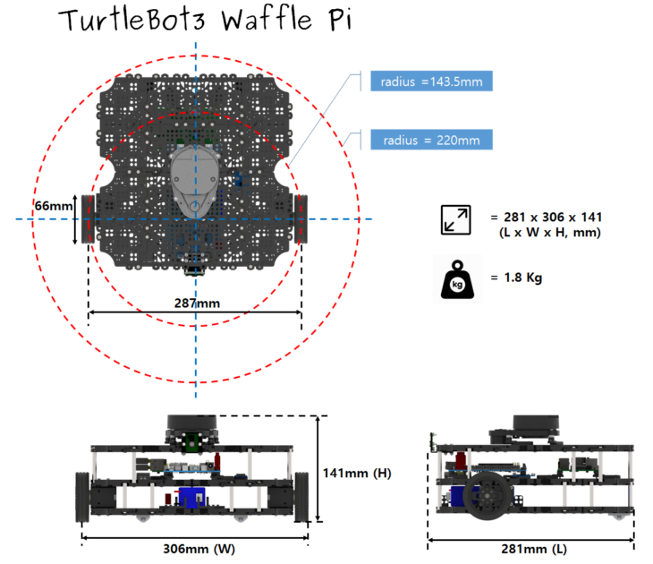
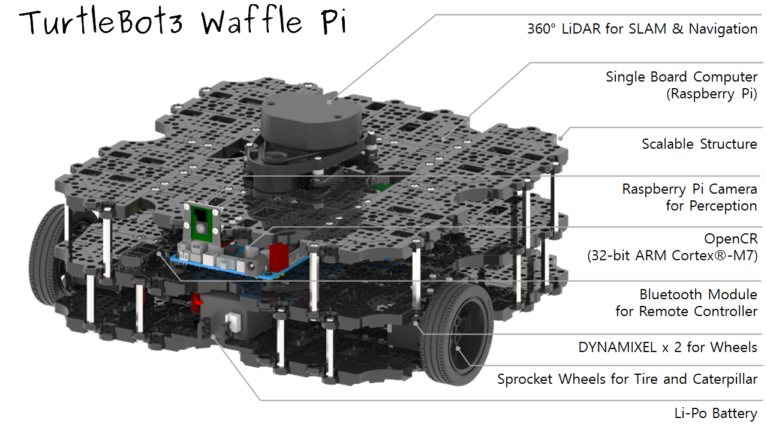

# Features

> **Source**: [https://emanual.robotis.com/docs/en/platform/turtlebot3/features](https://emanual.robotis.com/docs/en/platform/turtlebot3/features)

---

# Features

## Specifications

### Hardware Specifications

| Items | Burger | Waffle Pi |
| --- | --- | --- |
| Maximum translational velocity | 0.22 m/s | 0.26 m/s |
| Maximum rotational velocity | 2.84 rad/s (162.72 deg/s) | 1.82 rad/s (104.27 deg/s) |
| Maximum payload | 15kg | 30kg |
| Size (L x W x H) | 138mm x 178mm x 192mm | 281mm x 306mm x 141mm |
| Weight (+ SBC + Battery + Sensors) | 1kg | 1.8kg |
| Climbing Threshold | 10 mm or lower | 10 mm or lower |
| Expected operating time | 2h 30m | 2h |
| Expected charging time | 2h 30m | 2h 30m |
| SBC (Single Board Computer) | Raspberry Pi 4 | Raspberry Pi 4 |
| MCU | 32-bit ARM Cortex®-M7 with FPU (216 MHz, 462 DMIPS) | 32-bit ARM Cortex®-M7 with FPU (216 MHz, 462 DMIPS) |
| Remote Controller | - | RC-100B + BT-410 Set (Bluetooth 4, BLE) |
| Actuator | XL430-W250 | XM430-W210 |
| LDS (Laser Distance Sensor) | 360 Laser Distance SensorLDS-02 | 360 Laser Distance SensorLDS-02 |
| Camera | - | Raspberry Pi Camera Module v2.1 |
| IMU | Gyroscope 3 AxisAccelerometer 3 Axis | Gyroscope 3 AxisAccelerometer 3 Axis |
| Power connectors | 3.3V / 800mA5V / 4A12V / 1A | 3.3V / 800mA5V / 4A12V / 1A |
| Expansion pins | GPIO 18 pinsArduino 32 pin | GPIO 18 pinsArduino 32 pin |
| Peripheral Connections | UART x3, CAN x1, SPI x1, I2C x1, ADC x5, 5pin OLLO x4 | UART x3, CAN x1, SPI x1, I2C x1, ADC x5, 5pin OLLO x4 |
| DYNAMIXEL ports | RS485 x 3, TTL x 3 | RS485 x 3, TTL x 3 |
| Audio | Several programmable beep sequences | Several programmable beep sequences |
| Programmable LEDs | User LED x 4 | User LED x 4 |
| Status LEDs | Board status LED x 1Arduino LED x 1Power LED x 1 | Board status LED x 1Arduino LED x 1Power LED x 1 |
| Buttons and Switches | Push buttons x 2, Reset button x 1, Dip switch x 2 | Push buttons x 2, Reset button x 1, Dip switch x 2 |
| Battery | Lithium polymer 11.1V 1800mAh / 19.98Wh 5C | Lithium polymer 11.1V 1800mAh / 19.98Wh 5C |
| PC Connection | USB | USB |
| Firmware Upgrade | via USB / via JTAG | via USB / via JTAG |
| Power Adapter (SMPS) | Input : 100-240V, AC 50/60Hz, 1.5A @maxOutput : 12V DC, 5A | Input : 100-240V, AC 50/60Hz, 1.5A @maxOutput : 12V DC, 5A |

### Dimension and Mass

#### Data of TurtleBot3 Burger

#### Data of TurtleBot3 Waffle Pi

## Components

### Parts List

TurtleBot3 is available in two types of models: `Burger` and `Waffle Pi` .  The following table shows the lists of components. The major differences between two models are the actuators, the SBC(Single Board Computer) and the Sensors.

|  | Part Name | Burger | Waffle Pi |
| --- | --- | --- | --- |
| Chassis Parts | Waffle Plate | 8 | 24 |
| . | Plate Support M3x35mm | 4 | 12 |
| . | Plate Support M3x45mm | 10 | 10 |
| . | PCB Support | 12 | 12 |
| . | Wheel | 2 | 2 |
| . | Tire | 2 | 2 |
| . | Ball Caster | 1 | 2 |
| . | Camera Bracket | 0 | 1 |
| Motors | DYNAMIXEL (XL430-W250-T) | 2 | 0 |
| . | DYNAMIXEL (XM430-W210-T) | 0 | 2 |
| Boards | OpenCR1.0 | 1 | 1 |
| . | *Raspberry Pi | 1 | 1 |
| . | USB2LDS | 1 | 1 |
| Remote Controllers | BT-410 Set (Bluetooth 4, BLE) | 0 | 1 |
| . | RC-100B (Remote Controller) | 0 | 1 |
| Sensors | **LDS-01orLDS-02 | 1 | 1 |
| . | Raspberry Pi Camera v2.1 | 0 | 1 |
| Memory | MicroSD Card | 1 | 1 |
| Cables | Raspberry Pi Power Cable | 1 | 1 |
| . | Li-Po Battery Extension Cable | 1 | 1 |
| . | DYNAMIXEL to OpenCR Cable | 2 | 2 |
| . | USB Cable | 2 | 2 |
| . | Camera Cable | 0 | 1 |
| Powers | SMPS 12V5A | 1 | 1 |
| . | A/C Cord | 1 | 1 |
| . | LIPO Battery 11.1V 1,800mAh | 1 | 1 |
| . | LIPO Battery Charger | 1 | 1 |
| Tools | Screw driver | 1 | 1 |
| . | Rivet tool | 1 | 1 |
| Miscellaneous | PH_M2x4mm_K | 8 | 8 |
| . | PH_T2x6mm_K | 4 | 8 |
| . | PH_M2x12mm_K | 0 | 4 |
| . | PH_M2.5x8mm_K | 16 | 16 |
| . | PH_M2.5x12mm_K | 0 | 20 |
| . | PH_T2.6x12mm_K | 16 | 0 |
| . | PH_M2.5x16mm_K | 4 | 4 |
| . | PH_M3x8mm_K | 44 | 140 |
| . | NUT_M2 | 0 | 4 |
| . | NUT_M2.5 | 20 | 24 |
| . | NUT_M3 | 16 | 96 |
| . | Rivet_1 | 14 | 22 |
| . | Rivet_2 | 2 | 2 |
| . | Spacer | 4 | 4 |
| . | Silicone Spacer | 0 | 4 |
| . | Bracket | 5 | 6 |
| . | Adapter Plate | 1 | 1 |

* The [Raspberry Pi 3 Model B+](https://www.raspberrypi.org/products/raspberry-pi-3-model-b-plus/) was included as standard starting in 2019. Earlier models are equipped with a [Raspberry Pi 3 Model B](https://www.raspberrypi.org/products/raspberry-pi-3-model-b/) .  * The [Raspberry Pi 4 Model B](https://www.raspberrypi.org/products/raspberry-pi-4-model-b/) has been included as standard since 2021 September.  * The [LDS-02](https://emanual.robotis.com/docs/en/platform/turtlebot3/appendix_lds_02/) has replaced the previous generation [LDS-01](https://emanual.robotis.com/docs/en/platform/turtlebot3/appendix_lds_01/) since 2022.

The TurtleBot3 Waffle is discontinued due to the EOL of the [Intel® Joule™ 570x](http://ark.intel.com/products/96414/Intel-Joule-570x-Developer-Kit) SBC.

### Open Source Hardware

Complete CAD data is available in Onshape, a full-cloud 3D CAD editor accessible through a web browser from your PC or from portable devices.

- [TurtleBot3 Burger 3D Model](http://www.robotis.com/service/download.php?no=676)
- [TurtleBot3 Waffle 3D Model](http://www.robotis.com/service/download.php?no=677)
- [TurtleBot3 Waffle Pi 3D Model](http://www.robotis.com/service/download.php?no=678)
