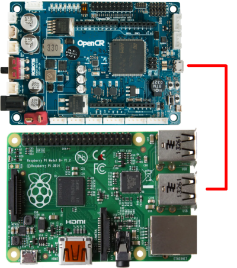
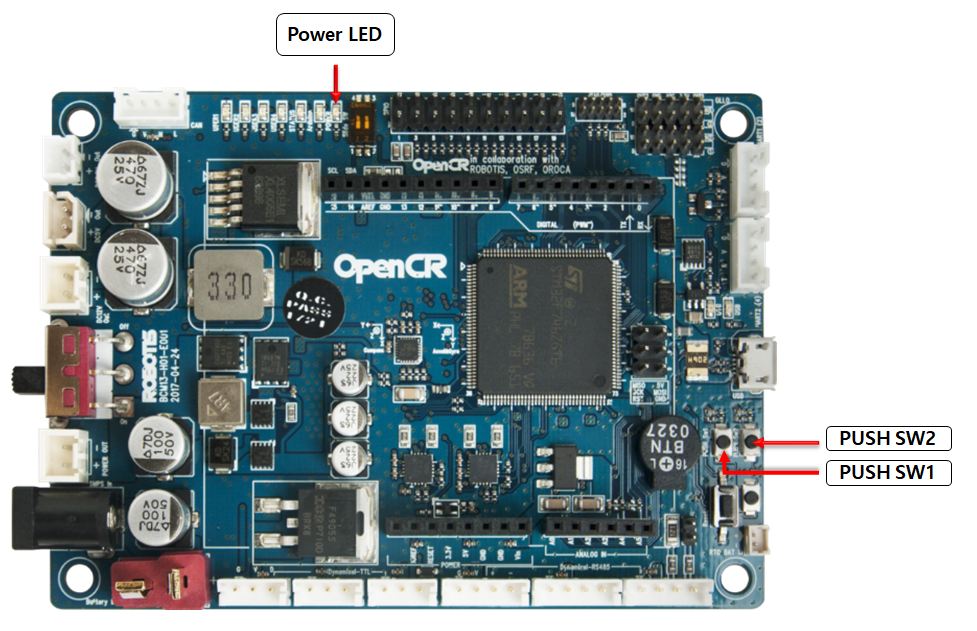

> **Source**: [https://emanual.robotis.com/docs/en/platform/turtlebot3/opencr_setup](https://emanual.robotis.com/docs/en/platform/turtlebot3/opencr_setup)

---
#TOC

1. [Humble](#humble)
2. [Jazzy](#jazzy)
3. [Noetic](#noetic)

---
# Humble

## 3.3 OpenCR Setup

1. Connect the [OpenCR](https://emanual.robotis.com/docs/en/parts/controller/opencr10/) to the Rasbperry Pi using a micro USB cable.  


2. Install the required packages on the Raspberry Pi in order to upload the [OpenCR](https://emanual.robotis.com/docs/en/parts/controller/opencr10/) firmware.  
**[TurtleBot3 SBC]** 
```
$ sudo dpkg --add-architecture armhf  
$ sudo apt-get update  
$ sudo apt-get install libc6:armhf  
```

3. Depending on your specific model, specify either `burger` or `waffle` for the **OPENCR_MODEL** name.  
**[TurtleBot3 SBC]** 
```
$ export OPENCR_PORT=/dev/ttyACM0  
$ export OPENCR_MODEL=burger
$ rm -rf ./opencr_update.tar.bz2  
```

4. Download the firmware and required loader, then extract the file to prepare for upload. 
**[TurtleBot3 SBC]** 
```
$ wget https://github.com/ROBOTIS-GIT/OpenCR-Binaries/raw/master/turtlebot3/ROS2/latest/opencr_update.tar.bz2   
$ tar -xvf opencr_update.tar.bz2 
```

5. Upload firmware to the OpenCR.  
**[TurtleBot3 SBC]** 
```
$ cd ./opencr_update  
$ ./update.sh $OPENCR_PORT $OPENCR_MODEL.opencr  
```

6. A successful firmware upload for the TurtleBot3 Burger will look like this:


7. If the firmware upload fails, try uploading again through recovery mode according to the following instructions. While in recovery mode, the `STATUS` led of the [OpenCR](https://emanual.robotis.com/docs/en/parts/controller/opencr10/) will blink periodically. 
   * Hold down the `PUSH SW2` button.
   * Press the `Reset` button.
   * Release the `Reset` button.


   
   * Release thePUSH SW2button.


 Click here to expand more details about firmware uploads using the Arduino IDE

Please be aware that the OpenCR board manager does not support Arduino IDE on ARM based SBCs such as Raspberry Pi or NVidia Jetson.
In order to upload the OpenCR firmware using the Arduino IDE, please follow the below instructions on your PC.

If you are using Linux, please configure the USB ports for OpenCR use. For other operating systems (OSX or Windows), you can skip this step.
$ wget https://raw.githubusercontent.com/ROBOTIS-GIT/OpenCR/master/99-opencr-cdc.rules
$ sudo cp ./99-opencr-cdc.rules /etc/udev/rules.d/
$ sudo udevadm control --reload-rules
$ sudo udevadm trigger
$ sudo apt install libncurses5-dev:i386
Install Arduino IDE.
Download the latest Arduino IDE
After completing installation, run the Arduino IDE.

Press Ctrl + , to open the Preferences menu

Enter the below address in the Additional Boards Manager URLs.
https://raw.githubusercontent.com/ROBOTIS-GIT/OpenCR/master/arduino/opencr_release/package_opencr_index.json


Open the TurtleBot3 firmware. Please select the correct firmware, depending on your specific model .
Burger : File > Examples > Turtlebot3 ROS2 > turtlebot3_burger
Waffle/Waffle Pi : File > Examples > Turtlebot3 ROS2 > turtlebot3_waffle
Connect the OpenCR to the PC and Select OpenCR > OpenCR Board from the Tools > Board menu.

Select the USB port with the OpenCR connected from the Tools > Port menu.

Upload the TurtleBot3 firmware sketch with Ctrl + U or the upload icon.


If the firmware upload fails, try uploading again through recovery mode according to the following instructions. While in recovery mode, the STATUS led of the OpenCR will blink periodically.
Hold down the PUSH SW2 button.
Press the Reset button.
Release the Reset button.
Release the PUSH SW2 button. 

### 3.2.1 OpenCR Test

> **NOTE** : If the wheels do not move while performing the OpenCR Test, refer to the” **TurtleBot3 DYNAMIXEL setup instructions** ” to update the DYNAMIXEL’s configuration.

You can use `PUSH SW 1` and `PUSH SW 2` buttons to see whether your robot has been properly assembled. This process tests the left and right DYNAMIXEL configurations and the [OpenCR](https://emanual.robotis.com/docs/en/parts/controller/opencr10/) board firmware.



1. After assembling the TurtleBot3, connect power to the [OpenCR](https://emanual.robotis.com/docs/en/parts/controller/opencr10/) and turn on the power switch. The red `Power LED` will be turned on.
2. Place the robot on flat ground in a wide open area. For the test, a safety radius of 1 meter (40 inches) is recommended.
3. Press and hold `PUSH SW 1` for a few seconds to command the robot to move 30 centimeters (about 12 inches) forward.
4. Press and hold `PUSH SW 2` for a few seconds to command the robot to rotate 180 degrees in place.

---

## OpenCR Setup

1. Connect the [OpenCR](https://emanual.robotis.com/docs/en/parts/controller/opencr10/) to the Rasbperry Pi using a micro USB cable.  
2. Install the required packages on the Raspberry Pi in order to upload the [OpenCR](https://emanual.robotis.com/docs/en/parts/controller/opencr10/) firmware.  **[TurtleBot3 SBC]** $sudodpkg--add-architecturearmhf$sudoapt-get update$sudoapt-getinstalllibc6:armhf
3. Depending on your specific model, specify either `burger` or `waffle` for the **OPENCR_MODEL** name.  **[TurtleBot3 SBC]** $exportOPENCR_PORT=/dev/ttyACM0$exportOPENCR_MODEL=burger$rm-rf./opencr_update.tar.bz2
4. Download the firmware and required loader, then extract the file to prepare for upload. **[TurtleBot3 SBC]** $wget https://github.com/ROBOTIS-GIT/OpenCR-Binaries/raw/master/turtlebot3/ROS2/latest/opencr_update.tar.bz2$tar-xvfopencr_update.tar.bz2
5. Upload firmware to the OpenCR.  **[TurtleBot3 SBC]** $cd./opencr_update$./update.sh$OPENCR_PORT$OPENCR_MODEL.opencr
6. A successful firmware upload for the TurtleBot3 Burger will look like this:
7. If the firmware upload fails, try uploading again through recovery mode according to the following instructions. While in recovery mode, the `STATUS` led of the [OpenCR](https://emanual.robotis.com/docs/en/parts/controller/opencr10/) will blink periodically. Hold down thePUSH SW2button.Press theResetbutton.Release theResetbutton.Release thePUSH SW2button.


### OpenCR Test

**NOTE** : If the wheels do not move while performing the OpenCR Test, refer to the” **TurtleBot3 DYNAMIXEL setup instructions** ” to update the DYNAMIXEL’s configuration.

You can use `PUSH SW 1` and `PUSH SW 2` buttons to see whether your robot has been properly assembled. This process tests the left and right DYNAMIXEL configurations and the [OpenCR](https://emanual.robotis.com/docs/en/parts/controller/opencr10/) board firmware.


1. After assembling the TurtleBot3, connect power to the [OpenCR](https://emanual.robotis.com/docs/en/parts/controller/opencr10/) and turn on the power switch. The red `Power LED` will be turned on.
2. Place the robot on flat ground in a wide open area. For the test, a safety radius of 1 meter (40 inches) is recommended.
3. Press and hold `PUSH SW 1` for a few seconds to command the robot to move 30 centimeters (about 12 inches) forward.
4. Press and hold `PUSH SW 2` for a few seconds to command the robot to rotate 180 degrees in place.

---

## OpenCR Setup

1. Connect the [OpenCR](https://emanual.robotis.com/docs/en/parts/controller/opencr10/) to the Rasbperry Pi using a micro USB cable.  
2. Install the required packages on the Raspberry Pi in order to upload the [OpenCR](https://emanual.robotis.com/docs/en/parts/controller/opencr10/) firmware.  **[TurtleBot3 SBC]** $sudodpkg--add-architecturearmhf$sudoapt-get update$sudoapt-getinstalllibc6:armhf
3. Depending on your specific model, specify either `burger` or `waffle` for the **OPENCR_MODEL** name.  **[TurtleBot3 SBC]** $exportOPENCR_PORT=/dev/ttyACM0$exportOPENCR_MODEL=burger_noetic$rm-rf./opencr_update.tar.bz2
4. Download the firmware and required loader, then extract the file to prepare for upload. **[TurtleBot3 SBC]** $wget https://github.com/ROBOTIS-GIT/OpenCR-Binaries/raw/master/turtlebot3/ROS1/latest/opencr_update.tar.bz2$tar-xvfopencr_update.tar.bz2
5. Upload firmware to the OpenCR.  **[TurtleBot3 SBC]** $cd./opencr_update$./update.sh$OPENCR_PORT$OPENCR_MODEL.opencr
6. A successful firmware upload for the TurtleBot3 Burger will look like this:
7. If the firmware upload fails, try uploading again through recovery mode according to the following instructions. While in recovery mode, the `STATUS` led of the [OpenCR](https://emanual.robotis.com/docs/en/parts/controller/opencr10/) will blink periodically. Hold down thePUSH SW2button.Press theResetbutton.Release theResetbutton.Release thePUSH SW2button.


### OpenCR Test

**NOTE** : If the wheels do not move while performing the OpenCR Test, refer to the” **TurtleBot3 DYNAMIXEL setup instructions** ” to update the DYNAMIXEL’s configuration.

You can use `PUSH SW 1` and `PUSH SW 2` buttons to see whether your robot has been properly assembled. This process tests the left and right DYNAMIXEL configurations and the [OpenCR](https://emanual.robotis.com/docs/en/parts/controller/opencr10/) board firmware.


1. After assembling the TurtleBot3, connect power to the [OpenCR](https://emanual.robotis.com/docs/en/parts/controller/opencr10/) and turn on the power switch. The red `Power LED` will be turned on.
2. Place the robot on flat ground in a wide open area. For the test, a safety radius of 1 meter (40 inches) is recommended.
3. Press and hold `PUSH SW 1` for a few seconds to command the robot to move 30 centimeters (about 12 inches) forward.
4. Press and hold `PUSH SW 2` for a few seconds to command the robot to rotate 180 degrees in place.
