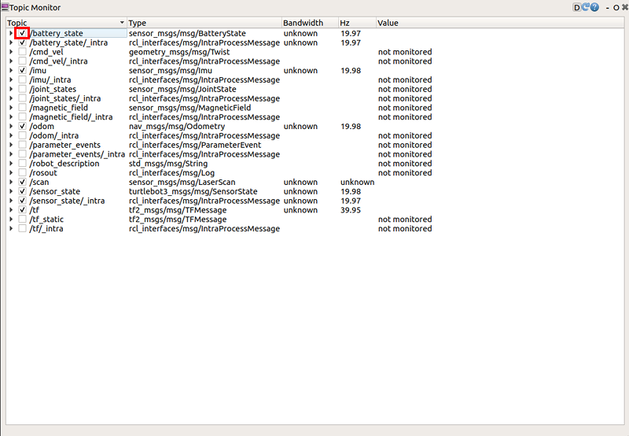
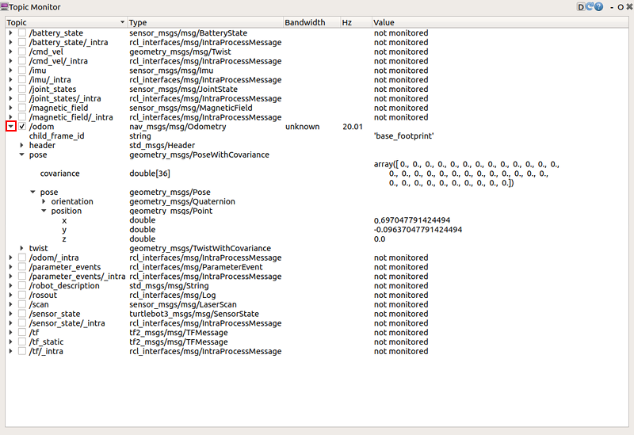
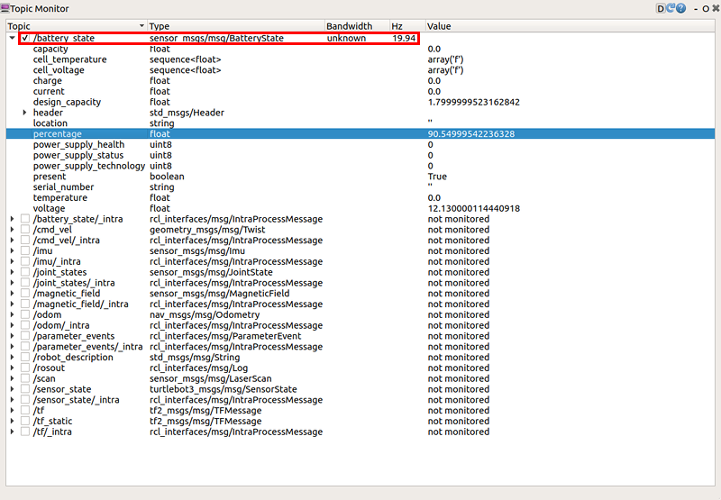

> **Source**: [https://emanual.robotis.com/docs/en/platform/turtlebot3/basic_operation](https://emanual.robotis.com/docs/en/platform/turtlebot3/basic_operation)

---
# TOC

1. [Humble](#humble)
2. [Jazzy](#jazzy)
3. [Noetic](#noetic)

---
[TOC](#toc)
# Humble

## 3.6 Basic Operation

### 3.6.1 Teleoperation

* The TurtleBot3 can be teleoperated by remote control. Make sure that the necessary ROS packages are supported for your SBC and ROS version.

https://youtu.be/Z4s18hlazb4?si=BG1B2EDN6CCOHq8y

> **WARNING** : Make sure to run [Bringup](https://emanual.robotis.com/docs/en/platform/turtlebot3/bringup/#bringup) on the TurtleBot3 SBC before teleoperation. Additionally, be careful when testing the robot on the table as the robot may drive over the edge.


#### 3.6.1.1 Keyboard

1. Open a terminal on the **Remote PC** .
2. Run the teleoperation node. Replace the `${TB3_MODEL}` with `burger` or `waffle` or `waffle_pi` , if the TURTLEBOT3_MODEL parameter is not predefined.  
**[Remote PC]**
```
$ export TURTLEBOT3_MODEL=${TB3_MODEL}
$ ros2 run turtlebot3_teleop teleop_keyboard
```

4. If the node is successfully launched, the following instructions will appear on the terminal window.  
**[Remote PC]** 
```
Control Your Turtlebot3
Moving around
     w
 a   s   d
     x
w/x : increase/decrease linear velocity (Burger : ~ 0.22, Waffle and Waffle Pi : ~ 0.26)
a/d : increase/decrease angular velocity (Burger : ~ 2.84, Waffle and Waffle Pi : ~ 1.82)
space key, s : force stop
CTRL-C to quit
```

#### 3.6.1.2 RC-100

The settings for the [ROBOTIS RC-100B](https://emanual.robotis.com/docs/en/parts/communication/rc-100/) are included in the OpenCR firmware for TurtleBot3. It can be used with the [BT410](https://emanual.robotis.com/docs/en/parts/communication/bt-410/) Bluetooth module .TurtleBot3 Waffle Pi includes this controller and Bluetooth modules. When using the RC-100B, it is not necessary to execute a specific node because `turtlebot_core` node creates a `/cmd_vel` topic in the firmware directly connected to OpeCR.


1. Connect BT-410 to any of the OpenCR UART ports.
2. Control the TurtleBot3 with RC-100. Up / Down : Increase or decrease linear velocityLeft / Right : Increase or decrease angular velocity


#### 3.6.1.3 PS3 Joystick

1. Connect the PS3 Joystick to theRemote PCvia Bluetooth or a USB cable.
2. Install the `ds4drv` package using pip.  **[Remote PC]** $sudopipinstallds4drv
3. Launch the joystick node.  **[Remote PC]** $sudods4drv$ros2 run joy joy_node
4. Open a new terminal and launch the teleoperation node.  **[Remote PC]** $ros2 run teleop_twist_joy teleop_node


#### 3.6.1.4 XBOX 360 Joystick

1. Connect the XBOX 360 Joystick to the remote PC with the Wireless Adapter or USB cable.
2. Open a terminal on theRemote PC.
3. Launch the joystick node.  **[Remote PC]** $ros2 run joy joy_node
4. Open a new terminal and launch the teleoperation node.  **[Remote PC]** $ros2 run teleop_twist_joy teleop_node


### 3.6.2 Topic Monitor

1. Run rqt from the PC with the command below. If the topic monitor window is not displayed, select the `plugin` -> `Topics` -> `Topic Monitor` .  
**[Remote PC]** 
```
$rqt
```


2. When the topic monitor is loaded, the topic values are not monitored by default. Click the checkbox next to each topic to monitor the topic.  <br>

3. To see more detailed topic messages, click the `▶` icon next to the checkbox.  <br>

- /battery_stateindicates a message relating to the battery condition, such as the current battery voltage and remaining capacity.  <br>

- /odomindicates a message containing the odometry of the TurtleBot3. This topic has orientation and position encoder data.  <br>

- /sensor_stateindicates a message containing encoder values, battery and torque status.  <br>

- /scanindicates a message containing LDS data, such as angle_max and min, and range_max and min.  <br>


---
[TOC](#toc)
# Jazzy

## 3.6 Basic Operation

### 3.6.1 Teleoperation

* The TurtleBot3 can be teleoperated by remote control. Make sure that the necessary ROS packages are supported for your SBC and ROS version.

https://youtu.be/Z4s18hlazb4?si=BG1B2EDN6CCOHq8y

> **WARNING** : Make sure to run [Bringup](https://emanual.robotis.com/docs/en/platform/turtlebot3/bringup/#bringup) on the TurtleBot3 SBC before teleoperation. Additionally, be careful when testing the robot on the table as the robot may drive over the edge.


#### 3.6.1.1 Keyboard

1. Open a terminal on the **Remote PC** .
2. Run the teleoperation node. Replace the `${TB3_MODEL}` with `burger` or `waffle` or `waffle_pi` , if the TURTLEBOT3_MODEL parameter is not predefined.  
**[Remote PC]**
```
$ export TURTLEBOT3_MODEL=${TB3_MODEL}
$ ros2 run turtlebot3_teleop teleop_keyboard
```

4. If the node is successfully launched, the following instructions will appear on the terminal window.  
**[Remote PC]** 
```
Control Your Turtlebot3
Moving around
     w
 a   s   d
     x
w/x : increase/decrease linear velocity (Burger : ~ 0.22, Waffle and Waffle Pi : ~ 0.26)
a/d : increase/decrease angular velocity (Burger : ~ 2.84, Waffle and Waffle Pi : ~ 1.82)
space key, s : force stop
CTRL-C to quit
```

#### 3.6.1.2 RC-100

The settings for the [ROBOTIS RC-100B](https://emanual.robotis.com/docs/en/parts/communication/rc-100/) are included in the OpenCR firmware for TurtleBot3. It can be used with the [BT410](https://emanual.robotis.com/docs/en/parts/communication/bt-410/) Bluetooth module .TurtleBot3 Waffle Pi includes this controller and Bluetooth modules. When using the RC-100B, it is not necessary to execute a specific node because `turtlebot_core` node creates a `/cmd_vel` topic in the firmware directly connected to OpeCR.


1. Connect BT-410 to any of the OpenCR UART ports.
2. Control the TurtleBot3 with RC-100. Up / Down : Increase or decrease linear velocityLeft / Right : Increase or decrease angular velocity


#### 3.6.1.3 PS3 Joystick

1. Connect the PS3 Joystick to theRemote PCvia Bluetooth or a USB cable.
2. Install the `ds4drv` package using pip.  **[Remote PC]** $sudopipinstallds4drv
3. Launch the joystick node.  **[Remote PC]** $sudods4drv$ros2 run joy joy_node
4. Open a new terminal and launch the teleoperation node.  **[Remote PC]** $ros2 run teleop_twist_joy teleop_node


#### 3.6.1.4 XBOX 360 Joystick

1. Connect the XBOX 360 Joystick to the remote PC with the Wireless Adapter or USB cable.
2. Open a terminal on theRemote PC.
3. Launch the joystick node.  **[Remote PC]** $ros2 run joy joy_node
4. Open a new terminal and launch the teleoperation node.  **[Remote PC]** $ros2 run teleop_twist_joy teleop_node


### 3.6.2 Topic Monitor

1. Run rqt from the PC with the command below. If the topic monitor window is not displayed, select the `plugin` -> `Topics` -> `Topic Monitor` .  
**[Remote PC]** 
```
$rqt
```


2. When the topic monitor is loaded, the topic values are not monitored by default. Click the checkbox next to each topic to monitor the topic.  <br>

3. To see more detailed topic messages, click the `▶` icon next to the checkbox.  <br>

- /battery_stateindicates a message relating to the battery condition, such as the current battery voltage and remaining capacity.  <br>

- /odomindicates a message containing the odometry of the TurtleBot3. This topic has orientation and position encoder data.  <br>

- /sensor_stateindicates a message containing encoder values, battery and torque status.  <br>

- /scanindicates a message containing LDS data, such as angle_max and min, and range_max and min.  <br>


---
[TOC](#toc)
# Noetic

## 3.6 Basic Operation

### 3.6.1 Teleoperation

* The TurtleBot3 can be teleoperated by remote control. Make sure that the necessary ROS packages are supported for your SBC and ROS version.

https://youtu.be/Z4s18hlazb4?si=BG1B2EDN6CCOHq8y

> **WARNING** : Make sure to run [Bringup](https://emanual.robotis.com/docs/en/platform/turtlebot3/bringup/#bringup) on the TurtleBot3 SBC before teleoperation. Additionally, be careful when testing the robot on the table as the robot may drive over the edge.


#### 3.6.1.1 Keyboard

1. Open a terminal on the **Remote PC** .
2. Run the teleoperation node. Replace the `${TB3_MODEL}` with `burger` or `waffle` or `waffle_pi` , if the TURTLEBOT3_MODEL parameter is not predefined.  
**[Remote PC]**
```
$ export TURTLEBOT3_MODEL=${TB3_MODEL}
$ ros2 run turtlebot3_teleop teleop_keyboard
```

4. If the node is successfully launched, the following instructions will appear on the terminal window.  
**[Remote PC]** 
```
Control Your Turtlebot3
Moving around
     w
 a   s   d
     x
w/x : increase/decrease linear velocity (Burger : ~ 0.22, Waffle and Waffle Pi : ~ 0.26)
a/d : increase/decrease angular velocity (Burger : ~ 2.84, Waffle and Waffle Pi : ~ 1.82)
space key, s : force stop
CTRL-C to quit
```

#### 3.6.1.2 RC-100

The settings for the [ROBOTIS RC-100B](https://emanual.robotis.com/docs/en/parts/communication/rc-100/) are included in the OpenCR firmware for TurtleBot3. It can be used with the [BT410](https://emanual.robotis.com/docs/en/parts/communication/bt-410/) Bluetooth module .TurtleBot3 Waffle Pi includes this controller and Bluetooth modules. When using the RC-100B, it is not necessary to execute a specific node because `turtlebot_core` node creates a `/cmd_vel` topic in the firmware directly connected to OpeCR.


1. Connect BT-410 to any of the OpenCR UART ports.
2. Control the TurtleBot3 with RC-100. Up / Down : Increase or decrease linear velocityLeft / Right : Increase or decrease angular velocity


#### 3.6.1.3 PS3 Joystick

1. Connect the PS3 Joystick to theRemote PCvia Bluetooth or a USB cable.
2. Install the `ds4drv` package using pip.  **[Remote PC]** $sudopipinstallds4drv
3. Launch the joystick node.  **[Remote PC]** $sudods4drv$ros2 run joy joy_node
4. Open a new terminal and launch the teleoperation node.  **[Remote PC]** $ros2 run teleop_twist_joy teleop_node


#### 3.6.1.4 XBOX 360 Joystick

1. Connect the XBOX 360 Joystick to the remote PC with the Wireless Adapter or USB cable.
2. Open a terminal on theRemote PC.
3. Launch the joystick node.  **[Remote PC]** $ros2 run joy joy_node
4. Open a new terminal and launch the teleoperation node.  **[Remote PC]** $ros2 run teleop_twist_joy teleop_node


### 3.6.2 Topic Monitor

1. Run rqt from the PC with the command below. If the topic monitor window is not displayed, select the `plugin` -> `Topics` -> `Topic Monitor` .  
**[Remote PC]** 
```
$rqt
```


2. When the topic monitor is loaded, the topic values are not monitored by default. Click the checkbox next to each topic to monitor the topic.  <br>

3. To see more detailed topic messages, click the `▶` icon next to the checkbox.  <br>

- /battery_stateindicates a message relating to the battery condition, such as the current battery voltage and remaining capacity.  <br>

- /odomindicates a message containing the odometry of the TurtleBot3. This topic has orientation and position encoder data.  <br>

- /sensor_stateindicates a message containing encoder values, battery and torque status.  <br>

- /scanindicates a message containing LDS data, such as angle_max and min, and range_max and min.  <br>

