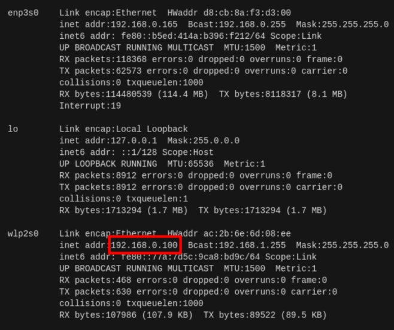

> **Source**: [https://emanual.robotis.com/docs/en/platform/turtlebot3/quick-start](https://emanual.robotis.com/docs/en/platform/turtlebot3/quick-start)

---
# TOC

1. [Humble](#humle)
2. [Jazzy](#jazzy)
3. [Noetic](#noetic)

---
# Humble

**Currently, ROS 1 Noetic and ROS 2 Humble are officially supported. In 2025, additional resources will be allocated for managing the open platform, with plans to complete example support for Humble in Q1 and extend support to Jazzy by Q2. The following chart provides an overview of the features supported by each ROS distribution.**

✓ : Available  ? : Unverified  X : Unavailable

| Features | Noetic | Humble | Jazzy(soon) |
| --- | --- | --- | --- |
| Teleop | ✓ | ✓ | ✓ |
| SLAM | ✓ | ✓ | ✓ |
| Navigation | ✓ | ✓ | ✓ |
| Simulation | ✓ | ✓ | ✓ |
| Manipulation | ✓ | ✓ | X |
| Home Service Challenge | ✓ | X | X |
| Autonomous Driving | ✓ | ✓ | X |
| Machine Learning | X | X | X |


# 3. Quick Start Guide

   * https://youtu.be/2I_29m_Z3WA?si=zKCmMYpevv3eIiGR

## 3.1 PC Setup

> **WARNING** : The content in this chapter is for the initialization of the `Remote PC` (your desktop or laptop PC) which will be used to control the TurtleBot3. Do not complete these instructions on the TurtleBot3 platform itself.

> **Compatibility WARNING**
> - The `Jetson Nano` does not support native Ubuntu 20.04. Please refer to the [NVIDIA developer forum](https://forums.developer.nvidia.com/t/when-will-jetpack-move-to-ubuntu-20-04/142517) for more details.

> **NOTE** : This instruction was tested on the `Ubuntu 22.04` linux distribution running `ROS 2 Humble Hawksbill` .

### 3.1.1 Download and Install Ubuntu on Remote PC
   * 1. Download the `Ubuntu 22.04 LTS Desktop` image for your PC from the link below.
     * [Ubuntu 22.04 LTS Desktop image (64-bit)](https://releases.ubuntu.com/22.04/)
   * 2. Follow the instructions below to install Ubuntu.
     * [Install Ubuntu desktop](https://ubuntu.com/tutorials/install-ubuntu-desktop#1-overview)


### 3.1.2 Install ROS 2 on Remote PC
   * Please follow [the official ROS 2 documentation](https://docs.ros.org/en/humble/Installation.html) to install ROS 2 Humble.
   * For most Linux users, the [Debian package installation method](https://docs.ros.org/en/humble/Installation/Ubuntu-Install-Debians.html) is strongly recommended.

**Details about How to install ROS 2.**

1. Visit the [Debian package](https://docs.ros.org/en/humble/Installation/Ubuntu-Install-Debians.html) installation page.

2. Copy the CLI commands located in the green box and paste into your terminal with (ctrl + shift + v)


3. Generally, ros-humble-desktop is recommended for the Remote PC


4. Add a line sourcing your environment to your bashrc. [Remote PC]

```
echo "source /opt/ros/humble/setup.bash" >> ~/.bashrc  
source ~/.bashrc  
```

### 3.1.3 Install Dependent ROS 2 Packages

1. Open the terminal with `Ctrl` + `Alt` + `T` on the **Remote PC** .

2. Install Gazebo  **[Remote PC]**

```
$sudoaptinstallros-humble-gazebo-*
```

4. Install Cartographer  **[Remote PC]** 

```
$sudoaptinstallros-humble-cartographer
$sudoaptinstallros-humble-cartographer-ros
```

5. Install Navigation2  **[Remote PC]** 

```
$sudoaptinstallros-humble-navigation2
$sudoaptinstallros-humble-nav2-bringup
```


### 3.1.4 Install TurtleBot3 Packages

Install the required TurtleBot3 Packages.

**[Remote PC]**

```
$ source /opt/ros/humble/setup.bash
$ mkdir -p ~/turtlebot3_ws/src
$ cd ~/turtlebot3_ws/src/
$ git clone -b humble https://github.com/ROBOTIS-GIT/DynamixelSDK.git
$ git clone -b humble https://github.com/ROBOTIS-GIT/turtlebot3_msgs.git
$ git clone -b humble https://github.com/ROBOTIS-GIT/turtlebot3.git
$ sudo apt install python3-colcon-common-extensions
$ cd ~/turtlebot3_ws
$ colcon build --symlink-install
$ echo 'source ~/turtlebot3_ws/install/setup.bash' >> ~/.bashrc
$ source ~/.bashrc
```

### 3.1.5 Environment Configuration

1. Setup your ROS environment for the Remote PC.  **[Remote PC]**

```
$echo 'export ROS_DOMAIN_ID=30 #TURTLEBOT3' >>~/.bashrc
$echo 'source /usr/share/gazebo/setup.sh' >>~/.bashrc
$echo 'source /opt/ros/humble/setup.bash' >>~/.bashrc
$source ~/.bashrc
```

---
[TOC](#toc)

# Jazzy

https://youtu.be/2I_29m_Z3WA?si=VK5NZvZkM5J3OBsd

## 3.1 PC Setup

> **WARNING** : The content in this chapter is for the initialization of the `Remote PC` (your desktop or laptop PC) which will be used to control the TurtleBot3. Do not complete these instructions on the TurtleBot3 platform itself.

> **Compatibility WARNING**
> - The `Jetson Nano` does not support native Ubuntu 20.04. Please refer to the [NVIDIA developer forum](https://forums.developer.nvidia.com/t/when-will-jetpack-move-to-ubuntu-20-04/142517) for more details.

> **NOTE** : This instruction was tested on the `Ubuntu 24.04` linux distribution running `ROS 2 Jazzy Jalisco` .


### 3.1.1 Download and Install Ubuntu on Remote PC
  * 1. Download the `Ubuntu 24.04 LTS Desktop` image for your PC from the link below. 
      [Ubuntu 24.04 LTS Desktop image (64-bit)](https://releases.ubuntu.com/noble/)
   * 2. Follow the instructions below to install Ubuntu. 
      [Install Ubuntu desktop](https://ubuntu.com/tutorials/install-ubuntu-desktop#1-overview)


### 3.1.2 Install ROS 2 on Remote PC
   * Please follow [the official ROS 2 documentation](https://docs.ros.org/en/jazzy/Installation.html) to install ROS 2 Jazzy.
   * For most Linux users, the [Debian package installation method](https://docs.ros.org/en/jazzy/Installation/Ubuntu-Install-Debians.html) is strongly recommended.

**Details about How to install ROS 2.**

1. Visit the [Debian package](https://docs.ros.org/en/humble/Installation/Ubuntu-Install-Debians.html) installation page.

2. Copy the CLI commands located in the green box and paste into your terminal with (ctrl + shift + v)


3. Generally, ros-humble-desktop is recommended for the Remote PC


4. Add a line sourcing your environment to your bashrc. [Remote PC]

```
echo "source /opt/ros/humble/setup.bash" >> ~/.bashrc  
source ~/.bashrc  
```

### 3.1.3 Install Dependent ROS 2 Packages
   * 1. Open the terminal with `Ctrl` + `Alt` + `T` on the **Remote PC** .
   * 2. Install Gazebo Sim  **[Remote PC]**
```
$ sudo apt-get update
$ sudo apt-get install curl lsb-release gnupg
$ sudo curl https://packages.osrfoundation.org/gazebo.gpg --output /usr/share/keyrings/pkgs-osrf-archive-keyring.gpg
$ echo "deb [arch=$(dpkg --print-architecture) signed-by=/usr/share/keyrings/pkgs-osrf-archive-keyring.gpg] http://packages.osrfoundation.org/gazebo/ubuntu-stable $(lsb_release -cs) main" | sudo tee /etc/apt/sources.list.d/gazebo-stable.list > /dev/null
$ sudo apt-get update
$ sudo apt-get install gz-harmonic
```

3. Install Cartographer  **[Remote PC]** 

```
$ sudo apt install ros-jazzy-cartographer
$ sudo apt install ros-jazzy-cartographer-ros
```

4. Install Navigation2  **[Remote PC]** 

```
$ sudo apt install ros-jazzy-navigation2
$ sudo apt install ros-jazzy-nav2-bringup
```


### 3.1.4 Install TurtleBot3 Packages

Install the required TurtleBot3 Packages.

**[Remote PC]**

```
$ source /opt/ros/jazzy/setup.bash
$ mkdir -p ~/turtlebot3_ws/src
$ cd ~/turtlebot3_ws/src/
$ git clone -b jazzy https://github.com/ROBOTIS-GIT/DynamixelSDK.git
$ git clone -b jazzy https://github.com/ROBOTIS-GIT/turtlebot3_msgs.git
$ git clone -b jazzy https://github.com/ROBOTIS-GIT/turtlebot3.git
$ sudo apt install python3-colcon-common-extensions
$ cd ~/turtlebot3_ws
$ colcon build --symlink-install
$ echo 'source ~/turtlebot3_ws/install/setup.bash' >> ~/.bashrc
$ source ~/.bashrc
```

### 3.1.5 Environment Configuration

1. Setup your ROS environment for the Remote PC.  **[Remote PC]**

```
$ echo 'export ROS_DOMAIN_ID=30 #TURTLEBOT3' >> ~/.bashrc
$ echo 'source /opt/ros/jazzy/setup.bash' >> ~/.bashrc
$ source ~/.bashrc
```

---
[TOC](#toc)

# Noetic

https://youtu.be/ji2kQXgCjeM?si=p-uhHHO0maF3VZEo

## 3.1 PC Setup

> **WARNING** : The content in this chapter is for the initialization of the `Remote PC` (your desktop or laptop PC) which will be used to control the TurtleBot3. Do not complete these instructions on the TurtleBot3 platform itself.

> **Compatibility WARNING**
> - The `Jetson Nano` does not support native Ubuntu 20.04. Please refer to the [NVIDIA developer forum](https://forums.developer.nvidia.com/t/when-will-jetpack-move-to-ubuntu-20-04/142517) for more details.

> **NOTE** : This instruction was tested on the `Ubuntu 20.04` linux distribution running `ROS1 Noetic Ninjemys` .

### 3.1.1  Download and Install Ubuntu on Remote PC
   * 1. Download the `Ubuntu 20.04 LTS Desktop` image for your PC from the link below. 
      [Ubuntu 20.04 LTS Desktop image (64-bit)](https://releases.ubuntu.com/20.04/)
   * 2. Follow the instructions below to install Ubuntu. 
      [Install Ubuntu desktop](https://www.ubuntu.com/download/desktop/install-ubuntu-desktop)


### 3.1.2 Install ROS on Remote PC

   * Open the terminal with `Ctrl` + `Alt` + `T` and enter the below commands one at a time.
   * If you would like to inspect the content of the installation script, please refer to [the script file](https://raw.githubusercontent.com/ROBOTIS-GIT/robotis_tools/master/install_ros_noetic.sh) .

**[Remote PC]**

```
$ sudo apt update
$ sudo apt upgrade
$ wget https://raw.githubusercontent.com/ROBOTIS-GIT/robotis_tools/master/install_ros_noetic.sh
$ chmod 755 ./install_ros_noetic.sh 
$ bash ./install_ros_noetic.sh
```

   * If the above installation fails, please refer to [the official ROS1 Noetic installation guide](http://wiki.ros.org/noetic/Installation/Ubuntu) .


### 3.1.3 Install Dependent ROS Packages

**[Remote PC]**

```
$ sudo apt-get install ros-noetic-joy ros-noetic-teleop-twist-joy \
  ros-noetic-teleop-twist-keyboard ros-noetic-laser-proc \
  ros-noetic-rgbd-launch ros-noetic-rosserial-arduino \
  ros-noetic-rosserial-python ros-noetic-rosserial-client \
  ros-noetic-rosserial-msgs ros-noetic-amcl ros-noetic-map-server \
  ros-noetic-move-base ros-noetic-urdf ros-noetic-xacro \
  ros-noetic-compressed-image-transport ros-noetic-rqt* ros-noetic-rviz \
  ros-noetic-gmapping ros-noetic-navigation ros-noetic-interactive-markers
```


### 3.1.4 Install TurtleBot3 Packages

* Install required TurtleBot3 Debian packages.

**[Remote PC]**

```
$ sudo apt install ros-noetic-dynamixel-sdk
$ sudo apt install ros-noetic-turtlebot3-msgs
$ sudo apt install ros-noetic-turtlebot3
```

**building TurtleBot3 packages from source.**

   * Make sure to remove any identical pre-compiled packages to avoid redundancy.
   **[Remote PC]**

```
$ sudo apt remove ros-noetic-dynamixel-sdk
$ sudo apt remove ros-noetic-turtlebot3-msgs
$ sudo apt remove ros-noetic-turtlebot3
```

   * In case you need to download the source code and build the packages yourself, use the commands below.
   **[Remote PC]**

```
$ mkdir -p ~/catkin_ws/src
$ cd ~/catkin_ws/src/
$ git clone -b noetic https://github.com/ROBOTIS-GIT/DynamixelSDK.git
$ git clone -b noetic https://github.com/ROBOTIS-GIT/turtlebot3_msgs.git
$ git clone -b noetic https://github.com/ROBOTIS-GIT/turtlebot3.git
$ cd ~/catkin_ws && catkin_make
$ echo "source ~/catkin_ws/devel/setup.bash" >> ~/.bashrc
```

### 3.1.5 Network Configuration


1. Connect your PC to a WiFi network and find the assigned IP address with the command below.  
**[Remote PC]**

```
   $ifconfig
```



2. Open the file and update the ROS IP settings with the command below.  
**[Remote PC]** 

```
$nano ~/.bashrc
```

3. Press Ctrl + END or Alt + / to move the cursor to the end of the line.Modify the address of localhostin the ROS_MASTER_URI and ROS_HOSTNAME with the IP address acquired from the previous terminal window.


4. Source the updated bashrc with the following command.  
**[Remote PC]** 

```
$source~/.bashrc
```
