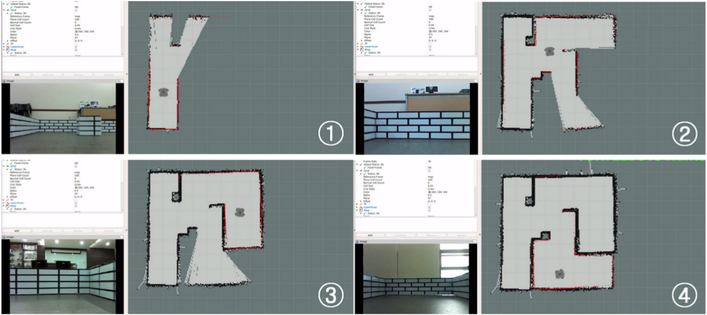
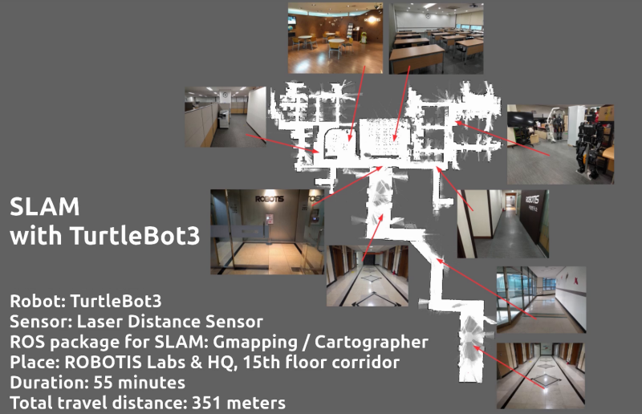
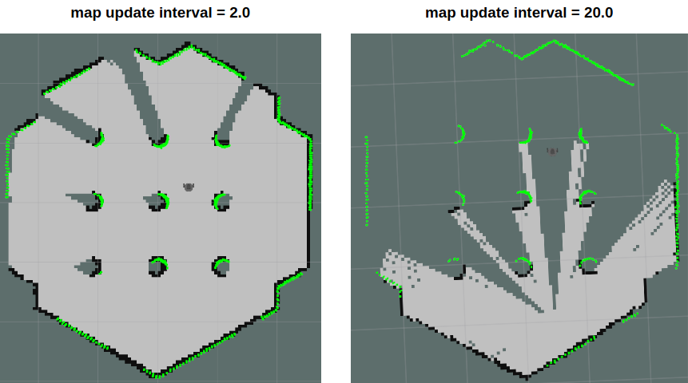

> **Source**: [https://emanual.robotis.com/docs/en/platform/turtlebot3/slam](https://emanual.robotis.com/docs/en/platform/turtlebot3/slam)

---
# TOC

1. [Humble](#humble)
2. [Jazzy](#jazzy)
3. [Noetic](#noetic)

---
[TOC](#toc)
# Humble


# 4.SLAM

> **NOTE**
> - SLAM should be run on the **Remote PC** .
> - Make sure to launch [Bringup](https://emanual.robotis.com/docs/en/platform/turtlebot3/bringup) on the TurtleBot3 before executing any operations.

**SLAM (Simultaneous Localization and Mapping)** is a technique to draw a map by estimating current location in an arbitrary space.  The video here shows you how accurately TurtleBot3 can draw a map using SLAM techniques.

https://youtu.be/lkW4-dG2BCY?si=XSC_G6b_Hu858jNC

## 4.1 Run SLAM Node

1. If the `Bringup` is not running on the TurtleBot3 SBC, launch the Bringup first. **Skip this step if you have launched bringup previously** .
   * Open a new terminal from Remote PC withCtrl+Alt+Tand connect to Raspberry Pi with its IP address. The default password is ubuntu.
   ```
   $ ssh ubuntu@{IP_ADDRESS_OF_RASPBERRY_PI}
   ```
   * Please use the proper keyword amongburger,waffle,waffle_pifor theTURTLEBOT3_MODELparameter.
   **[TurtleBot3 SBC]**
   ```
   $ export TURTLEBOT3_MODEL=burger
   $ ros2 launch turtlebot3_bringup robot.launch.py
   ```
   
2. Open a new terminal from Remote PC with `Ctrl` + `Alt` + `T` and launch the SLAM node. The Cartographer is used as a default SLAM method.  
  **[Remote PC]** 
  ```
  $ export TURTLEBOT3_MODEL=burger
  $ ros2 launch turtlebot3_cartographer cartographer.launch.py
  ```

   

**How to save the TURTLEBOT3_MODEL parameter?**

  * The $ export TURTLEBOT3_MODEL=${TB3_MODEL} command can be omitted if the TURTLEBOT3_MODEL parameter is predefined in the .bashrc file.
  * The .bashrc file is automatically loaded when a terminal window is created.

   * Example of defining TurtlBot3 Burger as a default model.
      **[Remote PC]**
```
$ echo 'export TURTLEBOT3_MODEL=burger' >> ~/.bashrc
$ source ~/.bashrc
```

   * Example of defining TurtlBot3 Waffle Pi as a default model.
      **[Remote PC]**
```
$ echo 'export TURTLEBOT3_MODEL=waffle_pi' >> ~/.bashrc
$ source ~/.bashrc
```

## 4.2 Run Teleoperation Node

Once SLAM node is successfully up and running, TurtleBot3 will be exploring unknown area of the map using teleoperation. It is important to avoid vigorous movements such as changing the linear and angular speed too quickly. When building a map using the TurtleBot3, it is a good practice to scan every corner of the map.

1. Open a new terminal and run the teleoperation node from the Remote PC.  Please use the proper keyword among `burger` , `waffle` , `waffle_pi` for the `TURTLEBOT3_MODEL` parameter.  **[Remote PC]**

```
$ export TURTLEBOT3_MODEL=burger
$ ros2 run turtlebot3_teleop teleop_keyboard

Control Your TurtleBot3!
---------------------------
Moving around:
       w
  a    s    d
       x

w/x : increase/decrease linear velocity
a/d : increase/decrease angular velocity
space key, s : force stop

CTRL-C to quit
```

2. Start exploring and drawing the map.  




## 4.3 Tuning Guide

The SLAM in ROS2 uses Cartographer ROS which provides configuration options via `Lua` file.

Below options are defined in `turtlebot3_cartographer/config/turtlebot3_lds_2d.lua` file.
For more details about each options, please refer to [the Cartographer ROS official documentation](https://google-cartographer-ros.readthedocs.io/en/latest/algo_walkthrough.html) .


### 4.3.1 MAP_BUILDER.use_trajectory_builder_2d
   * This option sets the type of SLAM.

### 4.3.2 TRAJECTORY_BUILDER_2D.min_range
   * This option sets the minimum usable range of the lidar sensor.

### 4.3.3 TRAJECTORY_BUILDER_2D.max_range
   * This option sets the maximum usable range of the lidar sensor.

### 4.3.4 TRAJECTORY_BUILDER_2D.missing_data_ray_length
   * In 2D, Cartographer replaces ranges further than max_range with TRAJECTORY_BUILDER_2D.missing_data_ray_length .

### 4.3.5 TRAJECTORY_BUILDER_2D.use_imu_data
   * If you use 2D SLAM, range data can be handled in real-time without an additional source of information so you can choose whether you’d like Cartographer to use an IMU or not.

### 4.3.6 TRAJECTORY_BUILDER_2D.use_online_correlative_scan_matching
   * **Local SLAM** : The RealTimeCorrelativeScanMatcher can be toggled depending on the reliability of the sensor.

### 4.3.7 TRAJECTORY_BUILDER_2D.motion_filter.max_angle_radians
   * **Local SLAM** : To avoid inserting too many scans per submaps, A scan is dropped if the motion does not exceed a certain angle.

### 4.3.8 POSE_GRAPH.optimize_every_n_nodes
   * **Global SLAM** : Setting POSE_GRAPH.optimize_every_n_nodes to 0 is a handy way to disable global SLAM and concentrate on the behavior of local SLAM.

### 4.3.9 POSE_GRAPH.constraint_builder.min_score
   * **Global SLAM** : Threshold for the scan match score below which a match is not considered. Low scores indicate that the scan and map do not look similar.

### 4.3.10 POSE_GRAPH.constraint_builder.global_localization_min_score
   * **Global SLAM** : Threshold below which global localizations are not trusted.

> **NOTE** : Constraints can be visualized in RViz, it is very handy to tune global SLAM. One can also toggle POSE_GRAPH.constraint_builder.log_matches to get regular reports of the constraints builder formatted as histograms.

## 4.4 Save Map

The map is drawn based on the robot’s [odometry](https://en.wikipedia.org/wiki/Odometry) , [tf](http://wiki.ros.org/tf) and scan information. 
These map data is drawn in the RViz window as the TurtleBot3 was traveling. 
After creating a complete map of desired area, save the map data to the local drive for the later use.

1. Launch the **map_saver_cli** node in the nav2_map_server package to create map files.  The map file is saved in the directory where the map_saver_cli node is launched at.  Unless a specific file name is provided, `map` will be used as a default file name and create `map.pgm` and `map.yaml` .  
**[Remote PC]** 
```
$ ros2 run nav2_map_server map_saver_cli -f ~/map
```

The `-f` option specifies a folder location and a file name where files to be saved.  With the above command, `map.pgm` and `map.yaml` will be saved in the home folder `~/` (/home/${username}).

## 4.5 Map

The map uses two-dimensional **Occupancy Grid Map (OGM)** , which is commonly used in ROS. 
The saved map will look like the figure below, where **white** area is collision free area while **black** area is occupied and inaccessible area, and **gray** area represents the unknown area. 
This map is used for the [Navigation](https://emanual.robotis.com/docs/en/platform/turtlebot3/navigation) .


The figure below shows the result of creating a large map using TurtleBot3. It took about an hour to create a map with a travel distance of about 350 meters.



---
[TOC](#toc)
# Jazzy


# 4.SLAM

> **NOTE**
> - SLAM should be run on the **Remote PC** .
> - Make sure to launch [Bringup](https://emanual.robotis.com/docs/en/platform/turtlebot3/bringup) on the TurtleBot3 before executing any operations.

**SLAM (Simultaneous Localization and Mapping)** is a technique to draw a map by estimating current location in an arbitrary space.  The video here shows you how accurately TurtleBot3 can draw a map using SLAM techniques.

https://youtu.be/lkW4-dG2BCY?si=XSC_G6b_Hu858jNC

## 4.1 Run SLAM Node

1. If the `Bringup` is not running on the TurtleBot3 SBC, launch the Bringup first. **Skip this step if you have launched bringup previously** .
   * Open a new terminal from Remote PC withCtrl+Alt+Tand connect to Raspberry Pi with its IP address. The default password is ubuntu.
   ```
   $ ssh ubuntu@{IP_ADDRESS_OF_RASPBERRY_PI}
   ```
   * Please use the proper keyword amongburger,waffle,waffle_pifor theTURTLEBOT3_MODELparameter.
   **[TurtleBot3 SBC]**
   ```
   $ export TURTLEBOT3_MODEL=burger
   $ ros2 launch turtlebot3_bringup robot.launch.py
   ```
   
2. Open a new terminal from Remote PC with `Ctrl` + `Alt` + `T` and launch the SLAM node. The Cartographer is used as a default SLAM method.  
  **[Remote PC]** 
  ```
  $ export TURTLEBOT3_MODEL=burger
  $ ros2 launch turtlebot3_cartographer cartographer.launch.py
  ```

   

**How to save the TURTLEBOT3_MODEL parameter?**

  * The $ export TURTLEBOT3_MODEL=${TB3_MODEL} command can be omitted if the TURTLEBOT3_MODEL parameter is predefined in the .bashrc file.
  * The .bashrc file is automatically loaded when a terminal window is created.

   * Example of defining TurtlBot3 Burger as a default model.
      **[Remote PC]**
```
$ echo 'export TURTLEBOT3_MODEL=burger' >> ~/.bashrc
$ source ~/.bashrc
```

   * Example of defining TurtlBot3 Waffle Pi as a default model.
      **[Remote PC]**
```
$ echo 'export TURTLEBOT3_MODEL=waffle_pi' >> ~/.bashrc
$ source ~/.bashrc
```

## 4.2 Run Teleoperation Node

Once SLAM node is successfully up and running, TurtleBot3 will be exploring unknown area of the map using teleoperation. It is important to avoid vigorous movements such as changing the linear and angular speed too quickly. When building a map using the TurtleBot3, it is a good practice to scan every corner of the map.

1. Open a new terminal and run the teleoperation node from the Remote PC.  Please use the proper keyword among `burger` , `waffle` , `waffle_pi` for the `TURTLEBOT3_MODEL` parameter.  **[Remote PC]**

```
$ export TURTLEBOT3_MODEL=burger
$ ros2 run turtlebot3_teleop teleop_keyboard

Control Your TurtleBot3!
---------------------------
Moving around:
       w
  a    s    d
       x

w/x : increase/decrease linear velocity
a/d : increase/decrease angular velocity
space key, s : force stop

CTRL-C to quit
```

2. Start exploring and drawing the map.  


## 4.3 Tuning Guide

The SLAM in ROS2 uses Cartographer ROS which provides configuration options via `Lua` file.

Below options are defined in `turtlebot3_cartographer/config/turtlebot3_lds_2d.lua` file.
For more details about each options, please refer to [the Cartographer ROS official documentation](https://google-cartographer-ros.readthedocs.io/en/latest/algo_walkthrough.html) .


### 4.3.1 MAP_BUILDER.use_trajectory_builder_2d
   * This option sets the type of SLAM.

### 4.3.2 TRAJECTORY_BUILDER_2D.min_range
   * This option sets the minimum usable range of the lidar sensor.

### 4.3.3 TRAJECTORY_BUILDER_2D.max_range
   * This option sets the maximum usable range of the lidar sensor.

### 4.3.4 TRAJECTORY_BUILDER_2D.missing_data_ray_length
   * In 2D, Cartographer replaces ranges further than max_range with TRAJECTORY_BUILDER_2D.missing_data_ray_length .

### 4.3.5 TRAJECTORY_BUILDER_2D.use_imu_data
   * If you use 2D SLAM, range data can be handled in real-time without an additional source of information so you can choose whether you’d like Cartographer to use an IMU or not.

### 4.3.6 TRAJECTORY_BUILDER_2D.use_online_correlative_scan_matching
   * **Local SLAM** : The RealTimeCorrelativeScanMatcher can be toggled depending on the reliability of the sensor.

### 4.3.7 TRAJECTORY_BUILDER_2D.motion_filter.max_angle_radians
   * **Local SLAM** : To avoid inserting too many scans per submaps, A scan is dropped if the motion does not exceed a certain angle.

### 4.3.8 POSE_GRAPH.optimize_every_n_nodes
   * **Global SLAM** : Setting POSE_GRAPH.optimize_every_n_nodes to 0 is a handy way to disable global SLAM and concentrate on the behavior of local SLAM.

### 4.3.9 POSE_GRAPH.constraint_builder.min_score
   * **Global SLAM** : Threshold for the scan match score below which a match is not considered. Low scores indicate that the scan and map do not look similar.

### 4.3.10 POSE_GRAPH.constraint_builder.global_localization_min_score
   * **Global SLAM** : Threshold below which global localizations are not trusted.

> **NOTE** : Constraints can be visualized in RViz, it is very handy to tune global SLAM. One can also toggle POSE_GRAPH.constraint_builder.log_matches to get regular reports of the constraints builder formatted as histograms.

## 4.4 Save Map

The map is drawn based on the robot’s [odometry](https://en.wikipedia.org/wiki/Odometry) , [tf](http://wiki.ros.org/tf) and scan information. 
These map data is drawn in the RViz window as the TurtleBot3 was traveling. 
After creating a complete map of desired area, save the map data to the local drive for the later use.

1. Launch the **map_saver_cli** node in the nav2_map_server package to create map files.  The map file is saved in the directory where the map_saver_cli node is launched at.  Unless a specific file name is provided, `map` will be used as a default file name and create `map.pgm` and `map.yaml` .  
**[Remote PC]** 
```
$ ros2 run nav2_map_server map_saver_cli -f ~/map
```

The `-f` option specifies a folder location and a file name where files to be saved.  With the above command, `map.pgm` and `map.yaml` will be saved in the home folder `~/` (/home/${username}).

## 4.5 Map

The map uses two-dimensional **Occupancy Grid Map (OGM)** , which is commonly used in ROS. 
The saved map will look like the figure below, where **white** area is collision free area while **black** area is occupied and inaccessible area, and **gray** area represents the unknown area. 
This map is used for the [Navigation](https://emanual.robotis.com/docs/en/platform/turtlebot3/navigation) .


The figure below shows the result of creating a large map using TurtleBot3. It took about an hour to create a map with a travel distance of about 350 meters.


---
[TOC](#toc)
# Noetic

# 4.SLAM

> **NOTE**
> - SLAM should be run on the **Remote PC** .
> - Make sure to launch [Bringup](https://emanual.robotis.com/docs/en/platform/turtlebot3/bringup) on the TurtleBot3 before executing any operations.

**SLAM (Simultaneous Localization and Mapping)** is a technique to draw a map by estimating current location in an arbitrary space.  The video here shows you how accurately TurtleBot3 can draw a map using SLAM techniques.

https://youtu.be/lkW4-dG2BCY?si=XSC_G6b_Hu858jNC

## 4.1 Run SLAM Node
1. Run roscore on the Remote PC.
**[Remote PC]**
```
$ roscore
```

2. If Bringup is not running on the TurtleBot3 SBC, launch Bringup. Skip this step if bringup is already running.
  * Open a new terminal on the Remote PC with Ctrl + Alt + T and connect to Raspberry Pi with its IP address. The default password is turtlebot. Specify your TurtleBot3 model (burger, waffle, waffle_pi) using the TURTLEBOT3_MODEL parameter. [Remote PC]
```
$ ssh pi@{IP_ADDRESS_OF_RASPBERRY_PI}
$ export TURTLEBOT3_MODEL=${TB3_MODEL}
$ roslaunch turtlebot3_bringup turtlebot3_robot.launch
```
3. Open a new terminal on the Remote PC with Ctrl + Alt + T and launch the SLAM node. The Gmapping is used as the default SLAM method. Specify your TurtleBot3 model (burger, waffle, waffle_pi) using the TURTLEBOT3_MODEL parameter. **[Remote PC]**
```
$ export TURTLEBOT3_MODEL=burger
$ roslaunch turtlebot3_slam turtlebot3_slam.launch
```
**How to save the TURTLEBOT3_MODEL parameter?**

* The $ export TURTLEBOT3_MODEL=${TB3_MODEL} command can be omitted if the TURTLEBOT3_MODEL parameter is predefined in your system’s .bashrc file.
* The .bashrc file is automatically loaded when a terminal window is created.

* Example defining TurtlBot3 Burger as the default model.
**[Remote PC]**
```
$ echo 'export TURTLEBOT3_MODEL=burger' >> ~/.bashrc
$ source ~/.bashrc
```

* Example defining TurtlBot3 Waffle Pi as the default model.
**[Remote PC]**
```
$ echo 'export TURTLEBOT3_MODEL=waffle_pi' >> ~/.bashrc
$ source ~/.bashrc
```
**Read more about other SLAM methods**

* Gmapping (ROS WIKI, Github)
1. Install required packages on the remote PC.
  * Packages related to Gmapping have already been installed on PC Setup section.
2. Launch the Gmapping SLAM node.
**[Remote PC]**
```
$ roslaunch turtlebot3_slam turtlebot3_slam.launch slam_methods:=gmapping
```

* Cartographer (ROS WIKI, Github)
1. Download and build required packages on the remote PC.
  * The Cartographer currently does not provide a binary installation method for ROS1 Noetic. Please download and build the source code as follows. Please refer to the official wiki page for more details.
**[Remote PC]**
```
$ sudo apt update
$ sudo apt install -y python3-wstool python3-rosdep ninja-build stow
$ cd ~/catkin_ws/src
$ wstool init src
$ wstool merge -t src https://raw.githubusercontent.com/cartographer-project/cartographer_ros/master/cartographer_ros.rosinstall
$ wstool update -t src
$ sudo rosdep init
$ rosdep update
$ rosdep install --from-paths src --ignore-src --rosdistro=noetic -y
$ src/cartographer/scripts/install_abseil.sh
$ sudo apt remove ros-noetic-abseil-cpp
$ catkin_make_isolated --install --use-ninja
```
1. Launch the Cartographer SLAM node.
**[Remote PC]**
```
$ source ~/catkin_ws/install_isolated/setup.bash
$ roslaunch turtlebot3_slam turtlebot3_slam.launch slam_methods:=cartographer
```

* Karto (ROS WIKI, Github)
1. Install dependent packages on PC.
**[Remote PC]**
```
$ sudo apt install ros-noetic-slam-karto
```
1. Launch the Karto SLAM node.
**[Remote PC]**
```
$ roslaunch turtlebot3_slam turtlebot3_slam.launch slam_methods:=karto
```

## 4.2 Run Teleoperation Node

Once SLAM node is successfully up and running, TurtleBot3 will be exploring unknown area of the map using teleoperation. It is important to avoid vigorous movements such as changing the linear and angular speed too quickly. When building a map using the TurtleBot3, it is a good practice to scan every corner of the map.

1. Open a new terminal and run the teleoperation node from the Remote PC.  Please use the proper keyword among `burger` , `waffle` , `waffle_pi` for the `TURTLEBOT3_MODEL` parameter.  **[Remote PC]**

```
$ export TURTLEBOT3_MODEL=burger
$ ros2 run turtlebot3_teleop teleop_keyboard

Control Your TurtleBot3!
---------------------------
Moving around:
       w
  a    s    d
       x

w/x : increase/decrease linear velocity
a/d : increase/decrease angular velocity
space key, s : force stop

CTRL-C to quit
```

2. Start exploring and drawing the map.  


## 4.3 Tuning Guide
* Gmapping has many parameters to change performances for different environments. You can get information about specific parameters from the ROS WiKi or referring to Chapter 11 of ROS Robot Programming. This tuning guide provides tips when configuring gmapping parameters. If you want to optimize SLAM performance for your environment, this section might be helpful.

The below parameters are defined in the turtlebot3_slam/config/gmapping_params.yaml file.

### 4.3.1 maxUrange
This parameter sets the maximum usable range of the lidar sensor.

### 4.3.2 map_update_interval
This parameter defines time period between map updates. The smaller the value, the more frequently the map is updated.
However, setting this too small will be require more processing power for map calculation.


### 4.3.3 minimumScore
This parameter sets the minimum score value that determines the success or failure of the sensor’s scan data matching test. This can reduce errors in the expected position of the robot in a large area. If the parameter is set properly, you will see information similar to the output shown below.
```
Average Scan Matching Score=278.965
neff= 100
Registering Scans:Done
update frame 6
update ld=2.95935e-05 ad=0.000302522
Laser Pose= -0.0320253 -5.36882e-06 -3.14142
```

If set too high, you might see the warnings below.
```
Scan Matching Failed, using odometry. Likelihood=0
lp:-0.0306155 5.75314e-06 -3.14151
op:-0.0306156 5.90277e-06 -3.14151
```

### 4.3.4 linearUpdate
When the robot translates a larger distance than this value, it will run the scanning process.

### 4.3.5 angularUpdate
When the robot rotates more than this value, it will run the scanning process. It is recommended to set this value lower than linearUpdate.

## 4.4 Save Map

The map is drawn based on the robot’s [odometry](https://en.wikipedia.org/wiki/Odometry) , [tf](http://wiki.ros.org/tf) and scan information. 
These map data is drawn in the RViz window as the TurtleBot3 was traveling. 
After creating a complete map of desired area, save the map data to the local drive for the later use.

1. Launch the **map_saver_cli** node in the nav2_map_server package to create map files.  The map file is saved in the directory where the map_saver_cli node is launched at.  Unless a specific file name is provided, `map` will be used as a default file name and create `map.pgm` and `map.yaml` .  
**[Remote PC]** 
```
$ ros2 run nav2_map_server map_saver_cli -f ~/map
```

The `-f` option specifies a folder location and a file name where files to be saved.  With the above command, `map.pgm` and `map.yaml` will be saved in the home folder `~/` (/home/${username}).

## 4.5 Map

The map uses two-dimensional **Occupancy Grid Map (OGM)** , which is commonly used in ROS. 
The saved map will look like the figure below, where **white** area is collision free area while **black** area is occupied and inaccessible area, and **gray** area represents the unknown area. 
This map is used for the [Navigation](https://emanual.robotis.com/docs/en/platform/turtlebot3/navigation) .


The figure below shows the result of creating a large map using TurtleBot3. It took about an hour to create a map with a travel distance of about 350 meters.


