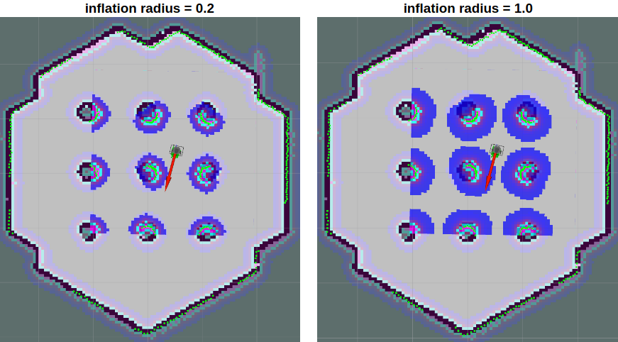

> **Source**: [https://emanual.robotis.com/docs/en/platform/turtlebot3/navigation](https://emanual.robotis.com/docs/en/platform/turtlebot3/navigation)

---
# TOC

1. [Humble](#humble)
2. [Jazzy](#jazzy)
3. [Noetic](#noetic)

---
[TOC](#toc)
# Humble

# 5. Navigation

> **WARNING** : While following these instructions, your TurtleBot3 may move and rotate unexpectedly. Please place the robot in safe location on the ground.

> **NOTE**
> - Navigation should be run on the Remote PC.
> - Make sure to launch [Bringup](https://emanual.robotis.com/docs/en/platform/turtlebot3/bringup/) on your TurtleBot3 before executing the following operations.
> - Navigation uses maps created by [SLAM](https://emanual.robotis.com/docs/en/platform/turtlebot3/slam/) . Please prepare a map before running Navigation.

**Navigation** is used move the robot from one location to a specified destination in a given environment. For this purpose, a map that contains geometry information describing furniture, objects, and walls of the given environment is required. As described in the previous SLAM section, a map was created with the distance information obtained by the sensor and the pose information of the robot itself.

## 5.1 Run Navigation Nodes

https://youtu.be/_-bv8VPwkZs?si=jakasqcERW7Cwk8L

1. If `Bringup` is not running on the TurtleBot3 SBC, launch Bringup.
  * Open a new terminal from Remote PC with `Ctrl+Alt+T` and connect to Raspberry Pi with its IP address. The default password is `ubuntu`.
  **[Remote PC]**
```
$ ssh ubuntu@{IP_ADDRESS_OF_RASPBERRY_PI}
$ export TURTLEBOT3_MODEL=${TB3_MODEL}
$ ros2 launch turtlebot3_bringup robot.launch.py
```

2. Open a new terminal from Remote PC with `Ctrl` + `Alt` + `T` and launch the Navigation node. ROS 2 uses [Navigation2](https://navigation.ros.org/) .
  Specify your TurtleBot3 model ( `burger` , `waffle` , `waffle_pi` ) using the `TURTLEBOT3_MODEL` parameter. 
  **[Remote PC]**
```
$ export TURTLEBOT3_MODEL=burger
$ ros2 launch turtlebot3_navigation2 navigation2.launch.py map:=$HOME/map.yaml
```
 
**How to save the TURTLEBOT3_MODEL parameter?**
* The $ export TURTLEBOT3_MODEL=${TB3_MODEL} command can be omitted if the TURTLEBOT3_MODEL parameter is predefined in your .bashrc file.
* The .bashrc file is automatically loaded when a terminal window is created.
  * Example defining TurtlBot3 Burger as the default model.
**[Remote PC]**
```
$ echo 'export TURTLEBOT3_MODEL=burger' >> ~/.bashrc
$ source ~/.bashrc
```

  * Example defining TurtlBot3 Waffle Pi as the default model.
**[Remote PC]**
```
$ echo 'export TURTLEBOT3_MODEL=waffle_pi' >> ~/.bashrc
$ source ~/.bashrc
```

## 5.2 Estimate Initial Pose

**Initial Pose Estimation** must be performed before running Navigation as this process initializes the AMCL parameters that are critical for Navigation. The TurtleBot3 has to be correctly located on the map with LDS sensor data that overlaps the displayed map.

1. Click the `2D Pose Estimate` button in the RViz2 menu.

2. Click on the map where the actual robot is located and drag the large green arrow toward the direction where the robot is facing.

3. Repeat step 1 and 2 until the LDS sensor data is overlayed on the saved map. 


4. Launch the keyboard teleoperation node to precisely locate the robot on the map.  
**[Remote PC]** 
```
$ ros2 run turtlebot3_teleop teleop_keyboard
```

5. Move the robot back and forth a bit to collect the surrounding environment information and narrow down the estimated location of the TurtleBot3 on the map (displayed with tiny green arrows).  


6. Terminate the keyboard teleoperation node with `Ctrl` + `C` to prevent different **cmd_vel** values from being published from multiple nodes during Navigation.

## Set Navigation Goal

1. Click the `Navigation2 Goal` button in the RViz2 menu.
2. Click on the map to set the destination of the robot and drag the green arrow toward the direction where the robot will be facing. This green arrow is a marker to can specify the destination of the robot.The root of the arrow is thex,ycoordinate of the destination, and the angleθis determined by the orientation of the arrow.As soon as x, y, θ are set, the TurtleBot3 will start moving to the destination immediately.

1. Click the `Navigation2 Goal` button in the RViz2 menu.
2. Click on the map to set the destination of the robot and drag the green arrow toward the direction where the robot will be facing. This green arrow is a marker to can specify the destination of the robot.The root of the arrow is thex,ycoordinate of the destination, and the angleθis determined by the orientation of the arrow.As soon as x, y, θ are set, the TurtleBot3 will start moving to the destination immediately.

1. Click the `2D Nav Goal` button in the RViz menu.  
2. Click on the map to set the destination of the robot and drag the green arrow toward the direction where the robot will be facing. This green arrow is a marker to specify the destination of the robot.The root of the arrow is thex,ycoordinate of the destination, and the angleθis determined by the orientation of the arrow.As soon as x, y, θ are set, the TurtleBot3 will start moving to the destination immediately.


## Tuning Guide

The Navigation2 stack has many parameters to change performances for different robots. Although it’s similar to ROS1 Navigation, please refer to the [Configuration Guide of Navigation2](https://navigation.ros.org/configuration/index.html) or [ROS Navigation Tuning Guide by Kaiyu Zheng](http://kaiyuzheng.me/documents/navguide.pdf) for more details.


### Costmap Parameters


#### inflation_layer.inflation_radius

- Defined in `turtlebot3_navigation2/param/${TB3_MODEL}.yaml`
- This parameter defines an inflation area of inaccesability around detected obstacles. Generated paths will be planned not to cross this area. It is safe to set this value to be slightly bigger than robot radius. For more information, please refer to [costmap_2d wiki](http://wiki.ros.org/costmap_2d#Inflation) .




#### inflation_layer.cost_scaling_factor

- Defined in `turtlebot3_navigation2/param/${TB3_MODEL}.yaml`
- This is an inverse proportional factor that is multiplied by the value of the costmap. If this parameter is increased, the value of the costmap is decreased.


The optimal path for the robot to pass through obstacles is to take a median path between them. Setting a smaller value for this parameter will create a farther path from the obstacles.


The Navigation2 stack has many parameters to change performances for different robots. Although it’s similar to ROS1 Navigation, please refer to the [Configuration Guide of Navigation2](https://navigation.ros.org/configuration/index.html) or [ROS Navigation Tuning Guide by Kaiyu Zheng](http://kaiyuzheng.me/documents/navguide.pdf) for more details.


### 5.4.1 Costmap Parameters

#### 5.4.1.1 inflation_layer.inflation_radius
- Defined in `turtlebot3_navigation2/param/${TB3_MODEL}.yaml`
- This parameter defines an inflation area of inaccesability around detected obstacles. Generated paths will be planned not to cross this area. It is safe to set this value to be slightly bigger than robot radius. For more information, please refer to [costmap_2d wiki](http://wiki.ros.org/costmap_2d#Inflation) .


#### 5.4.1.2 inflation_layer.cost_scaling_factor
- Defined in `turtlebot3_navigation2/param/${TB3_MODEL}.yaml`
- This is an inverse proportional factor that is multiplied by the value of the costmap. If this parameter is increased, the value of the costmap is decreased.


The optimal path for the robot to pass through obstacles is to take a median path between them. Setting a smaller value for this parameter will create a farther path from the obstacles.

### 5.1.2 dwb_controller

#### 5.4.2.1 max_vel_x
- Defined in `turtlebot3_navigation2/param/${TB3_MODEL}.yaml`
- This factor sets the maximum value for translational velocity.

#### 5.4.2.2 min_vel_x
- Defined in `turtlebot3_navigation2/param/${TB3_MODEL}.yaml`
- This factor sets the minimum value for translational velocity. If set this negative, the robot can move backwards.

#### 5.4.2.3 max_vel_y
- Defined in `turtlebot3_navigation2/param/${TB3_MODEL}.yaml`
- The maximum y velocity for the robot in m/s.

#### 5.4.2.4 min_vel_y
- Defined in `turtlebot3_navigation2/param/${TB3_MODEL}.yaml`
- The minimum y velocity for the robot in m/s.

#### 5.4.2.5 max_vel_theta
- Defined in `turtlebot3_navigation2/param/${TB3_MODEL}.yaml`
- Value setting the maximum rotational velocity. The robot can not spin faster than this.

#### 5.4.2.6 min_speed_theta
- Defined in `turtlebot3_navigation2/param/${TB3_MODEL}.yaml`
- Value setting the minimum rotational velocity. The robot can not spin slower than this.

#### 5.4.2.7 max_speed_xy
- Defined in `turtlebot3_navigation2/param/${TB3_MODEL}.yaml`
- The absolute value of the maximum translational velocity for the robot in m/s.

#### 5.4.2.8 min_speed_xy
- Defined in `turtlebot3_navigation2/param/${TB3_MODEL}.yaml`
- The absolute value of the minimum translational velocity for the robot in m/s.

#### 5.4.2.9 acc_lim_x
- Defined in `turtlebot3_navigation2/param/${TB3_MODEL}.yaml`
- The x acceleration limit of the robot in meters/sec^2.

#### 5.4.2.10 acc_lim_y
- Defined in `turtlebot3_navigation2/param/${TB3_MODEL}.yaml`
- The y acceleration limit of the robot in meters/sec^2.

#### 5.4.2.11 acc_lim_theta
- Defined in `turtlebot3_navigation2/param/${TB3_MODEL}.yaml`
- The rotational acceleration limit of the robot in radians/sec^2.

#### 5.4.2.12 decel_lim_x
- Defined in `turtlebot3_navigation2/param/${TB3_MODEL}.yaml`
- The deceleration limit of the robot in the x direction in m/s^2.

#### 5.4.2.13 decel_lim_y
- Defined in `turtlebot3_navigation2/param/${TB3_MODEL}.yaml`
- The deceleration limit of the robot in the y direction in m/s^2.

#### 5.4.2.14 decel_lim_theta
- Defined in `turtlebot3_navigation2/param/${TB3_MODEL}.yaml`
- The deceleration limit of the robot in the theta direction in rad/s^2.

#### 5.4.2.15 xy_goal_tolerance
- Defined in `turtlebot3_navigation2/param/${TB3_MODEL}.yaml`
- The x,y distance allowed when the robot reaches its goal pose.

#### 5.4.2.16 yaw_goal_tolerance
- Defined in `turtlebot3_navigation2/param/${TB3_MODEL}.yaml`
- The yaw angle allowed when the robot reaches its goal pose.

#### 5.4.2.17 transform_tolerance
- Defined in `turtlebot3_navigation2/param/${TB3_MODEL}.yaml`
- The allowance for latency for tf messages.

#### 5.4.2.18 sim_time
- Defined in `turtlebot3_navigation2/param/${TB3_MODEL}.yaml`
- This factor sets forward simulation time in seconds. Setting this too small makes it difficult for the robot to pass through narrow spaces while large values limit dynamic turns. You can observe the differences in length of the yellow line in the below image that representing the simulation path.


---
[TOC](#toc)
# Jazzy


---
[TOC](#toc)
# Noetic


