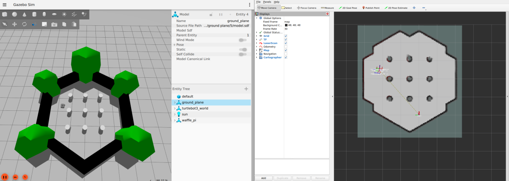

> **Source**: [https://emanual.robotis.com/docs/en/platform/turtlebot3/slam_simulation](https://emanual.robotis.com/docs/en/platform/turtlebot3/slam_simulation)

---
# TOC

1. [Humble](#humble)
2. [Jazzy](#jazzy)
3. [Noetic](#noetic)

---
[TOC](#toc)
# Humble

## 6.2 SLAM Simulation

With SLAM in the Gazebo simulator, you can select or create various environments and robot models in a virtual world. Other than the preparation of the simulation environment instead of bringing up the robot, SLAM Simulation is pretty similar to the operation of [SLAM](https://emanual.robotis.com/docs/en/platform/turtlebot3/slam/#slam) on the actual TurtleBot3.

The following instructions require prerequisites from the previous section, so please review the [Simulation](https://emanual.robotis.com/docs/en/platform/turtlebot3/simulation/) section first.


### 6.2.1 Launch Simulation World

Three Gazebo environments are prepared, but for creating a map with SLAM, it is recommended to use either **TurtleBot3 World** or **TurtleBot3 House** .  Use one of the following commands to load the Gazebo environment.

In this tutorial, TurtleBot3 World will be used.  Specify your TurtleBot3 model ( `burger` , `waffle` , `waffle_pi` ) using the `TURTLEBOT3_MODEL` parameter.

```
$ export TURTLEBOT3_MODEL=burger
$ ros2 launch turtlebot3_gazebo turtlebot3_world.launch.py
```
**Read more about How to load TurtleBot3 House** Specify your TurtleBot3 model (burger, waffle, waffle_pi) using the TURTLEBOT3_MODEL parameter.
```
$ export TURTLEBOT3_MODEL=burger
$ ros2 launch turtlebot3_gazebo turtlebot3_house.launch.py
```

### 6.2.2 Run SLAM Node

Open a new terminal on the Remote PC with `Ctrl` + `Alt` + `T` and run the SLAM node. Cartographer SLAM method is used by default.
Specify your TurtleBot3 model ( `burger` , `waffle` , `waffle_pi` ) using the `TURTLEBOT3_MODEL` parameter.

```
$ export TURTLEBOT3_MODEL=burger
$ ros2 launch turtlebot3_cartographer cartographer.launch.py use_sim_time:=True
```


### 6.2.3 Run Teleoperation Node

Open a new terminal on the Remote PC with `Ctrl` + `Alt` + `T` and run the teleoperation node from the Remote PC.
Specify your TurtleBot3 model ( `burger` , `waffle` , `waffle_pi` ) using the `TURTLEBOT3_MODEL` parameter.

```
$ export TURTLEBOT3_MODEL=burger
$ ros2 run turtlebot3_teleop teleop_keyboard

 Control Your TurtleBot3!
 ---------------------------
 Moving around:
        w
   a    s    d
        x

 w/x : increase/decrease linear velocity
 a/d : increase/decrease angular velocity
 space key, s : force stop

 CTRL-C to quit
```


### 6.2.4 Save Map

When the map is has been created, open a new terminal on the Remote PC with `Ctrl` + `Alt` + `T` and save the map.


```
$ ros2 run nav2_map_server map_saver_cli -f ~/map
```


> The saved map.pgm file

With SLAM in the Gazebo simulator, you can select or create various environments and robot models in a virtual world. Other than the preparation of the simulation environment instead of bringing up the robot, SLAM Simulation is pretty similar to the operation of [SLAM](https://emanual.robotis.com/docs/en/platform/turtlebot3/slam/#slam) on the actual TurtleBot3.

The following instructions require prerequisites from the previous section, so please review the [Simulation](https://emanual.robotis.com/docs/en/platform/turtlebot3/simulation/) section first.


### Launch Simulation World

Three Gazebo environments are prepared, but for creating a map with SLAM, it is recommended to use either **TurtleBot3 World** or **TurtleBot3 House** .  Use one of the following commands to load the Gazebo environment.

In this tutorial, TurtleBot3 World will be used.  Specify your TurtleBot3 model ( `burger` , `waffle` , `waffle_pi` ) using the `TURTLEBOT3_MODEL` parameter.

```
$ 
export 
TURTLEBOT3_MODEL
=
burger

$ 
ros2 launch turtlebot3_gazebo turtlebot3_world.launch.py

```


### Run SLAM Node

Open a new terminal on the Remote PC with `Ctrl` + `Alt` + `T` and run the SLAM node. Cartographer SLAM method is used by default.
Specify your TurtleBot3 model ( `burger` , `waffle` , `waffle_pi` ) using the `TURTLEBOT3_MODEL` parameter.

```
$ 
export 
TURTLEBOT3_MODEL
=
burger

$ 
ros2 launch turtlebot3_cartographer cartographer.launch.py use_sim_time:
=
True

```


### Run Teleoperation Node

Open a new terminal on the Remote PC with `Ctrl` + `Alt` + `T` and run the teleoperation node from the Remote PC.
Specify your TurtleBot3 model ( `burger` , `waffle` , `waffle_pi` ) using the `TURTLEBOT3_MODEL` parameter.

```
$ 
export 
TURTLEBOT3_MODEL
=
burger

$ 
ros2 run turtlebot3_teleop teleop_keyboard

 Control Your TurtleBot3!
 
---------------------------

 Moving around:
        w
   a    s    d
        x

 w/x : increase/decrease linear velocity
 a/d : increase/decrease angular velocity
 space key, s : force stop

 CTRL-C to quit

```


### Save Map

When the map is has been created, open a new terminal on the Remote PC with `Ctrl` + `Alt` + `T` and save the map.



```
$ 
ros2 run nav2_map_server map_saver_cli 
-f
 ~/map

```


> The saved map.pgm file

With SLAM in the Gazebo simulator, you can select or create various environments and robot models in a virtual world. Other than the preparation of the simulation environment instead of bringing up the robot, SLAM Simulation is pretty similar to the operation of [SLAM](https://emanual.robotis.com/docs/en/platform/turtlebot3/slam/#slam) on the actual TurtleBot3.

The following instructions require prerequisites from the previous section, so please review the [Simulation](https://emanual.robotis.com/docs/en/platform/turtlebot3/simulation/) section first.


### Launch Simulation World

Three Gazebo environments are prepared, but for creating a map with SLAM, it is recommended to use either **TurtleBot3 World** or **TurtleBot3 House** .  Use one of the following commands to load the Gazebo environment.

In this tutorial, TurtleBot3 World will be used.  Specify your TurtleBot3 model ( `burger` , `waffle` , `waffle_pi` ) using the `TURTLEBOT3_MODEL` parameter.  **[Remote PC]**

```
$ 
export 
TURTLEBOT3_MODEL
=
burger

$ 
roslaunch turtlebot3_gazebo turtlebot3_world.launch

```


### Run SLAM Node

Open a new terminal on the Remote PC with `Ctrl` + `Alt` + `T` and run the SLAM node. The Gmapping SLAM method is used by default.  Specify your TurtleBot3 model ( `burger` , `waffle` , `waffle_pi` ) using the `TURTLEBOT3_MODEL` parameter.  **[Remote PC]**

```
$ 
export 
TURTLEBOT3_MODEL
=
burger

$ 
roslaunch turtlebot3_slam turtlebot3_slam.launch slam_methods:
=
gmapping

```


### Run Teleoperation Node

Open a new terminal on the Remote PC with `Ctrl` + `Alt` + `T` and run the teleoperation node from the Remote PC.  Specify your TurtleBot3 model ( `burger` , `waffle` , `waffle_pi` ) using the `TURTLEBOT3_MODEL` parameter.  **[Remote PC]**

```
$ 
export 
TURTLEBOT3_MODEL
=
burger

$ 
roslaunch turtlebot3_teleop turtlebot3_teleop_key.launch

 Control Your TurtleBot3!
 
---------------------------

 Moving around:
        w
   a    s    d
        x

 w/x : increase/decrease linear velocity
 a/d : increase/decrease angular velocity
 space key, s : force stop

 CTRL-C to quit

```


### Save Map

When the map has been created, open a new terminal from Remote PC with `Ctrl` + `Alt` + `T` and save the map.


```
$ 
rosrun map_server map_saver 
-f
 ~/map

```


> The saved map.pgm file
