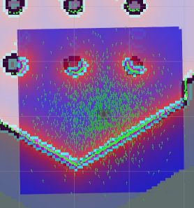

> **Source**: [https://emanual.robotis.com/docs/en/platform/turtlebot3/nav_simulation](https://emanual.robotis.com/docs/en/platform/turtlebot3/nav_simulation)

---
# TOC

1. [Humble](#humble)
2. [Jazzy](#jazzy)
3. [Noetic](#noetic)

---
[TOC](#toc)
# Humble

## 6.3 Navigation Simulation

Just like with SLAM in the Gazebo simulator, you can select or create various environments and robot models in the virtual Navigation world. However, a complete map has to be prepared before running Navigation. Other than the preparation of a simulation environment instead of bringing up the robot, Navigation Simulation is pretty similar to that of real-world TurtleBot3 [Navigation](https://emanual.robotis.com/docs/en/platform/turtlebot3/navigation/#navigation) .


### 6.3.1 Launch Simulation World

Terminate `Ctrl` + `C` all applications that were launched in the previous sections.

In the previous [SLAM](https://emanual.robotis.com/docs/en/platform/turtlebot3/slam/#slam) section, TurtleBot3 World was used to create a map. The same Gazebo environment will be used for Navigation.

Specify your TurtleBot model ( `burger` , `waffle` , `waffle_pi` ) using the `TURTLEBOT3_MODEL` parameter.

```
$ export TURTLEBOT3_MODEL=burger
$ ros2 launch turtlebot3_gazebo turtlebot3_world.launch.py
```

**Read more about How to load TurtleBot3 House**
```
$ export TURTLEBOT3_MODEL=burger
$ ros2 launch turtlebot3_gazebo turtlebot3_house.launch.py
```

### 6.3.2 Run Navigation Node

Open a new terminal from Remote PC with `Ctrl` + `Alt` + `T` and run the Navigation2 node.

```
$ export TURTLEBOT3_MODEL=burger
$ ros2 launch turtlebot3_navigation2 navigation2.launch.py use_sim_time:=True map:=$HOME/map.yaml
```


### 6.3.3 Estimate Initial Pose

**Initial Pose Estimation** must be performed before running Navigation as this process initializes the AMCL parameters that are critical for accurate Navigation. TurtleBot3 has to be correctly located on the map with the LDS sensor data that neatly overlaps the displayed map.

1. Click the `2D Pose Estimate` button in the RViz2 menu.

2. Click on the map where the actual robot is located and drag the large green arrow toward the direction where the robot is facing.

3. Repeat step 1 and 2 until the LDS sensor data is overlaid on the saved map. <br>


4. Launch keyboard teleoperation node to precisely locate the robot on the map. 
```
$ ros2 run turtlebot3_teleop teleop_keyboard
```

5. Move the robot back and forth a bit to collect the surrounding environment information and narrow down the estimated location of the TurtleBot3 on the map which is displayed with tiny green arrows. <br> 
 

6. Terminate the keyboard teleoperation node by entering `Ctrl` + `C` to the teleop node terminal in order to prevent different **cmd_vel** values are published from multiple nodes during Navigation.


### 6.3.4 Set Navigation Goal

1. Click the `Navigation2 Goal` button in the RViz2 menu.
2. Click on the map to set the destination of the robot and drag the green arrow toward the direction where the robot will be facing.
   * This green arrow is a marker that can specify the destination of the robot.
   * The root of the arrow isx,ycoordinate of the destination, and the angle `θ` is determined by the orientation of the arrow.
   * As soon as x, y, θ are set, TurtleBot3 will start moving to the destination immediately.


https://youtu.be/_-bv8VPwkZs?si=_2jsxtkvyDixrabo

**Read more about Navigation2**
   * The robot will create a path to reach to the Navigation2 Goal based on the global path planner. Then, the robot moves along the path. If an obstacle is placed in the path, the Navigation2 will use local path planner to avoid the obstacle.
   * Setting a Navigation2 Goal might fail if the path to the Navigation2 Goal cannot be created. If you wish to stop the robot before it reaches to the goal position, set the current position of TurtleBot3 as a Navigation2 Goal.
   * [Official ROS2 Navigation2 Wiki](https://navigation.ros.org/)

---
[TOC](#toc)
# Jazzy

## 6.3 Navigation Simulation

Just like with SLAM in the Gazebo simulator, you can select or create various environments and robot models in the virtual Navigation world. However, a complete map has to be prepared before running Navigation. Other than the preparation of a simulation environment instead of bringing up the robot, Navigation Simulation is pretty similar to that of real-world TurtleBot3 [Navigation](https://emanual.robotis.com/docs/en/platform/turtlebot3/navigation/#navigation) .


### 6.3.1 Launch Simulation World

Terminate `Ctrl` + `C` all applications that were launched in the previous sections.

In the previous [SLAM](https://emanual.robotis.com/docs/en/platform/turtlebot3/slam/#slam) section, TurtleBot3 World was used to create a map. The same Gazebo environment will be used for Navigation.

Specify your TurtleBot model ( `burger` , `waffle` , `waffle_pi` ) using the `TURTLEBOT3_MODEL` parameter.

```
$ export TURTLEBOT3_MODEL=burger
$ ros2 launch turtlebot3_gazebo turtlebot3_world.launch.py
```

**Read more about How to load TurtleBot3 House**
```
$ export TURTLEBOT3_MODEL=burger
$ ros2 launch turtlebot3_gazebo turtlebot3_house.launch.py
```

### 6.3.2 Run Navigation Node

Open a new terminal from Remote PC with `Ctrl` + `Alt` + `T` and run the Navigation2 node.

```
$ export TURTLEBOT3_MODEL=burger
$ ros2 launch turtlebot3_navigation2 navigation2.launch.py use_sim_time:=True map:=$HOME/map.yaml
```


### 6.3.3 Estimate Initial Pose

**Initial Pose Estimation** must be performed before running Navigation as this process initializes the AMCL parameters that are critical for accurate Navigation. TurtleBot3 has to be correctly located on the map with the LDS sensor data that neatly overlaps the displayed map.

1. Click the `2D Pose Estimate` button in the RViz2 menu.

2. Click on the map where the actual robot is located and drag the large green arrow toward the direction where the robot is facing.

3. Repeat step 1 and 2 until the LDS sensor data is overlaid on the saved map. <br>


4. Launch keyboard teleoperation node to precisely locate the robot on the map. 
```
$ ros2 run turtlebot3_teleop teleop_keyboard
```

5. Move the robot back and forth a bit to collect the surrounding environment information and narrow down the estimated location of the TurtleBot3 on the map which is displayed with tiny green arrows. <br> 
 

6. Terminate the keyboard teleoperation node by entering `Ctrl` + `C` to the teleop node terminal in order to prevent different **cmd_vel** values are published from multiple nodes during Navigation.


### 6.3.4 Set Navigation Goal

1. Click the `Navigation2 Goal` button in the RViz2 menu.
2. Click on the map to set the destination of the robot and drag the green arrow toward the direction where the robot will be facing.
   * This green arrow is a marker that can specify the destination of the robot.
   * The root of the arrow isx,ycoordinate of the destination, and the angle `θ` is determined by the orientation of the arrow.
   * As soon as x, y, θ are set, TurtleBot3 will start moving to the destination immediately.


https://youtu.be/_-bv8VPwkZs?si=_2jsxtkvyDixrabo

**Read more about Navigation2**
   * The robot will create a path to reach to the Navigation2 Goal based on the global path planner. Then, the robot moves along the path. If an obstacle is placed in the path, the Navigation2 will use local path planner to avoid the obstacle.
   * Setting a Navigation2 Goal might fail if the path to the Navigation2 Goal cannot be created. If you wish to stop the robot before it reaches to the goal position, set the current position of TurtleBot3 as a Navigation2 Goal.
   * [Official ROS2 Navigation2 Wiki](https://navigation.ros.org/)


---
[TOC](#toc)
# Noetic

## 6.3 Navigation Simulation

Just like with SLAM in the Gazebo simulator, you can select or create various environments and robot models in the virtual Navigation world. However, a complete map has to be prepared before running Navigation. Other than the preparation of a simulation environment instead of bringing up the robot, Navigation Simulation is pretty similar to that of real-world TurtleBot3 [Navigation](https://emanual.robotis.com/docs/en/platform/turtlebot3/navigation/#navigation) .


### 6.3.1 Launch Simulation World

Terminate `Ctrl` + `C` all applications that were launched in the previous sections.

In the previous [SLAM](https://emanual.robotis.com/docs/en/platform/turtlebot3/slam/#slam) section, TurtleBot3 World was used to create a map. The same Gazebo environment will be used for Navigation.
Specify your TurtleBot model ( `burger` , `waffle` , `waffle_pi` ) using the `TURTLEBOT3_MODEL` parameter.
```
$ export TURTLEBOT3_MODEL=burger
$ roslaunch turtlebot3_gazebo turtlebot3_world.launch
```

**Read more about How to load TurtleBot3 House**
```
$ export TURTLEBOT3_MODEL=burger
$ roslaunch turtlebot3_gazebo turtlebot3_house.launch
```

### 6.3.2 Run Navigation Node

Open a new terminal from Remote PC with `Ctrl` + `Alt` + `T` and run the Navigation2 node.

```
$ export TURTLEBOT3_MODEL=burger
$ roslaunch turtlebot3_navigation turtlebot3_navigation.launch map_file:=$HOME/map.yaml
```


### 6.3.3 Estimate Initial Pose

**Initial Pose Estimation** must be performed before running Navigation as this process initializes the AMCL parameters that are critical for correct Navigation. TurtleBot3 has to be correctly located on the map with LDS sensor data that neatly overlaps the displayed map.

1. Click the `2D Pose Estimate` button in the RViz2 menu.


2. Click on the map where the actual robot is located and drag the large green arrow toward the direction where the robot is facing.

3. Repeat step 1 and 2 until the LDS sensor data is overlaid on the saved map.

4. Launch the keyboard teleoperation node to precisely locate the robot on the map.
**[Remote PC]**
```
$ roslaunch turtlebot3_teleop turtlebot3_teleop_key.launch
```

5. Move the robot back and forth a bit to collect the surrounding environment information and narrow down the estimated location of the TurtleBot3 on the map which is displayed with tiny green arrows. <br> 
 

6. Terminate the keyboard teleoperation node by entering `Ctrl` + `C` to the teleop node terminal in order to prevent different **cmd_vel** values are published from multiple nodes during Navigation.


### 6.3.4 Set Navigation Goal

1. Click the `Navigation2 Goal` button in the RViz2 menu.


2. Click on the map to set the destination of the robot and drag the green arrow toward the direction where the robot will be facing.
   * This green arrow is a marker that can specify the destination of the robot.
   * The root of the arrow is `x`, `y` coordinate of the destination, and the angle `θ` is determined by the orientation of the arrow.
   * As soon as x, y, θ are set, TurtleBot3 will start moving to the destination immediately.


https://youtu.be/VYlMywwYALU?si=xtigL0xT-MxvU4iL


