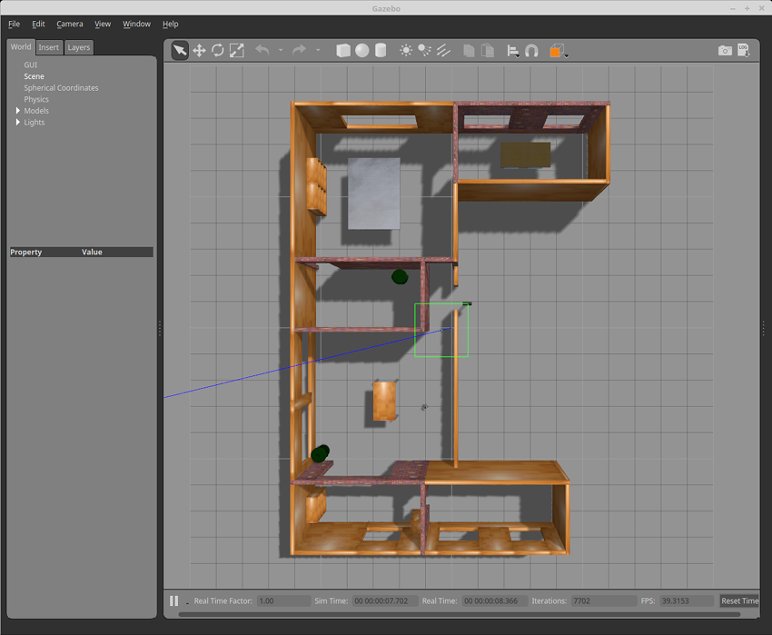

> **Source**: [https://emanual.robotis.com/docs/en/platform/turtlebot3/simulation](https://emanual.robotis.com/docs/en/platform/turtlebot3/simulation)

---
# TOC

1. [Humble](#humble)
2. [Jazzy](#jazzy)
3. [Noetic](#noetic)

---
[TOC](#toc)
# Humble

# 6. Simulation

**NOTE**

- The Simulation should be run from the **Remote PC** .
- Launching the Simulation for the first time on the Remote PC may take some time to setup the environment.


**Read more about TurtleBot3 Simulation**
  * TurtleBot3 supports simulation development environments that can allow for development with a virtual robot. There are two development environments to do this, one using fake node with 3D visualization in RViz, and the other is the 3D robot simulator Gazebo.
     * fake node simulation is suitable for testing the robot model and movement, but it does not support sensors.
     * If you need to perform SLAM or Navigation, Gazebo would be the preferred solution as it supports sensors such as IMU, LDS, and camera.
     * Gazebo Tutorials : http://gazebosim.org/tutorials

## 6.1 Gazebo Simulation

https://youtu.be/UzOoJ6a_mOg?si=nw5X17eLeQre-Veq

> The content in the e-Manual may be updated without prior notice and video content may be outdated.

This Gazebo Simulation uses the **ROS Gazebo package** , Gazebo version ROS 2 Humble has to be installed before running these instructions.


### 6.1.1 Install Simulation Package

  * The **TurtleBot3 Simulation Package** requires `turtlebot3` and `turtlebot3_msgs` packages. Without these prerequisite packages, the Simulation cannot be launched.  Please follow the [PC Setup](https://emanual.robotis.com/docs/en/platform/turtlebot3/quick-start/) instructions if you did not install required packages and dependent packages.

```
$ cd ~/turtlebot3_ws/src/
$ git clone -b humble https://github.com/ROBOTIS-GIT/turtlebot3_simulations.git
$ cd ~/turtlebot3_ws && colcon build --symlink-install
```

### 6.1.2 Launch Simulation World

Three simulation environments are prepared for TurtleBot3. Please select one of these environments to launch Gazebo.

**Please make sure to completely terminate any other Simulation world before launching a new world.**

1. Empty World  <br>

```
$ export TURTLEBOT3_MODEL=burger
$ ros2 launch turtlebot3_gazebo empty_world.launch.py
```

2. TurtleBot3 World  <br> 

```
$ export TURTLEBOT3_MODEL=waffle
$ ros2 launch turtlebot3_gazebo turtlebot3_world.launch.py
```

3. TurtleBot3 House   <br>

```
$ export TURTLEBOT3_MODEL=waffle_pi
$ ros2 launch turtlebot3_gazebo turtlebot3_house.launch.py
```

> **NOTE** : If TurtleBot3 House is launched for the first time, downloading the map may take more than a few minutes depending on network status.


### 6.1.3 Operate TurtleBot3

In order to teleoperate the TurtleBot3 with a keyboard, launch the teleoperation node with the command below in a new terminal window.

```
$ ros2 run turtlebot3_teleop teleop_keyboard
```

**Read more about How to run Autonomous Collision Avoidance**

* A simple collision avoidance node which keeps a safe distance from obstacles and makes turns to avoid collisions is provided with the TurtleBot3 simulation packages.
* In order to autonomously drive a TurtleBot3 in the TurtleBot3 world, please follow the instructions below.

1. Terminate the turtlebot3_teleop_key node by entering Ctrl + C in the terminal running the teleop node.
2. Enter the command below in the terminal.
```
$ ros2 run turtlebot3_gazebo turtlebot3_drive
```

**Read more about How to visualize Simulation data(RViz2)**

RViz2 visualizes published topics while simulation is running. You can launch RViz2 in a new terminal window with the following command.
```
$ ros2 launch turtlebot3_bringup rviz2.launch.py
```


---
[TOC](#toc)
# Jazzy

Simulation
NOTE

The Simulation should be run from the Remote PC.
Launching the Simulation for the first time on the Remote PC may take some time to setup the environment.
 Read more about TurtleBot3 Simulation

Gazebo Simulation

This Gazebo Simulation uses the ros-gz package, Gazebo version ROS 2 Humble has to be installed before running these instructions.

Install Simulation Package
The TurtleBot3 Simulation Package requires turtlebot3 and turtlebot3_msgs packages. Without these prerequisite packages, the Simulation cannot be launched.
Please follow the PC Setup instructions if you did not install required packages and dependent packages.

$ cd ~/turtlebot3_ws/src/
$ git clone -b jazzy https://github.com/ROBOTIS-GIT/turtlebot3_simulations.git
$ cd ~/turtlebot3_ws && colcon build --symlink-install
Launch Simulation World
Three simulation environments are prepared for TurtleBot3. Please select one of these environments to launch Gazebo.

Please make sure to completely terminate any other Simulation world before launching a new world.

Empty World
$ export TURTLEBOT3_MODEL=burger
$ ros2 launch turtlebot3_gazebo empty_world.launch.py


TurtleBot3 World
$ export TURTLEBOT3_MODEL=waffle
$ ros2 launch turtlebot3_gazebo turtlebot3_world.launch.py


TurtleBot3 House
$ export TURTLEBOT3_MODEL=waffle_pi
$ ros2 launch turtlebot3_gazebo turtlebot3_house.launch.py


NOTE: If TurtleBot3 House is launched for the first time, downloading the map may take more than a few minutes depending on network status.

Operate TurtleBot3
In order to teleoperate the TurtleBot3 with a keyboard, launch the teleoperation node with the command below in a new terminal window.

$ ros2 run turtlebot3_teleop teleop_keyboard

 Read more about How to visualize Simulation data(RViz2)

RViz2 visualizes published topics while simulation is running. You can launch RViz2 in a new terminal window with the following command.

$ ros2 launch turtlebot3_bringup rviz2.launch.py


---
[TOC](#toc)
# Noetic

Simulation
NOTE

Simulation should be run on the Remote PC.
Launching the Simulation for the first time on the Remote PC may take additional time to setup the environment.
 Read more about TurtleBot3 Simulation

Gazebo Simulation

The contents of the e-Manual can be updated without prior notice and video content may be outdated.

Install Simulation Package
The TurtleBot3 Simulation Package requires turtlebot3 and turtlebot3_msgs packages. Without these prerequisite packages, the Simulation cannot be launched.
Please follow the PC Setup instructions if you did not install all required packages and dependent packages.
[Remote PC]

$ cd ~/catkin_ws/src/
$ git clone -b noetic https://github.com/ROBOTIS-GIT/turtlebot3_simulations.git
$ cd ~/catkin_ws && catkin_make
Launch Simulation World
Three simulation environments are prepared for TurtleBot3. Please select one of these environments to launch Gazebo.

Please make sure to completely terminate any other Simulation world before launching a new world.

Empty World

[Remote PC]
$ export TURTLEBOT3_MODEL=burger
$ roslaunch turtlebot3_gazebo turtlebot3_empty_world.launch
TurtleBot3 World

[Remote PC]
$ export TURTLEBOT3_MODEL=waffle
$ roslaunch turtlebot3_gazebo turtlebot3_world.launch
TurtleBot3 House

[Remote PC]
$ export TURTLEBOT3_MODEL=waffle_pi
$ roslaunch turtlebot3_gazebo turtlebot3_house.launch
NOTE: When TurtleBot3 House is launched for the first time, downloading the map may take more than a few minutes depending on network status.

Operate TurtleBot3
In order to teleoperate the TurtleBot3 with the keyboard, launch the teleoperation node in a new terminal window.
[Remote PC]

$ roslaunch turtlebot3_teleop turtlebot3_teleop_key.launch

 Read more about How to run Autonomous Collision Avoidance

A simple collision avoidance node which keeps a safe distance from obstacles and makes turns to avoid collision is included with the provided TB3 packages. In order to autonomously drive a TurtleBot3 in the TurtleBot3 world simulation, please follow the instructions below.

Terminate the turtlebot3_teleop_key node by entering Ctrl + C to the terminal running the teleop node.

Enter the following command to the terminal.
[Remote PC]

$ roslaunch turtlebot3_gazebo turtlebot3_simulation.launch
 Read more about How to visualize Simulation data(RViz)

RViz visualizes published topics while simulation is running. You can launch RViz in a new terminal window by entering the command below.
[Remote PC]

$ roslaunch turtlebot3_gazebo turtlebot3_gazebo_rviz.launch


