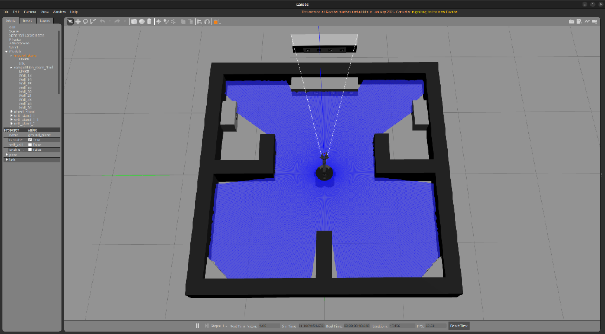
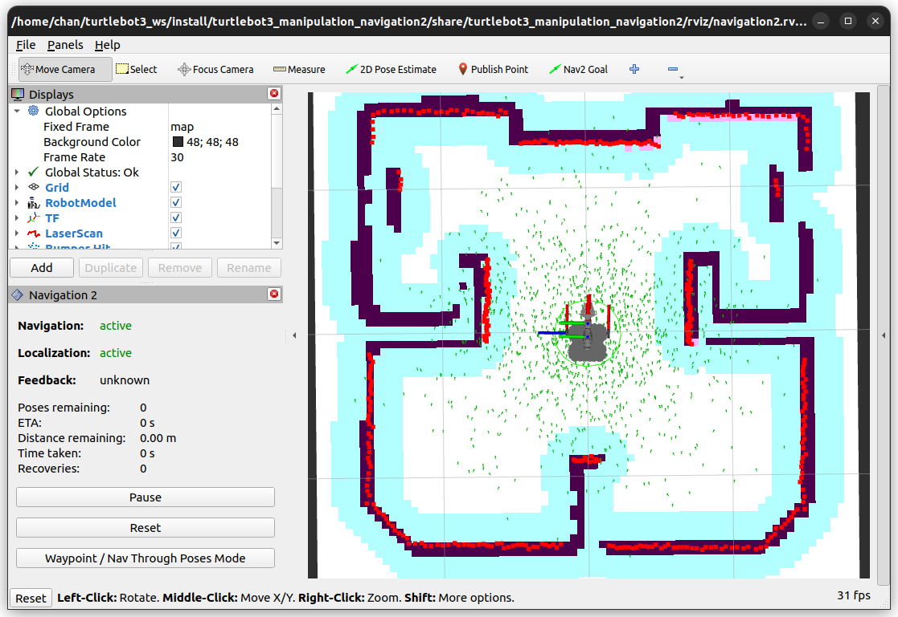
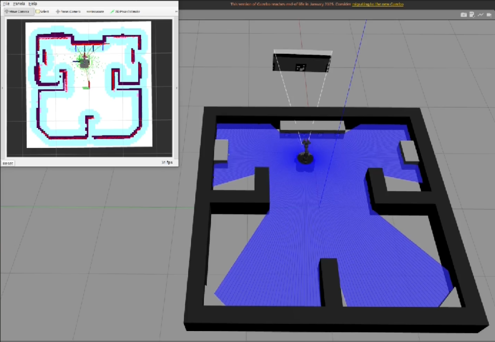
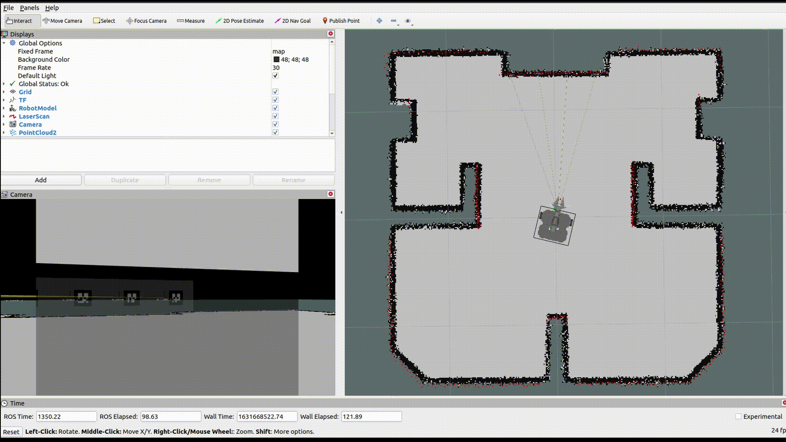
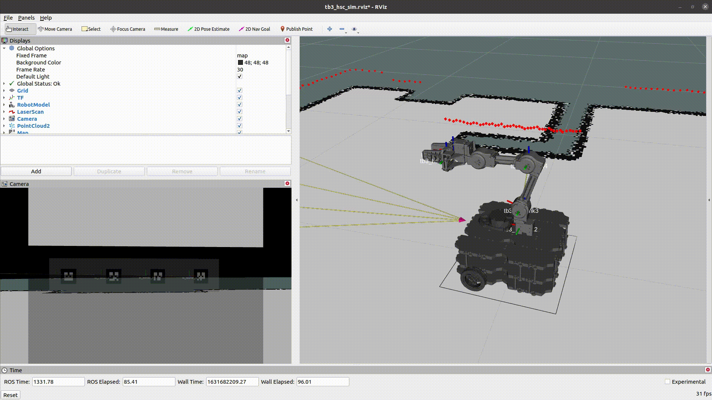
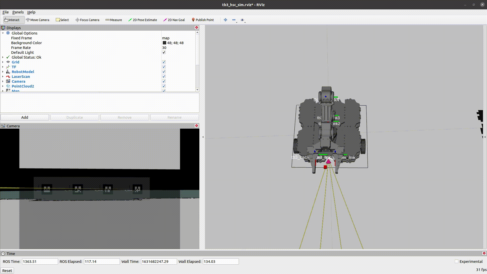
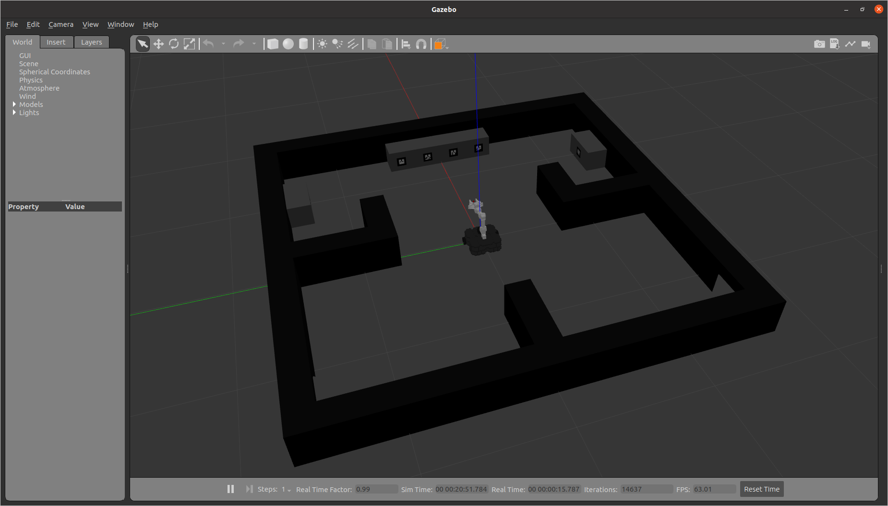
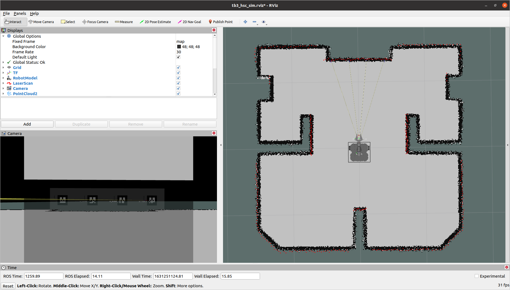

> **Source**: [https://emanual.robotis.com/docs/en/platform/turtlebot3/home_service_challenge](https://emanual.robotis.com/docs/en/platform/turtlebot3/home_service_challenge)

---
# TOC

1. [Humble](#humble)
2. [Noetic](#noetic)

---
[TOC](#toc)
# Humble

## 7.10 TurtleBot3 Home Service Challenge

> **NOTE** :
> - This instructions were tested on `Ubuntu 22.04` and `ROS2 Humble Hawksbill` .
> - For more information, see [OpenMANIPULATOR e-Manual](https://emanual.robotis.com/docs/en/platform/openmanipulator/) and [[ROS 2] Turtlebot3 Manipulation](https://emanual.robotis.com/docs/en/platform/turtlebot3/manipulation)


> Home Service Challenge Stadium and Objects

https://youtu.be/1rkN_F6ODo4?si=4erdIhSQrP17NejO

### 7.10.1 Getting Started

> **NOTE** : Be sure to complete the following instructions before installing Home Service Challenge packages in the pc.
> - [TurtleBot3 PC Set up](https://emanual.robotis.com/docs/en/platform/turtlebot3/quick-start/#pc-setup)
> - [TurtleBot3 SBC Set up](https://emanual.robotis.com/docs/en/platform/turtlebot3/sbc_setup/#sbc-setup)
> - [TB3 & OpenMANIPULATOR-X](https://emanual.robotis.com/docs/en/platform/turtlebot3/manipulation/#software-setup) packages
> **Prerequisites** :
> - ROS 2 Humble installed Laptop or desktop PC.
> - This instruction is based on Gazebo simulation.

**Remote PC Setup**  Install Home Service Challenge packages.  
**[Remote PC]**

```
$ cd ~/turtlebot3_ws/src/
$ git clone -b humble https://github.com/ROBOTIS-GIT/turtlebot3_home_service_challenge.git
$ cd ~/turtlebot3_ws && colcon build --symlink-install
```


### 7.10.2 Simulation

Simulate TurtleBot3 with OpenMANIPULATOR-X in Gazebo.  **[Remote PC]**

1. Run the Gazebo Simulation.
```
$ ros2 launch turtlebot3_manipulation_gazebo turtlebot3_home_service_challenge.launch.py
```



2. Run a Nav2 for Gazebo and set `2D Pose Estimate` in Rviz.
```
$ ros2 launch turtlebot3_home_service_challenge_tools navigation2.launch.py
```


3. Run the core package used to carry out Home Service Challenge’s mission. 
```
$ ros2 launch turtlebot3_home_service_challenge_core core_node.launch.py
```
> * NOTE: core_node contains nodes for ArUco marker detection, parking, and manipulator control, which core_node uses to perform scenario integration control. The core_node performs and controls the behavior in the scenario sequence. After running core_node, we can see the TF of the ArUco marker in rviz and we can run the scenario. SeeMissionsfor more detailed descriptions and to run the scenario.


### 7.10.3 Actual robot

**Ready for actual robot**

- If you want to run the scenario with TurtleBot3 with OpenMANIPULATOR-X, check the below lists. Create a custom map, then create and save the map withSLAM.Set up theRpi-camera.
  - Create a custom map, then create and save the map with [SLAM](https://emanual.robotis.com/docs/en/platform/turtlebot3/manipulation/#slam) .
  - Set up the [Rpi-camera](https://emanual.robotis.com/docs/en/platform/turtlebot3/sbc_setup/#raspberry-pi-camera) .

**Run Home Service Challenge with actual robot**

1. Run hardware bringup.  **[TurtleBot SBC]** $ros2 launch turtlebot3_manipulation_bringup hardware.launch.py
2. Run camera node.  **[TurtleBot SBC]** $ros2 run camera_ros camera_node--ros-args-pformat:='RGB888'-pwidth:=320-pheight:=240
3. Run a Nav2 and set 2D Pose Estimate in Rviz. If you want to use a custom map, run it with the launch argument.  **[Remote PC]** $ros2 launch turtlebot3_home_service_challenge_tools navigation2.launch.py map_yaml_file:=$HOME/map.yaml
4. Run the core package used to carry out Home Service Challenge’s mission. Specify the launch mode and ArUco marker size with the launch argument.  **[Remote PC]** $ros2 launch turtlebot3_home_service_challenge_core core_node.launch.py launch_mode:='actual'marker_size:=0.04

**Arguments**  
`launch_mode`
- default: simulation
- describtion: Select whether you want to run the Home Service Challenge as a simulation or as an actual robot.

`marker_size`
- default: 0.088
- describtion: Specifies the size of the ArUco markers used in the custom map.

> NOTE: core_node contains nodes for ArUco marker detection, parking, and manipulator control, which core_node uses to perform scenario integration control. The core_node performs and controls the behavior in the scenario sequence. After running core_node, we can see the TF of the ArUco marker in rviz and we can run the scenario. SeeMissionsfor more detailed descriptions and to run the scenario.


### 7.10.4 Missions


#### 7.10.4.1 Commands

Use the following commands during Home Service Challenge.  
**[Remote PC]**  
**Individual actions**

- Park in front of the ArUco marker: Put the marker’s ID for integer to `$MARKER_ID` . 
```
$  ros2 topic pub -1 /manipulator_control std_msgs/msg/String "{data: 'pick_target'}"
$  ros2 topic pub -1 /manipulator_control std_msgs/msg/String "{data: 'place_target'}"
```

> NOTE: When using this command, be sure to include one of the ArUco marker’s ID from ascenario.yamlfile. In the provided map, IDs 0 through 7 exist. For detailed information on the scenario, seeConfigurationdescription below at this section.

* Control Manipulator : Use the Manipulator to pick up or place objects. $ros2 topic pub-1/manipulator_control std_msgs/msg/String"{data: 'pick_target'}"$ros2 topic pub-1/manipulator_control std_msgs/msg/String"{data: 'place_target'}"

**Run scenario**  TurtleBot3 will perform **individual actions** for `$SCENARIO_NAME` based on the scenario written.

```
$ ros2 topic pub -1 /scenario_selection std_msgs/msg/String "{data: '$SCENARIO_NAME'}"
```

> **NOTE** : When using this command, be sure to include one of the scenario name from a `scenario.yaml` file. The provided scenario file contains `room1` through `room4` . For detailed information on the scenario, see [Details](https://emanual.robotis.com/docs/en/platform/turtlebot3/home_service_challenge#details-about-the-home-service-mission) description below at this section.


#### 7.10.4.2 Configuration

Modify data in configuration files according to the given environment.
**[Remote PC]**

* `scenario.yaml` : This file contains a scenario’s data. In the simulation, there are initially markers on the front of the TurtleBot with ID 0 through 3, which are assigned as target_marker_id. And in each room, there are markers with ID 4 through 7.
  * File Path : /turtlebot3_home_service_challenge/turtlebot3_home_service_challenge_core/config/scenario.yaml
  * Script
```
scenario:
  room1:  # SCENARIO_NAME
    target_marker_id: 0  # ArUco Marker's ID
    goal_pose: [0.9, 0.5, 0.0, 0.0, 0.0, 0.7071, 0.7071]  # The coordinates and orientation of the room where the goal marker is located.
    goal_marker_id: 4  # ArUco Marker's ID
    end_pose: [0.0, 0.0, 0.0, 0.0, 0.0, 0.0, 1.0]  # Coordinates and orientation of the location to return to.
```

* `turtlebot3_hsc_manipulation.srdf` : This configuration file contains manipulator’s position data. By changing the joint values or adding new `group_state`, you can specify the tmanipulator’s pose.
   * File Path : /turtlebot3_home_service_challenge/turtlebot3_home_service_challenge_tools/config/turtlebot3_hsc_manipulation.srdf
   * Script
```
<group_state name="target" group="arm">
    <joint name="joint1" value="0"/>
    <joint name="joint2" value="0.9076"/>
    <joint name="joint3" value="-0.9425"/>
    <joint name="joint4" value="0.0873"/>
</group_state>
```

#### 7.10.4.3 Details about the Home Service Mission

The goal of the Home Service Challenge is to move four different objects from a living room to a specific place with given rules, and to return to the starting point. (Used topic for run demo : `/scenario_selection` )

Using the demo package, the process of moving objects in Home Service Challenge is as follows.

1. Approaching the target. For the approach to the target with precise, TurtleBot3 wheels are directly controlled by computing target’s location from AR marker. (Used Topic :/target_maker_id,/cmd_vel) Try twice for reliable performance.



2. Picking the target with OpenMANIPULATOR-X’s gripper. Use the MoveIt package to perform joint space control, workspace control, and gripper control to pick the target object. (Used Topic :/manipulator_control) MoveIt Diagram
manipulation_diagram.png

3. Navigating to the next room where the object will be placed.
-Reach the next room saved in a yaml file using the Nav2 package.


5. Approaching the target.
6. Placing the object using the gripper.
7. Returning to the starting point using the Nav2 package.


---
[TOC](#toc)
# Noetic

## 7.10 TurtleBot3 Home Service Challenge

> **NOTE** :
> - This instructions were tested on `Ubuntu 20.04` and `ROS1 Noetic Ninjemys` .
> - For more informationn, see [OpenMANIPULATOR e-Manual](https://emanual.robotis.com/docs/en/platform/openmanipulator/) and [[ROS 1] Turtlebot3 Manipulation](https://emanual.robotis.com/docs/en/platform/turtlebot3/manipulation)
> - Home Service Challenge noetic package is mainly tested under the **Gazebo simulation** .
> - The actual robot will also be tested and updated.


> Home Service Challenge Stadium and Objects

https://youtu.be/lnLHSz7mGIA?si=-Tz5UwLntrFPc3mP

### 7.10.1 Getting Started

**NOTE** : Be sure to complete the following instructions before installing Home Service Challenge packages in the pc.

- [TurtleBot3 PC Set up](https://emanual.robotis.com/docs/en/platform/turtlebot3/quick-start/#pc-setup)
- [TurtleBot3 SBC Set up](https://emanual.robotis.com/docs/en/platform/turtlebot3/sbc_setup/#sbc-setup)
- [OpenMANIPULATOR-X](https://emanual.robotis.com/docs/en/platform/openmanipulator_x/quick_start_guide/#install-ros-packages) packages


#### 7.10.1.1 Prerequisites

`Remote PC`

- ROS 1 Noetic installed Laptop or desktop PC.
- This instruction is based on Gazebo simulation.


#### 7.10.1.2 Remote PC Setup

1. **[Remote PC]** Install Home Service Challenge packages. $cd~/catkin_ws/src/$git clone-bnoetic https://github.com/ROBOTIS-GIT/turtlebot3_home_service_challenge.git$git clone-bnoetic-devel https://github.com/machinekoder/ar_track_alvar$cd~/catkin_ws&&catkin_make
2. **[Remote PC]** Load the TurtleBot3 Waffle (or Waffle Pi) with OpenMANIPULATOR on RViz. $exportTURTLEBOT3_MODEL=${TB3_MODEL}$roslaunch turtlebot3_manipulation_description turtlebot3_manipulation_view.launch use_gui:=true NOTE: Specify${TB3_MODEL}:waffle,waffle_pibefore excuting the command. Set the permanent export setting by followingExport TURTLEBOT3_MODELinstruction. Rviz View. Specify ${TB3_MODEL} : waffle_pi


### 7.10.2 Ready for actual robots

**NOTE** : Actual robots are supported starting with ROS 2 Humble.


### 7.10.3 Missions


#### 7.10.3.1 Run a Demo and Manager Pacakge

1. **[Remote PC]** Run the Gazebo Simulation. $roslaunch turtlebot3_home_service_challenge_simulation competition.launch
2. **[Remote PC]** Run a simulation demo for Gazebo. $roslaunch turtlebot3_home_service_challenge_tools turtlebot3_home_service_challenge_demo_simulation.launch
3. **[Remote PC]** Run the manager package used to carry out Home Service Challenge’s mission. $roslaunch turtlebot3_home_service_challenge_manager manager.launch


#### 7.10.3.2 Commands

**[Remote PC]** Use the following commands during Home Service Challenge.

- **Ready** : TurtleBot3 will prepare to start a mission. $rostopic pub-1/tb3_hsc/command std_msgs/String ready_mission
- **Start** : TurtleBot3 will start a mission. $rostopic pub-1/tb3_hsc/command std_msgs/String start_mission
- **Stop** : TurtleBot3 will stop running a mission. $rostopic pub-1/tb3_hsc/command std_msgs/String stop_mission
- **Restart** : TurtleBot3 will restart a mission by a given scenario. $rostopic pub-1/tb3_hsc/command std_msgs/String restart_mission:SCENARIO_NAME NOTE: When using this command, be sure to include one of the senario name from ascenario.yamlfile. For detailed information on the scenario, seeConfigurationdescription below at this section.


#### 7.10.3.3 Operation Test

**[Remote PC]** Publish the following topics to test a navigation or manipulation feature.

- Navigation
```
$rostopic pub-1/tb3_hsc/command std_msgs/String nav_start
```


```
$rostopic pub-1/tb3_hsc/command std_msgs/String nav_ar_marker_0
```


```
$rostopic pub-1/tb3_hsc/command std_msgs/String nav_ar_marker_1
```


```
$rostopic pub-1/tb3_hsc/command std_msgs/String nav_ar_marker_2
```


```
$rostopic pub-1/tb3_hsc/command std_msgs/String nav_ar_marker_3
```


- Manipulation
```
$rostopic pub-1/tb3_hsc/command std_msgs/String arm_home
```


```
$rostopic pub-1/tb3_hsc/command std_msgs/String arm_joint
```


```
$rostopic pub-1/tb3_hsc/command std_msgs/String arm_task
```



```
$rostopic pub-1/tb3_hsc/command std_msgs/String open_gripper
```


```
$rostopic pub-1/tb3_hsc/command std_msgs/String close_gripper
```



#### 7.10.3.4 Configuration

**[Remote PC]** Modify data in configuration files according to the given environment.

* `scenario.yaml` : This file contains a scenario’s data.
  * File Path : /turtlebot3_home_service_challenge_manager/script/scenario.yaml
  * Script
```
SCENARIO_NAME: # start - scenario - finish
  task: TASK_NAME
  args: [0, 1, 2]
  timeout: 10 #sec, 0 : no time out
  next_scenario: find_object
  scenario_on_failure: standby
  retry_times: 0 #times, 0 : no retry
```
* `room.yaml` : This file contains data of the Home Service Challenge’s stadium.
  * File Path : /turtlebot3_home_service_challenge_manager/config/room.yaml
  * Script
```
room_1:
  name: toilet
  object:
    marker: ar_marker_0
    position: [0.25, 0, 0.15]
  target:
    marker: ar_marker_4
    position: [0.25, 0, 0.15]
  x: [1.5, 0.6]
  y: [1.5, 0.2]
```
* `config.yaml` : This configuration file contains manager package’s data.
  * File Path : /turtlebot3_home_service_challenge_manager/config/config.yaml


#### Details about the Home Service Mission

The goal of the Home Service Challenge is to move four different objects from a living room to a specific place with given rules, and to return to the starting point.

Using the demo package, the process of moving objects in Home Service Challenge is as follows.

1. Navigating to a target in the living room. Find a target, and reach it using a Navigation package.


2. Approaching the target. For the approach to the target with precise, TurtleBot3 wheels are directly controlled by computing target’s location from AR marker. (Used Topic :/tb3_hsc/cmd_vel). To produce a reliable performance, Closed-loop and control system can be used for the specified number of times.


3. Picking the target with OpenMANIPULATOR-X’s gripper. Pick the target object using the moveit package (Joint space control, Task space control and Gripper control) MoveIt Diagram


4. Leaving for the next room to place the object (Used Topic : `/tb3_hsc/cmd_vel` ) When moving back from the target, the wheels are directly controlled by the manager program using/tb3_hsc/cmd_veltopic.

5. Navigating to the place where the object will be placed. Find a next target, and reach it using a Navigation package.


6. Approaching the target.

7. Placing the object using the gripper.

8. Returning to the starting point using the navigation package.


### Simulation

Simulate TurtleBot3 with OpenMANIPULATOR-X in Gazebo.

1. **[Remote PC]** Run Gazebo. 
```
$ roslaunch turtlebot3_home_service_challenge_simulation competition.launch
```


2. **[Remote PC]** Run a simulation demo for Gazebo. 
```
$ roslaunch turtlebot3_home_service_challenge_tools turtlebot3_home_service_challenge_demo_simulation.launch
```


3. **[Remote PC]** Run Home Service Manager. 
```
$ roslaunch turtlebot3_home_service_challenge_manager manager.launch
```

4. Use the Home Service Challenge commands, See [Commands](https://emanual.robotis.com/docs/en/platform/turtlebot3/home_service_challenge#commands)


