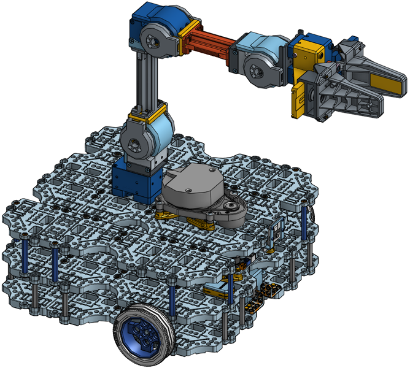
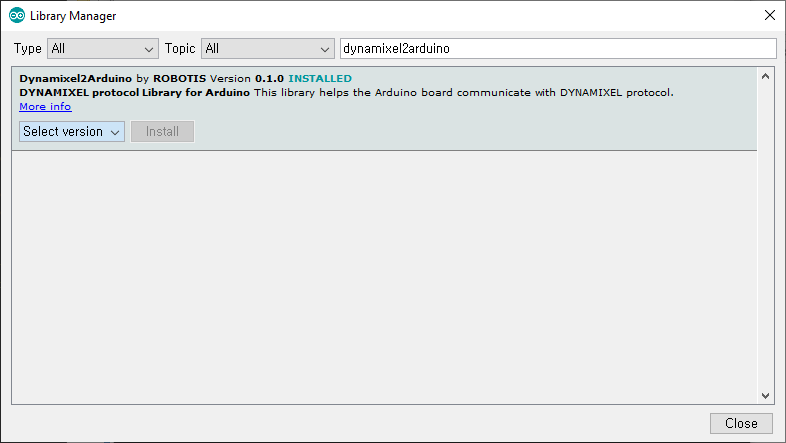
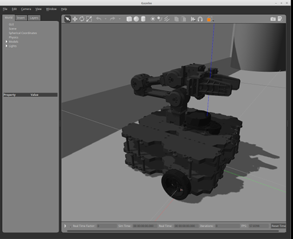
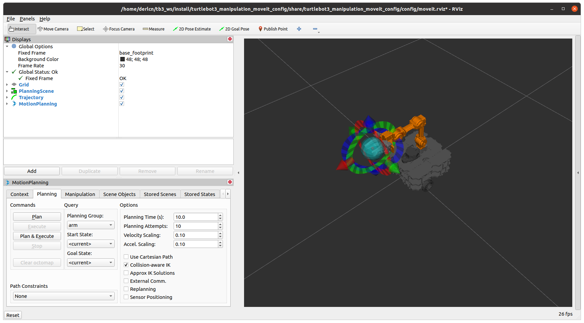

> **Source**: [https://emanual.robotis.com/docs/en/platform/turtlebot3/manipulation](https://emanual.robotis.com/docs/en/platform/turtlebot3/manipulation)

---
# TOC

1. [Humble](#humble)
2. [Noetic](#noetic)

---
[TOC](#toc)
# Humble

# 7. Manipulation

> **NOTE** :
> - These instructions were tested on `Ubuntu 22.04` and `ROS2 Humble Hawksbill` .
> - If you want more specific information about OpenMANIPULATOR-X operation, please refer to the [OpenMANIPULATOR-X](https://emanual.robotis.com/docs/en/platform/openmanipulator/) eManual page.

> The contents in e-Manual are subject to change without prior notice. Some included video instructions may differ from the contents in the e-Manual.

## 7.1 TurtleBot3 with OpenMANIPULATOR


* The OpenMANIPULATOR-X from ROBOTIS is a low cost manipulator using DYNAMIXEL actuators with 3D printable parts and support for ROS.
* The OpenMANIPULATOR-X is compatible with the TurtleBot3 Waffle as a `mobile manipulator` with the SLAM and Navigation capabilities integral to the TurtleBot3 platform.

* https://youtu.be/Qhvk5cnX2hM?si=kdWlSmFP9ta3l5Jv
* https://youtu.be/P82pZsqpBg0?si=0775bFW_WgB71_zu

> The contents in e-Manual are subject to change without notice. Some video content may differ from the contents in the eManual.

## 7.2 Software Setup

> **NOTE** : TurtleBot3 Manipulation for ROS2 Humble requires the `turtlebot3_manipulation` package. Follow the instructions below to install the required package and its dependencies.

> **The TurtleBot3 Simulation Package requires the turtlebot3 and turtlebot3_msgs packages. Without these prerequisite packages, the TurtleBot3 Manipulator cannot be launched. Please followQuick Start Guideinstructions if you did not install required packages and dependent packages.**

1. Connect to the **TurtleBot3 SBC** using the ssh command below.  
**[Remote PC]**
```
$ ssh ubuntu@{IP_ADDRESS_OF_TURTLEBOT3}
```

3. Install the packages for TurtleBot3 Manipulation.  
**[TurtleBot3 SBC]** 
```
$ sudo apt install ros-humble-hardware-interface ros-humble-xacro ros-humble-ros2-control ros-humble-ros2-controllers ros-humble-gripper-controllers
$ cd ~/turtlebot3_ws/src/
$ git clone -b humble https://github.com/ROBOTIS-GIT/turtlebot3_manipulation.git
$ cd ~/turtlebot3_ws && colcon build --symlink-install
```

4. Open a terminal on the **Remote PC** and install the required packages using the following commands.  
**[Remote PC]** 
```
$ sudo apt install ros-humble-dynamixel-sdk ros-humble-ros2-control ros-humble-ros2-controllers ros-humble-gripper-controllers ros-humble-moveit*
$ cd ~/turtlebot3_ws/src/
$ git clone -b humble https://github.com/ROBOTIS-GIT/turtlebot3_manipulation.git
$ cd ~/turtlebot3_ws && colcon build --symlink-install
```
## 7.3 Hardware Assembly

- [CAD files](http://www.robotis.com/service/download.php?no=767) (TurtleBot3 Waffle Pi + OpenMANIPULATOR)


1. Remove the `LDS-01` or `LDS-02` LiDAR sensor and install it on the front of TurtleBot3.  Red circles indicate recommended bolt holes.
2. Install the `OpenMANIPULATOR-X` on the TurtleBot3.  Yellow circles indicate recommended bolt holes.





## 7.4 OpenCR Setup

> **NOTE** : To use the OpenMANIPULATOR-X, you need to upload specific firmware to the OpenCR by using either a **shell script** or the **Arduino IDE** .
> 1. The **Shell script** is recommended to upload the firmware as it uses a pre-built binary file
> 2. The **Arduino IDE** builds from the provided source code and uploads the generated binary file. The OpenCR Arduino board manager does not support ARM based processors such as Raspberry Pi or Jetson Nano.

> **WARNING**  Please connect all DYNAMIXEL motors to the OpenCR before uploading the OpenCR firmware.

* After the OpenMANIPULATOR-X is properly mounted on TurtleBot3, the OpenCR firmware needs to be updated to control the connected DYNAMIXELs. Please follow the firmware update instructions below.

1. Download the OpenCR firmware file on the Raspberry Pi (SBC) and upload the correct firmware with the following commands.  
**[TurtleBot3 SBC]** 
```
$ export OPENCR_PORT=/dev/ttyACM0
$ export OPENCR_MODEL=turtlebot3_manipulation
$ rm -rf ./opencr_update.tar.bz2
$ wget https://github.com/ROBOTIS-GIT/OpenCR-Binaries/raw/master/turtlebot3/ROS2/latest/opencr_update.tar.bz2
$ tar -xvf opencr_update.tar.bz2
$ cd ./opencr_update
$ ./update.sh $OPENCR_PORT $OPENCR_MODEL.opencr
```

2. When the firmware is successfully uploaded to the OpenCR, **jump_to_fw** will be printed to the terminal used to upload the firmware.


### 7.4.1 Arduino IDE

> Please be aware that OpenCR board manager **does not support Arduino IDE on ARM based SBC such as Raspberry Pi or NVidia Jetson** .  In order to upload the OpenCR firmware using Arduino IDE, please follow the below instructions on your PC.

> **NOTE** : To use the OpenMANIPULATOR-X, you will need to upload dedicated firmware to the OpenCR by using either a **shell script** or the **Arduino IDE** .

**about the firmware upload using Arduino IDE**

1. If you are using Linux, please configure the USB port for the OpenCR. For other OS(OSX or Windows), you can skip to the step 2 “Install Arduino IDE”.
```
$ wget https://raw.githubusercontent.com/ROBOTIS-GIT/OpenCR/master/99-opencr-cdc.rules
$ sudo cp ./99-opencr-cdc.rules /etc/udev/rules.d/
$ sudo udevadm control --reload-rules
$ sudo udevadm trigger
$ sudo apt install libncurses5-dev:i386
```
2. Install Arduino IDE.
  * Download the latest Arduino IDE
3. After completing the installation, run Arduino IDE.
4. Press `Ctrl` + `,` to open the Preferences menu
5. Enter below addresses in the Additional Boards Manager URLs.
```
https://raw.githubusercontent.com/ROBOTIS-GIT/OpenCR/master/arduino/opencr_release/package_opencr_index.json
```


6. Select Sketch > Include Library > Manage Libraries... to install the DYNAMIXEL2Arduino library. 


7. Search for DYNAMIXEL2Arduino from the Library Manager and install the library. 



8.Open the TurtleBot3 Manipulation example.
  * File > Examples > turtlebot3 > turtlebot3_manipulation > turtlebot3_manipulation
9. Connect the micro USB of the OpenCR to the PC and select Tools > Board > OpenCR > OpenCR Board in the Arduino IDE.
10. Select the port connected to the OpenCR from the Tools > Port menu.
11. Upload the TurtleBot3 firmware sketch with Ctrl + U or the upload icon.


12. If firmware upload fails, try uploading the firmware in recovery mode. the following sequence activates the recovery mode of the OpenCR. When in recovery mode, the STATUS led of the OpenCR will blink periodically.
  * Hold down the PUSH SW2 button.
  * Press the Reset button.
  * Release the Reset button.
  * Release the PUSH SW2 button.


## 7.5 Bringup

> In order to run a TurtleBot3 Manipulation simulation using Gazebo, please skip to the [Simulation](https://emanual.robotis.com/docs/en/platform/turtlebot3/manipulation#simulation) section.
> The following command will bringup the actual TurtleBot3 hardware with OpenMANIPULATOR-X on it.

1. Open a terminal from the **TurtleBot3 SBC** .
2. Bring up the TurtleBot3 Manipulation using the following command.
**[TurtleBot3 SBC]**

```
$ ros2 launch turtlebot3_manipulation_bringup hardware.launch.py
```

> **DANGER**
> **Please be aware of pinch danger between the robot joints!!!**
> When the Turtlebot3 Manipulation bringup launches, **the OpenMANIPULATOR-X will move to the initial pose** .  It is recommended to put the OpenMANIPULATOR-X in a similar pose to the below image to avoid any physical damage during the initial movement.
> 


## 7.6 Simulation
* Simulate the TurtleBot3 Manipulation using Gazebo by following the instructions below.

### 7.6.1 Install Simulation Package
* Install the packages for TurtleBot3 Manipulation Gazebo simulation.
**[Remote PC]**
```
$ cd ~/turtlebot3_ws/src/
$ git clone -b humble https://github.com/ROBOTIS-GIT/turtlebot3_simulations.git
$ cd ~/turtlebot3_ws && colcon build --symlink-install
```

### 7.6.2 How to Run Gazebo
* Bringup the TurtleBot3 with OpenMANIPULATOR-X in Gazebo world with the following command.
**[Remote PC]**

```
$ ros2 launch turtlebot3_manipulation_gazebo gazebo.launch.py
```


> **TIP**
> In order to run with RViz, append the `start_rviz` parameter as below.  
> **[Remote PC]**
> ```
> $ ros2 launch turtlebot3_manipulation_gazebo gazebo.launch.py start_rviz:=true
> ```

* To control the TurtleBot3 in the Gazebo simulation, the servo server node of MoveIt must be launched first.  
**[Remote PC]**
```
$ ros2 launch turtlebot3_manipulation_moveit_config servo.launch.py
```

Launch the keyboard teleoperation node.  
**[Remote PC]**

```
$ ros2 run turtlebot3_manipulation_teleop turtlebot3_manipulation_teleop
```

> **TIP**
> Following keys are used to control the TurtleBot3.
> ```
> Use o|k|l|; keys to move turtlebot base and use 'space' key to stop the base
> Use s|x|z|c|a|d|f|v keys to Cartesian jog
> Use 1|2|3|4|q|w|e|r keys to joint jog.
> 'ESC' to quit.
> ```

### 7.6.3 Simulation with MoveIt

* In order to use MoveIt to operate the OpenMANIPULATOR-X in Gazebo, terminate other Gazebo and RViz tools first.  Enter the below command to launch RViz with MoveIt configuration.
**[Remote PC]**

```
$ ros2 launch turtlebot3_manipulation_moveit_config moveit_gazebo.launch.py
```

The MoveIt Interface on RViz will be launched along with the Gazebo simulator.




## 7.7 Operate the Actual OpenMANIPULATOR

Please be aware that the actual hardware operation requires [Bringup](https://emanual.robotis.com/docs/en/platform/turtlebot3/manipulation#bringup) from the TurtleBot3 SBC.

Bring up the TurtleBot3 Manipulation using the following command.  **[TurtleBot3 SBC]**

```
 $ ros2 launch turtlebot3_manipulation_bringup hardware.launch.py
```

Enter the command below to launch the MoveIt on RViz.  **[Remote PC]**

```
$ ros2 launch turtlebot3_manipulation_moveit_config moveit_core.launch.py
```

To operate the robot with the keyboard teleoperation node, the RViz must be terminated.  Then launch the servo server node and teleoperation nodes on a separate terminal window.  **[Remote PC]**

```
$ ros2 launch turtlebot3_manipulation_moveit_config servo.launch.py
```

**[Remote PC]**

```
$ ros2 run turtlebot3_manipulation_teleop turtlebot3_manipulation_teleop
```


## 7.8 SLAM

> Be sure to read [SLAM](http://emanual.robotis.com/docs/en/platform/turtlebot3/slam/#slam) manual before use of the following instruction.


### 7.8.1 TurtleBot3 Bringup

Bring up the TurtleBot3 Manipulation `Actual` or `Simulation` using the following command.  `Actual` **[TurtleBot3 SBC]**

```
$ ros2 launch turtlebot3_manipulation_bringup hardware.launch.py
```

OR  `Simulation` **[Remote PC]**

```
$ ros2 launch turtlebot3_manipulation_gazebo gazebo.launch.py
```


### 7.8.2 Run SLAM Nodes

Launch **slam node** using the following command.  **[Remote PC]**

```
$ ros2 launch turtlebot3_manipulation_cartographer cartographer.launch.py
```


### 7.8.3 Run Teleoperation Nodes

1. Launch the servo server node.  
**[Remote PC]**
```
$ ros2 launch turtlebot3_manipulation_moveit_config servo.launch.py
```

3. Launch **teleop node** using the following command.  
**[Remote PC]**
```
$ ros2 run turtlebot3_manipulation_teleop turtlebot3_manipulation_teleop
```

5. Use `O` , `K` , `L` , `;` keys to drive the TurtleBot3 platform.


### 7.8.4 Save the Map

1. Open a terminal on **Remote PC** .
2. Run the nav2_map_server to save the current map on RViz.  
**[Remote PC]**
```
$ ros2 run nav2_map_server map_saver_cli -f ~/map
```


## 7.9 Navigation

> Be sure to read [Navigation](https://emanual.robotis.com/docs/en/platform/turtlebot3/navigation/#navigation) manual before use of the following instruction.


### 7.9.1 TurtleBot3 Bringup

Bring up the TurtleBot3 Manipulation `Actual` or `Simulation` using the following command.  `Actual` 
**[TurtleBot3 SBC]**
```
$ ros2 launch turtlebot3_manipulation_bringup hardware.launch.py
```

OR  `Simulation` 

**[Remote PC]**
```
$ ros2 launch turtlebot3_manipulation_gazebo gazebo.launch.py
```


### 7.9.2 Run Navigation Nodes
**[Remote PC]**

1. Open a terminal on **Remote PC** .
2. Launch the navigation file using the following command. 
```
$ ros2 launch turtlebot3_manipulation_navigation2 navigation2.launch.py map_yaml_file:=$HOME/map.yaml
```


