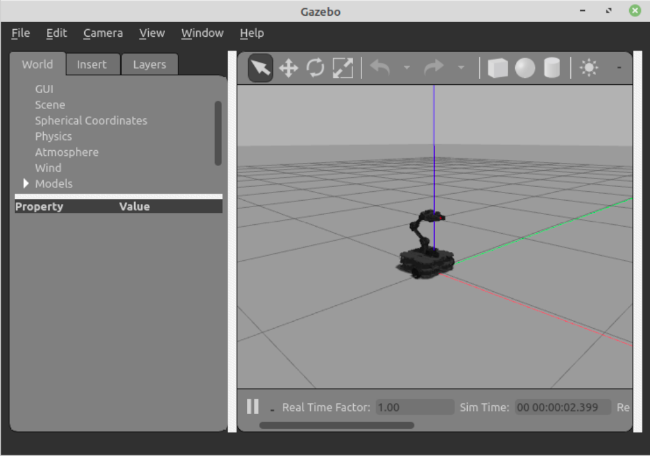
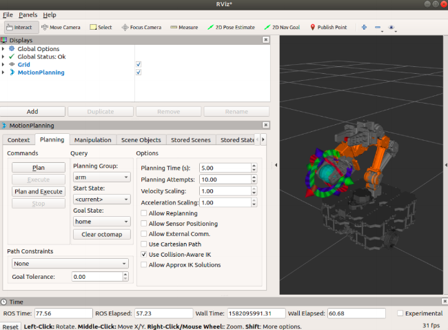
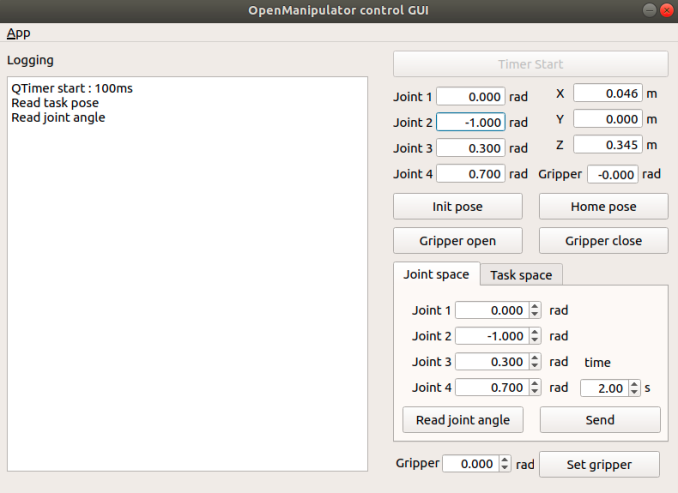
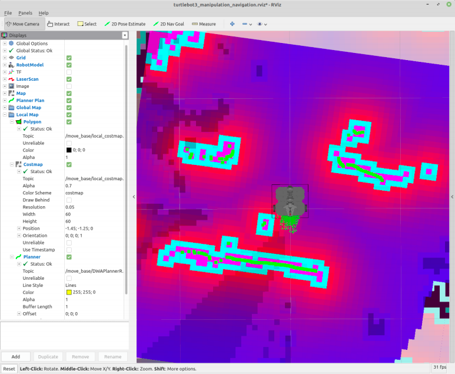

> **Source**: [https://emanual.robotis.com/docs/en/platform/turtlebot3/manipulation](https://emanual.robotis.com/docs/en/platform/turtlebot3/manipulation)

---
# TOC

1. [Humble](#humble)
2. [Noetic](#noetic)

---
[TOC](#toc)
# Humble

# 7. Manipulation

> **NOTE** :
> - These instructions were tested on `Ubuntu 22.04` and `ROS2 Humble Hawksbill` .
> - If you want more specific information about OpenMANIPULATOR-X operation, please refer to the [OpenMANIPULATOR-X](https://emanual.robotis.com/docs/en/platform/openmanipulator/) eManual page.

> The contents in e-Manual are subject to change without prior notice. Some included video instructions may differ from the contents in the e-Manual.

## 7.1 TurtleBot3 with OpenMANIPULATOR


* The OpenMANIPULATOR-X from ROBOTIS is a low cost manipulator using DYNAMIXEL actuators with 3D printable parts and support for ROS.
* The OpenMANIPULATOR-X is compatible with the TurtleBot3 Waffle as a `mobile manipulator` with the SLAM and Navigation capabilities integral to the TurtleBot3 platform.

* https://youtu.be/Qhvk5cnX2hM?si=kdWlSmFP9ta3l5Jv
* https://youtu.be/P82pZsqpBg0?si=0775bFW_WgB71_zu

> The contents in e-Manual are subject to change without notice. Some video content may differ from the contents in the eManual.

## 7.2 Software Setup

> **NOTE** : TurtleBot3 Manipulation for ROS2 Humble requires the `turtlebot3_manipulation` package. Follow the instructions below to install the required package and its dependencies.

> **The TurtleBot3 Simulation Package requires the turtlebot3 and turtlebot3_msgs packages. Without these prerequisite packages, the TurtleBot3 Manipulator cannot be launched. Please followQuick Start Guideinstructions if you did not install required packages and dependent packages.**

1. Connect to the **TurtleBot3 SBC** using the ssh command below.  
**[Remote PC]**
```
$ ssh ubuntu@{IP_ADDRESS_OF_TURTLEBOT3}
```

3. Install the packages for TurtleBot3 Manipulation.  
**[TurtleBot3 SBC]** 
```
$ sudo apt install ros-humble-hardware-interface ros-humble-xacro ros-humble-ros2-control ros-humble-ros2-controllers ros-humble-gripper-controllers
$ cd ~/turtlebot3_ws/src/
$ git clone -b humble https://github.com/ROBOTIS-GIT/turtlebot3_manipulation.git
$ cd ~/turtlebot3_ws && colcon build --symlink-install
```

4. Open a terminal on the **Remote PC** and install the required packages using the following commands.  
**[Remote PC]** 
```
$ sudo apt install ros-humble-dynamixel-sdk ros-humble-ros2-control ros-humble-ros2-controllers ros-humble-gripper-controllers ros-humble-moveit*
$ cd ~/turtlebot3_ws/src/
$ git clone -b humble https://github.com/ROBOTIS-GIT/turtlebot3_manipulation.git
$ cd ~/turtlebot3_ws && colcon build --symlink-install
```
## 7.3 Hardware Assembly

- [CAD files](http://www.robotis.com/service/download.php?no=767) (TurtleBot3 Waffle Pi + OpenMANIPULATOR)


1. Remove the `LDS-01` or `LDS-02` LiDAR sensor and install it on the front of TurtleBot3.  Red circles indicate recommended bolt holes.
2. Install the `OpenMANIPULATOR-X` on the TurtleBot3.  Yellow circles indicate recommended bolt holes.


## 7.4 OpenCR Setup

> **NOTE** : To use the OpenMANIPULATOR-X, you need to upload specific firmware to the OpenCR by using either a **shell script** or the **Arduino IDE** .
> 1. The **Shell script** is recommended to upload the firmware as it uses a pre-built binary file
> 2. The **Arduino IDE** builds from the provided source code and uploads the generated binary file. The OpenCR Arduino board manager does not support ARM based processors such as Raspberry Pi or Jetson Nano.

> **WARNING**  Please connect all DYNAMIXEL motors to the OpenCR before uploading the OpenCR firmware.

* After the OpenMANIPULATOR-X is properly mounted on TurtleBot3, the OpenCR firmware needs to be updated to control the connected DYNAMIXELs. Please follow the firmware update instructions below.

1. Download the OpenCR firmware file on the Raspberry Pi (SBC) and upload the correct firmware with the following commands.  
**[TurtleBot3 SBC]** 
```
$ export OPENCR_PORT=/dev/ttyACM0
$ export OPENCR_MODEL=turtlebot3_manipulation
$ rm -rf ./opencr_update.tar.bz2
$ wget https://github.com/ROBOTIS-GIT/OpenCR-Binaries/raw/master/turtlebot3/ROS2/latest/opencr_update.tar.bz2
$ tar -xvf opencr_update.tar.bz2
$ cd ./opencr_update
$ ./update.sh $OPENCR_PORT $OPENCR_MODEL.opencr
```

2. When the firmware is successfully uploaded to the OpenCR, **jump_to_fw** will be printed to the terminal used to upload the firmware.


### 7.4.1 Arduino IDE

> Please be aware that OpenCR board manager **does not support Arduino IDE on ARM based SBC such as Raspberry Pi or NVidia Jetson** .  In order to upload the OpenCR firmware using Arduino IDE, please follow the below instructions on your PC.

> **NOTE** : To use the OpenMANIPULATOR-X, you will need to upload dedicated firmware to the OpenCR by using either a **shell script** or the **Arduino IDE** .

## 7.5 Bringup

> In order to run a TurtleBot3 Manipulation simulation using Gazebo, please skip to the [Simulation](https://emanual.robotis.com/docs/en/platform/turtlebot3/manipulation#simulation) section.
> The following command will bringup the actual TurtleBot3 hardware with OpenMANIPULATOR-X on it.

1. Open a terminal from the **TurtleBot3 SBC** .
2. Bring up the TurtleBot3 Manipulation using the following command.
**[TurtleBot3 SBC]**

```
$ ros2 launch turtlebot3_manipulation_bringup hardware.launch.py
```

> **DANGER**
> **Please be aware of pinch danger between the robot joints!!!**
> When the Turtlebot3 Manipulation bringup launches, **the OpenMANIPULATOR-X will move to the initial pose** .  It is recommended to put the OpenMANIPULATOR-X in a similar pose to the below image to avoid any physical damage during the initial movement.
> 

**NOTE** : Be sure that the OpenCR port is properly assigned in the [turtlebot3_core.launch](https://github.com/ROBOTIS-GIT/turtlebot3/blob/467c76bc4fa2e34162f57107388839d82d3bcc0e/turtlebot3_bringup/launch/turtlebot3_core.launch#L5) bringup file.


### Run roscore

Run roscore to start ROS.  **[Remote PC]**

```
$ 
roscore

```


### Define TurtleBot3 Model

Export your TurtleBot3 model ( `waffle` or `waffle_pi` ) if the **TURTLEBOT3_MODEL** is not defined in your `.bashrc` file.  **[TurtleBot3 SBC]**

```
$ 
export 
TURTLEBOT3_MODEL
=
waffle_pi

```


### Run Bringup

Run the Bringup node for TurtleBot3, and start rosserial and LDS sensor using the following command.  **[TurtleBot3 SBC]**

```
$ 
roslaunch turtlebot3_bringup turtlebot3_robot.launch

```


## Simulation

Simulate the TurtleBot3 Manipulation using Gazebo by following the instructions below.


### Install Simulation Package

Install the packages for TurtleBot3 Manipulation Gazebo simulation.

**[Remote PC]**

```
$ 
cd
 ~/turtlebot3_ws/src/

$ 
git clone 
-b
 humble https://github.com/ROBOTIS-GIT/turtlebot3_simulations.git

$ 
cd
 ~/turtlebot3_ws 
&&
 colcon build 
--symlink-install


```


### How to Run Gazebo

Bringup the TurtleBot3 with OpenMANIPULATOR-X in Gazebo world with the following command.

**[Remote PC]**

```
$ 
ros2 launch turtlebot3_manipulation_gazebo gazebo.launch.py

```


**TIP**

In order to run with RViz, append the `start_rviz` parameter as below.  **[Remote PC]**

```
$ 
ros2 launch turtlebot3_manipulation_gazebo gazebo.launch.py start_rviz:
=
true


```

To control the TurtleBot3 in the Gazebo simulation, the servo server node of MoveIt must be launched first.  **[Remote PC]**

```
$ 
ros2 launch turtlebot3_manipulation_moveit_config servo.launch.py

```

Launch the keyboard teleoperation node.  **[Remote PC]**

```
$ 
ros2 run turtlebot3_manipulation_teleop turtlebot3_manipulation_teleop

```

**TIP**

Following keys are used to control the TurtleBot3.

```
Use o|k|l|; keys to move turtlebot base and use 'space' key to stop the base
Use s|x|z|c|a|d|f|v keys to Cartesian jog
Use 1|2|3|4|q|w|e|r keys to joint jog.
'ESC' to quit.

```


### Simulation with MoveIt

In order to use MoveIt to operate the OpenMANIPULATOR-X in Gazebo, terminate other Gazebo and RViz tools first.  Enter the below command to launch RViz with MoveIt configuration.

**[Remote PC]**

```
$ 
ros2 launch turtlebot3_manipulation_moveit_config moveit_gazebo.launch.py

```

The MoveIt Interface on RViz will be launched along with the Gazebo simulator.


Simulate TurtleBot3 Manipulation using Gazebo by following this section.


### Run Gazebo

Load the TurtleBot3 with OpenMANIPULATOR-X into Gazebo world with the following command.  **[Remote PC]**

```
$ 
roslaunch turtlebot3_manipulation_gazebo turtlebot3_manipulation_gazebo.launch

```




### Run move_group Node

In order to use the MoveIt feature, launch the **move_group** node.  With a successful launch, **“You can start planning now!”** message will be printed on the terminal.  **[Remote PC]**

```
$ 
roslaunch turtlebot3_manipulation_moveit_config move_group.launch

```


### Run RViz

Use MoveIt in RViz by reading a `moveit.rviz` file where MoveIt environment data is configured.  You can control the mounted manipulator using an interactive marker, and simulate the motion to a goal position, which helps preventing possible physical contact by simulating the motion in advance.  **[Remote PC]**

```
$ 
roslaunch turtlebot3_manipulation_moveit_config moveit_rviz.launch

```




### Run ROBOTIS GUI Controller

You can also use a GUI to control the OpenMANIPULATOR-X in Gazebo. The GUI supports **Task Space** and **Joint Space** controls.

- `Task Space Control` : Control based on valid gripping positions (represented as a small red cube between the grippers) of the end-effector of the OpenMANIPULATOR-X.
- `Joint Space Control` : Control based on each joint angle.  **[Remote PC]** $roslaunch turtlebot3_manipulation_gui turtlebot3_manipulation_gui.launch




## Operate the Actual OpenMANIPULATOR

Please be aware that the actual hardware operation requires [Bringup](https://emanual.robotis.com/docs/en/platform/turtlebot3/manipulation#bringup) from the TurtleBot3 SBC.

Bring up the TurtleBot3 Manipulation using the following command.  **[TurtleBot3 SBC]**

```
  
$ 
ros2 launch turtlebot3_manipulation_bringup hardware.launch.py

```

Enter the command below to launch the MoveIt on RViz.  **[Remote PC]**

```
$ 
ros2 launch turtlebot3_manipulation_moveit_config moveit_core.launch.py

```

To operate the robot with the keyboard teleoperation node, the RViz must be terminated.  Then launch the servo server node and teleoperation nodes on a separate terminal window.  **[Remote PC]**

```
$ 
ros2 launch turtlebot3_manipulation_moveit_config servo.launch.py

```

**[Remote PC]**

```
$ 
ros2 run turtlebot3_manipulation_teleop turtlebot3_manipulation_teleop

```

Follow the given instruction to operate your robot.


### Run roscore

Run roscore to use ROS 1.  **[Remote PC]**

```
$ 
roscore

```


### Run Bringup

1. Run Bringup node for TurtleBot3, and start rosserial and LDS sensor using following command.  **[TurtleBot3 SBC]** $roslaunch turtlebot3_bringup turtlebot3_robot.launch
2. Run Bringup node for OpenMANIPULATOR on TurtleBot3  **[Remote PC]** $roslaunch turtlebot3_manipulation_bringup turtlebot3_manipulation_bringup.launch


### Run move_group Node

**[Remote PC]**

```
$ 
roslaunch turtlebot3_manipulation_moveit_config move_group.launch

```


### Run RViz

Run RViz to visualize data and to use the interactive marker.  **[Remote PC]**

```
$ 
roslaunch turtlebot3_manipulation_moveit_config moveit_rviz.launch

```


### Run ROBOTIS GUI Controller

OpenMANIPULATOR can be controlled with using ROBOTIS GUI controller instead of RViz tool.  **[Remote PC]**

```
$ 
roslaunch turtlebot3_manipulation_gui turtlebot3_manipulation_gui.launch

```


## SLAM

Be sure to read [SLAM](http://emanual.robotis.com/docs/en/platform/turtlebot3/slam/#slam) manual before use of the following instruction.


### TurtleBot3 Bringup

Bring up the TurtleBot3 Manipulation `Actual` or `Simulation` using the following command.  `Actual` **[TurtleBot3 SBC]**

```
  
$ 
ros2 launch turtlebot3_manipulation_bringup hardware.launch.py

```

OR  `Simulation` **[Remote PC]**

```
  
$ 
ros2 launch turtlebot3_manipulation_gazebo gazebo.launch.py

```


### Run SLAM Nodes

Launch **slam node** using the following command.  **[Remote PC]**

```
$ 
ros2 launch turtlebot3_manipulation_cartographer cartographer.launch.py

```


### Run Teleoperation Nodes

1. Launch the servo server node.  **[Remote PC]** $ros2 launch turtlebot3_manipulation_moveit_config servo.launch.py
2. Launch **teleop node** using the following command.  **[Remote PC]** $ros2 run turtlebot3_manipulation_teleop turtlebot3_manipulation_teleop
3. Use `O` , `K` , `L` , `;` keys to drive the TurtleBot3 platform.


### Save the Map

1. Open a terminal on **Remote PC** .
2. Run the nav2_map_server to save the current map on RViz.  **[Remote PC]** $ros2 run nav2_map_server map_saver_cli-f~/map


Be sure to read [SLAM](http://emanual.robotis.com/docs/en/platform/turtlebot3/slam/#slam) manual before use of the following instruction.

Use SLAM feature to update an unknown map with TurtleBot3 and OpenMANIPULATOR

 ;


### Run roscore

Run roscore to use ROS 1.  **[Remote PC]**

```
$ 
roscore

```


### Run Bringup

Run Bringup node for TurtleBot3, and start rosserial and LDS sensor using following command.  **[TurtleBot3 SBC]**

```
roslaunch turtlebot3_bringup turtlebot3_robot.launch

```

**NOTE** : As OpenMANIPULATOR on TurtleBot3 is not neccessory for SLAM, **move_group** and **bringup** nodes, which are the parameters to control OpenMANIPULATOR, are not important to use


### Run SLAM Node

Run SLAM node for updating an unknown map with TurtleBot3. This node utilizes gmapping package.  **[Remote PC]**

```
$ 
roslaunch turtlebot3_manipulation_slam slam.launch

```


### Run turtlebot3_teleop_key Node

1. Update the map where TurtleBot3 will navigate using turtlebot3_teleop_key node.  **[Remote PC]** $roslaunch turtlebot3_teleop turtlebot3_teleop_key.launch
2. Once the map is completely updated, run the map_saver node to save the updated map.  **[Remote PC]** $rosrun map_server map_saver-f~/map


## Navigation

Be sure to read [Navigation](https://emanual.robotis.com/docs/en/platform/turtlebot3/navigation/#navigation) manual before use of the following instruction.


### TurtleBot3 Bringup

Bring up the TurtleBot3 Manipulation `Actual` or `Simulation` using the following command.  `Actual` **[TurtleBot3 SBC]**

```
  
$ 
ros2 launch turtlebot3_manipulation_bringup hardware.launch.py

```

OR  `Simulation` **[Remote PC]**

```
  
$ 
ros2 launch turtlebot3_manipulation_gazebo gazebo.launch.py

```


### Run Navigation Nodes

**[Remote PC]**

1. Open a terminal on **Remote PC** .
2. Launch the navigation file using the following command. $ros2 launch turtlebot3_manipulation_navigation2 navigation2.launch.py map_yaml_file:=$HOME/map.yaml

Be sure to read [Navigation](https://emanual.robotis.com/docs/en/platform/turtlebot3/navigation/#navigation) manual before use of the following instruction.

Send TurtleBot3 with OpenMANIPULATOR to the desired position in the map using Navigation node.


### Run roscore

Run roscore to use ROS 1.  **[Remote PC]**

```
$ 
roscore

```


### Run Bringup

Run Bringup node for TurtleBot3, and start rosserial and LDS sensor using following command.  **[TurtleBot3 SBC]**

```
$ 
roslaunch turtlebot3_bringup turtlebot3_robot.launch

```


### Run Navigation Node

Run Navigation node with the following command, which will call Unified Robot Description Format (urdf) and configuration data of RViz to set GUI enviroment, parmeters for Navigation and updated map.  **[Remote PC]**

```
$ 
roslaunch turtlebot3_manipulation_navigation navigation.launch map_file:
=
$HOME
/map.yaml 

```




### How to Control OpenMANIPULATOR with Navigation

You can run this node to control OpenMANIPULATOR on TurtleBot3 when TurtleBot3 is approaching to a goal position when Navigation node is running.
However, when TurtleBot3 is in motion, the movement of OpenMANIPULATOR will be unstable by external influences, such as center of gravity, or vibration; so that it is recommended for the manipulator to be used when TurtleBot3 is not driving.


#### Run Bringup node for OpenMANIPULATOR

Run **turtlebot3_manipulation_bringup** node just as use of single OpenMANIPULATOR. This node contains **arm_controller** and **gripper_controller** .  **[Remote PC]**

```
$ 
roslaunch turtlebot3_manipulation_bringup turtlebot3_manipulation_bringup.launch

```


#### Run move_group Node

**move_group** node supports two interfaces to control OpenMANIPULATOR; **MoveIt!** and **ROBOTIS GUI** . Choose either of them according to your preference. In this section, GUI Controller is introduced only.  **[Remote PC]**

```
$ 
roslaunch turtlebot3_manipulation_moveit_config move_group.launch

```

**NOTE** : Please refer to [MoveIt!](https://moveit.ros.org/) for more details.


### Run GUI Controller

Using this interface, you can control OpenMANIPULATOR on TurtleBot3  **[Remote PC]**

```
$ 
roslaunch turtlebot3_manipulation_gui turtlebot3_manipulation_gui.launch

```
