> **Source**: [https://emanual.robotis.com/docs/en/platform/turtlebot3/autonomous_driving](https://emanual.robotis.com/docs/en/platform/turtlebot3/autonomous_driving)

---


---


# 8. Autonomous Driving


## 8.1 Getting Started

> **NOTE**
> - The Autorace package was developed for `Ubuntu 22.04` running `ROS 2 Humble Hawksbill` .
> - The Autorace package has only been comprehensively tested for operation in the Gazebo simulator.
> - Instructions for correct simulation setup are available in the [Simulation](https://emanual.robotis.com/docs/en/platform/turtlebot3/simulation/) section of the manual.

> For ROS2 Humble, our Autonomous Driving package has only been tested in simulation.

### 8.1.1 Prerequisites

`Remote PC`

- ROS 2 Humble installed on a Laptop or desktop PC.


### 8.1.2 Install Autorace Packages

1. Install the AutoRace meta package on the `Remote PC` . 
```
$ cd ~/turtlebot3_ws/src/
$ git clone https://github.com/ROBOTIS-GIT/turtlebot3_autorace.git
$ cd ~/turtlebot3_ws && colcon build --symlink-install
```

2. Install additional dependent packages on the `Remote PC` . 
```
$ sudo apt install ros-humble-image-transport ros-humble-cv-bridge ros-humble-vision-opencv python3-opencv libopencv-dev ros-humble-image-pipeline
```

### 8.1.3 Setting World Plugin

Add an export line to your ~/.bashrc, put your workspace name in {your_ws}. This plugin allows you to animate dynamic environments in your world.

```
$ echo 'export GAZEBO_PLUGIN_PATH=$HOME/{your_ws}/build/turtlebot3_gazebo:$GAZEBO_PLUGIN_PATH' >> ~/.bashrc
```

### 8.1.4 Setting TurtleBot3 Model

Add an export line to your ~/.bashrc. Autorace only supports the burger_cam model.

```
$ echo 'export TURTLEBOT3_MODEL=burger_cam' >> ~/.bashrc
```


## 8.2 Camera Calibration

Camera calibration is crucial for autonomous driving as it ensures the camera provides accurate data about the robot’s environment. Although the Gazebo simulation simplifies some calibration steps, understanding the calibration process is important for transitioning to a real-world robot. 
Camera calibration typically consists of two steps: **intrinsic calibration** , which deals with the internal camera properties, and **extrinsic calibration** , which aligns the camera’s view with the robot’s coordinate system. In Gazebo, these steps are not required because the simulation uses predefined camera parameters, but these instructions will help you understand the overall process for real hardware deployment.


### 8.2.1 Camera Imaging Calibration

In the Gazebo simulation, camera imaging calibration is unnecessary because the simulated camera does not have lens distortion.

To begin, launch the Gazebo simulation on the Remote PC by running the following command:

```
$ ros2 launch turtlebot3_gazebo turtlebot3_autorace_2020.launch.py
```


### 8.2.2 Intrinsic Camera Calibration

Intrinsic calibration focuses on correcting lens distortion and determining the camera’s internal properties, such as focal length and optical center.
In real robots, this process is essential, but in a Gazebo simulation, intrinsic calibration is not required because the simulated camera is already distortion-free and provides an ideal image. However, this step is included to help users understand the process for real hardware deployment.

To execute the intrinsic calibration process as it would run on real hardware, launch:

```
$ ros2 launch turtlebot3_autorace_camera intrinsic_camera_calibration.launch.py
```

This step will not modify the image output but ensures that the correct topics ( `/camera/image_rect` or `/camera/image_rect_color/compressed` ) are available for subsequent processing.


### 8.2.3 Extrinsic Camera Calibration

Extrinsic calibration aligns the camera’s perspective with the robot’s coordinate system, ensuring that objects detected in the camera’s view correspond to their actual positions in the robot’s environment. In real robots, this process is crucial, but in a Gazebo simulation, the calibration is performed for consistency and to familiarize users with the real-world workflow.

Once the simulation is running, launch the extrinsic calibration process:

```
$ ros2 launch turtlebot3_autorace_camera extrinsic_camera_calibration.launch.py calibration_mode:=True
```

This will activate the nodes responsible for camera-to-ground projection and compensation.

**Visualization and Parameter Adjustment**

1. Execute rqt on `Remote PC` . 
```
$ rqt
```
2. Navigate toPlugins>Visualization>Image view. Create two image view windows.

3. Select the `/camera/image_extrinsic_calib` topic in one window and `/camera/image_projected` in the other. The first topic shows an image with a red trapezoidal shape and the latter shows the ground projected view (Bird’s eye view)./camera/image_extrinsic_calib(Left) and/camera/image_projected(Right)

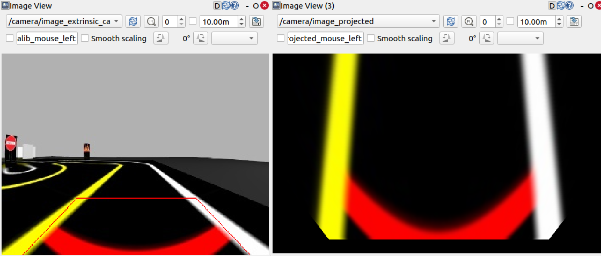


4. Navigate toPlugins>Configuration>Dynamic Reconfigure.

5. Adjust the parameters in `/camera/image_projection` and `/camera/image_compensation` to tune the camera’s calibration. 
  * Change the/camera/image_projectionvalue to adjust the/camera/image_extrinsic_calibtopic.
  * Intrinsic camera calibration modifies the perspective of the image in the red trapezoid.
  * Adjust/camera/image_compensationto fine-tune the/camera/image_projectedbird’s-eye view.rqt_reconfigure

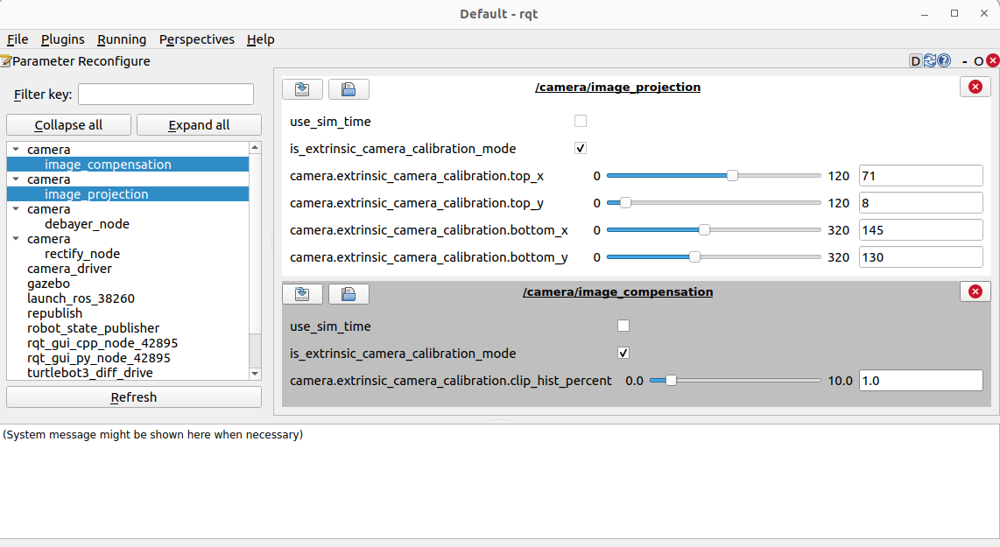

**Saving Calibration Data**

Once the best projection settings are found, the calibration data must be saved to ensure that the parameters persist across sessions. One way to save the extrinsic calibration data is by manually editing the YAML configuration files.

1. Navigate to the directory where the calibration files are stored: 
```
$ cd ~/turtlebot3_ws/src/turtlebot3_autorace/turtlebot3_autorace_camera/calibration/extrinsic_calibration/
```

2. Open the relevant YAML file (e.g., `projection.yaml` ) in a text editor: 
```
$ gedit projection.yaml
```

3. Modify the projection parameters to match the values obtained from dynamic reconfiguration.

This method ensures that the extrinsic calibration parameters are correctly saved for future runs.

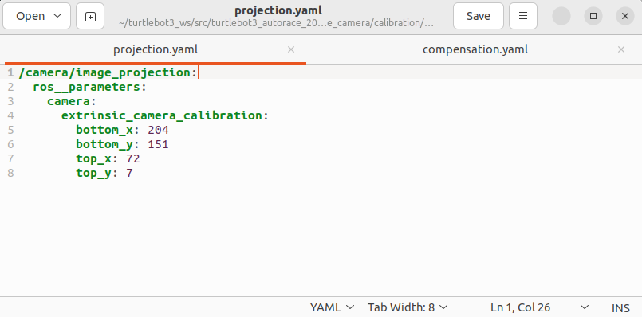

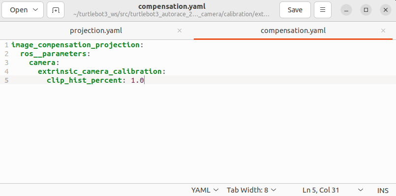

turtlebot3_autorace_camera/calibration/extrinsic_calibration/projection.yaml(Left)   |   
  turtlebot3_autorace_camera/calibration/extrinsic_calibration/compensation.yaml(Right)


### 8.2.4 Check Calibration Result

After completing the calibration process, follow the instructions below on the `Remote PC` to verify the calibration results.

1. Stop the current extrinsic calibration process.If the extrinsic calibration was launched incalibration_mode:=True, stop the process by closing the terminal or pressingCtrl + C.

2. **Launch the extrinsic calibration node without calibration mode.**  This ensures that the system applies the saved calibration parameters for verification. 
```
$ ros2 launch turtlebot3_autorace_camera extrinsic_camera_calibration.launch.py
```

3. Execute rqt and navigate **Plugins** > **Visualization** > **Image view** .
```
$ rqt
```

4. With successful calibration settings, the bird-eye view image should appear like below when the `/camera/image_projected` topic is selected. 

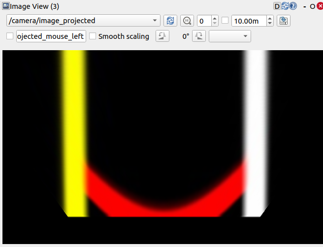

## 8.3 Lane Detection

Lane detection allows the TurtleBot3 to recognize lane markings and follow them autonomously. The system processes camera images from either a real TurtleBot3 or Gazebo simulation, applies color filtering, and identifies lane boundaries.

https://youtu.be/IqV4huXGBEk?si=Lq4xcuTwPKblm6iD

This section explains how to launch the lane detection system, visualize the detected lane markings, and calibrate the parameters to ensure accurate tracking.

**Launching Lane Detection in Simulation**

To begin, start the Gazebo simulation with a pre-defined lane-tracking course:

```
$ ros2 launch turtlebot3_gazebo turtlebot3_autorace_2020.launch.py
```

Next, run the camera calibration processes, which ensure that the detected lanes are accurately mapped to the robot’s perspective:

```
$ ros2 launch turtlebot3_autorace_camera intrinsic_camera_calibration.launch.py
```

```
$ ros2 launch turtlebot3_autorace_camera extrinsic_camera_calibration.launch.py
```

These steps activate intrinsic and extrinsic calibration to correct any distortions in the camera feed.

Finally, launch the lane detection node in calibration mode to begin detecting lanes:

```
$ ros2 launch turtlebot3_autorace_detect detect_lane.launch.py calibration_mode:=True
```

**Visualizing Lane Detection Output**

To inspect the detected lanes, open rqt on `Remote PC` :

```
$ rqt
```

Then navigate to **Plugins** > **Visualization** > **Image View** and open three image viewers to display different lane detection results:

- `/detect/image_lane/compressed`  
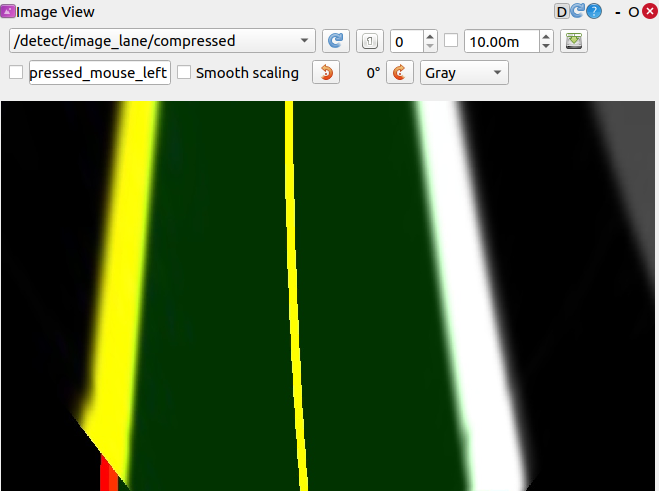

- `/detect/image_yellow_lane_marker/compressed` : a yellow range color filtered image.  
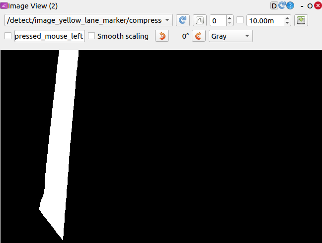

- `/detect/image_white_lane_marker/compressed` : a white range color filtered image.  
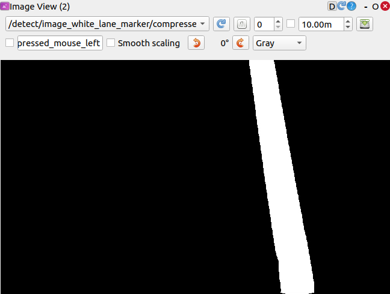


These visualizations help confirm that the lane detection algorithm is correctly identifying lane boundaries.

**Calibrating Lane Detection Parameters**

For optimal accuracy, tuning detection parameters is necessary. Adjusting these parameters ensures the robot properly identifies lanes under different lighting and environmental conditions.

1. Open the **lane.yaml** file located in **turtlebot3_autorace_detect/param/lane/** and write your modified values to this file. This will ensure the camera uses the modified parameters for future launches. ```
```
 $ cd ~/turtlebot3_ws/src/turtlebot3_autorace/turtlebot3_autorace_detect/param/lane
 $ gedit lane.yaml
```

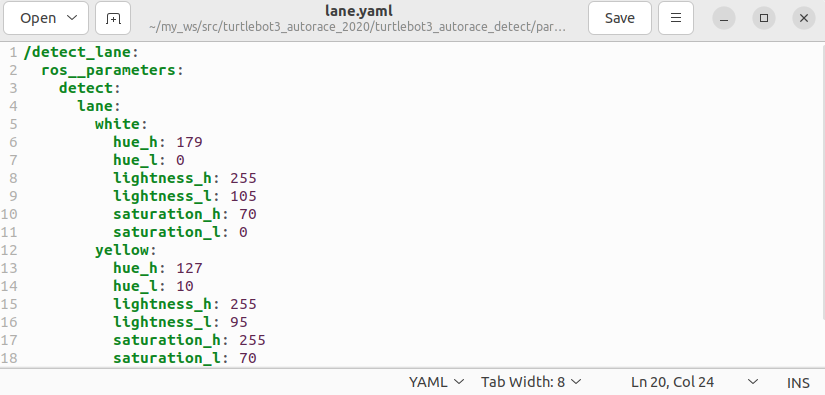

**Running Lane Tracking**

Once calibration is complete, restart the lane detection node without the calibration option:

```
$ ros2 launch turtlebot3_autorace_detect detect_lane.launch.py
```

Then, launch the lane following control node, which enables TurtleBot3 to automatically follow the detected lanes:

```
$ ros2 launch turtlebot3_autorace_mission control_lane.launch.py
```

## 8.4 Traffic Sign Detection

Traffic sign detection allows the TurtleBot3 to recognize and respond to traffic signs while driving autonomously.

https://youtu.be/DhSZo3dGW6A?si=zIEix-k61qo8slP-

This feature uses the `SIFT` (Scale-Invariant Feature Transform) algorithm, which detects key feature points in an image and compares them to a stored reference image for recognition. Signs with more distinct edges tend to yield better recognition results.

This section explains how to capture and store traffic sign images, configure detection parameters, and run the detection process in the Gazebo simulation.

> **NOTE** : More and better defined edges in the traffic sign increase recognition results from the SIFT algorithm.  Please refer to [this SIFT documentation](https://docs.opencv.org/master/da/df5/tutorial_py_sift_intro.html) for additional information.

**Launching Traffic Sign Detection in Simulation**

Start the Autorace Gazebo simulation to set up the environment:

```
$ ros2 launch turtlebot3_gazebo turtlebot3_autorace_2020.launch
```

Then, control the TurtleBot3 manually using the keyboard to navigate the vehicle toward traffic signs:

```
$ ros2 run turtlebot3_teleop teleop_keyboard
```

Position the robot so that traffic signs are clearly visible in the camera feed.

**Capturing and Storing Traffic Sign Images**

To ensure accurate recognition, the system requires pre-captured traffic sign images as reference data. While the repository provides default images, recognition accuracy may vary depending on conditions. **If the SIFT algorithm does not perform well with the provided images, capturing and using your own traffic sign images can improve recognition results** .

1. Open `rqt` , then navigate to Plugins > Visualization > Image View.
2. Create a new image view window and select the topic: `/camera/image_compensated` to display the camera feed.
3. Position the TurtleBot3 so that traffic signs are clearly visible in the camera view.
4. Capture images of each traffic sign and crop any unnecessary background, focusing only on the sign itself.
5. For the best performance, use the original traffic signs from the track whenever possible.

Save the images in the turtlebot3_autorace_detect package **/turtlebot3_autorace/turtlebot3_autorace_detect/image/** .

Ensure that the file names match those used in the source code, as the system references these names:

- The `construction.png` , `intersection.png` , `left.png` , `right.png` , `parking.png` , `stop.png` and `tunnel.png` file names are used by default.

If recognition performance is inconsistent with the default images, manually captured traffic sign images may enhance accuracy and improve overall detection reliability.

**Running Traffic Sign Detection**

Before launching the detection node, run the camera calibration processes to ensure the camera feed is properly aligned:

```
$ ros2 launch turtlebot3_autorace_camera intrinsic_camera_calibration.launch.py
$ ros2 launch turtlebot3_autorace_camera extrinsic_camera_calibration.launch.py
```

Then, launch the traffic sign detection node, specifying the mission type:  A specific mission for the **mission** argument must be selected from the following options:

- `intersection` , `construction` , `parking` , `level_crossing` , `tunnel`

```
$ ros2 launch turtlebot3_autorace_detect detect_sign.launch.py mission:=SELECT_MISSION
```

This command starts the detection process and allows TurtleBot3 to recognize and respond to the selected traffic sign. 
> NOTE: Replace theSELECT_MISSIONkeyword with one of the available options above.

**Visualizing Detection Results**

To check the detected traffic signs, open `rqt` , then navigate to: **Plugins > Visualization > Image View**

Create a new image view window and select the topic: `/detect/image_traffic_sign/compressed`

This will display the result of traffic sign detection in real-time. The detected traffic sign will be overlaid on the screen based on the mission assigned.

Below are examples of successfully detected traffic signs for different missions:

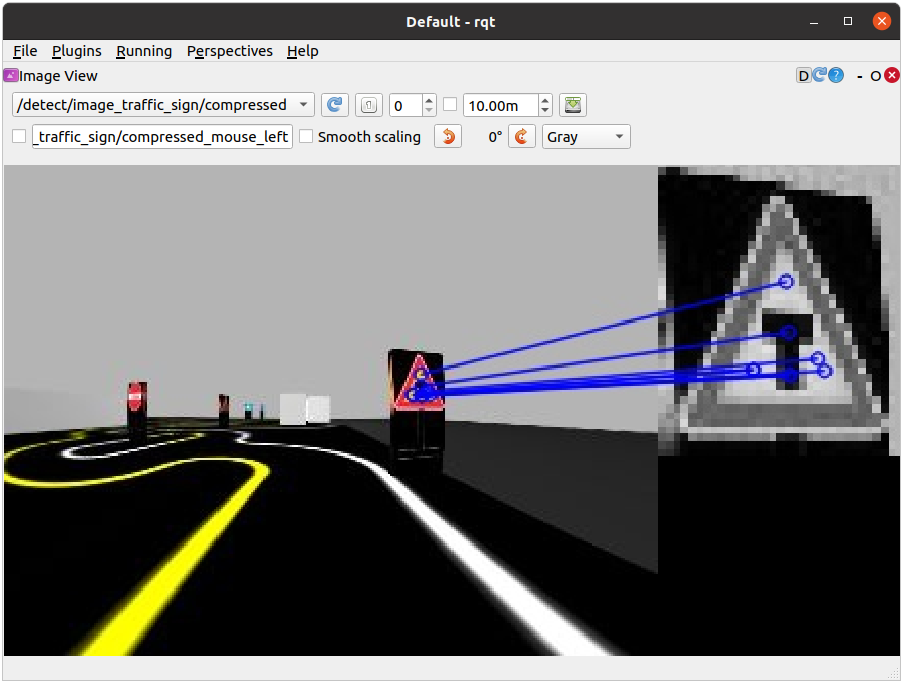

Detecting Intersection, Left, and Right signs (mission:=intersection)

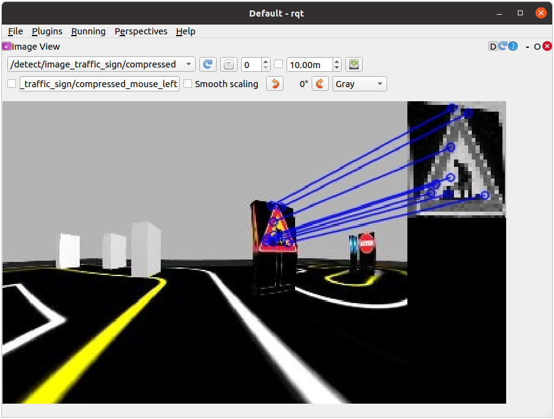 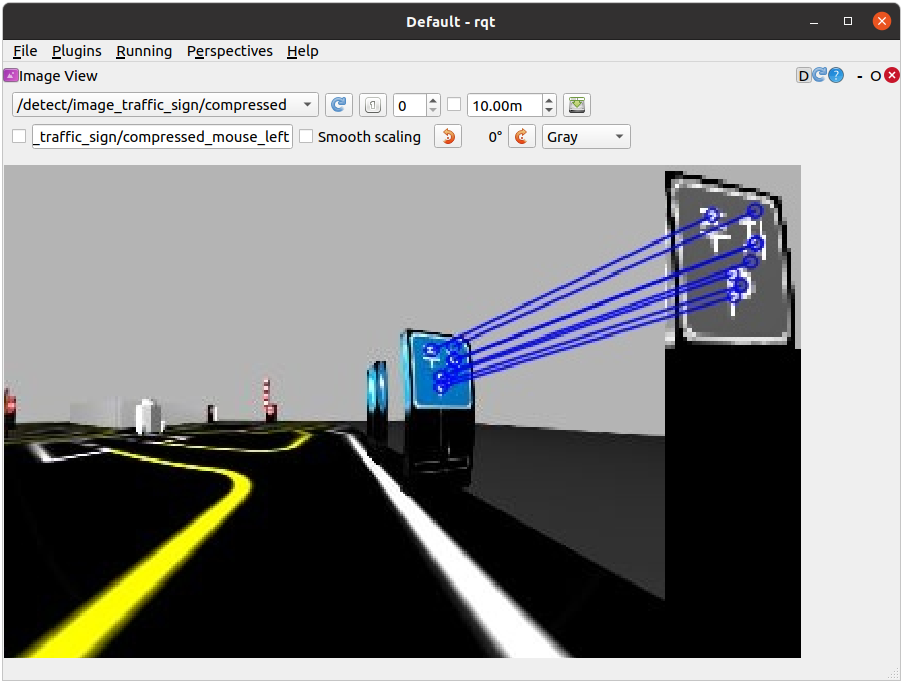

Detecting Construction, and Parking signs (mission:=construction,mission:=parking)

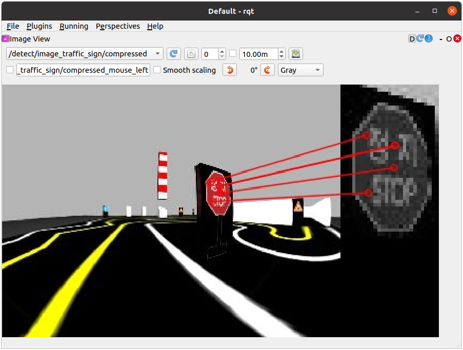 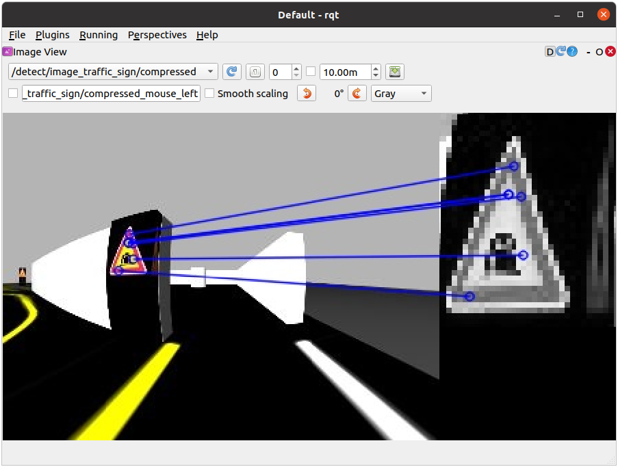

Detecting the Tunnel, and Level Crossing signs (mission:=level_crossing,mission:=tunnel)


## Missions

AutoRace is a competition for autonomous driving robot platforms designed to provide varied test conditions for autonomous robotics development. The provided open source libraries are based on ROS and are intended to be used as a base for further competitor development. Join Autorace and show off your development skill! **WARNING** : Be sure to read [Autonomous Driving](https://emanual.robotis.com/docs/en/platform/turtlebot3/autonomous_driving#autonomous-driving) in order to start missions.


### 8.5 Traffic Lights

This section describes how to complete the traffic light mission by having TurtleBot3 recognize the traffic lights and complete the course.


##### 8.5.1 Traffic Lights detection process

1. Filter the image to extract the red, yellow, green color mask images.
2. Locate the circle in the region of interest(RoI) for each masked image.
3. Find the red, yellow, and green traffic lights in that order.


##### Traffic Lights Detection

1. Open a new terminal and launch Autorace Gazebo simulation. 
```
$ ros2 launch turtlebot3_gazebo turtlebot3_autorace_2020.launch.py
```

2. Open a new terminal and launch the intrinsic calibration node. 
```
$ ros2 launch turtlebot3_autorace_camera intrinsic_camera_calibration.launch.py
```

3. Open a new terminal and launch the extrinsic calibration node. 
```
$ ros2 launch turtlebot3_autorace_camera extrinsic_camera_calibration.launch.py
```

4. Open a new terminal and launch the traffic light detection node with a calibration option. 
```
$ ros2 launch turtlebot3_autorace_detect detect_traffic_light.launch.py calibration_mode:=True
```

5. Execute rqt on `Remote PC`.
```
$ rqt
```

6. Navigate toPlugins>Visualization>Image view. Create two image view windows.
7. In one window, select the/detect/image_traffic_light/compressedtopic. In another window, select one of the four topics to view the masked images:/detect/image_red_light,/detect/image_yellow_light,/detect/image_green_light,/detect/image_traffic_light. Detecting the Yellow light. The image on the right displays/detect/image_yellow_lighttopic. Detecting the Yellow light. The image on the right displays/detect/image_yellow_lighttopic. Detecting the Red light. The image on the right displays/detect/image_red_lighttopic.
8. Navigate to **Plugins** > **Configuration** > **Dynamic Reconfigure** .
9. Adjust the parameters in/detect/traffic_lightto adjust the configuration of each masked image topic. Traffic light reconfigure


##### Saving Calibration Data

1. Open the `traffic_light.yaml` file located at **turtlebot3_autorace_detect/param/traffic_light/** . $gedit ~/turtlebot3_ws/src/turtlebot3_autorace_2020/turtlebot3_autorace_detect/param/traffic_light/traffic_light.yaml turtlebot3_autorace_detect/param/traffic_light/’traffic_light.yaml’
2. Write the modified values and save the file to keep your changes.


##### Testing Traffic Light Detection

1. Close all terminals or terminate them withCtrl+C
2. Open a new terminal and launch Autorace Gazebo simulation. $ros2 launch turtlebot3_gazebo turtlebot3_autorace_2020.launch.py
3. Open a new terminal and launch the intrinsic calibration node. $ros2 launch turtlebot3_autorace_camera intrinsic_camera_calibration.launch.py
4. Open a new terminal and launch the extrinsic calibration node. $ros2 launch turtlebot3_autorace_camera extrinsic_camera_calibration.launch.py
5. Open a new terminal and launch the traffic light detection node. $ros2 launch turtlebot3_autorace_detect detect_traffic_light.launch.py
6. Open a new terminal and execute the rqt_image_view. $rqt
7. Check each topics: `/detect/image_red_light` , `/detect/image_yellow_light` , `/detect/image_green_light` .


### Intersection

This mission does not have any associated example code.


### Construction

This section describes how to complete the construction mission. If the TurtleBot encounters an object while following a lane, it will swerve into the opposite lane to avoid the object before returning to its original lane.


##### Construction avoidance process

1. The TurtleBot is following a lane and it determines that there may be an obstacle in its path.
2. If an obstacle is detected within the danger zone, Turtlebot swerves to the opposite lane to avoid the obstacle.
3. The TurtleBot returns to it’s original lane again and continues following it.


##### How to Run Construction Mission

1. Close all terminals or terminate them withCtrl+C
2. Open a new terminal and launch the Autorace Gazebo simulation. $ros2 launch turtlebot3_gazebo turtlebot3_autorace_2020.launch.py
3. Open a new terminal and launch the intrinsic calibration node. $ros2 launch turtlebot3_autorace_camera intrinsic_camera_calibration.launch.py
4. Open a new terminal and launch the extrinsic calibration node. $ros2 launch turtlebot3_autorace_camera extrinsic_camera_calibration.launch.py
5. Open a new terminal and launch the construction mission node. $ros2 launch turtlebot3_autorace_mission mission_construction.launch.py
6. On the image window, you can watch the LiDAR visualization. The detected lidar points, and danger zone are displayed.

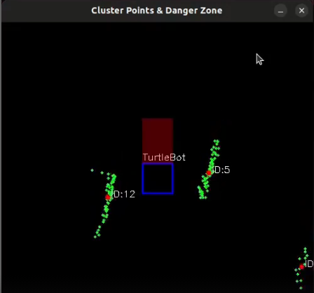


### Parking

This mission does not have any associated example code.


### Level Crossing

This section describes how you can detect a traffic bar. TurtleBot should detect the stop sign and wait for the crossing gate to open.


##### Level Crossing detection process

1. Filter the image to extract the red color mask image.
2. Find the rectangle in the masked image.
3. Connect the three squares to make a straight line.
4. Determine whether the bar is open or closed by measuring the slope of the line.


##### Level Crossing Detection

1. Close all terminals or terminate them withCtrl+C
2. Open a new terminal and launch Autorace Gazebo simulation. $ros2 launch turtlebot3_gazebo turtlebot3_autorace_2020.launch.py
3. Open a new terminal and launch the intrinsic calibration node. $ros2 launch turtlebot3_autorace_camera intrinsic_camera_calibration.launch.py
4. Open a new terminal and launch the extrinsic calibration node. $ros2 launch turtlebot3_autorace_camera extrinsic_camera_calibration.launch.py
5. Open a new terminal and launch the level crossing detection node with a calibration option. $ros2 launch turtlebot3_autorace_detect detect_level_crossing.launch.py calibration_mode:=True
6. Open a new terminal and execute rqt. $rqt
7. Select two topics on Image View Plugin:/detect/image_level_color_filtered/compressed,/detect/image_level/compressed.
8. Adjust parameters in thedetect_level_crossingon Dynamic Reconfigure Plugin
9. Open `level.yaml` file located at **turtlebot3_autorace_detect/param/level/** . $gedit ~/turtlebot3_ws/src/turtlebot3_autorace/turtlebot3_autorace_detect/param/level/level.yaml
10. Write modified values to the file and save.


##### Testing Level Crossing Detection

1. Close all terminals or terminate them withCtrl+C
2. Open a new terminal and launch Autorace Gazebo simulation. $ros2 launch turtlebot3_gazebo turtlebot3_autorace_2020.launch.py
3. Open a new terminal and launch the intrinsic calibration node. $ros2 launch turtlebot3_autorace_camera intrinsic_camera_calibration.launch.py
4. Open a new terminal and launch the extrinsic calibration node. $ros2 launch turtlebot3_autorace_camera extrinsic_camera_calibration.launch.py
5. Open a new terminal and launch the level crossing detection node. $ros2 launch turtlebot3_autorace_detect detect_level_crossing.launch.py
6. Open a new terminal and execute the rqt_image_view. $rqt
7. Check the image topic: `/detect/image_level/compressed` on Image View Plugin.


### Tunnel

This section describes how to complete the tunnel mission. The TurtleBot must use maps and navigation to proceed through obstacle areas with no lanes.


##### How to Run Tunnel Mission

**NOTE** : Change the navigation parameters in the **turtlebot3/turtlebot3_navigation2/param/buger_cam** file. If you slam and make a new map, Place the new map in the turtlebot3_autorace package at **/turtlebot3_autorace/turtlebot3_autorace_tunnel/map/** .

1. Close all terminals or terminate them withCtrl+C
2. Open a new terminal and launch the Autorace Gazebo simulation. $ros2 launch turtlebot3_gazebo turtlebot3_autorace_2020.launch.py
3. Open a new terminal and launch the tunnel mission node. This node runs the navigation and specifies the initial and target locations. $ros2 launch turtlebot3_autorace_mission mission_tunnel.launch.py
4. On the Rviz2 screen, you can watch the TurtleBot generate and follow a path in real-time.

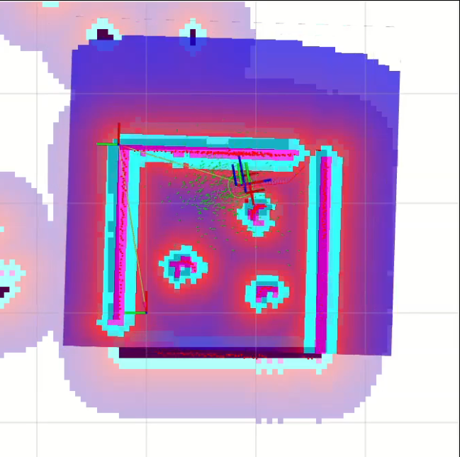


##### Set Initial Position and Goal Position

You can modify the initial position and goal position to fit your plan.

1. Open the `navigation.yaml` file located at **turtlebot3_autorace_mission/param/** . $gedit ~/turtlebot3_ws/src/turtlebot3_autorace/turtlebot3_autorace_mission/param/navigation.yaml
2. Write modified values and save the file.


## Getting Started

**NOTE**

- The Autorace package was developed on `Ubuntu 20.04` running `ROS1 Noetic Ninjemys` .
- The Autorace package has only been comprehensively tested for operation in the Gazebo simulator.
- Instructions for correct simulation setup are available in the [Simulation](https://emanual.robotis.com/docs/en/platform/turtlebot3/simulation/) section of the manual.

**Tip** : If you have an actual TurtleBot3, you can perform up to **Lane Detection** from our Autonomous Driving package with your physical robot. For more details, click the expansion note ( 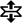 **Click to expand:** ) at the end of the content in each sub section.

The contents of the e-Manual are subject to change without prior notice. Therefore, some video content may differ from the content in the e-Manual.


### Prerequisites

`Remote PC`

- ROS 1 Noetic installed on your Laptop or desktop PC.
- These instructions are intended for use in a Gazebo simulation, but can be ported to the actual robot later.


### Install Autorace Packages

1. Install the AutoRace 2020 meta package on the `Remote PC` . $cd~/catkin_ws/src/$git clone-bnoetic https://github.com/ROBOTIS-GIT/turtlebot3_autorace_2020.git$cd~/catkin_ws&&catkin_make
2. Install additional required packages on the `Remote PC` . $sudoaptinstallros-noetic-image-transport ros-noetic-cv-bridge ros-noetic-vision-opencv python3-opencv libopencv-dev ros-noetic-image-proc


## Camera Calibration

Calibrating the camera is very important for autonomous driving. The following instructions provide a step by step guide on how to calibrate the camera.
The following instructions provide a step by step guide on how to calibrate the camera.


### Camera Imaging Calibration

Camera image calibration is not required in Gazebo Simulation.


### Intrinsic Camera Calibration

Intrinsic Camera Calibration is not required in Gazebo simulation.


### Extrinsic Camera Calibration

1. Open a new terminal on the `Remote PC` and launch Gazebo. $roslaunch turtlebot3_gazebo turtlebot3_autorace_2020.launch
2. Open a new terminal and launch the intrinsic camera calibration node. $roslaunch turtlebot3_autorace_camera intrinsic_camera_calibration.launch
3. Open a new terminal and launch the extrinsic camera calibration node. $roslaunch turtlebot3_autorace_camera extrinsic_camera_calibration.launch mode:=calibration
4. Execute rqt on the `Remote PC` . $rqt
5. Selectplugins>visualization>Image view. Create two image view windows.
6. Select the `/camera/image_extrinsic_calib/compressed` topic in one window and `/camera/image_projected_compensated` in the other. The first topic shows an image with a red trapezoidal shape and the latter shows the ground projected view (Bird’s eye view)./camera/image_extrinsic_calib/compressed(Left) and/camera/image_projected_compensated(Right)
7. Excute rqt_reconfigure on `Remote PC` . $rosrun rqt_reconfigure rqt_reconfigure
8. Adjust parameters in `/camera/image_projection` and `/camera/image_compensation_projection` to calibrate the image. Changing/camera/image_projectionaffects the/camera/image_extrinsic_calib/compressedtopic.Intrinsic camera calibration modifies the perspective of the image in the red trapezoid.rqt_reconfigure
9. After that, overwrite the updated values to the yaml files inturtlebot3_autorace_camera/calibration/extrinsic_calibration/.This will save the current calibration parameters so that they can be loaded later. turtlebot3_autorace_camera/calibration/extrinsic_calibration/compensation.yaml turtlebot3_autorace_camera/calibration/extrinsic_calibration/projection.yaml


### Check Calibration Result

After completing calibration, follow the step by step instructions below on the `Remote PC` to check the calibration result.

1. Close all terminals.
2. Open a new terminal and launch Autorace Gazebo simulation. Launch `roscore` with the **roslaunch** command. $roslaunch turtlebot3_gazebo turtlebot3_autorace_2020.launch
3. Open a new terminal and launch the intrinsic calibration node. $roslaunch turtlebot3_autorace_camera intrinsic_camera_calibration.launch
4. Open a new terminal and launch the extrinsic calibration node. $roslaunch turtlebot3_autorace_camera extrinsic_camera_calibration.launch
5. Open a new terminal and launch the rqt image viewer. $rqt_image_view
6. With successful calibration settings, the bird eye view image should appear like the image below when the `/camera/image_projected_compensated` topic is selected. 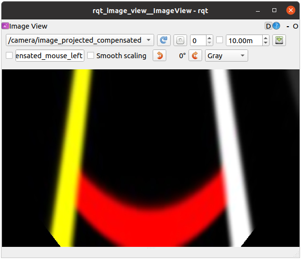


## Lane Detection

The Lane detection package that runs on the `Remote PC` receives camera images either from TurtleBot3 or Gazebo simulation to detect driving lanes and to drive the Turtlebot3 along them.  The following instructions describe how to use and calibrate the lane detection feature via rqt.

1. Place the TurtleBot3 between yellow and white lanes. NOTE: The lane detection filters yellow on the left side and white on the right side. Be sure that the yellow lane is on the left side of the robot.
2. Open a new terminal and launch the Autorace Gazebo simulation. Launch `roscore` with the **roslaunch** command. $roslaunch turtlebot3_gazebo turtlebot3_autorace_2020.launch
3. Open a new terminal and launch the intrinsic calibration node. $roslaunch turtlebot3_autorace_camera intrinsic_camera_calibration.launch
4. Open a new terminal and launch the extrinsic calibration node. $roslaunch turtlebot3_autorace_camera extrinsic_camera_calibration.launch
5. Open a new terminal and launch the lane detection calibration node. $roslaunch turtlebot3_autorace_detect detect_lane.launch mode:=calibration
6. Open a new terminal and launch the rqt. $rqt
7. Launch the rqt image viewer by selectingPlugins>Cisualization>Image view.Multiple rqt plugins can be run.
8. Display three topics at each image viewer /detect/image_lane/compressed/detect/image_yellow_lane_marker/compressed: a yellow range color filtered image./detect/image_white_lane_marker/compressed: a white range color filtered image.
9. Open a new terminal and execute rqt_reconfigure. $rosrun rqt_reconfigure rqt_reconfigure
10. Clickdetect_lanethen adjust parameters so that yellow and white colors can be filtered properly. TIP: Calibration for line color filtering is sometimes difficult due to the surrounding physical environment, such as the luminance of light in the room etc.To get started quickly, use the values from thelane.yamlfile located inturtlebot3_auatorace_detect/param/lane/as the reconfiguration parameters, then start calibration.Calibrate hue low - high value at first. (1) Hue value means the color, and every color, likeyellowandwhitehave their own region of hue values (refer to a hsv map for more information).Then calibrate the saturation low - high value. (2) Every color also has their own field of saturation.Finally, calibrate the lightness low - high value. (3) The provided source code has an auto-adjustment function, so calibrating lightness low value is not required. You can set the lightness high value to 255.Clearly filtered line images will give you clear results for lane tracking.
11. Openlane.yamlfile located inturtlebot3_autorace_detect/param/lane/. Writing modified values to this file will allow the camera to load the set parameters on future launches. Modified lane.yaml file
12. Close therqt_reconfigureanddetect_laneterminals.
13. Open a new terminal and launch the lane detect node without the calibration option. $roslaunch turtlebot3_autorace_detect detect_lane.launch
14. Open a new terminal and launch the node below to start the lane following operation. $roslaunch turtlebot3_autorace_driving turtlebot3_autorace_control_lane.launch


## Traffic Sign Detection

TurtleBot3 can detect various signs with the `SIFT` algorithm to compare the source image and the camera image, and perform programmed tasks while it drives.  Follow the instructions below to test the traffic sign detection.

**NOTE** : More edges in the traffic sign increase recognition results from the SIFT algorithm.  Please refer to the [SIFT documentation](https://docs.opencv.org/master/da/df5/tutorial_py_sift_intro.html) for more information.

1. Open a new terminal and launch the Autorace Gazebo simulation. Launch `roscore` with the **roslaunch** command. $roslaunch turtlebot3_gazebo turtlebot3_autorace_2020.launch
2. Open a new terminal and launch the teleoperation node. Drive the TurtleBot3 along the lane and stop where traffic signs can be clearly seen by the camera. $roslaunch turtlebot3_teleop turtlebot3_teleop_key.launch
3. Open a new terminal and launch the rqt_image_view. $rqt_image_view
4. Select the/camera/image_compensatedtopic to display the camera image.
5. Capture each traffic sign from therqt_image_viewand crop unnecessary part of image. For the best performance, it is recommended to use original traffic sign images as seen on the track.
6. Save the images in the turtlebot3_autorace_detect package **/turtlebot3_autorace_2020/turtlebot3_autorace_detect/image/** . The file name should match with the name used in the source code. construction.png,intersection.png,left.png,right.png,parking.png,stop.png,tunnel.pngfile names are used by default.
7. Open a new terminal and launch the intrinsic calibration node. $roslaunch turtlebot3_autorace_camera intrinsic_camera_calibration.launch
8. Open a new terminal and launch the extrinsic calibration node. $roslaunch turtlebot3_autorace_camera extrinsic_camera_calibration.launch
9. Open a new terminal and launch the traffic sign detection node.  A specific mission for the **mission** argument must be selected from the following options. intersection,construction,parking,level_crossing,tunnel$roslaunch turtlebot3_autorace_detect detect_sign.launch mission:=SELECT_MISSION
10. Open a new terminal and launch the rqt image view plugin. $rqt_image_view
11. Select/detect/image_traffic_sign/compressedtopic from the drop down list. A screen will display the result of traffic sign detection. Detecting the Intersection sign whenmission:=intersection Detecting the Left sign whenmission:=intersection Detecting the Right sign whenmission:=intersection Detecting the Construction sign whenmission:=construction Detecting the Parking sign whenmission:=parking Detecting the Level Crossing sign whenmission:=level_crossing Detecting the Tunnel sign whenmission:=tunnel


## Missions

AutoRace is a competition for autonomous driving robot platforms designed to provide varied test conditions for autonomous robotics development. The provided open source libraries are based on ROS and are intended to be used as a base for further competitor development. Join Autorace and show off your development skill! **WARNING** : Be sure to read [Autonomous Driving](https://emanual.robotis.com/docs/en/platform/turtlebot3/autonomous_driving#autonomous-driving) in order to start missions.


### Traffic Lights

Traffic Light is the first mission of AutoRace. TurtleBot3 must recognize the traffic lights and start the course.


##### Traffic Lights Detection

**NOTE** : In order to fix the traffic light to a specific color in Gazebo, you may modify the controlMission method in the `core_node_mission` file in the **turtlebot3_autorace_2020/turtlebot3_autorace_core/nodes/** directory.

1. Open a new terminal and launch Autorace Gazebo simulation. Launch `roscore` with the **roslaunch** command. $roslaunch turtlebot3_gazebo turtlebot3_autorace_2020.launch
2. Open a new terminal and launch the intrinsic calibration node. $roslaunch turtlebot3_autorace_camera intrinsic_camera_calibration.launch
3. Open a new terminal and launch the extrinsic calibration node. $roslaunch turtlebot3_autorace_camera extrinsic_camera_calibration.launch
4. Open a new terminal and launch the traffic light detection node with the calibration option. $roslaunch turtlebot3_autorace_detect detect_traffic_light.launch mode:=calibration
5. Open a new terminal to execute the rqt. Open four `rqt_image_view` plugins. $rqt
6. Select four topics:/detect/image_red_light,/detect/image_yellow_light,/detect/image_green_light,/detect/image_traffic_light. Detecting the Green light. The image on the right displays/detect/image_green_lighttopic. Detecting the Yellow light. The image on the right displays/detect/image_yellow_lighttopic. Detecting the Red light. The image on the right displays/detect/image_red_lighttopic.
7. Open a new terminal and excute rqt_reconfigure. $rosrun rqt_reconfigure rqt_reconfigure
8. Selectdetect_traffic_lightin the left column and adjust parameters properly so that the colors of the traffic light can be detected and differentiated. Traffic light reconfigure
9. Open thetraffic_light.yamlfile located atturtlebot3_autorace_detect/param/traffic_light/.
10. Write the modified values and save the file.


##### Testing Traffic Light Detection

1. Close all terminals or terminate them withCtrl+C
2. Open a new terminal and launch Autorace Gazebo simulation. Launch `roscore` with the **roslaunch** command. $roslaunch turtlebot3_gazebo turtlebot3_autorace_2020.launch
3. Open a new terminal and launch the intrinsic calibration node. $roslaunch turtlebot3_autorace_camera intrinsic_camera_calibration.launch
4. Open a new terminal and launch the extrinsic calibration node. $roslaunch turtlebot3_autorace_camera extrinsic_camera_calibration.launch
5. Open a new terminal and launch the traffic light detection node. $roslaunch turtlebot3_autorace_detect detect_traffic_light.launch
6. Open a new terminal and execute the rqt_image_view. $rqt_image_view
7. Check each topic: `/detect/image_red_light` , `/detect/image_yellow_light` , `/detect/image_green_light` .


##### How to Run Traffic Light Mission

**WARNING** : Please calibrate the color as described in [Traffic Lights Detection](https://emanual.robotis.com/docs/en/platform/turtlebot3/autonomous_driving#traffic-lights-detection) section before running the traffic light mission.

1. Close all terminals or terminate them withCtrl+C
2. Open a new terminal and launch the Autorace Gazebo simulation. Launch `roscore` with the **roslaunch** command. $roslaunch turtlebot3_gazebo turtlebot3_autorace_2020.launch
3. Open a new terminal and launch the intrinsic calibration node. $roslaunch turtlebot3_autorace_camera intrinsic_camera_calibration.launch
4. Open a new terminal and launch the autorace core node with a specific mission name. $roslaunch turtlebot3_autorace_core turtlebot3_autorace_core.launch mission:=traffic_light
5. Open a new terminal and enter the command below. This will prepare to run the traffic light mission by setting the `decided_mode` to `3` . $rostopic pub-1/core/decided_mode std_msgs/UInt8"data: 3"
6. Launch the Gazebo mission node. $roslaunch turtlebot3_autorace_core turtlebot3_autorace_mission.launch


### Intersection

Intersection is the second mission of AutoRace. The TurtleBot3 must detect the directional sign at the intersection, and proceed to the correct path.


##### How to Run Intersection Mission

1. Close all terminals or terminate them withCtrl+C
2. Open a new terminal and launch Autorace Gazebo simulation. Launch `roscore` with the **roslaunch** command. $roslaunch turtlebot3_gazebo turtlebot3_autorace_2020.launch
3. Open a new terminal and launch the intrinsic calibration node. $roslaunch turtlebot3_autorace_camera intrinsic_camera_calibration.launch
4. Open a new terminal and launch the keyboard teleoperation node.  Drive the TurtleBot3 along the lane and stop before the intersection traffic sign. $roslaunch turtlebot3_teleop turtlebot3_teleop_key.launch
5. Open a new terminal and launch the autorace core node with a specific mission name. $roslaunch turtlebot3_autorace_core turtlebot3_autorace_core.launch mission:=intersection
6. Open a new terminal and launch the Gazebo mission node. $roslaunch turtlebot3_autorace_core turtlebot3_autorace_mission.launch
7. Open a new terminal and enter the command below. This will prepare to run the intersection mission by setting the `decided_mode` to `2` . $rostopic pub-1/core/decided_mode std_msgs/UInt8"data: 2"


### Construction

Construction is the third mission in TurtleBot3 AutoRace 2020. The TurtleBot3 must avoid obstacles in the construction area.


##### How to Run Construction Mission

1. Close all terminals or terminate them withCtrl+C
2. Open a new terminal and launch Autorace Gazebo simulation. The `roscore` will be automatically launched with the **roslaunch** command. $roslaunch turtlebot3_gazebo turtlebot3_autorace_2020.launch
3. Open a new terminal and launch the intrinsic calibration node. $roslaunch turtlebot3_autorace_camera intrinsic_camera_calibration.launch
4. Open a new terminal and launch the keyboard teleoperation node.  Drive the TurtleBot3 along the lane and stop before the construction traffic sign. $roslaunch turtlebot3_teleop turtlebot3_teleop_key.launch
5. Open a new terminal and launch the autorace core node with a specific mission name. $roslaunch turtlebot3_autorace_core turtlebot3_autorace_core.launch mission:=construction
6. Open a new terminal and enter the command below. This will prepare to run the construction mission by setting the `decided_mode` to `2` . $rostopic pub-1/core/decided_mode std_msgs/UInt8"data: 2"


### Parking

Parking is the fourth mission in TurtleBot3 AutoRace 2020. The TurtleBot3 must detect the parking sign, and park in an empty parking spot.


##### How to Run Parking Mission

1. Close all terminals or terminate them withCtrl+C
2. Open a new terminal and launch Autorace Gazebo simulation. The `roscore` will be automatically launched with the **roslaunch** command. $roslaunch turtlebot3_gazebo turtlebot3_autorace_2020.launch
3. Open a new terminal and launch the intrinsic calibration node. $roslaunch turtlebot3_autorace_camera intrinsic_camera_calibration.launch
4. Open a new terminal and launch the keyboard teleoperation node.  Drive the TurtleBot3 along the lane and stop before the parking traffic sign. $roslaunch turtlebot3_teleop turtlebot3_teleop_key.launch
5. Open a new terminal and launch the autorace core node with a specific mission name. $roslaunch turtlebot3_autorace_core turtlebot3_autorace_core.launch mission:=parking
6. Open a new terminal and launch the Gazebo mission node. $roslaunch turtlebot3_autorace_core turtlebot3_autorace_mission.launch
7. Open a new terminal and enter the command below. This will prepare to run the parking mission by setting the `decided_mode` to `2` . $rostopic pub-1/core/decided_mode std_msgs/UInt8"data: 2"


### Level Crossing

Level Crossing is the fifth mission of TurtleBot3 AutoRace 2020. The TurtleBot3 must detect the stop sign and wait until the crossing gate is lifted.


##### Level Crossing Detection

1. Close all terminals or terminate them withCtrl+C
2. Open a new terminal and launch Autorace Gazebo simulation. Launch `roscore` with the **roslaunch** command. $roslaunch turtlebot3_gazebo turtlebot3_autorace_2020.launch
3. Open a new terminal and launch the intrinsic calibration node. $roslaunch turtlebot3_autorace_camera intrinsic_camera_calibration.launch
4. Open a new terminal and launch the extrinsic calibration node. $roslaunch turtlebot3_autorace_camera extrinsic_camera_calibration.launch
5. Open a new terminal and launch the level crossing detection node with a calibration option. $roslaunch turtlebot3_autorace_detect detect_level_crossing.launch mode:=calibration
6. Open a new terminal and execute rqt. $rqt
7. Select two topics:/detect/image_level_color_filtered/compressed,/detect/image_level/compressed.
8. Excute rqt_reconfigure. $rosrun rqt_reconfigure rqt_reconfigure
9. Adjust parameters in thedetect_level_crossingin the left column to enhance the detection of the crossing gate.
10. Openlevel.yamlfile located atturtlebot3_autorace_detect/param/level/.
11. Write any modified values to the file and save.


##### Testing Level Crossing Detection

1. Close all terminals or terminate them withCtrl+C
2. Open a new terminal and launch Autorace Gazebo simulation. Launch `roscore` with the **roslaunch** command. $roslaunch turtlebot3_gazebo turtlebot3_autorace_2020.launch
3. Open a new terminal and launch the intrinsic calibration node. $roslaunch turtlebot3_autorace_camera intrinsic_camera_calibration.launch
4. Open a new terminal and launch the extrinsic calibration node. $roslaunch turtlebot3_autorace_camera extrinsic_camera_calibration.launch
5. Open a new terminal and launch the level crossing detection node. $roslaunch turtlebot3_autorace_detect detect_level_crossing.launch
6. Open a new terminal and execute the rqt_image_view. $rqt_image_view
7. Check the image topic: `/detect/image_level/compressed` .


##### How to Run Level Crossing Mission

1. Close all terminals or terminate them withCtrl+C
2. Open a new terminal and launch Autorace Gazebo simulation. Lauch `roscore` with the **roslaunch** command. $roslaunch turtlebot3_gazebo turtlebot3_autorace_2020.launch
3. Open a new terminal and launch the intrinsic calibration node. $roslaunch turtlebot3_autorace_camera intrinsic_camera_calibration.launch
4. Open a new terminal and launch the keyboard teleoperation node.  Drive the TurtleBot3 along the lane and stop before the stop traffic sign. $roslaunch turtlebot3_teleop turtlebot3_teleop_key.launch
5. Open a new terminal and launch the autorace core node with a specific mission name. $roslaunch turtlebot3_autorace_core turtlebot3_autorace_core.launch mission:=level_crossing
6. Open a new terminal and launch the Gazebo mission node. $roslaunch turtlebot3_autorace_core turtlebot3_autorace_mission.launch
7. Open a new terminal and enter the command below. This will prepare to run the level crossing mission by setting the `decided_mode` to `2` . $rostopic pub-1/core/decided_mode std_msgs/UInt8"data: 2"


### Tunnel

Tunnel is the sixth mission of TurtleBot3 AutoRace 2020. The TurtleBot3 must avoid obstacles in the unexplored tunnel and exit successfully.


##### How to Run Tunnel Mission

**NOTE** : Change the navigation parameters in the **turtlebot3/turtlebot3_navigation/param/** file. If you slam and make a new map, Place the new map in the turtlebot3_autorace package you’ve placed in **/turtlebot3_autorace/turtlebot3_autorace_driving/maps/** .

1. Close all terminals or terminate them withCtrl+C
2. Open a new terminal and launch Autorace Gazebo simulation. Launch `roscore` with the **roslaunch** command. $roslaunch turtlebot3_gazebo turtlebot3_autorace_2020.launch
3. Open a new terminal and launch the intrinsic calibration node. $roslaunch turtlebot3_autorace_camera intrinsic_camera_calibration.launch
4. Open a new terminal and launch the keyboard teleoperation node.  Drive the TurtleBot3 along the lane and stop before the tunnel traffic sign. $roslaunch turtlebot3_teleop turtlebot3_teleop_key.launch
5. Open a new terminal and launch the autorace core node with a specific mission name. $roslaunch turtlebot3_autorace_core turtlebot3_autorace_core.launch mission:=tunnel
6. Open a new terminal and enter the command below. This will prepare to run the tunnel mission by setting the `decided_mode` to `2` . $rostopic pub-1/core/decided_mode std_msgs/UInt8"data: 2"
