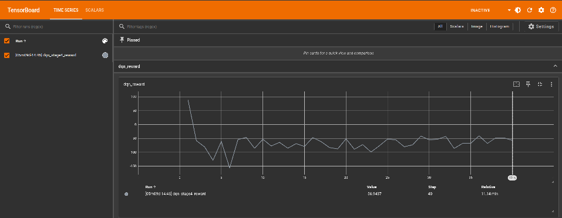
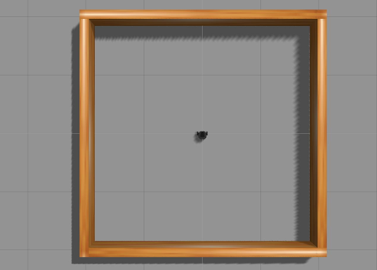
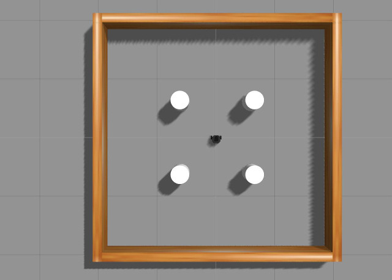
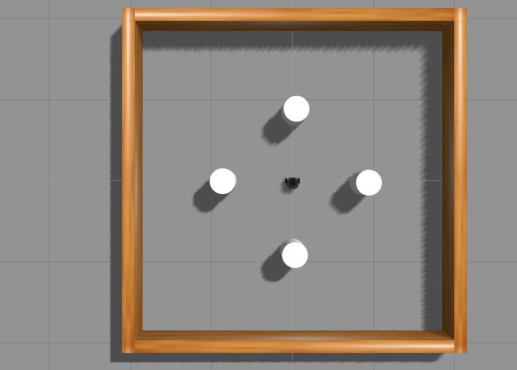
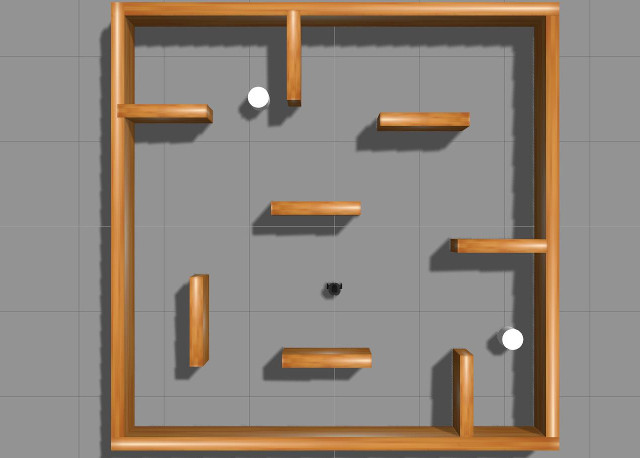

# Machine Learning

> **Source**: [https://emanual.robotis.com/docs/en/platform/turtlebot3/machine_learning](https://emanual.robotis.com/docs/en/platform/turtlebot3/machine_learning)

---


# Machine Learning

Machine learning, learning through experience, is a data analysis technique that teaches computers to recognize what is natural for people and animals. There are three types of machine learning: supervised learning, unsupervised learning, reinforcement learning.

This application is reinforcement learning with DQN (Deep Q-Learning). The reinforcement learning is concerned with how software agents ought to take actions in an environment, so as to maximize some notion of cumulative reward.

The contents in e-Manual are subject to be updated without a prior notice. Therefore, some video may differ from the contents in e-Manual.

This shows reinforcement learning with TurtleBot3 in gazebo.
This reinforcement learning example uses the Deep Q-Network (DQN) algorithm, utilizing data from the robot’s Laser Distance Sensor (LDS).

Machine learning, learning through experience, is a data analysis technique that teaches computers to recognize what is natural for people and animals. There are three types of machine learning: supervised learning, unsupervised learning, reinforcement learning.

This application is reinforcement learning with DQN (Deep Q-Learning). The reinforcement learning is concerned with how software agents ought to take actions in an environment, so as to maximize some notion of cumulative reward.

The contents in e-Manual are subject to be updated without a prior notice. Therefore, some video may differ from the contents in e-Manual.

This shows reinforcement learning with TurtleBot3 in gazebo.
This reinforcement learning example uses the Deep Q-Network (DQN) algorithm, utilizing data from the robot’s Laser Distance Sensor (LDS).

**NOTE** : This manual is currently based on Melodic and needs to be upgraded to the **Noetic** version!.


## Software Setup

**Note** : This package was built on Ubuntu 22.04 and ROS2 Humble, Python 3.10.

1. **Install Requirements** $pipinstall--upgradenumpy==1.26.4scipy==1.10.1tensorflow==2.19.0keras==3.9.2 pyqtgraph
2. Machine Learning packages WARNING: Be sure to installturtlebot3,turtlebot3_msgsandturtlebot3_simulationspackage before installation of machine learning packages. $cd~/turtlebot3_ws/src/$git clone-bhumble https://github.com/ROBOTIS-GIT/turtlebot3_machine_learning.git$cd~/turtlebot3_ws&&colcon build--symlink-install

1. Install Machine Learning package and Requirements WARNING: Be sure to installturtlebot3,turtlebot3_msgsandturtlebot3_simulationspackage before installation of machine learning packages. $cd~/turtlebot3_ws/src/$git clone-bjazzy https://github.com/ROBOTIS-GIT/turtlebot3_machine_learning.git$sudorosdep update$exportPIP_BREAK_SYSTEM_PACKAGES=1$cd~/turtlebot3_ws&&rosdepinstall--from-pathssrc--ignore-src$colcon build--symlink-install

To do this tutorial, you need to install Tensorflow, Keras and Anaconda with Ubuntu 18.04 and ROS1 Melodic.


### Anaconda

You can download [Anaconda 5.2.0](https://repo.anaconda.com/archive/Anaconda2-5.2.0-Linux-x86_64.sh) for Python 2.7 version.

After downloading Andaconda, go to the directory where the downloaded file is located at and enter the follow command.

Review and accept the license terms by entering `yes` in the terminal.  Also add the Anaconda2 install location to PATH in the .basrhc file.

```
$ 
bash Anaconda2-5.2.0-Linux-x86_64.sh

```

After installing Anaconda,

```
$ 
source
 ~/.bashrc

$ 
python 
-V


```

If Anaconda is installed successfuly, `Python 2.7.xx :: Anaconda, Inc.` will be returned in the terminal.


### ROS dependency packages

Install required packages first.

```
$ 
pip 
install 
msgpack argparse

```

To use ROS and Anaconda together, you must additionally install ROS dependency packages.

```
$ 
pip 
install
 
-U
 rosinstall empy defusedxml netifaces

```


### Tensorflow

This tutorial uses python 2.7(CPU only). If you want to use another python version and GPU, please refer to [TensorFlow](https://www.tensorflow.org/install/) .

```
$ 
pip 
install
 
--ignore-installed
 
--upgrade
 https://storage.googleapis.com/tensorflow/linux/cpu/tensorflow-1.8.0-cp27-none-linux_x86_64.whl

```


### Keras

[Keras](https://keras.io/) is a high-level neural networks API, written in Python and capable of running on top of TensorFlow.

```
$ 
pip 
install 
keras
==
2.1.5

```

Incompatible error messages regarding the tensorboard can be ignored as it is not used in this example, but it can be resolved by installing tensorboard as below.

```
$ 
pip 
install 
tensorboard

```


### Machine Learning packages

**WARNING** : Please install [turtlebot3](https://github.com/ROBOTIS-GIT/turtlebot3) , [turtlebot3_msgs](https://github.com/ROBOTIS-GIT/turtlebot3_msgs) and [turtlebot3_simulations](https://github.com/ROBOTIS-GIT/turtlebot3_simulations) package before installing this package.

```
$ 
cd
 ~/catkin_ws/src/

$ 
git clone https://github.com/ROBOTIS-GIT/turtlebot3_machine_learning.git

$ 
cd
 ~/catkin_ws 
&&
 catkin_make

```

Machine Learning is running on a Gazebo simulation world. If you haven’t installed the TurtleBot3 simulation package, please install with the command below.

```
$ 
cd
 ~/catkin_ws/src/

$ 
git clone 
-b
 melodic-devel https://github.com/ROBOTIS-GIT/turtlebot3_simulations.git

$ 
cd
 ~/catkin_ws 
&&
 catkin_make

```

Completely uninstall and reinstall numpy to rectify problems. You may need to perform uninstall a few times until numpy is completely uninstalled.

```
$ 
pip uninstall numpy

$ 
pip show numpy

$ 
pip uninstall numpy

$ 
pip show numpy

```

At this point, numpy should be completed uninstalled and you should not see any numpy information when entering `pip show numpy` .

Reinstall the numpy.

```
$ 
pip 
install 
numpy pyqtgraph

```


## Set parameters

The goal of DQN Agent is to get the TurtleBot3 to the goal avoiding obstacles. When TurtleBot3 gets closer to the goal, it gets a positive reward, and when it gets farther it gets a negative reward.
The episode ends when the TurtleBot3 crashes on an obstacle or after a certain period of time. During the episode, TurtleBot3 gets a big positive reward when it gets to the goal, and TurtleBot3 gets a big negative reward when it crashes on an obstacle.


### Set state

State is an observation of environment and describes the current situation. Here, `state_size` is 26 and has 24 LDS values, distance to goal, and angle to goal.  LDS values use a forward 180-degree range, so you need 48 values in a 360-degree range.

Turtlebot3’s LDS default is set to 360. You can modify sample of LDS at `/turtlebot3_simulations/turtlebot3_gazebo/models/turtlebot3_burger/model.sdf` .

```
gedit ~/turtlebot3_ws/src/turtlebot3_simulations/turtlebot3_gazebo/models/turtlebot3_burger/model.sdf

```

```
<sensor 
name
=
"hls_lfcd_lds"
 
type
=
"ray"
>
    
# Find the "hls_lfcd_lds"

  <visualize>true</visualize>    
# Visualization of LDS. If you don't want to see LDS, set to `false`


```

```
<scan>
  <horizontal>
    <samples>360</samples>    
# The number of sample. Modify it to 48

    <resolution>1.000000</resolution>
    <min_angle>0.000000</min_angle>
    <max_angle>6.280000</max_angle>
  </horizontal>
</scan>

```

**Note**  More lidar points can be used, but they require more computing resources. To use a different number of lidar points, replace `state_size` in **Hyper parameter** .

|  |  |
| --- | --- |
| sample = 360 | sample = 24 |

**Set action**

- Action is what an agent can do in each state. Here, turtlebot3 has always 0.15 m/s of linear velocity. angular velocity is determined by action.

| Action | Angular velocity(rad/s) |
| --- | --- |
| 0 | 1.5 |
| 1 | 0.75 |
| 2 | 0 |
| 3 | -0.75 |
| 4 | -1.5 |

**Set reward**

- When turtlebot3 takes an action in a state, it receives a reward. The reward design is very important for learning. A reward can be positive or negative. When turtlebot3 gets to the goal, it gets big positive reward. When turtlebot3
collides with an obstacle, it gets big negative reward. If you want to apply your reward design, modify `calculate_reward` function at `turtlebot3_machine_learning/turtlebot3_dqn/turtlebot3_dqn/dqn_environment.py` .

1. **Calculate reward**  At each step, it determines whether it succeeded or failed, and calculates a reward for TurtleBot3’s behavior. defcalculate_reward(self):yaw_reward=1-(2*abs(self.goal_angle)/math.pi)obstacle_reward=self.compute_weighted_obstacle_reward()reward=yaw_reward+obstacle_rewardifself.succeed:reward=100.0elifself.fail:reward=-50.0returnreward
2. **Yaw reward**  Yaw reward uses a square root based reward function. This has the following advantages over a linear function. yaw_reward=1-(2*abs(self.goal_angle)/math.pi)
3. **Obstacle reward**  Obstacle reward is a function that calculates a penalty based on the distance and angle of obstacles within 0.5 meters in front of the robot, quantitatively assessing the degree of risk.

- `compute_directional_weights()` : Calculate the importance of each obstacle angle. defcompute_directional_weights(self,relative_angles,max_weight=10.0):power=6raw_weights=(numpy.cos(relative_angles))**power+0.1scaled_weights=raw_weights*(max_weight/numpy.max(raw_weights))normalized_weights=scaled_weights/numpy.sum(scaled_weights)returnnormalized_weights The closer to the front, the higher the weight, and the higher thepower, the stronger this weight. After that, we scale and normalize by max_weight.
  - The closer to the front, the higher the weight, and the higher the `power` , the stronger this weight. After that, we scale and normalize by max_weight.
- `compute_weighted_obstacle_reward()` : Apply the weights to calculate the obastcle reward. defcompute_weighted_obstacle_reward(self):ifnotself.front_rangesornotself.front_angles:return0.0front_ranges=numpy.array(self.front_ranges)front_angles=numpy.array(self.front_angles)valid_mask=front_ranges<=0.5ifnotnumpy.any(valid_mask):return0.0front_ranges=front_ranges[valid_mask]front_angles=front_angles[valid_mask]relative_angles=numpy.unwrap(front_angles)relative_angles[relative_angles>numpy.pi]-=2*numpy.piweights=self.compute_directional_weights(relative_angles,max_weight=10.0)safe_dists=numpy.clip(front_ranges-0.25,1e-2,3.5)decay=numpy.exp(-3.0*safe_dists)weighted_decay=numpy.dot(weights,decay)reward=-(1.0+4.0*weighted_decay)returnreward Select only obstacles located within 0.5 meters and penalize obstacles in range proportional to their distance. Closer obstacles are weighted more heavily to encourage TurtleBot3 to avoid them when they are in front of it.
  - Select only obstacles located within 0.5 meters and penalize obstacles in range proportional to their distance. Closer obstacles are weighted more heavily to encourage TurtleBot3 to avoid them when they are in front of it.

**Set hyper parameters**

- This tutorial has been learned using DQN. DQN is a reinforcement learning method that selects a deep neural network by approximating the action-value function(Q-value). Agent has follow hyper parameters at `/turtlebot3_machine_learning/turtlebot3_dqn/turtlebot3_dqn/dqn_agent.py` .

| Hyper parameter | default | description |
| --- | --- | --- |
| update_target_after | 5000 | Update rate of target network. |
| discount_factor | 0.99 | Represents how much future events lose their value according to how far away. |
| learning_rate | 0.0007 | Learning speed. If the value is too large, learning does not work well, and if it is too small, learning time is long. |
| epsilon | 1.0 | The probability of choosing a random action. |
| epsilon_min | 0.05 | The minimum of epsilon. |
| batch_size | 128 | Size of a group of training samples. |
| min_replay_memory_size | 5000 | Start training if the replay memory size is greater than 5000. |
| replay_memory | 500000 | The size of replay memory. |
| state_size | 26 | The number of information features an agent can observe at a point in time. LDS values, distance to goal, and angle to goal. |

The goal of DQN Agent is to get the TurtleBot3 to the goal avoiding obstacles. When TurtleBot3 gets closer to the goal, it gets a positive reward, and when it gets farther it gets a negative reward.
The episode ends when the TurtleBot3 crashes on an obstacle or after a certain period of time. During the episode, TurtleBot3 gets a big positive reward when it gets to the goal, and TurtleBot3 gets a big negative reward when it crashes on an obstacle.


### Set state

State is an observation of environment and describes the current situation. Here, `state_size` is 26 and has 24 LDS values, distance to goal, and angle to goal.  LDS values use a forward 180-degree range, so you need 48 values in a 360-degree range.

Turtlebot3’s LDS default is set to 360. You can modify sample of LDS at `/turtlebot3_simulations/turtlebot3_gazebo/models/turtlebot3_burger/model.sdf` .

```
gedit ~/turtlebot3_ws/src/turtlebot3_simulations/turtlebot3_gazebo/models/turtlebot3_burger/model.sdf

```

```
<sensor 
name
=
"hls_lfcd_lds"
 
type
=
"ray"
>
    
# Find the "hls_lfcd_lds"

  <visualize>true</visualize>    
# Visualization of LDS. If you don't want to see LDS, set to `false`


```

```
<scan>
  <horizontal>
    <samples>360</samples>    
# The number of sample. Modify it to 48

    <resolution>1.000000</resolution>
    <min_angle>0.000000</min_angle>
    <max_angle>6.280000</max_angle>
  </horizontal>
</scan>

```

**Note**  More lidar points can be used, but they require more computing resources. To use a different number of lidar points, replace `state_size` in **Hyper parameter** .

|  |  |
| --- | --- |
| sample = 360 | sample = 24 |

**Set action**

- Action is what an agent can do in each state. Here, turtlebot3 has always 0.15 m/s of linear velocity. angular velocity is determined by action.

| Action | Angular velocity(rad/s) |
| --- | --- |
| 0 | 1.5 |
| 1 | 0.75 |
| 2 | 0 |
| 3 | -0.75 |
| 4 | -1.5 |

**Set reward**

- When turtlebot3 takes an action in a state, it receives a reward. The reward design is very important for learning. A reward can be positive or negative. When turtlebot3 gets to the goal, it gets big positive reward. When turtlebot3
collides with an obstacle, it gets big negative reward. If you want to apply your reward design, modify `calculate_reward` function at `turtlebot3_machine_learning/turtlebot3_dqn/turtlebot3_dqn/dqn_environment.py` .

1. **Calculate reward**  At each step, it determines whether it succeeded or failed, and calculates a reward for TurtleBot3’s behavior. defcalculate_reward(self):yaw_reward=1-(2*abs(self.goal_angle)/math.pi)obstacle_reward=self.compute_weighted_obstacle_reward()reward=yaw_reward+obstacle_rewardifself.succeed:reward=100.0elifself.fail:reward=-50.0returnreward
2. **Yaw reward**  Yaw reward uses a square root based reward function. This has the following advantages over a linear function. yaw_reward=1-(2*abs(self.goal_angle)/math.pi)
3. **Obstacle reward**  Obstacle reward is a function that calculates a penalty based on the distance and angle of obstacles within 0.5 meters in front of the robot, quantitatively assessing the degree of risk.

- `compute_directional_weights()` : Calculate the importance of each obstacle angle. defcompute_directional_weights(self,relative_angles,max_weight=10.0):power=6raw_weights=(numpy.cos(relative_angles))**power+0.1scaled_weights=raw_weights*(max_weight/numpy.max(raw_weights))normalized_weights=scaled_weights/numpy.sum(scaled_weights)returnnormalized_weights The closer to the front, the higher the weight, and the higher thepower, the stronger this weight. After that, we scale and normalize by max_weight.
  - The closer to the front, the higher the weight, and the higher the `power` , the stronger this weight. After that, we scale and normalize by max_weight.
- `compute_weighted_obstacle_reward()` : Apply the weights to calculate the obastcle reward. defcompute_weighted_obstacle_reward(self):ifnotself.front_rangesornotself.front_angles:return0.0front_ranges=numpy.array(self.front_ranges)front_angles=numpy.array(self.front_angles)valid_mask=front_ranges<=0.5ifnotnumpy.any(valid_mask):return0.0front_ranges=front_ranges[valid_mask]front_angles=front_angles[valid_mask]relative_angles=numpy.unwrap(front_angles)relative_angles[relative_angles>numpy.pi]-=2*numpy.piweights=self.compute_directional_weights(relative_angles,max_weight=10.0)safe_dists=numpy.clip(front_ranges-0.25,1e-2,3.5)decay=numpy.exp(-3.0*safe_dists)weighted_decay=numpy.dot(weights,decay)reward=-(1.0+4.0*weighted_decay)returnreward Select only obstacles located within 0.5 meters and penalize obstacles in range proportional to their distance. Closer obstacles are weighted more heavily to encourage TurtleBot3 to avoid them when they are in front of it.
  - Select only obstacles located within 0.5 meters and penalize obstacles in range proportional to their distance. Closer obstacles are weighted more heavily to encourage TurtleBot3 to avoid them when they are in front of it.

**Set hyper parameters**

- This tutorial has been learned using DQN. DQN is a reinforcement learning method that selects a deep neural network by approximating the action-value function(Q-value). Agent has follow hyper parameters at `/turtlebot3_machine_learning/turtlebot3_dqn/turtlebot3_dqn/dqn_agent.py` .

| Hyper parameter | default | description |
| --- | --- | --- |
| update_target_after | 5000 | Update rate of target network. |
| discount_factor | 0.99 | Represents how much future events lose their value according to how far away. |
| learning_rate | 0.0007 | Learning speed. If the value is too large, learning does not work well, and if it is too small, learning time is long. |
| epsilon | 1.0 | The probability of choosing a random action. |
| epsilon_min | 0.05 | The minimum of epsilon. |
| batch_size | 128 | Size of a group of training samples. |
| min_replay_memory_size | 5000 | Start training if the replay memory size is greater than 5000. |
| replay_memory | 500000 | The size of replay memory. |
| state_size | 26 | The number of information features an agent can observe at a point in time. LDS values, distance to goal, and angle to goal. |

The goal of DQN Agent is to get the TurtleBot3 to the goal avoiding obstacles. When TurtleBot3 gets closer to the goal, it gets a positive reward, and when it gets farther it gets a negative reward.
The episode ends when the TurtleBot3 crashes on an obstacle or after a certain period of time. During the episode, TurtleBot3 gets a big positive reward when it gets to the goal, and TurtleBot3 gets a big negative reward when it crashes on an obstacle.

The contents in e-Manual are subject to be updated without a prior notice. Therefore, some video may differ from the contents in e-Manual.


### Set state

State is an observation of environment and describes the current situation. Here, `state_size` is 26 and has 24 LDS values, distance to goal, and angle to goal.

Turtlebot3’s LDS default is set to 360. You can modify sample of LDS at `turtlebot3/turtlebot3_description/urdf/turtlebot3_burger.gazebo.xacro` .

```
<xacro:arg 
name
=
"laser_visual"
 
default
=
"false"
/>   
# Visualization of LDS. If you want to see LDS, set to `true`


```

```
<scan>
  <horizontal>
    <samples>360</samples>            
# The number of sample. Modify it to 24

    <resolution>1</resolution>
    <min_angle>0.0</min_angle>
    <max_angle>6.28319</max_angle>
  </horizontal>
</scan>

```

|  |  |
| --- | --- |
| sample = 360 | sample = 24 |


### Set action

Action is what an agent can do in each state. Here, turtlebot3 has always 0.15 m/s of linear velocity. angular velocity is determined by action.

| Action | Angular velocity(rad/s) |
| --- | --- |
| 0 | -1.5 |
| 1 | -0.75 |
| 2 | 0 |
| 3 | 0.75 |
| 4 | 1.5 |


### Set reward

When turtlebot3 takes an action in a state, it receives a reward. The reward design is very important for learning. A reward can be positive or negative. When turtlebot3 gets to the goal, it gets big positive reward. When turtlebot3
collides with an obstacle, it gets big negative reward. If you want to apply your reward design, modify `setReward` function at `/turtlebot3_machine_learning/turtlebot3_dqn/src/turtlebot3_dqn/environment_stage_#.py` .


### Set hyper parameters

This tutorial has been learned using DQN. DQN is a reinforcement learning method that selects a deep neural network by approximating the action-value function(Q-value). Agent has follow hyper parameters at `/turtlebot3_machine_learning/turtlebot3_dqn/nodes/turtlebot3_dqn_stage_#` .

| Hyper parameter | default | description |
| --- | --- | --- |
| episode_step | 6000 | The time step of one episode. |
| target_update | 2000 | Update rate of target network. |
| discount_factor | 0.99 | Represents how much future events lose their value according to how far away. |
| learning_rate | 0.00025 | Learning speed. If the value is too large, learning does not work well, and if it is too small, learning time is long. |
| epsilon | 1.0 | The probability of choosing a random action. |
| epsilon_decay | 0.99 | Reduction rate of epsilon. When one episode ends, the epsilon reduce. |
| epsilon_min | 0.05 | The minimum of epsilon. |
| batch_size | 64 | Size of a group of training samples. |
| train_start | 64 | Start training if the replay memory size is greater than 64. |
| memory | 1000000 | The size of replay memory. |


## Run Machine Learning

The contents in e-Manual are subject to be updated without a prior notice. Therefore, some video may differ from the contents in e-Manual.

**Description of the stages**

1. Stage 1 (No Obstacle)Stage 1 is a 4x4 map with no obstacles.
2. Stage 2 (Static Obstacle)Stage 2 is a 4x4 map with four cylinders of static obstacles.
3. Stage 3 (Moving Obstacle)Stage 3 is a 4x4 map with four cylinders of moving obstacles.
4. Stage 4 (Combination Obstacle)Stage 4 is a 5x5 map with walls and two cylinders of moving obstacles.

**Understanding the Machine Learning simulation**

1. Reset environmentBefore the start of an episode, reset the position of the goal and regenerate the goal.
2. **Select an action**  The behavior is determined by epsilon value, which decreases as training progresses.   What is Q-value?Q-value is a key concept in reinforcement learning, meaning the expected cumulative reward for performing an action in a state.The agent tries to maximize its reward by choosing the action with the highest Q-value.What is epsilon?Epsilon is the probability of an agent doing an ‘Exploration’.Exploration means trying out different behaviors because you don’t know much about the environment, so the Q value isn’t accurate yet.If the epsilon value is high, random behaviors (exploration) are more likely to be selected. If the epsilon value is low, behaviors with high Q-values (exploitation) are more likely to be selected.
3. **Training model**  After the robot performs an action, it receives a reward or penalty for its behavior and checks to see if it reached its goal.

**Run machine learning**

1. **Bring the stage in Gazebo map.** $ros2 launch turtlebot3_gazebo turtlebot3_dqn_{$stage_num}.launch.py argument stage_numdefault: 1description: The integer value of stage you want to run. This package has stations numbered 1 through 4, as described above.
2. **Run Gazebo environment node.**  This node manages the Gazebo environment. It regenerates the Goal and initializes the TurtleBot’s location when an episode starts anew. $ros2 run turtlebot3_dqn dqn_gazebo{$stage_num}
3. **Run DQN environment node.**  This node manages the DQN environment. It calculates the state of the TurtleBot and uses it to determine rewards, success, and failure. $ros2 run turtlebot3_dqn dqn_environment
4. **Run DQN agent node.**  This node trains the TurtleBot. It trains TurtleBot with calculated rewards and determines its next behavior. $ros2 run turtlebot3_dqn dqn_agent--ros-args-pepsilon_decay:=6000-pmax_training_episodes:=1000-puse_gpu:=true-pmodel_file:=model1.h5-pverbose:=true argument epsilon_decaydefault: 6000description: The integer value of epsilon decay. This value is used to determine the probability of an agent doing anExploration. A largerepsilon_decayresults in moreExplorationover timemax_training_episodesdefault: 1000description: The integer value of max training episodes. This value is used to determine the maximum number of episodes to train the model.use_gpudefault: truedescription: The boolean value of use gpu.model_filedefault: Nonedescription: Name of the model file located in thesaved_modeldirectory. If provided, the specified pretrained model will be loaded. If empty, the model will be trained from scratch.verbosedefault: truedescription: The boolean value of verbose. If true, the training process will be printed to the terminal.
5. **Test traind model.**  After training, to test the trained model, run test node instead of DQN agent node. $ros2 run turtlebot3_dqn dqn_test--ros-args-pmodel_file:=model1.h5-puse_gpu:=true-pverbose:=true argument use_gpudefault: truedescription: The boolean value of use gpu.

`model_file`

- default: None
- description: Name of the model file located in the `saved_model` directory. It is used to test the pretrained model.
- `verbose`
- default: true
- description: The boolean value of verbose. If true, the test process will be printed to the terminal.

**Run machine learning graph**

1. **Action graph**  The Action graph shows the present TurtleBot’s action and their rewards, and the total rewards in an episode. $ros2 run turtlebot3_dqn action_graph
2. **Result graph**  The Result graph is a linear plot of the average of the maximum values of Q-Value and the total reward as each episode progresses. $ros2 run turtlebot3_dqn result_graph NOTE: The graph is recorded from the time you run the node. For full recording, turn it on before you start learning.

**TensorBoard graph**  Using TensorBoard, you can visualize the rewards per episode for each learning. The file is saved in `~/turtlebot3_dqn_logs/gradient_tape` .

1. **Run TensorBoard** tensorboard--logdir=~/turtlebot3_dqn_logs/gradient_tape
2. **Access the TensorBoard in a browser**  [http://localhost:6006](http://localhost:6006)  

The contents in e-Manual are subject to be updated without a prior notice. Therefore, some video may differ from the contents in e-Manual.

**Description of the stages**

1. Stage 1 (No Obstacle)Stage 1 is a 4x4 map with no obstacles.
2. Stage 2 (Static Obstacle)Stage 2 is a 4x4 map with four cylinders of static obstacles.
3. Stage 3 (Moving Obstacle)Stage 3 is a 4x4 map with four cylinders of moving obstacles.
4. Stage 4 (Combination Obstacle)Stage 4 is a 5x5 map with walls and two cylinders of moving obstacles.

**Understanding the Machine Learning simulation**

1. Reset environmentBefore the start of an episode, reset the position of the goal and regenerate the goal.
2. **Select an action**  The behavior is determined by epsilon value, which decreases as training progresses.   What is Q-value?Q-value is a key concept in reinforcement learning, meaning the expected cumulative reward for performing an action in a state.The agent tries to maximize its reward by choosing the action with the highest Q-value.What is epsilon?Epsilon is the probability of an agent doing an ‘Exploration’.Exploration means trying out different behaviors because you don’t know much about the environment, so the Q value isn’t accurate yet.If the epsilon value is high, random behaviors (exploration) are more likely to be selected. If the epsilon value is low, behaviors with high Q-values (exploitation) are more likely to be selected.
3. **Training model**  After the robot performs an action, it receives a reward or penalty for its behavior and checks to see if it reached its goal.

**Run machine learning**

1. **Bring the stage in Gazebo map.** $ros2 launch turtlebot3_gazebo turtlebot3_dqn_{$stage_num}.launch.py argument stage_numdefault: 1description: The integer value of stage you want to run. This package has stations numbered 1 through 4, as described above.
2. **Run Gazebo environment node.**  This node manages the Gazebo environment. It regenerates the Goal and initializes the TurtleBot’s location when an episode starts anew. $ros2 run turtlebot3_dqn dqn_gazebo{$stage_num}
3. **Run DQN environment node.**  This node manages the DQN environment. It calculates the state of the TurtleBot and uses it to determine rewards, success, and failure. $ros2 run turtlebot3_dqn dqn_environment
4. **Run DQN agent node.**  This node trains the TurtleBot. It trains TurtleBot with calculated rewards and determines its next behavior. $ros2 run turtlebot3_dqn dqn_agent--ros-args-pepsilon_decay:=6000-pmax_training_episodes:=1000-puse_gpu:=true-pmodel_file:=model1.h5-pverbose:=true argument epsilon_decaydefault: 6000description: The integer value of epsilon decay. This value is used to determine the probability of an agent doing anExploration. A largerepsilon_decayresults in moreExplorationover timemax_training_episodesdefault: 1000description: The integer value of max training episodes. This value is used to determine the maximum number of episodes to train the model.use_gpudefault: truedescription: The boolean value of use gpu.model_filedefault: Nonedescription: Name of the model file located in thesaved_modeldirectory. If provided, the specified pretrained model will be loaded. If empty, the model will be trained from scratch.verbosedefault: truedescription: The boolean value of verbose. If true, the training process will be printed to the terminal.
5. **Test traind model.**  After training, to test the trained model, run test node instead of DQN agent node. $ros2 run turtlebot3_dqn dqn_test--ros-args-pmodel_file:=model1.h5-puse_gpu:=true-pverbose:=true argument use_gpudefault: truedescription: The boolean value of use gpu.

`model_file`

- default: None
- description: Name of the model file located in the `saved_model` directory. It is used to test the pretrained model.
- `verbose`
- default: true
- description: The boolean value of verbose. If true, the test process will be printed to the terminal.

**Run machine learning graph**

1. **Action graph**  The Action graph shows the present TurtleBot’s action and their rewards, and the total rewards in an episode. $ros2 run turtlebot3_dqn action_graph
2. **Result graph**  The Result graph is a linear plot of the average of the maximum values of Q-Value and the total reward as each episode progresses. $ros2 run turtlebot3_dqn result_graph NOTE: The graph is recorded from the time you run the node. For full recording, turn it on before you start learning.

**TensorBoard graph**  Using TensorBoard, you can visualize the rewards per episode for each learning. The file is saved in `~/turtlebot3_dqn_logs/gradient_tape` .

1. **Run TensorBoard** tensorboard--logdir=~/turtlebot3_dqn_logs/gradient_tape
2. **Access the TensorBoard in a browser**  [http://localhost:6006](http://localhost:6006)  

In this Machine Learning example, 24 Lidar samples are used, which should be modified as written in the [Set parameters](https://emanual.robotis.com/docs/en/platform/turtlebot3/machine_learning#set-parameters) section.


### Stage 1 (No Obstacle)

Stage 1 is a 4x4 map with no obstacles.



```
$ 
roslaunch turtlebot3_gazebo turtlebot3_stage_1.launch

```

Open another terminal and enter the command below.

```
$ 
roslaunch turtlebot3_dqn turtlebot3_dqn_stage_1.launch

```

If you want to see the visualized data, launch the graph.

```
$ 
roslaunch turtlebot3_dqn result_graph.launch

```


### Stage 2 (Static Obstacle)

Stage 2 is a 4x4 map with four cylinders of static obstacles.



```
$ 
roslaunch turtlebot3_gazebo turtlebot3_stage_2.launch

```

Open another terminal and enter the command below.

```
$ 
roslaunch turtlebot3_dqn turtlebot3_dqn_stage_2.launch

```

If you want to see the visualized data, launch the graph.

```
$ 
roslaunch turtlebot3_dqn result_graph.launch

```


### Stage 3 (Moving Obstacle)

Stage 2 is a 4x4 map with four cylinders of moving obstacles.



```
$ 
roslaunch turtlebot3_gazebo turtlebot3_stage_3.launch

```

Open another terminal and enter the command below.

```
$ 
roslaunch turtlebot3_dqn turtlebot3_dqn_stage_3.launch

```

If you want to see the visualized data, launch the graph.

```
$ 
roslaunch turtlebot3_dqn result_graph.launch

```


### Stage 4 (Combination Obstacle)

Stage 4 is a 5x5 map with walls and two cylinders of moving obstacles.



```
$ 
roslaunch turtlebot3_gazebo turtlebot3_stage_4.launch

```

Open another terminal and enter the command below.

```
$ 
roslaunch turtlebot3_dqn turtlebot3_dqn_stage_4.launch

```

If you want to see the visualized data, launch the graph.

```
$ 
roslaunch turtlebot3_dqn result_graph.launch

```
