# Examples

> **Source**: [https://emanual.robotis.com/docs/en/platform/turtlebot3/basic_examples](https://emanual.robotis.com/docs/en/platform/turtlebot3/basic_examples)

---


# Examples

**WARNING** : This content is a temporarily upload of the manual originally supporting **Kinetic** . It will soon be ported to Noetic and support is planned for **Humble** examples soon.

Make sure to run the [Bringup](https://emanual.robotis.com/docs/en/platform/turtlebot3/bringup/#bringup) instruction before performing these examples, and be careful when testing the robot on tables or other areas where the robot could be damaged by unexpected movement.

**NOTE** :

- These instructions were tested on `Ubuntu 16.04` and `ROS Kinetic Kame` .
- These instructions are intended to be run on the remote PC.

The contents in the e-Manual are subject change without prior notice. Some video content may differ from the contents in the e-Manual.

**NOTE** : This feature is available for ROS Kinetic.


## Move using Interactive Markers

This example demonstrates how to control the TurtleBot3 in RViz using Interactive Markers. Interactive Markers allow users to move the robot by manipulating on-screen controls in RViz, enabling both linear movement and rotation without the need for a physical joystick or command-line inputs.

**Understanding the Overall Flow**

To successfully use Interactive Markers to control TurtleBot3, several key components must be launched. The interaction between these components enables real-time manual control of the robot in RViz.

- **TurtleBot3 Interactive Marker (turtlebot3_interactive_marker node)** Manages interactive markers that allow users to control the TurtleBot3 within RViz.Publishes updates via/turtlebot3_interactive_marker/update.Receives user interactions and provides feedback through/turtlebot3_interactive_marker/feedback.Converts interactive marker movements intocmd_velcommands, sending them to the TurtleBot3 Node.
  - Manages interactive markers that allow users to control the TurtleBot3 within RViz.
  - Publishes updates via `/turtlebot3_interactive_marker/update` .
  - Receives user interactions and provides feedback through `/turtlebot3_interactive_marker/feedback` .
  - Converts interactive marker movements into `cmd_vel` commands, sending them to the TurtleBot3 Node.
- **TurtleBot3 Node (turtlebot3_node)** Subscribes tocmd_velto control the actual movement of the TurtleBot3.
  - Subscribes to `cmd_vel` to control the actual movement of the TurtleBot3.
- **Differential Drive Controller (diff_drive_controller)** Receives odometry data and sends it to/odom.Publishes transformations (/tf) necessary for maintaining the robot’s coordinate system.Works in conjunction with Robot State Publisher.
  - Receives odometry data and sends it to `/odom` .
  - Publishes transformations ( `/tf` ) necessary for maintaining the robot’s coordinate system.
  - Works in conjunction with Robot State Publisher.
- **Robot State Publisher (robot_state_publisher)** Publishes the/robot_descriptionand maintains the robot’s kinematic model in RViz.
  - Publishes the `/robot_description` and maintains the robot’s kinematic model in RViz.

These components work together to allow real-time interactive control of the TurtleBot3 directly from RViz, enabling linear movement and rotation through intuitive marker interactions.


### Running the Interactive Marker Example

**1. Bringup TurtleBot3**

1. Open a new terminal on the remote PC with `Ctrl` + `Alt` + `T` and connect to the Raspberry Pi via SSH using its IP address.  **[Remote PC]** $ssh ubuntu@{IP_ADDRESS_OF_RASPBERRY_PI}
2. Bring up the basic packages to start essential TurtleBot3 applications. You will need to specify your TurtleBot3 model.  **[TurtleBot3 SBC]** $exportTURTLEBOT3_MODEL=burger$ros2 launch turtlebot3_bringup robot.launch.py

Wait until the bringup process finishes and the TurtleBot3 is ready before proceeding.

**2. Start the Interactive Marker Server**

The interactive marker node must be launched to generate the markers in RViz and process user input. Run the following command to start the interactive marker node:

**[Remote PC]**

```
$ 
ros2 run turtlebot3_example turtlebot3_interactive_marker

```

This node initializes the interactive markers in RViz, allowing users to control the robot by dragging the visual markers.

**3. Visualizing TurtleBot3 Model in Rviz**

Before using interactive markers, RViz must be configured properly to visualize the robot model and enable marker-based control. Start RViz2:

**[Remote PC]**

```
$ 
rviz2

```

Once RViz2 opens, follow these steps to configure the display:

- **Add the Robot Model** : Click the “Add” button in the bottom-left corner.Select “RobotModel”.Set theTopicto/robot_description.
  - Click the “ **Add** ” button in the bottom-left corner.
  - Select “ **RobotModel** ”.
  - Set the **Topic** to `/robot_description` .
- **Enable Interactive Markers** : Click the “Add” button again.Navigate to the “By topic” tab.Locate and select “InteractiveMarkers.
  - Click the “ **Add** ” button again.
  - Navigate to the “ **By topic** ” tab.
  - Locate and select “ **InteractiveMarkers** .

At this point, the TurtleBot3 should appear in RViz, along with interactive markers that allow you to control its movement.

**4. Controlling TurtleBot3 with Interactive Markers**

With RViz properly set up, you can now control TurtleBot3 using interactive markers:

- **Move Forward/Backward** : Drag the arrow-shaped marker along its axis.
- **Rotate Left/Right** : Click and rotate the circular handle.

These actions generate `cmd_vel` messages, which are sent to TurtleBot3 Node to execute real movement.

In this example, you have set up interactive marker control for TurtleBot3 in RViz, allowing for direct manual operation without predefined commands. This method provides an intuitive way to move the robot and observe its response in real time. Try exploring different interactions to get familiar with controlling TurtleBot3 through RViz.

The TurtleBot3 can be moved using [Interactive Markers](http://wiki.ros.org/interactive_markers) in RViz.

**[Remote PC]** Open a new terminal and launch the remote file.

**TIP** : Before executing this command, you have to specify the model name of the TurtleBot3 variant you will be using. The `${TB3_MODEL}` variable must be set to name of the model you are using ( `burger` , `waffle` , or `waffle_pi` ). This can also be permanently set in your ROS environment configuration according to the [Export TURTLEBOT3_MODEL](https://emanual.robotis.com/docs/en/platform/turtlebot3/export_turtlebot3_model) instructions.

```
$ 
export 
TURTLEBOT3_MODEL
=
${
TB3_MODEL
}


$ 
roslaunch turtlebot3_bringup turtlebot3_remote.launch

```

**[Remote PC]** launch the interactive markers file.

```
$ 
roslaunch turtlebot3_example interactive_markers.launch

```

**[Remote PC]** Visualize the model in 3D with RViz.

```
$ 
rosrun rviz rviz 
-d
 
`
rospack find turtlebot3_example
`
/rviz/turtlebot3_interactive.rviz

```


## Obstacle Detection

**Understanding the Overall Flow**

To successfully detect obstacles and prevent collisions, several key components must be launched. The interaction between these components enables real-time obstacle detection and autonomous stopping of the robot when an obstacle is detected within a certain distance.

- **TurtleBot3 Obstacle Detection Node (turtlebot3_obstacle_detection node)** Subscribes to LaserScan messages from the LiDAR sensor/scan.Analyzes scan data to detect obstacles in the defined stop zone (e.g., within 0.5m of distance, -90 to +90 degrees ahead).Publishes appropriatecmd_velcommands to control the robot’s motion.
  - Subscribes to LaserScan messages from the LiDAR sensor `/scan` .
  - Analyzes scan data to detect obstacles in the defined stop zone (e.g., within 0.5m of distance, -90 to +90 degrees ahead).
  - Publishes appropriate `cmd_vel` commands to control the robot’s motion.
- **TurtleBot3 Node (turtlebot3_node)** Subscribes tocmd_velto control the actual movement of TurtleBot3.
  - Subscribes to `cmd_vel` to control the actual movement of TurtleBot3.

These components work together to allow real-time obstacle detection and autonomous stopping of the TurtleBot3, ensuring safe navigation.


### Running the Obstacle Detection Example

**1. Bring up TurtleBot3**

Open a new terminal on the remote PC (e.g., your laptop) and connect to the Raspberry Pi via SSH:  **[Remote PC]**

```
  
$ 
ssh ubuntu@
{
IP_ADDRESS_OF_RASPBERRY_PI
}


```

Once connected, launch the TurtleBot3 bringup package:  **[TurtleBot3 SBC]**

```
  
$ 
export 
TURTLEBOT3_MODEL
=
burger
  
$ 
ros2 launch turtlebot3_bringup robot.launch.py

```

Wait until the bringup process finishes and the TurtleBot3 is ready before proceeding.

**2. Start the Obstacle Detection Node**

To activate the Obstacle Detection system, launch the following node:

**[Remote PC]**

```
  
$ 
ros2 run turtlebot3_example turtlebot3_obstacle_detection

```

This node subscribes to LaserScan `/scan` and processes LiDAR data to determine whether there are obstacles within it’s range.

**3. Testing Obstacle Detection**  Once the system is set up, you can test the obstacle detection functionality to verify its behavior in real-time.

- **Expected Behavior** The robot moves forward at 0.2 m/s when no obstacles are detected.When an obstacle is detected within 0.5m of the front of the robot, the robot will stop immediately.If the obstacle is removed, the robot will resume moving forward at 0.2 m/s.The robot does not attempt to avoid the obstacle, it only stops and waits for clearance.
  - The robot moves forward at 0.2 m/s when no obstacles are detected.
  - When an obstacle is detected within 0.5m of the front of the robot, the robot will stop immediately.
  - If the obstacle is removed, the robot will resume moving forward at 0.2 m/s.
  - The robot does not attempt to avoid the obstacle, it only stops and waits for clearance.
- **How It Works** The robot constantly receives LaserScan (scan topic) data from the LiDAR sensor.It monitors the distance to the closest obstacle within the front 180° field of view (-90° to +90°).If any object is detected within 0.5m, the robot sets linear.x = 0.0, stopping movement.If no obstacles are detected, the robot resumes normal movement (linear.x = 0.2).
  - The robot constantly receives LaserScan (scan topic) data from the LiDAR sensor.
  - It monitors the distance to the closest obstacle within the front 180° field of view (-90° to +90°).
  - If any object is detected within 0.5m, the robot sets linear.x = 0.0, stopping movement.
  - If no obstacles are detected, the robot resumes normal movement (linear.x = 0.2).

The TurtleBot3 can move or stop in response to LDS readings. When the TurtleBot3 is moving, it will stop when it detects an obstacle ahead.

**[Remote PC]** Launch the obstacle file.

```
$ 
roslaunch turtlebot3_example turtlebot3_obstacle.launch

```


## Relative Move

**What is Relative Move?**  This example demonstrates how TurtleBot3 can move to a relative position and orientation based on its current pose. Users input the relative position `(x, y)` and heading angle `theta` via the terminal. The robot will then move accordingly using odometry data.

The movement is carried out in three steps :

> Rotate toward the target direction based on (x, y) Move forward to the target position Rotate to the desired final orientation (theta)

**How it works?**

- `turtlebot3_relative_move` Node Overview  **1.** Subscribes to the `/odom` topic to get the robot’s current position and orientation.  **2.** Calculates the target global pose using the relative input `x, y` and `theta` .  **3.** Publishes velocity commands to the `cmd_vel` topic to move accordingly.


### How to run?

**Step 1: Launch TurtleBot3 Bringup**  Open a new terminal on the remote PC (e.g., your laptop) and connect to the Raspberry Pi via SSH:  **[Remote PC]**

```
  
$ 
ssh ubuntu@
{
IP_ADDRESS_OF_RASPBERRY_PI
}


```

Once connected, launch the essential TurtleBot3 bringup package:  **[TurtleBot3 SBC]**

```
  
$ 
export 
TURTLEBOT3_MODEL
=
burger
  
$ 
ros2 launch turtlebot3_bringup robot.launch.py

```

Wait until the bringup process finishes and the TurtleBot3 is ready before proceeding.

**Step 2: Run the Relative Move Node**  Open a new terminal and run:  **[Remote PC]**

```
  
$ 
ros2 run turtlebot3_example turtlebot3_relative_move

```

The node will initialize and prompt you to enter the relative coordinates.

**Step 3: Type Input Values**  You will see the following terminal prompt:

```
TurtleBot3 Relative Move

------------------------------------------------------

From the current pose,
x: goal position x 
(
unit: m
)

y: goal position y 
(
unit: m
)

theta: goal orientation 
(
range: 
-180
 ~ 180, unit: deg
)


------------------------------------------------------


```

Example Input:

```
Input x: 1.0
Input y: 1.0
Input theta 
(
deg
)
: 90

```

The robot will move 1 meterforwardand 1 meter to theleft, then rotate to90 degreesfrom its current heading. The robot first turns 45° to face the target point, and rotates anadditional 45°to reach the final heading of 90° after moving forward.

**NOTE** :

- If you manually move the robot, it can cause a **drift or error** in odometry, resulting in inaccurate movement or a wrong final pose.

**NOTE** : This feature has been implemented in ROS 2 Humble and later. Unfortunately, it is not available in ROS 1.


## Absolute Move

**NOTE** :

- This example was formerly called Position Control , now renamed to Absolute Move .
- Although it works similarly toRelative Move— moving the robot based on user-input(x, y)andtheta— the key difference lies in thecoordinate system: Relative Move: inputs arerelativeto the robot’s current poseAbsolute Move: inputs areabsolutecoordinates in the global odometry frameSo make sure to choose the appropriate example depending on the type of control you need.
  - **Relative Move** : inputs are **relative** to the robot’s current pose
  - **Absolute Move** : inputs are **absolute** coordinates in the global odometry frame  So make sure to choose the appropriate example depending on the type of control you need.

This example explains how to use the TurtleBot3 Absolute Move feature, which enables precise navigation to an absolute coordinate in the odometry frame. The system uses odometry data and quaternion-based orientation calculations to move the robot to a target position and heading.

**Understanding the Overall Flow**

To successfully move TurtleBot3 to a desired absolute position, several key components must be launched. The interaction between these components enables precise position tracking and movement control.

- **TurtleBot3 Absolute Move Node (turtlebot3_absolute_move node)** Subscribes to odometry/odomto track the current position and orientation of the robot.Receives user input for absolute target coordinatesx, yand heading.Computes motion commandscmd_velto navigate the robot to the desired position.
  - Subscribes to odometry `/odom` to track the current position and orientation of the robot.
  - Receives user input for absolute target coordinates `x, y` and heading.
  - Computes motion commands `cmd_vel` to navigate the robot to the desired position.
- **TurtleBot3 Node (turtlebot3_node)** Subscribes tocmd_velto execute movement based on position control commands.These components work together to allow precise movement and heading alignment, ensuring that TurtleBot3 accurately reaches its target destination.
  - Subscribes to `cmd_vel` to execute movement based on position control commands.
  - These components work together to allow precise movement and heading alignment, ensuring that TurtleBot3 accurately reaches its target destination.


### Running the Absolute Move System

**Step 1: Preparing TurtleBot3 (Odom Reset)**  Before running the absolute move system, follow these steps to initialize the odometry frame `odom` properly:

1. Place TurtleBot3 on a stable surface in the desired starting location.
2. Ensure the robot is facing the correct direction.
3. Turn on the power, allowing the system to reset the odometry frame `odom = (0,0,0)` at the starting position.  If you do not reset the odometry properly, the robot may navigate incorrectly due to incorrect initial position data.

**Step 2: Launch TurtleBot3 Bringup**  Open a new terminal on the remote PC (e.g., your laptop) and connect to the Raspberry Pi via SSH:  **[Remote PC]**

```
  
$ 
ssh ubuntu@
{
IP_ADDRESS_OF_RASPBERRY_PI
}


```

Once connected, launch the essential TurtleBot3 bringup package:  **[TurtleBot3 SBC]**

```
  
$ 
export 
TURTLEBOT3_MODEL
=
burger
  
$ 
ros2 launch turtlebot3_bringup robot.launch.py

```

Wait until the bringup process finishes and the TurtleBot3 is ready before proceeding.

**Step 3: Start the Absolute Move Node**  Open a new terminal and run:  **[Remote PC]**

```
  
$ 
ros2 run turtlebot3_example turtlebot3_absolute_move

```

The node will initialize and prompt you to enter the target coordinates and heading.

**Step 4: Enter Target Coordinates**  When prompted, enter the absolute position `x, y` and heading (in degrees). Example:

```
TurtleBot3 Absolute Move

----------------------------------------------

Enter absolute coordinates 
in 
odometry frame
goal x: absolute x position 
(
unit: m
)

goal y: absolute y position 
(
unit: m
)

goal heading: absolute orientation 
(
range: 
-180
 ~ 180, unit: deg
)


----------------------------------------------


[
INFO] 
[
1741151360.648697875] 
[
turtlebot3_absolute_move]: Ready to receive goal inputs.
goal x 
(
absolute
)
: 1.5
goal y 
(
absolute
)
: 2.0
goal heading 
(
absolute, degrees
)
: 90

```

This will move the robot to `1.5, 2.0` and rotate it to face `90°` .

**How It Works**

- 1. Absolute MoveThe system calculates the distance between the current position and the goal.
  The robot moves toward the goal while adjusting its angle to minimize deviation.
  If the distance to the goal is under 0.05m, the robot stops linear motion and transitions to heading alignment.
- 2. Heading ControlOnce the robot reaches the targetx, y, it calculates the heading error (difference between current and goal heading).
  The robot rotates until the heading error is minimized (below 1.0°).
  Upon successful alignment, it stops and waits for the next goal input.

The TurtleBot3 can be moved in a 2D plane using `point (x, y)` and `z-angular` instructions. For example, if you send (0.5, 0.3, 60), the TurtleBot3 moves to point (x = 0.5m, y = 0.3m) and then rotates to face 60 degrees.

**[Remote PC]** launch the pointop file.

```
$ 
roslaunch turtlebot3_example turtlebot3_pointop_key.launch

```


## Patrol

This section explains how to configure and execute the TurtleBot3 patrol function, enabling autonomous movement along predefined and custom routes using ROS 2 Humble. The Action Client sends patrol parameters (e.g., shape, area, or iteration count) to the Action Server, which then translates these parameters into `cmd_vel` commands to move the TurtleBot3. Please refer to the below video for more detailed usage.

**Understanding the Overall Flow**

In this setup, different nodes work together to accomplish the patrol behavior:

- **TurtleBot3 Patrol Client (turtlebot3_patrol_client)** Accepts user input (such as the selected patrol shape and number of iterations).Sends the patrol parameters to theAction Server.Receives feedback on the progress of the patrol and displays status messages.
  - Accepts user input (such as the selected patrol shape and number of iterations).
  - Sends the patrol parameters to the **Action Server** .
  - Receives feedback on the progress of the patrol and displays status messages.
- **TurtleBot3 Patrol Server (turtlebot3_patrol_server)** Receives patrol instructions from theAction Client.Converts the instructions into motion commands (cmd_vel) for the TurtleBot3.Sends back feedback (such as completion status) to the client.
  - Receives patrol instructions from the **Action Client** .
  - Converts the instructions into motion commands ( `cmd_vel` ) for the TurtleBot3.
  - Sends back feedback (such as completion status) to the client.
- **TurtleBot3 Node (turtlebot3_node)** Executes movements based oncmd_velmessages.Publishes sensor data (e.g., IMU, battery state, LIDAR scans) and transformation data (tf).Interfaces with hardware drivers so that the robot can perform physical movements.
  - Executes movements based on `cmd_vel` messages.
  - Publishes sensor data (e.g., IMU, battery state, LIDAR scans) and transformation data ( `tf` ).
  - Interfaces with hardware drivers so that the robot can perform physical movements.


### Running the Patrol Example

**1. Bringup TurtleBot3**

1. Open a new first terminal on the remote PC with `Ctrl` + `Alt` + `T` and connect to the Raspberry Pi via SSH using its IP address.  Enter your `password` of Ubuntu OS in `Raspberry pi` .  **[Remote PC]** $ssh ubuntu@{IP_ADDRESS_OF_RASPBERRY_PI}
2. Bring up basic packages to start essential TurtleBot3 applications. You will need to specify your specific TurtleBot3 model.  **[TurtleBot3 SBC]** $exportTURTLEBOT3_MODEL=burger$ros2 launch turtlebot3_bringup robot.launch.py

Wait until the bringup process finishes and the TurtleBot3 is ready before proceeding.

**2. Start the Patrol Server**

Open a new second terminal on the remote PC and run the patrol server node.  **[Remote PC]**

```
  
$ 
export 
TURTLEBOT3_MODEL
=
burger
  
$ 
ros2 run turtlebot3_example turtlebot3_patrol_server

```

**3. Start the Patrol Client**

Open a new third terminal on the remote PC and run the patrol client node.  **[Remote PC]**

```
  
$ 
ros2 run turtlebot3_example turtlebot3_patrol_client

```

When the client starts, you will be prompted to select the patrol shape (square or triangle) and enter any required parameters (such as side length or number of iterations). Type in the desired values and press Enter.
The client sends the provided information to the server, and the TurtleBot3 begins its patrol accordingly.

**4. Visualizing TurtleBot3 in RViz(Optional)** To view the TurtleBot3’s movements and visualize the robot in RViz, you can launch the RViz visualization tool.  **[Remote PC]**

```
  
$ 
ros2 launch turtlebot3_bringup rviz2.launch.py

```

Once RViz is open, you will be able to see the TurtleBot3 as it performs the patrol according to the parameters you set.

To further explore the functionality of the system, it is recommended to experiment with different patrol parameters, such as varying the side length of the patrol shape, adjusting the number of repetitions, or modifying the patrol speed. These adjustments will allow you to observe how the patrol behavior changes and deepen your understanding of how the action client-server framework coordinates movement. By systematically testing different configurations, you can refine your usage of the patrol system and optimize it for specific applications.

The TurtleBot3 can also be programmed to move according to custom routes. The example program features three route shapes: rectangle, triangle and circle. Please refer to the [tutorial video](https://youtu.be/Xg1pKFQY5p4) for a more detailed usage demonstration.

**[Remote PC]** Launch the patrol server file.

```
$ 
rosrun turtlebot3_example turtlebot3_server

```

**[Remote PC]** Launch the patrol client file.

```
$ 
roslaunch turtlebot3_example turtlebot3_client.launch

```


## Follower

In order to follow along with the examples below, you have to install the [turtlebot3_applications](https://github.com/ROBOTIS-GIT/turtlebot3_applications) packages.  Also it uses the navigation2 package, make sure that the `Navigation2` package and `turtlebot3_simulation` are properly installed by following the Quick Start Guide.

Go to your `turtlebot3_ws` directory and clone the `turtlebot3_applications` and `turtlebot3_applications_msgs` repository. Then build the new packages.  **[Remote PC]**

```
$ 
sudo 
apt 
install 
ros-humble-navigation2

$ 
cd
 ~/turtlebot3_ws/src

$ 
git clone https://github.com/ROBOTIS-GIT/turtlebot3_applications.git

$ 
cd
 ~/turtlebot3_ws 
&&
 colcon build 
--symlink-install
 
--packages-select
 turtlebot3_follower

```


### Description

- **What is Follower example?** This example demonstrates a robot following the one in front of it.When the leading robot is controlled via teleoperation, the remaining robots follow the one in front of them in sequence.This example uses odometry and the Nav2 local planner.
  - This example demonstrates a robot following the one in front of it.
  - When the leading robot is controlled via teleoperation, the remaining robots follow the one in front of them in sequence.
  - This example uses odometry and the Nav2 local planner.

**NOTE** :

- Odometry drift can accumulate over time, making it less accurate.


### Follower in Gazebo

1. Modify the [Multi Robot Launch](https://emanual.robotis.com/docs/en/platform/turtlebot3/basic_examples#modifing-multi-robot-launch-in-gazebo) file according to your intended purpose. In the demo video and manual, it was used as shown below.number_of_robot= 5pose= [[-0.8,-0.5], [-1.0,-0.5], [-1.2,-0.5], [-1.4,-0.5], [-1.6,-0.5]]world= ‘turtlebot3_world.world’
2. Launch the Gazebo with five turtlebot3s.  **[Remote PC]** $exportTURTLEBOT3_MODEL=burger$ros2 launch turtlebot3_gazebo multi_robot.launch.py
3. Modify theturtlebot3_follower.launch.pyinturtlebot3_follower package.Set the variablenumber_of_follower. In the demo, we used 5 robots in total, so we set it to 4.
4. Launch the follower node.  **[Remote PC]** $ros2 launch turtlebot3_follower turtlebot3_follower.launch.py use_sim_time:=true
5. Open the RViz2 and click `file` → `Open Config` → `follower.rviz` in `turtlebot3_follower_package` .  **[Remote PC]** $rviz2
6. Teleop leader robot.  **[Remote PC]** $ros2 run turtlebot3_teleop teleop_keyboard--ros-args-r__ns:=/TB3_1


### Follower in real robot

1. Align the TurtleBot3s in a straight line and place them close together like below picture.
2. Bringup leader turtlebot3 with namespace `TB3_1` .  **[TurtleBot3 SBC]** $ros2 launch turtlebot3_bringup robot.launch.py namespace:=TB3_1
3. Bringup follower turtlebot3 with namespace `TB3_2` , `TB3_3` …etc  **[TurtleBot3 SBC]** $ros2 launch turtlebot3_bringup robot.launch.py namespace:=TB3_2# TB3_3, TB3_4 ...etc
4. Set the variable `number_of_follower` and launch the follower node.  **[Remote PC]** $ros2 launch turtlebot3_follower turtlebot3_follower.launch.py
5. Open the RViz2 and click `file` → `Open Config` → `follower.rviz` in `turtlebot3_follower_package` .  **[Remote PC]** $rviz2
6. Teleop leader robot.  **[Remote PC]** $ros2 run turtlebot3_teleop teleop_keyboard--ros-args-r__ns:=/TB3_1

In order to follow along with the examples below, you have to install the [turtlebot3_applications](https://github.com/ROBOTIS-GIT/turtlebot3_applications) and [turtlebot3_applications_msgs](https://github.com/ROBOTIS-GIT/turtlebot3_applications_msgs) packages.

**[Remote PC]** Go to your `catkin workspace` directory (/home/(user_name)/catkin_ws/src) and clone the turtlebot3_applications and turtlebot3_applications_msgs repository. Then run `catkin_make` to build the new packages.

```
$ 
sudo 
apt-get 
install 
ros-kinetic-ar-track-alvar

$ 
sudo 
apt-get 
install 
ros-kinetic-ar-track-alvar-msgs

$ 
cd
 ~/catkin_ws/src

$ 
git clone https://github.com/ROBOTIS-GIT/turtlebot3_applications.git

$ 
git clone https://github.com/ROBOTIS-GIT/turtlebot3_applications_msgs.git

$ 
cd
 ~/catkin_ws 
&&
 catkin_make

```

**NOTE** :

- The follower demo was implemented only using the integrated LDS-01 360 Laser Distance Sensor. A classification algorithm is used based on previous fitting with samples of person and obstacle positions. The example follows someone in front of the robot within a 50 centimeter range and 140 degree arc.
- Running the follower demo in an area with obstacles may not work well. Therefore, it is recommended to run the demo in an open area.

1. **[Remote PC]** Install `scikit-learn` , `NumPy` and `ScyPy` packages. $sudoapt-getinstallpython-pip$sudopipinstall-Uscikit-learn numpy scipy$sudopipinstall--upgradepip
2. **[Remote PC]** When installation is completed, run roscore on the remote pc. $roscore
3. **[TurtleBot]** Launch the [Bringup](https://emanual.robotis.com/docs/en/platform/turtlebot3/bringup/#bringup) package. $roslaunch turtlebot3_bringup turtlebot3_robot.launch
4. **[Remote PC]** Set the enviroment variable for the TurtleBot3 Burger and launch `turtlebot3_follow_filter` . $exportTURTLEBOT3_MODEL=burger$roslaunch turtlebot3_follow_filter turtlebot3_follow_filter.launch
5. **[Remote PC]** Launch `turtlebot3_follower` . $roslaunch turtlebot3_follower turtlebot3_follower.launch


## Panorama


### What is Panorama?

This example allows the TurtleBot3 to rotate in place while capturing images and combining them into a panoramic image using OpenCV’s Stitcher module. The process is initiated via a ROS service call, and depending on the selected mode, the robot either pauses to take snapshots or rotates continuously. The final stitched panorama is published as a ROS topic and saved as a JPEG file locally.


### Installation

Before running the panorama example, make sure to clone and build the required packages.  **[Remote PC]**

```
$ 
cd
 ~/turtlebot3_ws/src/

$ 
git clone 
-b
 humble https://github.com/ROBOTIS-GIT/turtlebot3_applications.git

$ 
git clone 
-b
 humble https://github.com/ROBOTIS-GIT/turtlebot3_applications_msgs.git


$ 
cd
 ~/turtlebot3_ws/

$ 
colcon build 
--symlink-install


```


### How to Run?

**Step 1: Launch TurtleBot3 Bringup**  Connect to the Raspberry Pi via SSH.  **[Remote PC]**

```
$ 
ssh ubuntu@
{
IP_ADDRESS_OF_RASPBERRY_PI
}


```

**[TurtleBot3 SBC]**

```
$ 
export 
TURTLEBOT3_MODEL
=
burger

$ 
ros2 launch turtlebot3_bringup robot.launch.py

```

**Step 2: Run the camera node**  Connect to the Raspberry Pi via SSH.  **[Remote PC]**

```
$ 
ssh ubuntu@
{
IP_ADDRESS_OF_RASPBERRY_PI
}


```

Depending on your setup, use one of the following:

**NOTE** :

- A working camera is required to run this example. Depending on your system setup, you can use a Raspberry Pi Camera with a compatible driver such as `camera-ros` or `v4l2-camera` . Please refer to [SBC Setup](https://emanual.robotis.com/docs/en/platform/turtlebot3/sbc_setup/#raspberry-pi-camera) to use the Pi Camera.

- For `camera-ros`  **[TurtleBot3 SBC]** $ros2 launch turtlebot3_bringup camera.launch.py format:=BGR888
- For `v4l2-camera`  Adding `-r __ns:=/camera` organizes all topics published by the node under the `/camera` namespace.  **[TurtleBot3 SBC]** $ros2 run v4l2_camera v4l2_camera_node--ros-args-poutput_encoding:="bgr8"-r__ns:=/camera

**Step 3:  Launch the panorama application**  **[Remote PC]**

```
$ 
ros2 launch turtlebot3_panorama turtlebot3_panorama.launch.py

```

**Step 4: Start panorama capture**  The application supports three capture modes:

- **SNAP_AND_ROTATE** : The robot rotates by a fixed angle, stops completely, and then takes a snapshot. This process repeats until a full sweep(180°) is completed. It ensures more stable images by avoiding motion blur and is suitable for environments where sharpness and stitching accuracy are important.  **[Remote PC]** $ros2 service call /take_pano turtlebot3_applications_msgs/srv/TakePanorama"{mode: 0}"
- **CONTINUOUS** : The robot rotates continuously while taking snapshots. This mode captures the scene more quickly and smoothly, but may result in slightly less precise stitching due to motion blur or misalignment.  **[Remote PC]** $ros2 service call /take_pano turtlebot3_applications_msgs/srv/TakePanorama"{mode: 1}"
- **STOP** : Stops an ongoing panorama creation process that was started using either the SNAP_AND_ROTATE or CONTINUOUS mode. This command can be used at any time to immediately halt rotation and discard the images collected so far.  **[Remote PC]** $ros2 service call /take_pano turtlebot3_applications_msgs/srv/TakePanorama"{mode: 2}"

**Step 5: Viewing the result**  Images will be saved automatically under `~/panorama_results/` . You can simply open the saved image files from your home directory to view them.

- Files saved: Individual snapshots: snapshot_1.jpg, snapshot_2.jpg, …Final panorama: stitched_result.jpg Example of the final stitched panorama image(stitched_result.jpg) captured by TurtleBot3.

**NOTE** :

- The `turtlebot3_panorama` demo uses `pano_ros` for taking snapshots and stitching them together to create panoramic image.
- Panorama demo requires the `raspicam_node` package. Instructions for installing this package can be found [here](https://github.com/UbiquityRobotics/raspicam_node)
- Panorama demo requires the OpenCV and cvbridge packages. Instructions for installing OpenCV can be found [here](http://docs.opencv.org/2.4/doc/tutorials/introduction/linux_install/linux_install.html)

1. **[TurtleBot]** Launch the `turtlebot3_rpicamera` file $roslaunch turtlebot3_bringup turtlebot3_rpicamera.launch
2. **[Remote PC]** Launch `panorama` . $roslaunch turtlebot3_panorama panorama.launch
3. **[Remote PC]** To start the panorama demo, enter the following command. $rosservice call turtlebot3_panorama/take_pano 0 360.0 30.0 0.3 Parameters that can be sent to the rosservice to get a panoramic image are: Mode for taking the pictures. 0 : snap&rotate (i.e. rotate, stop, snapshot, rotate, stop, snapshot, …)1 : continuous (i.e. keep rotating while taking snapshots)2 : stop taking pictures and create panoramic image
    - Total angle of panoramic image, in degrees
    - Angle interval (in degrees) when creating the panoramic image in snap&rotate mode, time interval (in seconds) otherwise
    - Rotating velocity (in radians/s)
4. **[Remote PC]** To view the result image, enter the following command. $rqt_image_view image:=/turtlebot3_panorama/panorama


## Automatic Parking

**NOTE** : This feature is not supported yet. We are currently working on it.

**NOTE** :

- The `turtlebot3_automatic_parking` demo was using an LDS-01 360 laser Distance Sensor and reflective tape. The LaserScan topic has intensity and distance data from LDS. The TurtleBot3 uses this to locate the reflective tape.
- The `turtlebot3_automatic_parking` demo requires the `NumPy` package.

1. **[Remote PC]** Install `NumPy` . If you already installed numpy, you can **skip** these commands. $sudoapt-getinstallpython-pip$sudopipinstall-Unumpy$sudopipinstall--upgradepip
2. **[Remote PC]** Run roscore. $roscore
3. **[TurtleBot]** Bring up basic packages to start TurtleBot3 applications. $roslaunch turtlebot3_bringup turtlebot3_robot.launch
4. **[Remote PC]** Export your TurtleBot3 model according to the version you will be using. $exportTURTLEBOT3_MODEL=burger NOTE: Specify${TB3_MODEL}:burger,waffle,waffle_pibefore excuting the command. You can permanently configure your TurtleBot model according to theExport TURTLEBOT3_MODELinstructions.
5. **[Remote PC]** Run RViz. $roslaunch turtlebot3_bringup turtlebot3_remote.launch$rosrun rviz rviz-d`rospack find turtlebot3_automatic_parking`/rviz/turtlebot3_automatic_parking.rviz
6. **[Remote PC]** Launch the automatic parking file. $roslaunch turtlebot3_automatic_parking turtlebot3_automatic_parking.launch You can select LaserScan topic in RViz./scan /scan_spot


## ArUco Tracker

This section explains how to configure and execute the TurtleBot3 ArUco Tracker function. The camera vision recognizes the ArUco marker and broadcasts it via TF conversion.  If you want more information, check out the [OpenCV Docs](https://docs.opencv.org/4.x/d5/dae/tutorial_aruco_detection.html) .

- **NOTE** : Theturtlebot3_aruco_trackeruses the RaspberryPi camera.If you want to perform Automatic Parking Vision, need to set the TurtleBot3 model towaffle_pi.
  - The `turtlebot3_aruco_tracker` uses the RaspberryPi camera.
  - If you want to perform Automatic Parking Vision, need to set the TurtleBot3 model to `waffle_pi` .

1. **Installation**  Before running the example, make sure the required packages is installed.  **[Remote PC]** $cd~/turtlebot3_ws/src/$git clone-bhumble https://github.com/ROBOTIS-GIT/turtlebot3_applications.git$cd~/turtlebot3_ws/$colcon build--symlink-install--packages-selectturtlebot3_aruco_tracker
2. **Setup environment**  Opencv-contrib-python is a package that contains contributed modules in addition to the usual OpenCV core modules.  **[Remote PC]** $pipinstallopencv-contrib-python
3. Prepare an ArUco markerArUco markers are divided into multiple dictionaries to balance the number of markers, identification reliability, and detection speed. In this example, we used theDICT_5X5_250dictionary. Prepare an image of an ArUco marker and measure the size of the marker.
4. **Bringup TurtleBot3**  Bring up basic packages to start essential TurtleBot3 applications. You will need to specify your specific TurtleBot3 model.  **[TurtleBot3 SBC]** $exportTURTLEBOT3_MODEL=waffle_pi$ros2 launch turtlebot3_bringup robot.launch.py
5. **Start the Camera node**  Run camera_node. To use camera module, you must follow [SBC Setup](https://emanual.robotis.com/docs/en/platform/turtlebot3/sbc_setup/#raspberry-pi-camera) and camera calibration. If you don’t perform the calibration correctly, tracking will not work properly. Forcamera-ros[TurtleBot3 SBC]$ros2 launch turtlebot3_bringup camera.launch.py--ros-args-pwidth:=320-pheight:=240Forv4l2-cameraAdding-r __ns:=/cameraorganizes all topics published by the node under the/cameranamespace.[TurtleBot3 SBC]```bash
$ ros2 run v4l2_camera v4l2_camera_node –ros-args -p image_size:=[320,240] -r __ns:=/camera
6. **Visualizing TurtleBot3 and TF of ArUco markers in RViz**  Launch the RViz to view the TurtleBot3’s movements and visualize TF.  **[Remote PC]** $ros2 launch turtlebot3_bringup rviz2.launch.py
7. **Tracking ArUco markers**  **Launch argument**  `marker_size` default: 0.04description: An integer value for the size of the marker to use. Unit of meters. [Remote PC] $ros2 launch turtlebot3_aruco_tracker turtlebot3_aruco_tracker.launch.py marker_size:=0.04

**NOTE** : This feature is supported on ROS 2.


## Automatic Parking Vision

**NOTE** : The `turtlebot3_automatic_parking_vision` uses the RaspberryPi camera, the default platform used for this demo is TurtleBot3 Waffle Pi. Since it parks according to an AR marker on a visible wall, a printed AR marker should be prepared.


### Understanding the Automatic Parking Vision

Automatic Parking Vision uses sequence control. The following describes the sequences that make up the parking process.   **Sequences of Parking Process**

1. In the initial state, wait for a parking command (receiving a marker ID) to occur.
2. Find a marker to park on. Rotate the TurtleBot until a marker is detected.
3. When a marker is detected, align the TurtleBot’s orientation to the center of the marker to calculate marker’s pose.
4. TurtleBot performs the sub-process to position the TurtleBot in front of the marker.  **Sequences of Nearby Process(sub-process)** Record the initial TurtleBot and marker pose and then calculate the rotation angle to rotate it.Go straight so that the center of the TurtleBot is centered on the marker.Compares the current rotation to the initial rotation to calculate the desired angle and rotate.Signals the end of the move_nearby_parking_lot sequence and moves on to the next sequence in the overall parking process.
5. Determines the distance to the marker and controls the TurtleBot to stop in front of it. The TurtleBot’s orientation is controlled by proportional control.
6. After parking is complete, reverse some distance and repeat sequences 3 through 5 one more time so that the turtlebot can park in a more precise location.
7. After the parking process is complete, stop the parking process and the internal state is initialized to prepare for the next parking action.


### Running the Automatic Parking Vision

1. **Installation**  Before running the example, make sure the required packages is installed.  **[Remote PC]** $cd~/turtlebot3_ws/src/$git clone-bhumble https://github.com/ROBOTIS-GIT/turtlebot3_applications.git$git clone-bhumble https://github.com/ROBOTIS-GIT/turtlebot3_applications_msgs.git$cd~/turtlebot3_ws/$colcon build--symlink-install
2. Launch ArUco TrackerThis example uses the ArUco tracker example, so you’ll need to follow theArUco trackersection to run the ArUco tracker node.
3. **Launch vision parking node**  This node receives the `/target_marker_id` topic and performs the process of parking in front of the corresponding ArUco marker.  **[Remote PC]** $ros2 launch turtlebot3_automatic_parking_vision turtlebot3_automatic_parking_vision.launch.py
4. **Publish /target_marker_id topic.**  To park in front of the desired ArUco marker, put the marker ID as an integer after `data:` . ( In this command, to park in front of marker ID 0. )  **[Remote PC]** $ros2 topic pub-1/target_marker_id std_msgs/msg/Int32"{data: 0}"

**NOTE** :

- The `turtlebot3_automatic_parking_vision` uses the RaspberryPi camera, the default platform used for this demo is TurtleBot3 Waffle Pi. Since it parks according to an AR marker on a visible wall, a printed AR marker should be prepared.
- The `turtlebot3_automatic_parking_vision` uses a rectified image based on `image_proc` nodes. To get a rectified image, the robot should use optical calibration data for the RaspberryPi camera. (Every downloaded turtlebot3 package should have the camera calibration data for RaspberryPi camera v2 by default.)
- The `turtlebot3_automatic_parking_vision` package requires `ar_track_alvar` package.

1. **[Remote PC]** Run roscore. $roscore
2. **[TurtleBot]** Bring up basic packages to start TurtleBot3 applications. $roslaunch turtlebot3_bringup turtlebot3_robot.launch
3. **[TurtleBot]** Start the RaspberryPi camera nodes. $roslaunch turtlebot3_bringup turtlebot3_rpicamera.launch
4. **[Remote PC]** The RaspberryPi package will publish compressed images for fast communication. However, what will be needed in image rectification in the `image_proc` node is raw image data. The compressed image should be transformed to a raw image. $rosrun image_transport republish compressedin:=raspicam_node/image raw out:=raspicam_node/image
5. **[Remote PC]** Then, the image rectification should be carried out. $ ROS_NAMESPACE=raspicam_node rosrun image_proc image_proc image_raw:=image_approximate_s=true_queue_size:=20
6. **[Remote PC]** Now the AR marker detection can start. Before running related launch file, the model of what will be used by this example code should be exported. After running the launch file, RViz will be automatically run under preset environments. $exportTURTLEBOT3_MODEL=waffle_pi$roslaunch turtlebot3_automatic_parking_vision turtlebot3_automatic_parking_vision.launch TurtleBot3 Automatic Parking Vision


## Load Multiple TurtleBot3s

**NOTE** : This feature is available for ROS2 `Humble` .


### Description

- **What is Load Multiple TurtleBot3s example?** This example shows how to operate multiple TurtleBot3s from one Remote PC.If you operate multiple TurtleBots as if you were operating just one, you won’t be able to distinguish which topic belongs to which robot.You can assign a unique namespace to each TurtleBot3’snode,topic,frameso you can identify each TurtleBot3.
  - This example shows how to operate multiple TurtleBot3s from one Remote PC.
  - If you operate multiple TurtleBots as if you were operating just one, you won’t be able to distinguish which topic belongs to which robot.  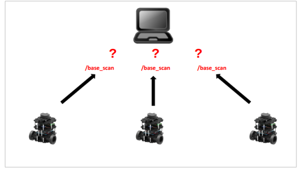
  - You can assign a unique namespace to each TurtleBot3’s `node` , `topic` , `frame` so you can identify each TurtleBot3.  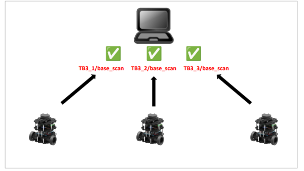
- **launch files** multi_robot.launch.pyLaunch sub launch files(gzsever, gzclient, robot_state_publisher, multi_spawn_turtlebot3) with parameters.Modify the model SDF temporarily for changing odom frame_id and base scan’s target frame_id.robot_state_publisher.launch.py → robot_state_publisher nodeRead model URDF and publish/tfbased on robot hardware.multi_spawn_turtlebot3.launch.py → spawn_entity.pyRead model.sdf and spawn the TurtleBot3 model in gazebo world.Sensor data is made by plugin that is written in model.sdf.
  - Launch sub launch files(gzsever, gzclient, robot_state_publisher, multi_spawn_turtlebot3) with parameters.
  - Modify the model SDF temporarily for changing odom frame_id and base scan’s target frame_id.
  - Read model URDF and publish `/tf` based on robot hardware.
  - Read model.sdf and spawn the TurtleBot3 model in gazebo world.
  - Sensor data is made by plugin that is written in model.sdf.
  - multi_robot.launch.py Launch sub launch files(gzsever, gzclient, robot_state_publisher, multi_spawn_turtlebot3) with parameters.Modify the model SDF temporarily for changing odom frame_id and base scan’s target frame_id.
  - robot_state_publisher.launch.py → robot_state_publisher node Read model URDF and publish/tfbased on robot hardware.
  - multi_spawn_turtlebot3.launch.py → spawn_entity.py Read model.sdf and spawn the TurtleBot3 model in gazebo world.Sensor data is made by plugin that is written in model.sdf.


### Multi Robot launch in Gazebo

**In this chapter, we show how to launch multi robot gazebo**

- Launch the multi_robot.launch gazebo package. $ros2 launch turtlebot3_gazebo multi_robot.launch.py
- You can see three TurtleBot3s as in the picture below.
- Nodes and topics are completely separated by namespace.  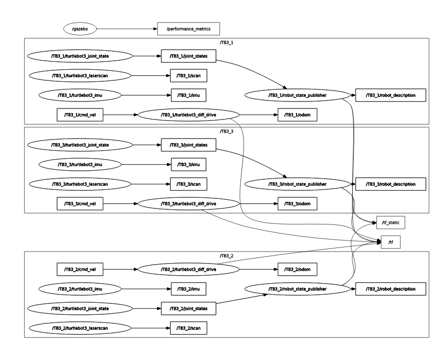

**NOTE**

- Namespace is not necessary for `/tf` and `/tf_static` .
- tf2_ros package manages `/tf` & `/tf_static` , allowing multiple nodes to publish `/tf` & `/tf_static` .
- Instead, frame_ids in `/tf` & `/tf_static` must be unique.

- Frames are completely saparated by namespace.  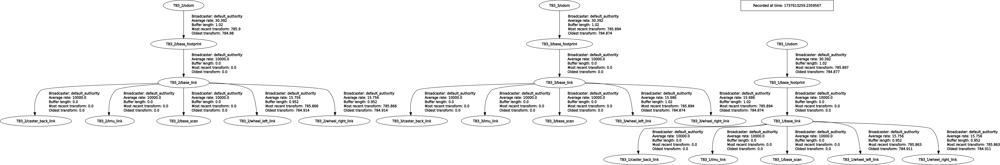


### Modifing Multi Robot launch in Gazebo

**In this chapter, we will learn how to modify the launch files to fit the Gazebo simulation for your own project**

- **Change robot number.** multi_robot.launch → Change value ofnumber_of_robotvariable.
  - multi_robot.launch → Change value of `number_of_robot` variable.
- **Change world model.** multi_robot.launch → Change value ofworldvariable to your world file path.
  - multi_robot.launch → Change value of `world` variable to your world file path.
- **Change robot spawn location.** multi_robot.launch → Change value ofposelist. Row means robot number, column[0] isx_pose, column[1] isy_pose
  - multi_robot.launch → Change value of `pose` list. Row means robot number, column[0] is `x_pose` , column[1] is `y_pose`
- **Change robot namespace.** multi_robot.launch → Change value ofnamespacevariable.
  - multi_robot.launch → Change value of `namespace` variable.

**TurtleBot3 World Example**

- You can see three TurtleBot3s in the picture below.

`number_of_robot` = 4  `pose` = [[-2,-0.5], [0.5,-2], [2,0.5], [-0.5,2]]  `world` = turtlebot3_world.world

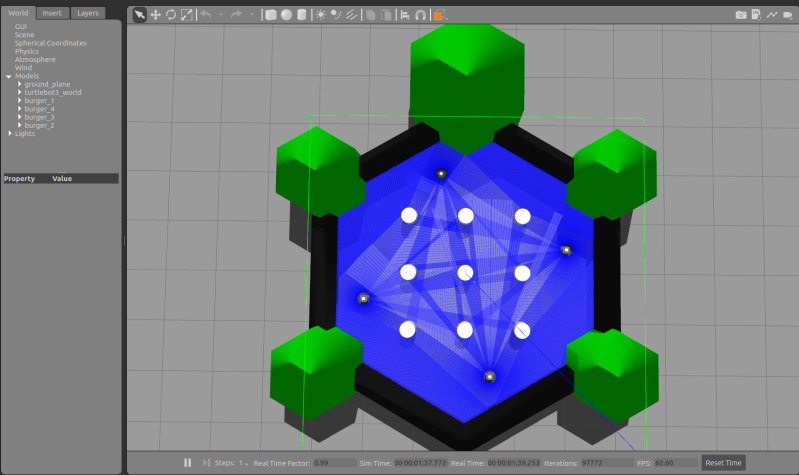


### Multi Robot launch in reality

**In this chapter, we show how to launch multiple robots in reality**

- Modify the frame_id of the topic header. This allows sensor data to be viewed separately in RViz2.

**This task should be performed on the files located on the TurtleBot SBC where bringup is run.**

```
$ 
nano ~/turtlebot3_ws/src/turtlebot3/turtlebot3_node/include/turtlebot3_node/sensors/imu.hpp  

```

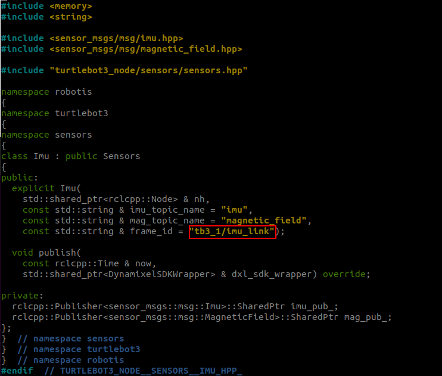

```
$ 
nano ~/turtlebot3_ws/src/ld08_driver/src/lipkg.cpp  

```

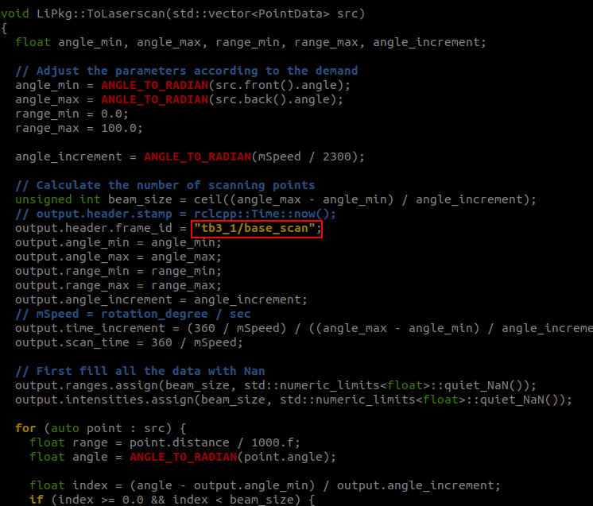

- Launch bringup with the namespace as an argument. $ros2 launch turtlebot3_bringup robot.launch.py namespace:=tb3_1# Insert what you want to use as namespace
- Nodes and topics are completely separated by namespace.  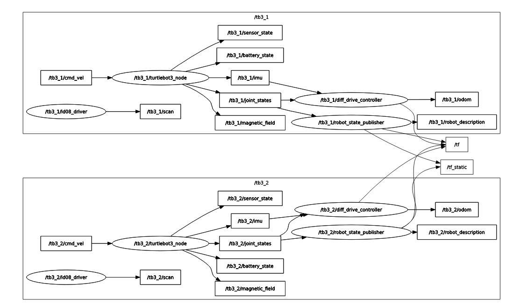


### Multi Robot Teleop

**In this chapter, we will control multiple robots with teleop in Gazebo simulation.**

```
$ 
ros2 run turtlebot3_teleop teleop_keyboard 
--ros-args
 
-r
 __ns:
=
/tb3_1 
# Change the number to the robot you want to control  


```

```
$ 
ros2 run turtlebot3_teleop teleop_keyboard Change 
--ros-args
 
-r
 __ns:
=
/tb3_1

Control Your TurtleBot3!

---------------------------

Moving around:
        w
   a    s    d
        x

w/x : increase/decrease linear velocity 
(
Burger : ~ 0.22, Waffle and Waffle Pi : ~ 0.26
)

a/d : increase/decrease angular velocity 
(
Burger : ~ 2.84, Waffle and Waffle Pi : ~ 1.82
)


space key, s : force stop

CTRL-C to quit

```

**NOTE** : This example can only be run on firmware version `1.2.1` or higher.

1. **[Remote PC]** Run roscore. $roscore
2. Bringup multiple TurtleBot3s with different namespaces. We recommend that the namespace is easy to remember, and to identify multiple units liketb3_0,tb3_1ormy_robot_0,my_robot_1 [TurtleBot(tb3_0)]Bring up basic packages withROS NAMESPACEfor nodes,multi_robot_namefor tf prefix andset_lidar_frame_idfor lidar frame id. These parameters must be the same.$ ROS_NAMESPACE=tb3_0 roslaunch turtlebot3_bringup turtlebot3_robot.launch multi_robot_name:="tb3_0"set_lidar_frame_id:="tb3_0/base_scan"[TurtleBot(tb3_1)]Bring up basic packages withROS NAMESPACEfor nodes,multi_robot_namefor tf prefix andset_lidar_frame_idfor lidar frame id. These parameters must be the same but different other robots.$ ROS_NAMESPACE=tb3_1 roslaunch turtlebot3_bringup turtlebot3_robot.launch multi_robot_name:="tb3_1"set_lidar_frame_id:="tb3_1/base_scan"
3. Then the terminal for `tb3_0` will output the messages below. You can watch TF for messages with the prefix `tb3_0` SUMMARY========PARAMETERS*/rosdistro: kinetic*/rosversion: 1.12.13*/tb3_0/turtlebot3_core/baud: 115200*/tb3_0/turtlebot3_core/port: /dev/ttyACM0*/tb3_0/turtlebot3_core/tf_prefix: tb3_0*/tb3_0/turtlebot3_lds/frame_id: tb3_0/base_scan*/tb3_0/turtlebot3_lds/port: /dev/ttyUSB0

NODES
  /tb3_0/
    turtlebot3_core(rosserial_python/serial_node.py)turtlebot3_diagnostics(turtlebot3_bringup/turtlebot3_diagnostics)turtlebot3_lds(hls_lfcd_lds_driver/hlds_laser_publisher)ROS_MASTER_URI=http://192.168.1.2:11311

process[tb3_0/turtlebot3_core-1]: started with pid[1903]
process[tb3_0/turtlebot3_lds-2]: started with pid[1904]
process[tb3_0/turtlebot3_diagnostics-3]: started with pid[1905][INFO][1531356275.722408]: ROS Serial Python Node[INFO][1531356275.796070]: Connecting to /dev/ttyACM0 at 115200 baud[INFO][1531356278.300310]: Note: publish buffer size is 1024 bytes[INFO][1531356278.303516]: Setup publisher on sensor_state[turtlebot3_msgs/SensorState][INFO][1531356278.323360]: Setup publisher on version_info[turtlebot3_msgs/VersionInfo][INFO][1531356278.392212]: Setup publisher on imu[sensor_msgs/Imu][INFO][1531356278.414980]: Setup publisher on cmd_vel_rc100[geometry_msgs/Twist][INFO][1531356278.449703]: Setup publisher on odom[nav_msgs/Odometry][INFO][1531356278.466352]: Setup publisher on joint_states[sensor_msgs/JointState][INFO][1531356278.485605]: Setup publisher on battery_state[sensor_msgs/BatteryState][INFO][1531356278.500973]: Setup publisher on magnetic_field[sensor_msgs/MagneticField][INFO][1531356280.545840]: Setup publisher on /tf[tf/tfMessage][INFO][1531356280.582609]: Note: subscribe buffer size is 1024 bytes[INFO][1531356280.584645]: Setup subscriber on cmd_vel[geometry_msgs/Twist][INFO][1531356280.620330]: Setup subscriber on sound[turtlebot3_msgs/Sound][INFO][1531356280.649508]: Setup subscriber on motor_power[std_msgs/Bool][INFO][1531356280.688276]: Setup subscriber on reset[std_msgs/Empty][INFO][1531356282.022709]: Setup TF on Odometry[tb3_0/odom][INFO][1531356282.026863]: Setup TF on IMU[tb3_0/imu_link][INFO][1531356282.030138]: Setup TF on MagneticField[tb3_0/mag_link][INFO][1531356282.033628]: Setup TF on JointState[tb3_0/base_link][INFO][1531356282.041117]:--------------------------[INFO][1531356282.044421]: Connected to OpenCR board![INFO][1531356282.047700]: This core(v1.2.1)is compatible with TB3 Burger[INFO][1531356282.051355]:--------------------------[INFO][1531356282.054785]: Start Calibration of Gyro[INFO][1531356284.585490]: Calibration End
4. **[Remote PC]** Launch the robot state publisher with the same namespace. [TurtleBot(tb3_0)]$ ROS_NAMESPACE=tb3_0 roslaunch turtlebot3_bringup turtlebot3_remote.launch multi_robot_name:=tb3_0[TurtleBot(tb3_1)]$ ROS_NAMESPACE=tb3_1 roslaunch turtlebot3_bringup turtlebot3_remote.launch multi_robot_name:=tb3_1
5. Before starting another application, check topics and the TF tree to open rqt $rqt

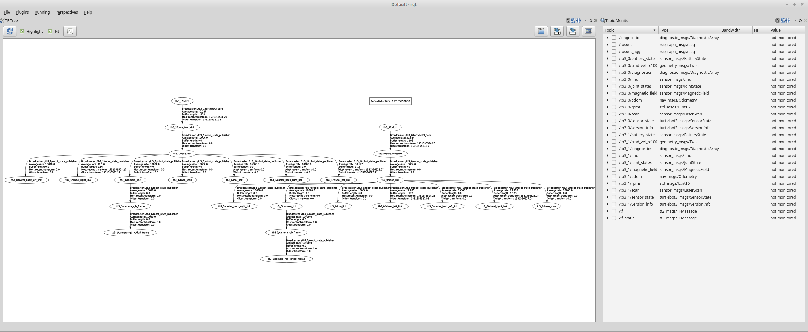

To use this setup, each TurtleBot3 makes a map using SLAM and these maps are merged simultaneously by the [multi_map_merge](http://wiki.ros.org/multirobot_map_merge) package. You can get more information about this by visiting [Virtual SLAM by Multiple TurtleBot3s](https://emanual.robotis.com/docs/en/platform/turtlebot3/simulation/#2-excute-slam) .


## YOLO Object Detection

**What is YOLO?**  YOLO(You Only Look Once) is a real-time object detection model. It views the entire image in a single pass(“only once”) and predicts both the bounding boxes and class probabilities directly. This makes YOLO extremely fast and efficient, making it ideal for real-time applications on TurtleBot3.

> In this example, we use YOLOv8 to perform real-time object detection using the TurtleBot3 camera. We will train a custom model and integrate it into a ROS 2 node for deployment on the robot. By the end of this tutorial, you’ll be able to train a YOLO model to recognize specific objects and run real-time detection directly on your TurtleBot3.

**What Tools Are Used?**

- [Roboflow](https://roboflow.com/) : Dataset preparation & export in YOLO format
- [Google Colab](https://colab.google/) : Model training using GPU with PyTorch pre-installed


### Dataset Preparation

**Step 1: Data Annotation (Labeling)**  To create your own custom datset, you need to go through a data annotation(labeling) process.

- Option A: Upload Your Own Images Go toRoboflowand create a new projectUpload your images (from TurtleBot3 camera or bag files)ClickAnnotateand draw bounding boxes for each objectCreate class namesClickGenerateto finalize the dataset
  - Go to [Roboflow](https://roboflow.com/) and create a new project
  - Upload your images (from TurtleBot3 camera or bag files)
  - Click `Annotate` and draw bounding boxes for each object
  - Create class names
  - Click `Generate` to finalize the dataset

For detailed guidance, see the official [Roboflow Annotate Documentation](https://docs.roboflow.com/annotate/use-roboflow-annotate) .

**NOTE** :

- Label at least 50–100 images per class
- Ensure variation in lighting, angles, and backgrounds
- Include some empty images (no objects) to reduce false positives

- Option B: Use Public Dataset (Quick Start)
In this example, we are using a public dataset from Roboflow, which is already labeled. To explore a public dataset, go [here](https://universe.roboflow.com/) .

**Step 2: Export the Dataset**  Download and export the dataset in YOLO format.  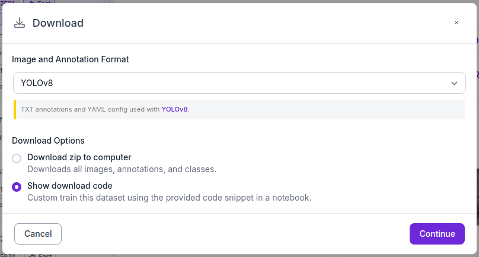


### Model Training

Google Colab provides a free GPU environment, which is especially useful if you don’t have a local GPU setup.

**Step 1: Change the runtime type to GPU**  To enable GPU acceleration, go to `Runtime` → `Change runtime type` , and select `GPU` as the hardware accelerator. This will allow your training to run faster using Colab’s free GPU resources.  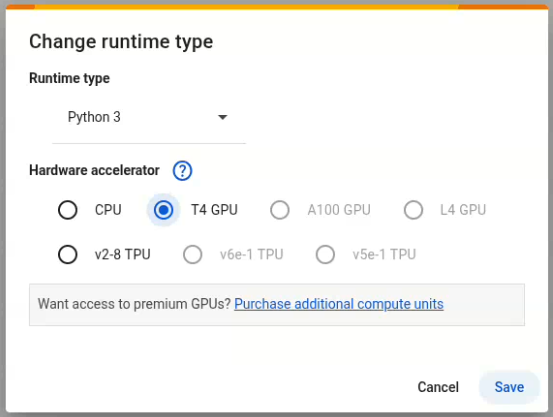

**Step 2: Install Ultralytics**  **[Colab]**

```
!
pip 
install 
ultralytics

```

**Step 3: Load the Dataset**  Copy the dataset loading code from Roboflow. It is provided after exporting. Make sure the paths to the `train` , `val` and `test` image directories are correctly defined in the `data.yaml` file.

- Example of `data.yaml` file  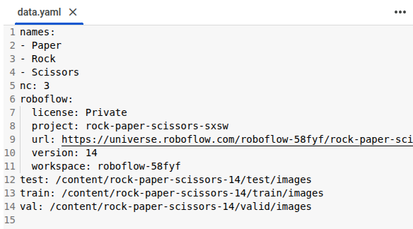

**Step 4: Train the Model**  **[Colab]**

```
from ultralytics import YOLO

model
=
YOLO
(
"yolov8n.pt"
)

model.train
(
data
=
'{data_path}/data.yaml'
,epochs
=
100
)


```

- In this example, we use `yolov8n.pt` , a lightweight model optimized for speed and efficiency. You may use other variants like `yolov8s` , `m` , or `l` based on your needs.
- `epochs` refers to the number of times the model iterates over the entire dataset during training. If set too low, the model may not learn effectively. If set too high, training can take a long time or exceed Google Colab’s GPU usage limit.
- `data_path` refers to the directory where your dataset and `data.yaml` file are located.

**Step 5: Download the Trained Model**  After training, the best-performing weights( `best.pt` ) will be saved at `/content/runs/detect/train/weights` .  **[Colab]**

```
from google.colab import files
files.download
(
'/content/runs/detect/train/weights/best.pt'
)


```


### Remote PC Setup

**Step 1: ROS 2 Package Setup**  If you haven’t already cloned and built the `turtlebot3_applications` package, run the following commands first.  **[Remote PC]**

```
$ 
cd
 ~/turtlebot3_ws/src/

$ 
git clone 
-b
 humble https://github.com/ROBOTIS-GIT/turtlebot3_applications.git

$ 
cd
 ~/turtlebot3_ws 
&&
 colcon build 
--symlink-install
 
--packages-select
 turtlebot3_yolo_object_detection

$ 
source install
/setup.bash

```

**Step 2: Install the Required Dependencies**  Install PyTorch and Ultralytics.  Visit the official [PyTorch Installation Guide](https://pytorch.org/get-started/locally/) to install the correct version for your system.  **[Remote PC]**

```
# For CPU-only (example)


$ 
pip3 
install 
torch torchvision torchaudio 
--index-url
 https://download.pytorch.org/whl/cpu

```

Once PyTorch is installed,  **[Remote PC]**

```
$ 
pip3 
install 
ultralytics opencv-python 
"numpy<2.0"


```


### Camera Stream Setup

**Launch the Camera Node**  Ensure that the SBC and Remote PC are on the same network and ROS 2 DDS communication is properly set(e.g., `ROS_DOMAIN_ID` , `ROS_LOCALHOST_ONLY=0` ).  **[TurtleBot3 SBC]**

```
 
$ 
ros2 launch turtlebot3_bringup camera.launch.py format:
=
RGB888

```


### Prediction

**Step 1: Run the Detection Node**  You can pass the path to your `best.pt` model file as a parameter at runtime. Replace the `model_path` with the path to your custom-trained `.pt` file.  **[Remote PC]**

```
$ 
ros2 launch turtlebot3_yolo_object_detection turtlebot3_yolo_object_detection.launch.py model_path:
=
<path_to_best.pt>

```

> To test quickly without training or downloading a model, set model_path:=yolov8n.pt to use the COCO pre-trained YOLOv8 model.

**Step 2: Visualize the Detection Results**  Open rqt_image_view and select the `/camera/detections/compressed` topic to view the camera feed with detection results. The detection node publishes the result as annotated image to the `/camera/detections/compressed` topic using OpenCV.  **[Remote PC]**

```
$ 
rqt_image_view

```
