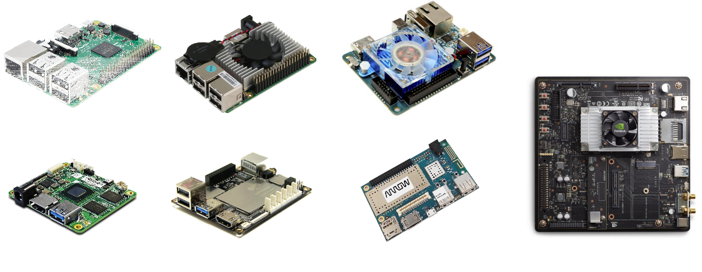
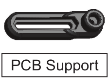
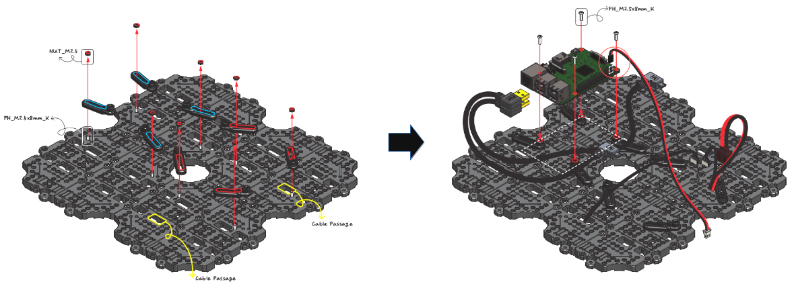
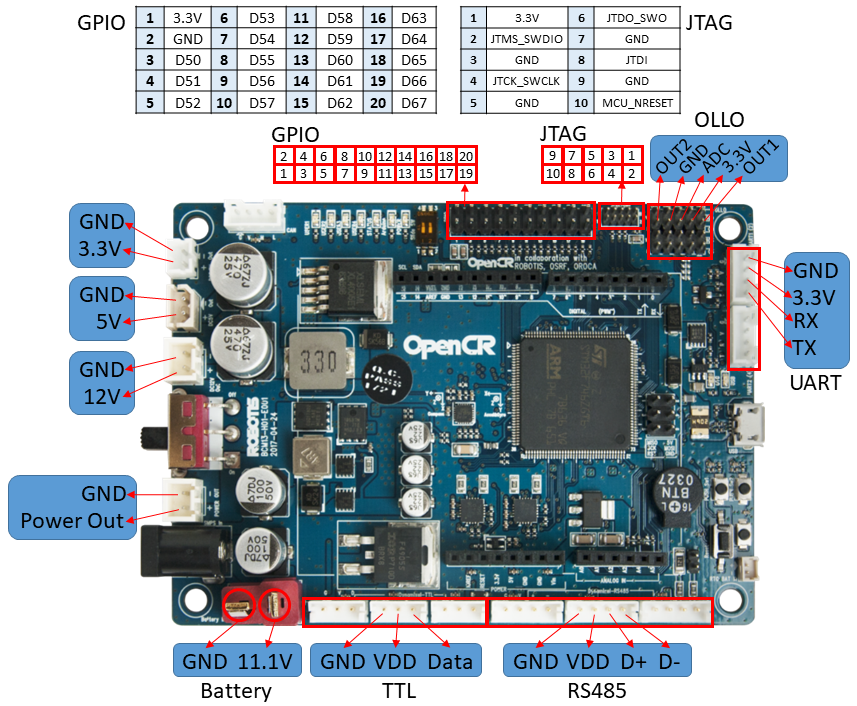
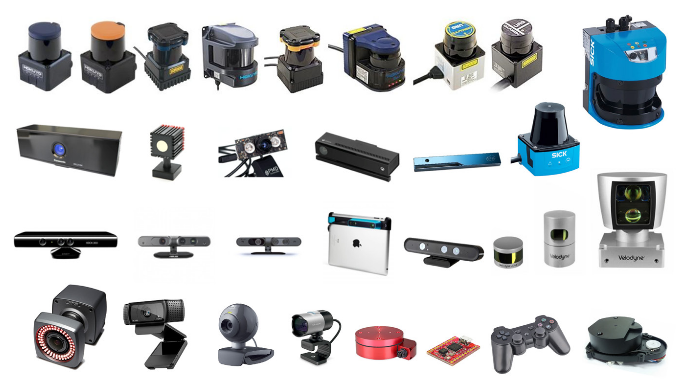

# TurtleBot3

> **Source**: [https://emanual.robotis.com/docs/en/platform/turtlebot3/compatible_devices](https://emanual.robotis.com/docs/en/platform/turtlebot3/compatible_devices)

---

## Compatible Devices

- If you want to use other products instead of Computer and Sensors included in the basic configuration, please refer to the this page.

### Computer

- TurtleBot3’s main computer isRaspberry Pi 3(TurtleBot3 Burger and Waffle Pi) andIntel Joule 570x(TurtleBot3 Waffle). These SBCs (Single Board Computer) are enough to use the basic features of TurtleBot3, but users need to increase CPU performance, use GPU, or add RAM size for other purposes. This section describes how to replace the SBC.
- There are various types of SBC as shown in the following figure. The specification of each SBC is different. But if you can install Linux and ROS on the SBC you want to use, you can use that SBC as the main computer for TurtleBot3. In addition to SBC,Intel NUC, mini PC and small notebooks are available.

- The TurtleBot3 development team has tested several SBCs. Here is a list of SBCs we tested: Raspberry Pi 3Intel Joule 570xDragonBoard 410cNVIDIA Jetson TX2UP BoardUP CoreLattePandaODROID-XU4
  - [Raspberry Pi 3](https://www.raspberrypi.org/products/)
  - [Intel Joule 570x](https://ark.intel.com/products/96414/Intel-Joule-570x-Developer-Kit)
  - [DragonBoard 410c](https://developer.qualcomm.com/hardware/dragonboard-410c)
  - [NVIDIA Jetson TX2](https://developer.nvidia.com/embedded/buy/jetson-tx2-devkit)
  - [UP Board](http://www.up-board.org/up/)
  - [UP Core](http://www.up-board.org/upcore/)
  - [LattePanda](https://www.lattepanda.com/)
  - [ODROID-XU4](http://www.hardkernel.com/)

#### Hardware assembly

- Most of the SBCs can be assembled without problems using `PCB support` , which is built in TurtleBot3. For reference, you can purchase additional parts such as PCB support ( [link](http://www.robotis-shop-en.com/?act=shop_en.goods_view&GS=3284&GC=GD070003) ), download [files](http://www.robotis.com/service/download.php?no=676) shared with Onshape, and print them using a 3D printer.

- You can fix SBC on the waffle-plate of TurtleBot3 using the PCB support in the fixing hole of the SBC to be used as shown in the following figure.

#### Power supply

- Hardware assembly of the SBC is simple. But the power supply is not simple. You need to modify the existing power cable or make a new power cable to match thepower cableof the computer you are going to use.
- As a basic part of TurtleBot3, the followingpower cableis provided. The left figure is for Raspberry Pi and the right figure is for Intel Joule 570x. The power cable must be made to match the power specifications of the computer you are using.OpenCRhas both a 5V (4A) power and a 12V (1A) power, which are commonly used in SBCs.

- The power source for the SBC is the three connectors on the left in the [OpenCR](https://emanual.robotis.com/docs/en/parts/controller/opencr10/) pinmap below.

### Sensors

- TurtleBot3 Burgeruses enhanced360° LiDAR,9-Axis Inertial Measurement Unitandprecise encoderfor your research and development.TurtleBot3 Waffleis equipped with an identical 360° LiDAR as well but additionally proposes a powerfulIntel® RealSense™with the recognition SDK.TurtleBot3 Waffle Piuses high utilizedRaspberry Pi Camera. This will be the best hardware solution for making a mobile robot.
- If you use an additional sensor, you can use it after attaching the sensor to the robot. The ROS provides a development environment in which drivers and libraries of the aforementioned sensors can be used. Not all sensors are supported by ROS package, but more and more sensor related packages are increasing.

- If you are looking for a new sensor, check outSensors pageof ROS Wiki to find the sensor and related ROS packages you want.
- If you are using an analog sensor connected to the embedded board, you can use it with OpenCR. If you need to use an analog sensor other than USB or Ethernet communication, refer toAdditional Sensorspage.
