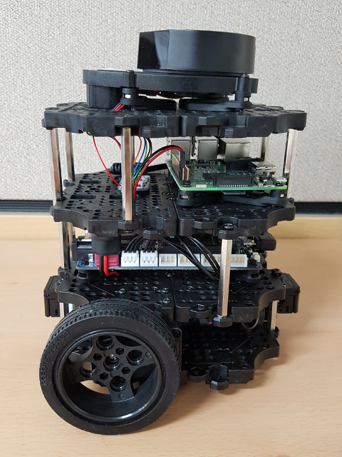
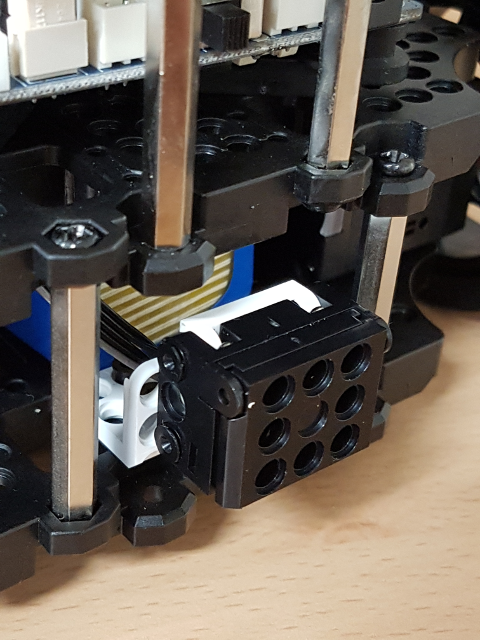
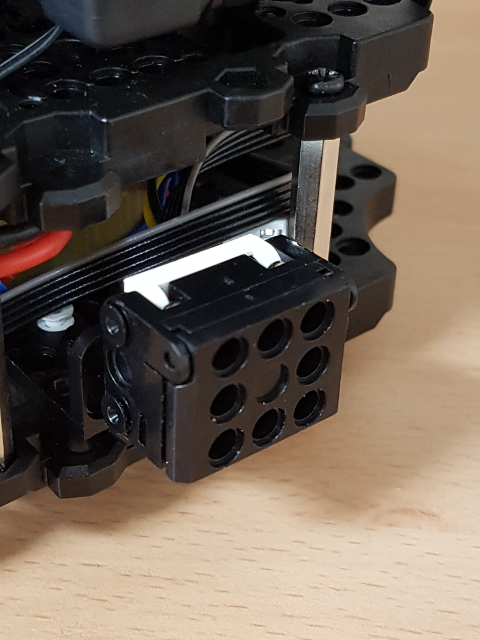
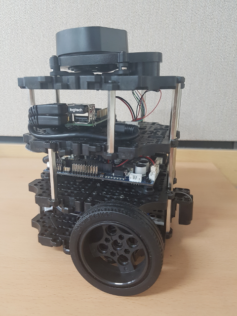
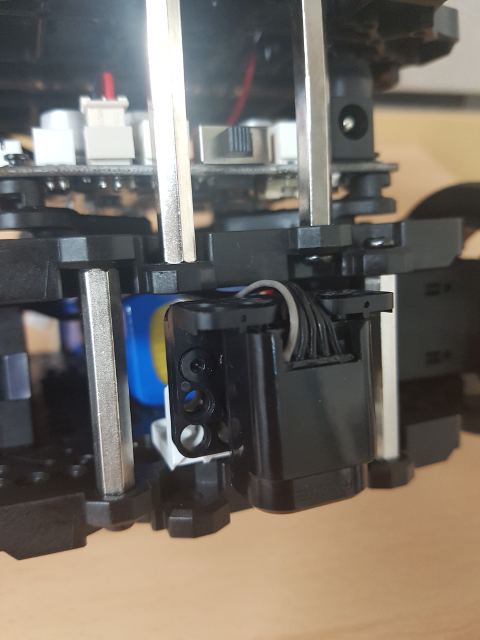
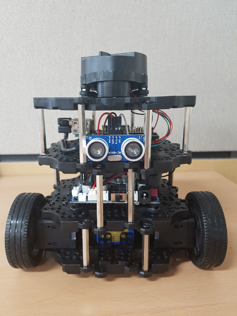
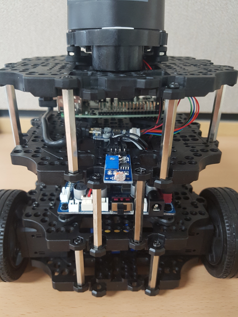
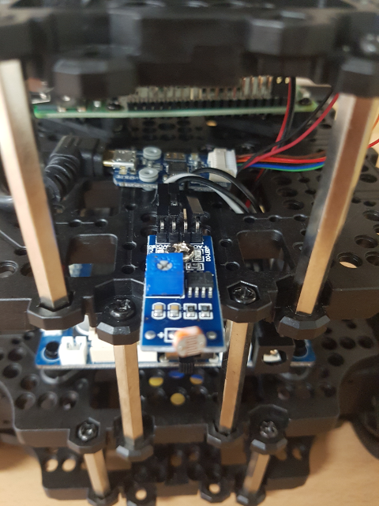
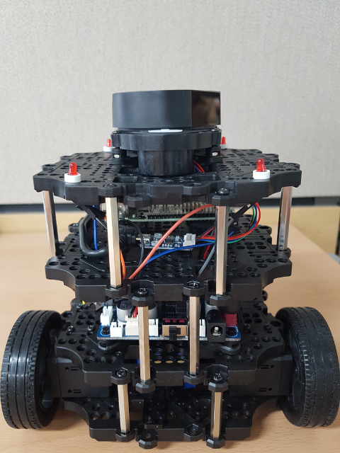
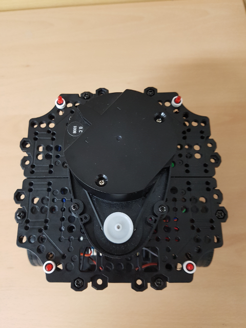

# TurtleBot3

> **Source**: [https://emanual.robotis.com/docs/en/platform/turtlebot3/additional_sensors](https://emanual.robotis.com/docs/en/platform/turtlebot3/additional_sensors)

---


## Additional Sensors

TurtleBot3 can be attach to additional sensors. Examples shown here can be that how to use additional sensors such as IR, ultrasonic, switch, etc. in OpenCR of TurtleBot3.


### Bumper

- Device - [Touch_sensor (TS-10)](http://emanual.robotis.com/docs/en/parts/sensor/ts-10/)



(Front side)



(Back side)



- Default PIN

| Device | PIN |
| --- | --- |
| Front sensor | ROBOTIS_5-PIN 3 |
| Back sensor | ROBOTIS_5-PIN 4 |

**Tip :** If you want to use another PIN, refer to [OpenCR PIN Map](http://emanual.robotis.com/docs/en/parts/controller/opencr10/) .

- Run with Turtlebot3

**WARNING** : Make sure to run the [Bringup](https://emanual.robotis.com/docs/en/platform/turtlebot3/additional_sensors#bringup) instruction before performing Example.

**[Remote PC]** Launch the bumper launch file.

```
$ 
roslaunch turtlebot3_example turtlebot3_bumper.launch

```

- Run with Arduino IDE

This example can be open [Arduino IDE](http://emanual.robotis.com/docs/en/parts/controller/opencr10/#arduino-ide) .

Select to `File` -> `Examples` -> `ROS` -> `2. Sensors` -> `a_Bumper` . Upload to OpenCR.

**[Remote PC]** Run ros serial_node package.

```
$ 
rosrun rosserial_python serial_node.py __name:
=
turtlebot3_core _port:
=
/dev/ttyACM0 _baud:
=
115200

```

**WARNING** : If you upload examples to OpenCR, you have to re-upload [turtlebot3_core](http://emanual.robotis.com/docs/en/platform/turtlebot3/opencr_setup/#opencr-setup) .


### IR

- Device - [IR_sensor (IRSS-10)](http://emanual.robotis.com/docs/en/parts/sensor/irss-10/)





- Default PIN

| Device | PIN |
| --- | --- |
| IR sensor | ROBOTIS_5-PIN 2 |

**Tip :** If you want to use another PIN, refer to [OpenCR PIN Map](http://emanual.robotis.com/docs/en/parts/controller/opencr10/) .

- Run with Turtlebot3

**WARNING** : Make sure to run the [Bringup](https://emanual.robotis.com/docs/en/platform/turtlebot3/additional_sensors#bringup) instruction before performing Example.

**[Remote PC]** Launch the cliff launch file.

```
$ 
roslaunch turtlebot3_example turtlebot3_cliff.launch

```

- Run with Arduino IDE

This example can be open [Arduino IDE](http://emanual.robotis.com/docs/en/parts/controller/opencr10/#arduino-ide) .

Select to `File` -> `Examples` -> `ROS` -> `2. Sensors` -> `b_Cliff` . Upload to OpenCR.

**[Remote PC]** Run ros serial_node package.

```
$ 
rosrun rosserial_python serial_node.py __name:
=
turtlebot3_core _port:
=
/dev/ttyACM0 _baud:
=
115200

```


### Ultrasonic

- Device - Ultrasonic sensor (HC-SR04)



- Default PIN:

| Device | PIN |
| --- | --- |
| Trigger | BDPIN_GPIO_1 |
| Echo | BDPIN_GPIO_2 |

**Tip :** If you want to use another PIN, refer to [OpenCR PIN Map](http://emanual.robotis.com/docs/en/parts/controller/opencr10/) .

- Run with Turtlebot3

**WARNING** : Make sure to run the [Bringup](https://emanual.robotis.com/docs/en/platform/turtlebot3/additional_sensors#bringup) instruction before performing Example.

**[Remote PC]** Launch the sonar launch file.

```
$ 
roslaunch turtlebot3_example turtlebot3_sonar.launch

```

- Run with Arduino IDE

This example can be open [Arduino IDE](http://emanual.robotis.com/docs/en/parts/controller/opencr10/#arduino-ide) .

Select to `File` -> `Examples` -> `ROS` -> `2. Sensors` -> `c_Ultrasonic` . Upload to OpenCR.

**[Remote PC]** Run ros serial_node package.

```
$ 
rosrun rosserial_python serial_node.py __name:
=
turtlebot3_core _port:
=
/dev/ttyACM0 _baud:
=
115200

```


### Illumination

- Device - LDR sensor (Flying-Fish MH-sensor)





- Default PIN

| Device | PIN |
| --- | --- |
| Analog | A1 |

**Tip :** If you want to use another PIN, refer to [OpenCR PIN Map](http://emanual.robotis.com/docs/en/parts/controller/opencr10/) .

- Run with Turtlebot3

**WARNING** : Make sure to run the [Bringup](https://emanual.robotis.com/docs/en/platform/turtlebot3/additional_sensors#bringup) instruction before performing Example.

**[Remote PC]** Launch the illumination launch file.

```
$ 
roslaunch turtlebot3_example turtlebot3_illumination.launch

```

- Run with Arduino IDE

This example can be open [Arduino IDE](http://emanual.robotis.com/docs/en/parts/controller/opencr10/#arduino-ide) .

Select to `File` -> `Examples` -> `ROS` -> `2. Sensors` -> `d_Illumination` . Upload to OpenCR.

**[Remote PC]** Run ros serial_node package.

```
$ 
rosrun rosserial_python serial_node.py __name:
=
turtlebot3_core _port:
=
/dev/ttyACM0 _baud:
=
115200

```


### LED

- Device - led (led101)





- Default PIN

| Device | PIN |
| --- | --- |
| Front_left | BDPIN_GPIO_4 |
| Front_right | BDPIN_GPIO_6 |
| Back_left | BDPIN_GPIO_8 |
| Back_right | BDPIN_GPIO_10 |

**Tip :** If you want to use another PIN, refer to [OpenCR PIN Map](http://emanual.robotis.com/docs/en/parts/controller/opencr10/) .

- Run

This example is allways active when connected led. the leds show a specific pattern depend on the linear and angular velocity of Turtlebot3.
