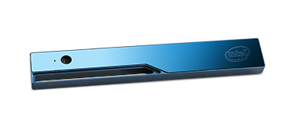

# TurtleBot3

> **Source**: [https://emanual.robotis.com/docs/en/platform/turtlebot3/appendix_realsense](https://emanual.robotis.com/docs/en/platform/turtlebot3/appendix_realsense)

---


### RealSense™




### Overview

[Intel® RealSense™](https://click.intel.com/realsense.html) is a platform for implementing gesture-based human-computer interaction techniques. It consists of series of consumer grade 3D cameras together with an easy to use machine perception library. The Intel® RealSense™ R200 camera is a USB 3.0 device that can provide color, depth, and infrared video streams. The TurtleBot3 Waffle model adopts Intel® RealSense™ R200 to enable 3D SLAM and navigation, and it is possible to apply various applications such as gesture recognition, object recognition and scene recognition based on 3D depth information obtained using RealSense™’s innovative Active Stereo Technology.


### Specifications


#### Technical Specifications

| Items | Specifications |
| --- | --- |
| RGB Video Resolution | 1920 x 1280, 2M |
| IR Depth Resolution | 640 x 480, VGA |
| Laser Projector | Class 1 IR Laser Projector (IEC 60825-1:2007 Edition 2) |
| Frame Rate | 30 fps (RGB), 60 fps (IR depth) |
| FOV (Field-of-View) | 77° (RGB), 70° (IR depth), Diagonal Field of View |
| Range | 0.3m ~ 4.0m |
| Operating Supply Voltage | 5V (via USB port) |
| USB Port | USB 3.0 |
| Dimensions | 101.56mm length x 9.55mm height x 3.8mm width |
| Mass | Under 35g |


#### Minimum System Requirements

| Items | Specifications |
| --- | --- |
| Processors | 4th Generation and future Intel® Core™ processors |
| Disk Storage | 1GB |
| Memory | 2GB |
| Interface | USB 3.0 |
|  | Ubuntu 14.04 and 16.04 LTS (GCC 4.9 toolchain) |
| Operating System | Windows 8.1 and Windows 10 (Visual Studio 2015 Update 2) |
| for SDK | Mac OS X 10.7+ (Clang toolchain) |
|  | Ostro |

Here is the detail specification document: [Intel® RealSense™ Datasheet](https://software.intel.com/sites/default/files/managed/d7/a9/realsense-camera-r200-product-datasheet.pdf)


### Intel® RealSense™ R200 for TurtleBot3

The Intel® RealSense™ R200 is applied on TurtleBot3 Waffle.


### Introduction Video

The TurtleBot3 Waffle uses Intel® RealSense™ Camera R200 as a default vision sensor. Check this video out that shows how Intel® RealSense™ Camera R200 can be used in TurtleBot3 Waffle.


### User Guide

[Intel® RealSense™ packages](http://wiki.ros.org/RealSense) enable the use of Intel® RealSense™ R200, F200, SR300 and ZR300 cameras with ROS. Below table describes packages required to operate Intel® RealSense™. You will be guided to install these packaged in the next section.

| Package | Description |
| --- | --- |
| librealsense | Underlying library driver for communicating with Intel® RealSense™ camera |
| realsense_camera | ROS Intel® RealSense™ camera node for publishing camera |


#### Installation

**Warning!** There are installation prerequisites for the Intel® RealSense™ package installation in http://wiki.ros.org/librealsense

**[TurtleBot]** The following commands will install relevant Intel® RealSense™ library.

```
$ 
sudo 
apt-get 
install 
linux-headers-generic

$ 
sudo 
apt-get 
install 
ros-kinetic-librealsense

```

**[TurtleBot]** To run the Intel® RealSense™ with ROS, the following package is needed. There are stable and unstable version packages. Choose one and install it.


##### [Stable]

```
$ 
cd 
catkin_ws/src

$ 
git clone https://github.com/intel-ros/realsense.git

$ 
cd 
realsense

$ 
git checkout 1.8.0

$ 
cd 
catkin_ws 
&&
 catkin_make 
-j2


```


##### [Unstable]

```
$ 
sudo 
apt-get 
install 
ros-kinetic-realsense-camera

```


#### Run realsense_camera Node

**[TurtleBot]** Run the following command

```
$ 
roslaunch realsense_camera r200_nodelet_default.launch

```

While the realsense_camera node is running, you can view various data from Intel® RealSense™ by launching rqt_image_view.

**[Remote PC]** Run the following command

```
$ 
rqt_image_view

```

Once the gui application is appeared on the screen, you can select data topic name related to Intel® RealSense™ from drop down menu at the top of the application.


#### (Optional) To Try as the Example Video Shows

**[TurtleBot]** Input `ctrl` + `c` to quit the previously run camera node, then run other realsense_camera node

```
$ 
roslaunch realsense_camera r200_nodelet_rgbd.launch

```

**[TurtleBot]** Run turtlebot3_bringup node to get datas for doing SLAM

```
$ 
roslaunch turtlebot3_bringup turtlebot3_robot.launch

```

**[Remote PC]** Run turtlebot3_slam node to do SLAM

```
$ 
roslaunch turtlebot3_slam turtlebot3_slam.launch

```

**[Remote PC]** Run RViz

```
$ 
rosrun rviz rviz 
-d
 
`
rospack find turtlebot3_slam
`
/rviz/turtlebot3_slam.rviz

```

**[Remote PC]** Click `Panels` - `Views` to open the view window

**[Remote PC]** Click `TopDownOrtho (rviz)` and change it into `XYOrbit (rviz)`

**[Remote PC]** Click `add` - `By topic` and find the PointCloud2 type `/points` topic in `/camera/depth` , then click it

**[Remote PC]** Click PointCloud2 type topic on the left window, then change `Color Transformer` from `Intensity` to `AxisColor` . This will show the depth of each points by color description.

**[Remote PC]** Click `add` - `By topic` and find the Image type `/image_color` topic in `/camera/rgb` , then click it. This will show the view of the rgb camera


### References

- [Intel® RealSense™ Datasheet](https://software.intel.com/sites/default/files/managed/d7/a9/realsense-camera-r200-product-datasheet.pdf)
- [Data ranges](https://software.intel.com/en-us/articles/intel-realsense-data-ranges)
- [Intel® RealSense™ SDK](https://software.intel.com/en-us/intel-realsense-sdk)
- [Purchase](https://click.intel.com/realsense.html)
