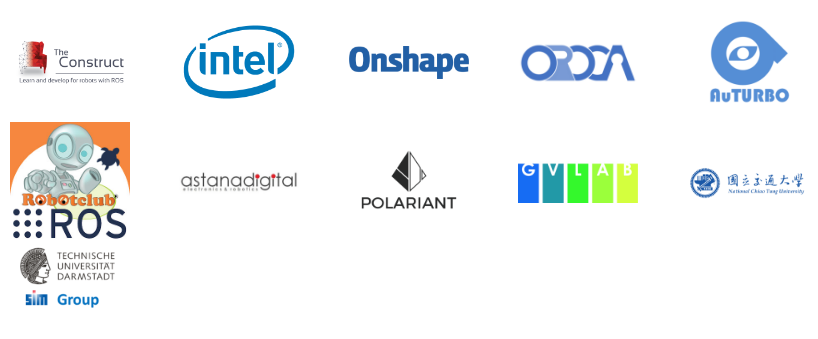
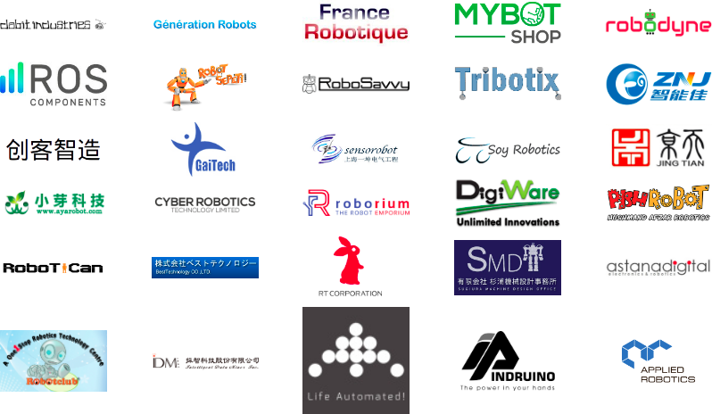

> **출처**: [https://emanual.robotis.com/docs/en/platform/turtlebot3/overview](https://emanual.robotis.com/docs/en/platform/turtlebot3/overview)

---

# 1. 개요

> **공지**: 2025년 플랫폼 팀이 구성됨에 따라 오픈 플랫폼 발전을 위한 실질적인 자원이 투입될 예정입니다.
> 최우선 과제로 **TurtleBot3**는 ROS 2 Humble을 완전히 지원하며, **포괄적인 예제 구현**이 2025년 Q1에 출시될 예정입니다. Q2에는 **ROS 2 Jazzy** 및 **Gazebo Sim** 지원이 확대되어 ROS 생태계 및 시뮬레이션 환경의 최신 발전과의 원활한 통합이 보장됩니다.

>  **Raspberry Pi 4**
> * TurtleBot3 플랫폼이 업그레이드되어 표준 온보드 SBC로 Raspberry Pi 4가 탑재되었습니다.

>  **Jetson Nano**
> * TurtleBot3 하드웨어는 Nvidia Jetson Nano SBC 사용도 지원합니다.
> * Jetson Nano를 TurtleBot3와 함께 사용하기 위한 설정 방법은 아래 동영상을 참조하세요.
> * TurtleBot3 사용 준비에 앞서 [Jetson Nano Developer Kit 설정](https://developer.nvidia.com/embedded/learn/get-started-jetson-nano-devkit) 안내를 먼저 완료해야 합니다.

https://youtu.be/fGEq_0aWpoA?si=04295vvKW_UPX5dP

**TurtleBot이란?**

[TurtleBot](https://www.turtlebot.com/)은 [ROS](http://www.ros.org/about-ros/) 교육 및 연구를 위해 개발된 표준 로봇 플랫폼입니다. TurtleBot 플랫폼의 개념은 1940년대 초반부터 기초 로봇공학과 컴퓨터 과학 교육에 사용된 [Turtle 로봇](https://en.wikipedia.org/wiki/Turtle_(robot))에서 파생되었습니다. TurtleBot은 ROS를 처음 접하는 사람들을 가르치고, 보다 고급 개발을 위한 충분한 기반 시스템을 제공하기 위해 설계된 단순하고 업그레이드가 용이한 플랫폼입니다. 출시 이후 TurtleBot은 표준 ROS 교육 플랫폼이자 전 세계 개발자와 학생들 사이에서 가장 인기 있는 로봇 플랫폼이 되었습니다.

현재 [TurtleBot](https://www.turtlebot.com/)은 4가지 버전이 있습니다. TurtleBot1은 Willow Garage에서 Tully(Open Robotics 플랫폼 매니저)와 Melonee(Fetch Robotics CEO)가 iRobot의 Roomba 기반 연구 로봇인 Create 위에 ROS 배포를 위해 개발했습니다. 2010년에 개발되어 2011년부터 판매되었습니다. 2012년에는 Yujin Robot이 연구 로봇 iClebo Kobuki를 기반으로 TurtleBot2를 개발했습니다. 2017년에는 ROBOTIS가 이전 모델의 기능과 사용자 요구를 보완하기 위해 개선된 모듈식 디자인으로 TurtleBot3를 개발했습니다. ClearPath Robotics가 개발한 TurtleBot4는 iRobot Create3 베이스를 특징으로 하며, TurtleBot3 플랫폼보다 덜 모듈식인 대안입니다. TurtleBot 시리즈에 대한 자세한 내용은 [공식 TurtleBot 웹사이트](https://www.turtlebot.com/about/)에서 전체 플랫폼 역사를 확인할 수 있습니다.

특히 TurtleBot3는 교육, 연구, 취미 프로젝트 및 제품 프로토타이핑을 위한 소형, 저렴하고 맞춤 설정이 가능한 ROS 기반 모바일 로봇입니다. TurtleBot3의 목표는 기능과 품질을 희생하지 않으면서 저비용, 고유연성의 로봇 개발 플랫폼을 제공하는 동시에, 다양한 복잡한 로봇 응용 분야에 맞출 수 있는 충분한 확장성을 제공하는 것입니다. TurtleBot3는 간단한 기계적 부품과 커스텀 컴퓨터 및 센서를 포함한 업그레이드된 전자 부품을 사용하여 다양한 방식으로 맞춤 설정할 수 있습니다. 또한 TurtleBot3는 강력한 임베디드 시스템에 적합한 비용 효율적이고 소형인 SBC를 지속적으로 업그레이드하여 초기 성능을 계속해서 발전시켜 왔습니다. TurtleBot3의 핵심 기술인 [SLAM](https://en.wikipedia.org/wiki/Simultaneous_localization_and_mapping), [내비게이션](https://en.wikipedia.org/wiki/Robot_navigation) 및 [매니퓰레이션](https://en.wikipedia.org/wiki/Robotic_manipulation)은 다양한 연구 및 서비스 로봇 응용 분야에 적합합니다.

**ROS와 TurtleBot에 기여하는 방법**

TurtleBot3는 Open Robotics, ROBOTIS 및 The Construct, Intel, Onshape, OROCA, AuTURBO, ROS in Robotclub Malaysia, Astana Digital, Polariant Experiment, Tokyo University of Agriculture and Technology, GVlab, National Chiao Tung University의 Networked Control Robotics Lab, TU Darmstadt의 SIM Group을 포함한 많은 파트너 간의 협력 프로젝트입니다. Open Robotics는 소프트웨어 및 커뮤니티 활동을 담당하고, ROBOTIS는 제조 및 글로벌 유통을 담당합니다.

TurtleBot3 협력 프로젝트의 가장 중요한 부분은 오픈 소스 기반의 소프트웨어, 하드웨어 및 플랫폼 커뮤니티입니다. 이에 따라 ROBOTIS는 항상 더 많은 파트너와 연구 협력자들이 이 프로젝트에 참여하여 로봇공학 분야 전체를 풍요롭게 하기를 장려하고 있습니다.

오픈 소스 로봇공학 개발을 계속 발전시키기 위한 파트너십에 관심이 있으시면, 이 양식을 작성하여 협력 방법에 대해 자세히 알아보세요.

* TurtleBot3 제공자  

* TurtleBot3 파트너 및 연구 협력자  

   * 각 협력 멤버의 웹 페이지는 여기에서 확인할 수 있습니다.

* TurtleBot3 유통사  

* 각 협력 멤버의 웹 페이지는 여기에서 확인할 수 있습니다.

TurtleBot3 지도

## 1.1 공지사항

## ROS 및 TurtleBot3 관련 자료:

- 23/01/2025 TurtleBot3 유지보수 및 개발 공식 재개!
- 09/06/2021 TurtleBot3가 Raspberry Pi 4로 업그레이드되었습니다!!!
- 05/28/2021 [TurtleBot3 Autorace 2020, ROS Noetic 지원](https://www.youtube.com/playlist?list=PLRG6WP3c31_WsNjwmYID2ulX5g4WcjKbI)
- 05/24/2021 [ROS 2 Galactic Geochelone 릴리스](https://discourse.ros.org/t/ros-2-galactic-geochelone-released/20559)
- 12/20/2020 [Webots, ROS 2 Foxy로 TurtleBot3 지원](https://discourse.ros.org/t/turtlebot3-and-webots/17880)
- 10/15/2020 [ROS 2 Foxy 릴리스](https://discourse.ros.org/t/new-packages-for-foxy-fitzroy-2020-11-05/17140)
- 08/21/2019 [ROS 2 Dashing 릴리스](https://discourse.ros.org/t/tb3-ros-2-dashing-release/10364)
- 08/20/2019 [Navigation2 Dashing 릴리스 - 데모 영상](https://discourse.ros.org/t/navigation2-dashing-release-demo-video/10349)
- 02/01/2019 [TurtleBot3 ROS2 신규 패키지 발표 (Cartographer 및 Navigation2 포함)](https://discourse.ros.org/t/announcing-new-packages-for-turtlebot3-in-ros2-including-cartographer-and-navigation2/7694)
- 12/17/2018 [ros2arduino 릴리스: ROS 2 통신을 위한 Arduino 라이브러리](https://discourse.ros.org/t/ros2arduino-0-0-1-released-arduino-library-for-communicating-with-ros2-dds/7147)
- 09/21/2018 [XEL Network 첫 번째 애플리케이션 + ROSCon2018에서 XEL 장치 100세트 무료 배포!](https://discourse.ros.org/t/xel-network-first-application-distributing-xel-devices-100-set-for-free-in-roscon2018/6115)
- 09/13/2018 [XEL Network 소개: ROS2 기반 모듈형 H/W 생태계](https://discourse.ros.org/t/introducing-the-xel-network-modular-h-w-ecosystem-over-ros2/6050)
- 09/05/2018 [ROS2 튜토리얼 소개](https://discourse.ros.org/t/tb3-introducing-ros2-tutorials/5959)
- 08/08/2018 [머신러닝 튜토리얼](https://discourse.ros.org/t/tb3-machine-learning-tutorial/5659)
- 08/08/2018 [ROS Development Studio의 TurtleBot3 AutoRace](https://discourse.ros.org/t/tb3-turtlebot3-autorace-in-ros-development-studio/5660)
- 08/07/2018 [ROS Development Studio의 Task Mission 튜토리얼](https://discourse.ros.org/t/tb3-tutorial-for-task-mission-in-ros-development-studio/5651)
- 07/18/2018 [초보자를 위한 새로운 ROS 온라인 강좌](https://discourse.ros.org/t/new-ros-online-course-for-beginner/5320)
- 07/03/2018 [Gazebo에서 TurtleBot3 AutoRace](https://discourse.ros.org/t/tb3-turtlebot3-autorace-with-gazebo/5261)
- 05/25/2018 [TurtleBot3 소프트웨어(v1.0.0) 및 펌웨어(v1.2.0) 업데이트 발표](https://discourse.ros.org/t/announcing-turtlebot3-software-v1-0-0-and-firmware-v1-2-0-update/4888)
- 05/21/2018 [TB3와 함께하는 강화학습!](https://discourse.ros.org/t/tb3-reinforcement-learning-with-tb3/4842)
- 05/16/2018 [TurtleBot3 1주년: 협력 요청 (5월 23일까지)](https://discourse.ros.org/t/1-year-of-turtlebot3-call-for-collaboration-by-23-may/4792)
- 05/11/2018 [OpenMANIPULATOR와 결합된 TurtleBot3 출시](https://discourse.ros.org/t/turtlebot3-with-openmanipulator-is-released/4747)
- 04/27/2018 [멋진 TurtleBot3 프로젝트 모음 (BallBot 프로젝트 등)](https://discourse.ros.org/t/awesome-turtlebot3-projects-like-ballbot-project/4629)
- 04/20/2018 [AR 감지 기반 TurtleBot3 자동 주차](https://discourse.ros.org/t/tb3-turtlebot3-automatic-parking-under-ar-detection/4476)
- 03/29/2018 [TurtleBot3 AutoRace 2017 튜토리얼 및 소스 코드 공개](https://discourse.ros.org/t/tb3-turtlebot3-autorace-2017-tutorial-source-codes-released/4339)
- 03/17/2018 [TurtleBot3 Auto 프로젝트](https://discourse.ros.org/t/tb3-turtlebot3-auto-project/1402)
- 03/15/2018 [Gazebo 시뮬레이션](https://discourse.ros.org/t/tb3-gazebo-simulation/4207)
- 02/19/2018 [Waffle Pi 출시 이벤트!](https://discourse.ros.org/t/tb3-waffle-pi-launching-event/4005)
- 02/08/2018 [TurtleBot3 개발자가 집필한 ROS 로봇 프로그래밍 핸드북](http://community.robotsource.org/t/download-the-ros-robot-programming-book-for-free/51/)
- 02/02/2018 [TurtleBot3 LDS-01 사용 방법](https://discourse.ros.org/t/tb3-how-to-use-lds-01-of-turtlebot3/3862)
- 01/30/2018 [TurtleBot3 기본 동작 데모](https://discourse.ros.org/t/tb3-turtlebot3-basic-operation-demo/3840)
- 01/26/2018 [KAIST의 TurtleBot3 프로젝트](https://discourse.ros.org/t/turtlebot3-projects-in-kaist/3794)
- 01/18/2018 [TurtleBot3 소프트웨어 및 펌웨어 업데이트, Waffle Pi](https://discourse.ros.org/t/turtlebot3-software-and-firmware-update-and-waffle-pi/3729)
- 01/17/2018 [TurtleBot3 자동 주차 데모](https://discourse.ros.org/t/tb3-turtlebot3-automatic-parking-demo/3720)
- 11/07/2017 [ARM TechCon: 오픈 소스 소프트웨어 프로젝트 최고 기여상](https://discourse.ros.org/t/arm-techcon-best-contribution-to-an-open-source-software-project/3129)
- 09/20/2017 [TurtleBot3 AutoRace 2017 티저 #2](https://discourse.ros.org/t/tb3-turtlebot3-autorace-2017-teaser-2/2701)
- 09/13/2017 [TurtleBot3 AutoRace 2017 티저 #1](https://discourse.ros.org/t/tb3-turtlebot3-autorace-2017-teaser-1/2626)
- 07/31/2017 [TurtleBot3 Burger 조립 영상](https://discourse.ros.org/t/tb3-turtlebot3-burger-assembly-video/2340)
- 06/07/2017 [TurtleBot3 Follow 데모](https://discourse.ros.org/t/tb3-turtlebot3-follow-demo/1897)
- 05/29/2017 [ICRA2017에서의 TurtleBot3 전시, 파티 및 튜토리얼](https://discourse.ros.org/t/tb3-exhibition-party-and-tutorials-with-turtlebot3-at-icra2017/1878)
- 05/11/2017 [TurtleBot3 얼리버드 할인 제공 (5월 29일까지)](https://discourse.ros.org/t/tb3-turtlebot3-early-bird-discount-offer-until-may-29/1830)
- 05/08/2017 [무료 TB3 Burger 이벤트 놓치지 마세요!](https://discourse.ros.org/t/tb3-dont-miss-free-tb3-burger-event/1809)
- 05/08/2017 [Erico Guizzo와 Evan Ackerman의 상세한 리뷰](https://discourse.ros.org/t/tb3-very-informative-and-detailed-review-by-erico-guizzo-and-evan-ackerman/1808)
- 04/24/2017 [TurtleBot3 Friends](https://discourse.ros.org/t/tb3-turtlebot3-friends/1717)
- 04/12/2017 [레이저 거리 센서(LDS)를 탑재한 TurtleBot3](https://discourse.ros.org/t/tb3-turtlebot3-with-laser-distance-sensor-lds/1644)
- 04/05/2017 [Gazebo 시뮬레이터](https://discourse.ros.org/t/tb3-gazebo-simulator/1608)
- 03/21/2017 [TurtleBot3 공식 위키 사이트 (기술 정보)](https://discourse.ros.org/t/tb3-turtlebot3-official-wiki-site-technical-information/1536)
- 03/15/2017 [OpenCR을 탑재한 TurtleBot3](https://discourse.ros.org/t/tb3-turtlebot3-with-opencr/1488)
- 03/08/2017 [TurtleBot3 하드웨어: 무료 제공!](https://discourse.ros.org/t/tb3-turtlebot3-hardware-free-for-you/1444)
- 03/01/2017 [TurtleBot3 Auto 프로젝트](https://discourse.ros.org/t/tb3-turtlebot3-auto-project/1402)
- 02/21/2017 [TurtleBot3 RoadTrain](https://discourse.ros.org/t/tb3-turtlebot3-roadtrain/1364)
- 02/01/2017 [TurtleBot3 Segway](https://discourse.ros.org/t/tb3-turtlebot3-segway/1247)
- 01/25/2017 [TurtleBot3 조립하기](https://discourse.ros.org/t/tb3-assembling-the-turtlebot3/1208)
- 01/17/2017 [TurtleBot3 Tank](https://discourse.ros.org/t/tb3-turtlebot3-tank/1169)
- 12/28/2016 [TurtleBot3 Omni wheel 및 Mecanum wheel 예제](https://discourse.ros.org/t/tb3-turtlebot3-omni-wheel-and-mecanum-wheel-example/1028)
- 12/23/2016 [TurtleBot3 자율주행 자동차](https://discourse.ros.org/t/tb3-turtlebot3-autonomous-car/1011)
- 12/21/2016 [TurtleBot3 - R2D2와 함께하는 Turtlebot의 여정](https://discourse.ros.org/t/tb3-the-turtlebot3-the-journey-of-the-turtlebot-with-r2d2/998)
- 12/13/2016 [TurtleBot3 예제 #10 Turtlebot의 여정](https://discourse.ros.org/t/tb3-the-turtlebot3-example-10-the-journey-of-the-turtlebot/965)
- 12/05/2016 [TurtleBot3로 SLAM 하기](https://discourse.ros.org/t/tb3-slam-with-the-turtlebot3/927)
- 11/23/2016 [TurtleBot3 원격 작동 예제](https://discourse.ros.org/t/tb3-the-turtlebot3-teleoperation-example/865)
- 11/21/2016 [TurtleBot3 예제 #01 4관절 4바퀴 병진 이동](https://discourse.ros.org/t/tb3-the-turtlebot3-example-01-parallel-translation-with-4-joints-and-4-wheels/838)
- 11/16/2016 [TurtleBot3 페이로드 테스트](https://discourse.ros.org/t/tb3-payload-test-of-turtlebot3/827)
- 10/13/2016 [TurtleBot3 발표](https://discourse.ros.org/t/announcing-turtlebot3/623)

## 최근 소식

- 11/12/2020 [ROS World 2020: ROBOTIS TurtleBot3 병렬 세션](https://vimeo.com/480460365)
- 07/22/2019 [2019년 ROS 기반 로보틱스 기업 톱 10, The Robot Report](https://www.therobotreport.com/top-10-ros-based-robotics-companies-2019/)
- 12/10/2018 [로봇 선물 가이드 2018, IEEE Spectrum](https://spectrum.ieee.org/automaton/robotics/home-robots/robot-gift-guide-2018)
- 11/26/2018 [AWS RoboMaker – 지능형 로봇 앱 개발, 테스트, 배포 및 관리, AWS News Blog](https://aws.amazon.com/blogs/aws/aws-robomaker-develop-test-deploy-and-manage-intelligent-robotics-apps/)
- 10/01/2018 [Windows 10용 ROS 실험적 릴리스 발표, IEEE Spectrum](https://spectrum.ieee.org/automaton/robotics/robotics-software/microsoft-announces-experimental-release-of-ros-for-windows-10)
- 09/29/2018 "XEL Network : ROS2를 사용한 모듈형 H/W 생태계" ROSCon2018 — [PDF](https://roscon.ros.org/2018/presentations/ROSCon2018_Lightning1_11.pdf), [영상](https://vimeo.com/292710106)
- 09/14/2018 "오픈 로봇 플랫폼 소개: 모바일 로봇, 매니퓰레이터, 휴머노이드, 핸드" ROSCon JP 2018 — [PDF](https://roscon.ros.org/jp/2018/presentations/ROSCon_JP_2018_presentation_4.pdf), [영상](https://vimeo.com/292071289)
- 07/06/2018 [Video Friday: Roboy, AI 윤리, Big Clapper](https://spectrum.ieee.org/automaton/robotics/robotics-hardware/video-friday-roboy-ai-ethics-big-clapper)
- 02/02/2018 [Video Friday: Waffle 로봇, 레이저 vs 드론, TurtleBot 튜토리얼, IEEE Spectrum](https://spectrum.ieee.org/automaton/robotics/robotics-hardware/video-friday-waffle-robots-laser-vs-drone-turtlebot-tutorials)
- 11/30/2017 [로봇 선물 가이드 2017, IEEE Spectrum](https://spectrum.ieee.org/automaton/robotics/home-robots/robot-gift-guide-2017)
- 11/07/2017 [기억에 남는 ROS 기반 로봇 10선, Robotics Trends](http://roboticstrends.com/article/10_memorable_ros_based_robots)
- 11/07/2017 [TurtleBot 3 and Friends: AI 로봇공학 진입 장벽 낮추기, ThomasNet](https://news.thomasnet.com/fullstory/40007572)
- 10/24/2017 [Arm TechCon 혁신상 최종 후보 발표, arm TechCon](http://www.armtechcon.com/announcing-the-arm-techcon-innovation-award-finalists/)
- 10/13/2017 [오픈 소스 Linux 로봇 톱 10, Linux.com](https://www.linux.com/blog/2017/10/top-10-open-source-linux-robots)
- 09/22/2017 "TurtleBot3 AutoRace" ROSCon2017 — [PDF](https://roscon.ros.org/2017/presentations/ROSCon%202017%20Lightning%20211.pdf), [영상](https://vimeo.com/236177042#t=1760s)
- 09/21/2017 "Introducing OpenMANIPULATOR; 완전 개방형 로봇 플랫폼" ROSCon2017 — [PDF](https://roscon.ros.org/2017/presentations/ROSCon%202017%20OpenManipulator.pdf), [영상](https://vimeo.com/236147296)
- 07/16/2017 [TurtleBot3 Teacher: 로봇 키트로 ROS 배우기, IEEE Spectrum](https://spectrum.ieee.org/geek-life/hands-on/the-turtlebot3-teacher)
- 06/16/2017 [Turtlebot3, 오픈 소스 Ubuntu/ROS 기반 로봇 키트, Open Electronics](https://www.open-electronics.org/turtlebot3-the-open-source-ubunturos-based-robot-kit/)
- 06/14/2017 [오픈 소스 TurtleBot 3 로봇 키트, Raspberry Pi에서 Ubuntu와 ROS 실행, Linux.com](https://www.linux.com/news/event/open-source-summit-na/2017/6/open-source-turtlebot-3-robot-kit-runs-ubuntu-and-ros-raspberry-pi)
- 06/09/2017 [Ubuntu 기반 TurtleBot, Pi 또는 Joule 탑재로 주요 개정, LinuxGizmos.com](http://linuxgizmos.com/ubuntu-driven-turtlebot-gets-a-major-rev-with-a-pi-or-joule-in-the-drivers-seat/)
- 05/31/2017 [Turtlebot 3 출시, Ubuntu](https://insights.ubuntu.com/2017/05/31/the-turtlebot-3-has-launched/)
- 05/29/2017 [ICRA 2017의 최신 로봇공학 연구 소식, IEEE Spectrum](http://spectrum.ieee.org/automaton/robotics/robotics-software/all-the-latest-most-exciting-robotics-research-from-icra-2017)
- 05/17/2017 [로봇 DNA를 만드는 실리콘밸리 스타트업, Bloomberg](https://www.bloomberg.com/news/videos/2017-05-17/the-silicon-valley-startup-creating-robot-dna-video)
- 05/02/2017 [TurtleBot 3 실습 리뷰: ROS 학습을 위한 강력한 소형 로봇, IEEE Spectrum](http://spectrum.ieee.org/automaton/robotics/robotics-hardware/review-robotis-turtlebot-3)
- 12/28/2016 [ROS 9주년 기념, ROBOHUB](http://robohub.org/celebrating-9-years-of-ros/)
- 10/13/2016 [3D 프린팅 TurtleBot으로 로봇공학 발전, 3D Printing Industry](https://3dprintingindustry.com/news/advances-robotics-made-easier-forthcoming-3d-printed-turtlebot-96844/)
- 10/12/2016 [Robotis와 OSRF, TurtleBot 3 발표: 더 작고, 저렴하며, 모듈화, IEEE Spectrum](http://spectrum.ieee.org/automaton/robotics/diy/robotis-and-osrf-announce-turtlebot-3-smaller-cheaper-and-modular)
- 09/21/2016 "Turtlebot3 소개" ROSCon2016 — [PDF](http://roscon.ros.org/2016/presentations/ROSCon2016_Turtlebot3_ROBOTIS.pdf), [영상](https://vimeo.com/187699447)
- 03/26/2013 [TurtleBot 발명가가 로봇에 대한 모든 것을 알려줍니다, IEEE Spectrum](http://spectrum.ieee.org/automaton/robotics/diy/interview-turtlebot-inventors-tell-us-everything-about-the-robot)
