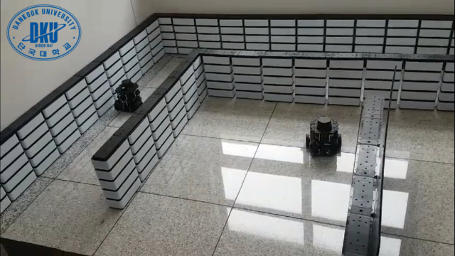
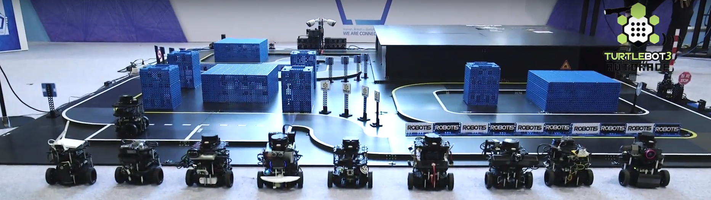

> **출처**: [https://emanual.robotis.com/docs/en/platform/turtlebot3/challenges](https://emanual.robotis.com/docs/en/platform/turtlebot3/challenges)
---

## 1.2 이벤트

### 1.2.1 RDS 온라인 경진대회

#### 1.2.1.1 TurtleBot3를 활용한 온라인 경진대회

ROBOTIS는 [ROS Development Studio (RDS)](http://www.theconstructsim.com/rds-ros-development-studio/)에서 TurtleBot3 AutoRace와 TurtleBot3 및 OpenManipulator를 활용한 Task Mission을 위한 온라인 경진대회를 준비했습니다. 이 온라인 경진대회에 무료로 참여하여 체계적인 실험 환경에서 SLAM, 내비게이션, 자율주행, 매니퓰레이션에 대해 배울 수 있습니다.

- [ROS Development Studio 사용 방법](https://www.youtube.com/playlist?list=PLK0b4e05LnzYGvX6EJN1gOQEl6aa3uyKS)

#### 1.2.1.2 RDS에서의 TurtleBot3 AutoRace

- [TurtleBot3 AutoRace](https://rds.theconstructsim.com/tc_projects/use_project_share_link/21e00583-6e60-415a-aa66-bd2c78e0733a)

자세한 내용이나 원격 PC에서 실행하려면 [자율주행](https://emanual.robotis.com/docs/en/platform/turtlebot3/autonomous_driving/#autonomous-driving) 섹션을 방문하세요.

#### 1.2.1.3 RDS에서의 TurtleBot3와 OpenManipulator를 활용한 Task Mission

- [TurtleBot3와 OpenManipulator를 활용한 Task Mission](https://rds.theconstructsim.com/tc_projects/use_project_share_link/b345dbb4-c806-4822-919e-84b7cf00c8c0)

자세한 내용이나 원격 PC에서 실행하려면 [매니퓰레이션](https://emanual.robotis.com/docs/en/platform/turtlebot3/manipulation/#bringup) 섹션을 방문하세요.

#### 1.2.1.4 ROS Development Studio (RDS)

[ROS Development Studio (RDS)](http://www.theconstructsim.com/rds-ros-development-studio/)는 웹 브라우저만으로 로봇을 프로그래밍하고 테스트할 수 있는 온라인 IDE입니다. RDS를 사용하면 다음과 같은 작업이 가능합니다: 자동 완성을 포함한 이미 설정된 IDE 환경에서 보다 빠르게 로봇용 ROS 프로그램을 개발할 수 있습니다. 제공된 시뮬레이션 로봇에서 실시간으로 프로그램을 테스트할 수 있습니다. 제공된 시뮬레이션을 사용하거나 자신의 시뮬레이션을 업로드할 수 있습니다. 프로그래밍 결과를 신속하게 확인할 수 있습니다. 그래픽 ROS 도구를 사용하여 디버깅할 수 있습니다. RDS에서 개발한 내용을 실제 로봇에서 테스트할 수 있습니다 (로봇이 있는 경우). 이 모든 것을 웹 브라우저만으로, 설치 없이, 운영 체제에 구애받지 않고 사용할 수 있습니다. WINDOWS, LINUX 또는 OSX를 사용하여 ROS를 개발하세요. [The Construct](http://www.theconstructsim.com/)에서 제공하는 TurtleBot3 관련 [강의 및 참고 자료](https://emanual.robotis.com/docs/en/platform/turtlebot3/learn/#the-construct)에 대한 자세한 내용은 다음 링크를 참조하세요.

### 1.2.2 오프라인 경진대회

#### 1.2.2.1 FIRA Malaysia 2018 TurtleBot3 미로 찾기

   * https://youtu.be/5XERzM6ZfJg?si=iYM8Hwcg5P2yVncd

   * https://youtu.be/AamHifhvNMs?si=MHeZjNFvX88mbOnU

- 영상#1 [https://youtu.be/5XERzM6ZfJg](https://youtu.be/5XERzM6ZfJg)
- 영상#2 [https://youtu.be/AamHifhvNMs](https://youtu.be/AamHifhvNMs)
- 영상#3 [https://youtu.be/72SDxhgmnBg](https://youtu.be/72SDxhgmnBg)
- 소스코드 [https://github.com/arixrobotics/fira_maze](https://github.com/arixrobotics/fira_maze)

#### 1.2.2.2 FIRA Malaysia 2018 TurtleBot3 Robosot (사무실 업무 챌린지)

- 자세한 내용은 다음 [페이지](https://www.facebook.com/FiraPoliteknikMalaysia/videos/1409162685896584/)를 참조하세요.

#### 1.2.2.3 GdR TurtleBot Challenge 2018 (TU Darmstadt)

https://youtu.be/OdLsbAMy7m0?si=gtBscBXyjaqX7rSE

- "Monka" vs. "Ninja Turtle" [https://youtu.be/OdLsbAMy7m0](https://youtu.be/OdLsbAMy7m0)
- "Turtle Machine" vs. "TurtleBot 6" [https://youtu.be/L8PHxUR54dM](https://youtu.be/L8PHxUR54dM)
- 더 많은 영상은 다음 [링크](https://www.youtube.com/channel/UCqvqk6E7g4z5idx6yseR6Ug)를 참조하세요.

#### 1.2.2.4 자율주행 모바일 로봇 경진대회 (단국대학교)

### 1.2.3 AutoRace RBIZ 챌린지

#### 1.2.3.1 AutoRace - RBIZ Challenge 2017

- 자세한 내용은 다음 [페이지](https://emanual.robotis.com/docs/en/platform/turtlebot3/autorace_rviz_challenge)를 참조하세요.

#### 1.2.3.2 AutoRace - RBIZ Challenge 2018

- 대회는 11월 15~17일 한국 대구에서 개최됩니다.

#### 1.2.3.3 AutoRace RBIZ Challenge 2017

- TurtleBot3 AutoRace 공식 출시 — AutoRace 소스코드, AutoRace 트랙, AutoRace 심판 시스템
  - [AutoRace 소스코드](http://wiki.ros.org/turtlebot3_autorace)
  - [AutoRace 트랙](https://github.com/ROBOTIS-GIT/autorace_track)
  - [AutoRace 심판 시스템](https://github.com/ROBOTIS-GIT/autorace_referee)

- 참가팀 소스코드

| 순위 | 팀 | 소스코드 링크 |
|:----------:|:----------:|:----------:|
| 1 | RealRiceThief | [Github](https://github.com/KoG-8/Turtlebot_RealRiceThief) |
| 2 | IronHeart | [Github](https://github.com/kijongGil/Ironheart) |
| 3 | Robit | [Github](https://github.com/ROBIT-GIT/turtlebot3_autoRace_2017) |
| 4 | Loading | [Github](https://github.com/AuTURBO/autorace2017-team-loading) |
| 5 | RunHoney | [Github](https://github.com/AuTURBO/autorace2017-team-honey) |
| 6 | Sherlotics | [Github](https://github.com/minbaekkim/turtlebot_autorace) |
| 7 | FastAndFurious | [Github](https://github.com/kts006/deu_racer) |
| 8 | BonoBono | [Github](https://github.com/Gaeul/BonobonoTurtlebot) |
| 9 | BeginAgain | [Github](https://github.com/yh-na/beginagain) |
| 10 | Hanzo | [Github](https://github.com/DeokYun/autorace) |
| 11 | Codis | 공개 예정 |
| 12 | Zero | [Github](https://github.com/dongwan123/zero_turtlebot_competition) |
| 13 | CanDynamix| [Github](https://github.com/candynamix/can_dynamix) |
| 14 | Cena | 기권 |
| 15 | TogetherChaChaCha | 기권 |

#### 1.2.3.4 TurtleBot3 AutoRace 2017 티저

- 공식 티저 #1
   * https://youtu.be/9Wnu8If1eS4?si=7NcEL0F_5SDhsVNh

- 공식 티저 #2
   * https://youtu.be/47YnSBAssOM?si=yI7T1vCR6DW6pQHz

- 공식 최종 영상
   * https://youtu.be/DWDBAHHQi_k?si=F73ab5UEEqw8URfh

#### 1.2.3.5 TurtleBot3 AutoRace 2017 참가팀

- 영상 - Team RealRiceThief (1위)
   * https://youtu.be/szhllE1T_cg?si=S8wpNa9vKVE0eBQd

- TurtleBot3는 MIT DuckieTown의 오픈 소스 엔지니어링을 기반으로 주행 자율성을 테스트했습니다.
   * https://youtu.be/1V33iEu4ylw?si=n1MVRZzwEdAritU4

#### 1.2.3.6 AutoRace RBIZ Challenge 2018

   * https://youtu.be/6t6cyFiGLvs?si=Q5SJVTrkgKixcD7L

| 순위 | 팀 | 소스코드 링크 |
| --- | --- | --- |
| 1 | ROBIT | [Github](https://github.com/developer0hye/2018-Turtlebot3-Autorace-ROBIT) |
| 2 | Au-Di | [Github](https://github.com/taening/AuDi-GIT-turtlebot3_autorace) |
| 3 | ROBIT2 | 공개 예정 |
| 4 | Wang Bam Ppang | [Github](https://github.com/Seunghooon/Turtlebot3_autorace_2018) |
| 5 | Four Leaf Clover | 공개 예정 |
| 6 | AuTURBO | [Github](https://github.com/YeongJunKim/2018-turtlebot3-autorace) |
| 7 | MATLABurger | 공개 예정 |
| 8 | Eung Chang Ho | [Github](https://github.com/engcang/Turtlebot3Autorace_Eungchangho_Team) |
| 9 | ZETIN | 공개 예정 |
| 10 | ROSMASTER | 공개 예정 |
