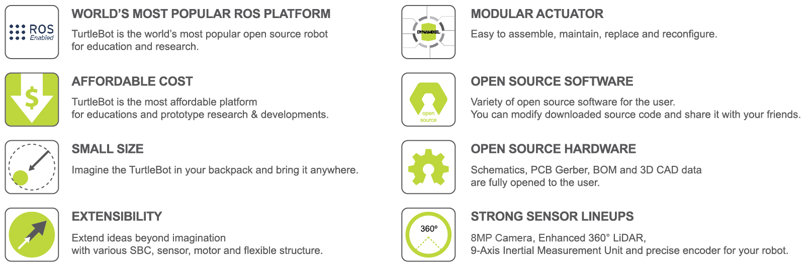
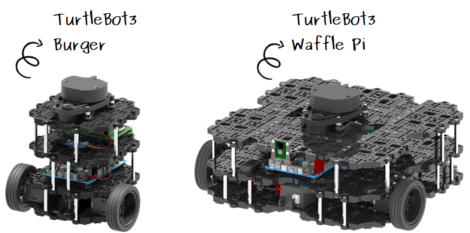
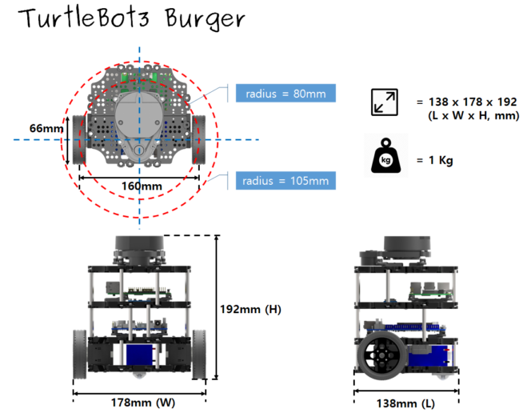
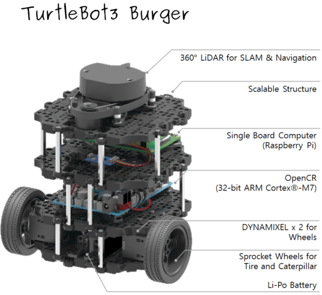

> **출처**: [https://emanual.robotis.com/docs/en/platform/turtlebot3/features](https://emanual.robotis.com/docs/en/platform/turtlebot3/features)

---

# 2. 특징

> **세계에서 가장 인기 있는 ROS 플랫폼**
>    * TurtleBot은 교육 및 연구용으로 가장 인기 있는 오픈 소스 로봇입니다. 특히 TurtleBot3는 교육, 연구, 취미 프로젝트 및 제품 프로토타이핑을 위해 사용되는 소형, 저비용, 완전 맞춤 설정 가능한 ROS 기반 모바일 로봇 플랫폼입니다.
>
> **합리적인 가격**
>    * TurtleBot3는 학교, 연구소 및 기업의 비용 부담을 줄이기 위해 개발되었습니다. TurtleBot3는 360° 레이저 거리 센서 LDS-02를 장착한 가장 저렴한 SLAM 가능 모바일 로봇입니다.
>
> **소형 크기**
>    * TurtleBot3 Burger의 크기는 138mm x 178mm x 192mm (L x W x H)에 불과합니다. 이는 이전 모델 크기의 약 1/4입니다. TurtleBot3를 백팩에 넣어 가지고 다니며 어디서든 시스템을 개발하고 테스트할 수 있다고 상상해보세요.
>
> **ROS 표준**
>    * TurtleBot 브랜드는 ROS를 개발하고 유지 관리하는 Open Robotics에서 관리합니다. 오늘날 ROS는 전 세계 로봇 공학자들에게 표준 플랫폼이 되었습니다. TurtleBot 제품군은 기존 ROS 기반 로봇 구성 요소와 통합될 수 있지만, TurtleBot3는 ROS 학습을 시작하려는 사람들을 위한 저렴한 베이스 플랫폼으로 설계되었습니다.
>
> **확장성**
>    * TurtleBot3는 사용자가 다양한 대안 옵션으로 기계적 구조를 맞춤 설정할 수 있도록 장려합니다: 플랫폼은 오픈 소스 임베디드 보드(모터 제어 보드), 메인 컴퓨팅 장치로서의 단일 보드 컴퓨터, 그리고 2륜 차동 구동 플랫폼에 장착된 라이다 또는 시각 센서로 구성됩니다. 이 외에도 TurtleBot3 플랫폼은 다양한 방식으로 구조적, 기계적으로 맞춤 설정이 가능합니다: 자동차, 자전거, 트레일러 등. 확장 가능한 구조에 다양한 SBC, 센서 및 모터를 사용하여 상상력을 넘어서는 아이디어를 확장하세요.
>
> **모바일 로봇을 위한 모듈식 액추에이터**
>    * TurtleBot3는 바퀴 관절에 2개의 DYNAMIXEL 스마트 서보를 사용하여 정밀한 공간 데이터를 얻을 수 있습니다. DYNAMIXEL XM 시리즈는 6가지 작동 모드(XL 시리즈: 4가지 작동 모드) 중 하나로 작동할 수 있습니다: 바퀴용 속도 제어 모드, 관절용 토크 제어 모드 또는 위치 제어 모드 등. DYNAMIXEL은 가볍지만 속도, 토크 및 위치 제어로 정밀하게 제어할 수 있는 모바일 매니퓰레이터를 만드는 데에도 사용될 수 있습니다. DYNAMIXEL은 TurtleBot3를 다른 경쟁 플랫폼보다 더 유연하게 만들어 조립, 유지보수, 교체 및 재구성을 쉽게 만드는 핵심 구성 요소입니다.
>
> **ROS를 위한 오픈 제어 보드**
>    * 제어 보드는 ROS 통신을 위한 오픈 소스 하드웨어 및 소프트웨어입니다. 오픈 소스 제어 보드 OpenCR1.0은 DYNAMIXEL뿐만 아니라 비용 효율적인 방식으로 기본 인식 작업에 자주 사용되는 ROBOTIS 센서도 제어할 수 있을 만큼 강력합니다. 터치 센서, 적외선 센서, 컬러 센서 등 다양한 센서를 사용할 수 있습니다. OpenCR1.0은 보드 내부에 IMU 센서가 내장되어 수많은 응용 분야에 정밀한 모션 추적을 제공합니다. 이 보드는 3.3V, 5V 및 12V 전원 공급 장치를 갖추고 있어 외부 구성 요소와의 호환성을 극대화합니다.
>
> **강력한 센서 라인업**
>    * TurtleBot3 Burger는 향상된 360° LiDAR, 9축 관성 측정 장치 및 정밀 엔코더를 갖추어 연구 개발을 지원합니다. TurtleBot3 Waffle도 동일한 360° LiDAR를 장착하고 있으며, 추가로 시각 인식을 위한 강력한 Raspberry Pi 카메라를 제공합니다.
>
> **오픈 소스**
>    * TurtleBot3의 하드웨어, 펌웨어 및 소프트웨어는 오픈 소스이므로 사용자는 소스 코드를 자유롭게 다운로드, 수정 및 공유할 수 있습니다. TurtleBot3의 모든 구성 요소는 저비용을 위해 사출 성형 플라스틱으로 제조되지만, 3D CAD 데이터도 3D 프린팅을 위해 제공됩니다.
> 3D CAD 데이터는 클라우드 기반 3D CAD 편집기인 Onshape를 통해 공개됩니다. 사용자는 데스크톱 PC, 노트북 및 휴대용 기기에서 웹 브라우저로 액세스할 수 있습니다. Onshape를 사용하면 3D 모델을 그리고 동료와 함께 조립할 수 있습니다. 또한 OpenCR1.0 보드를 직접 만들거나 수정하려는 사용자를 위해 OpenCR1.0 보드의 모든 세부 정보(회로도, PCB 거버 파일, BOM 및 펌웨어 소스 코드)가 오픈 소스 라이선스 하에 사용자 및 ROS 커뮤니티에 완전히 공개되어 있습니다.

## 2.1 사양

### 2.1.1 하드웨어 사양

| 항목 | Burger | Waffle Pi |
| --- | --- | --- |
| 최대 병진 속도 | 0.22 m/s | 0.26 m/s |
| 최대 회전 속도 | 2.84 rad/s (162.72 deg/s) | 1.82 rad/s (104.27 deg/s) |
| 최대 탑재 하중 | 15kg | 30kg |
| 크기 (L x W x H) | 138mm x 178mm x 192mm | 281mm x 306mm x 141mm |
| 무게 (+ SBC + 배터리 + 센서) | 1kg | 1.8kg |
| 등판 가능 높이 | 10 mm 이하 | 10 mm 이하 |
| 예상 작동 시간 | 2h 30m | 2h |
| 예상 충전 시간 | 2h 30m | 2h 30m |
| SBC (단일 보드 컴퓨터) | Raspberry Pi 4 | Raspberry Pi 4 |
| MCU | 32-bit ARM Cortex®-M7 with FPU (216 MHz, 462 DMIPS) | 32-bit ARM Cortex®-M7 with FPU (216 MHz, 462 DMIPS) |
| 리모컨 | - | RC-100B + BT-410 Set (Bluetooth 4, BLE) |
| 액추에이터 | XL430-W250 | XM430-W210 |
| LDS (레이저 거리 센서) | 360 레이저 거리 센서 [LDS-02](https://emanual.robotis.com/docs/en/platform/turtlebot3/appendix_lds_02/) | 360 레이저 거리 센서 [LDS-02](https://emanual.robotis.com/docs/en/platform/turtlebot3/appendix_lds_02/) |
| 카메라 | - | Raspberry Pi Camera Module v2.1 |
| IMU | 자이로스코프 3축, 가속도계 3축 | 자이로스코프 3축, 가속도계 3축 |
| 전원 커넥터 | 3.3V / 800mA, 5V / 4A, 12V / 1A | 3.3V / 800mA, 5V / 4A, 12V / 1A |
| 확장 핀 | GPIO 18핀, Arduino 32핀 | GPIO 18핀, Arduino 32핀 |
| 주변 장치 연결 | UART x3, CAN x1, SPI x1, I2C x1, ADC x5, 5핀 OLLO x4 | UART x3, CAN x1, SPI x1, I2C x1, ADC x5, 5핀 OLLO x4 |
| DYNAMIXEL 포트 | RS485 x 3, TTL x 3 | RS485 x 3, TTL x 3 |
| 오디오 | 프로그래밍 가능한 여러 비프 시퀀스 | 프로그래밍 가능한 여러 비프 시퀀스 |
| 프로그래밍 가능 LED | 사용자 LED x 4 | 사용자 LED x 4 |
| 상태 LED | 보드 상태 LED x 1, Arduino LED x 1, 전원 LED x 1 | 보드 상태 LED x 1, Arduino LED x 1, 전원 LED x 1 |
| 버튼 및 스위치 | 푸시 버튼 x 2, 리셋 버튼 x 1, DIP 스위치 x 2 | 푸시 버튼 x 2, 리셋 버튼 x 1, DIP 스위치 x 2 |
| 배터리 | 리튬 폴리머 11.1V 1800mAh / 19.98Wh 5C | 리튬 폴리머 11.1V 1800mAh / 19.98Wh 5C |
| PC 연결 | USB | USB |
| 펌웨어 업그레이드 | via USB / via JTAG | via USB / via JTAG |
| 전원 어댑터 (SMPS) | 입력: 100-240V, AC 50/60Hz, 1.5A @max출력: 12V DC, 5A | 입력: 100-240V, AC 50/60Hz, 1.5A @max출력: 12V DC, 5A |

### 2.1.2 치수 및 무게

#### 2.1.2.1 TurtleBot3 Burger 데이터

#### 2.1.2.2 TurtleBot3 Waffle Pi 데이터

## 2.2 구성품

### 2.2.1 부품 목록

TurtleBot3는 `Burger`와 `Waffle Pi` 두 가지 모델로 제공됩니다. 다음 표는 구성품 목록을 보여줍니다. 두 모델의 주요 차이점은 액추에이터, SBC(단일 보드 컴퓨터) 및 센서입니다.

|  | 부품명 | Burger | Waffle Pi |
| --- | --- | --- | --- |
| 섀시 부품 | Waffle Plate | 8 | 24 |
| . | Plate Support M3x35mm | 4 | 12 |
| . | Plate Support M3x45mm | 10 | 10 |
| . | PCB Support | 12 | 12 |
| . | Wheel | 2 | 2 |
| . | Tire | 2 | 2 |
| . | Ball Caster | 1 | 2 |
| . | Camera Bracket | 0 | 1 |
| 모터 | DYNAMIXEL ([XL430-W250-T](https://emanual.robotis.com/docs/en/dxl/x/xl430-w250/)) | 2 | 0 |
| . | DYNAMIXEL ([XM430-W210-T](https://emanual.robotis.com/docs/en/dxl/x/xm430-w210/)) | 0 | 2 |
| 보드 | [OpenCR1.0](https://emanual.robotis.com/docs/en/platform/turtlebot3/appendix_opencr1_0/) | 1 | 1 |
| . | *Raspberry Pi | 1 | 1 |
| . | USB2LDS | 1 | 1 |
| 리모컨 | BT-410 Set (Bluetooth 4, BLE) | 0 | 1 |
| . | RC-100B (리모컨) | 0 | 1 |
| 센서 | **LDS-01 또는 LDS-02 | 1 | 1 |
| . | [Raspberry Pi Camera v2.1](https://www.raspberrypi.org/products/camera-module-v2/) | 0 | 1 |
| 메모리 | MicroSD 카드 | 1 | 1 |
| 케이블 | Raspberry Pi 전원 케이블 | 1 | 1 |
| . | Li-Po 배터리 연장 케이블 | 1 | 1 |
| . | DYNAMIXEL to OpenCR 케이블 | 2 | 2 |
| . | USB 케이블 | 2 | 2 |
| . | 카메라 케이블 | 0 | 1 |
| 전원 | SMPS 12V 5A | 1 | 1 |
| . | AC 코드 | 1 | 1 |
| . | LiPO 배터리 11.1V 1,800mAh | 1 | 1 |
| . | LiPO 배터리 충전기 | 1 | 1 |
| 도구 | 드라이버 | 1 | 1 |
| . | 리벳 도구 | 1 | 1 |
| 기타 | PH_M2x4mm_K | 8 | 8 |
| . | PH_T2x6mm_K | 4 | 8 |
| . | PH_M2x12mm_K | 0 | 4 |
| . | PH_M2.5x8mm_K | 16 | 16 |
| . | PH_M2.5x12mm_K | 0 | 20 |
| . | PH_T2.6x12mm_K | 16 | 0 |
| . | PH_M2.5x16mm_K | 4 | 4 |
| . | PH_M3x8mm_K | 44 | 140 |
| . | NUT_M2 | 0 | 4 |
| . | NUT_M2.5 | 20 | 24 |
| . | NUT_M3 | 16 | 96 |
| . | 리벳_1 | 14 | 22 |
| . | 리벳_2 | 2 | 2 |
| . | 스페이서 | 4 | 4 |
| . | 실리콘 스페이서 | 0 | 4 |
| . | 브라켓 | 5 | 6 |
| . | 어댑터 플레이트 | 1 | 1 |

* [Raspberry Pi 3 Model B+](https://www.raspberrypi.org/products/raspberry-pi-3-model-b-plus/)는 2019년부터 표준으로 포함되었습니다. 초기 모델은 [Raspberry Pi 3 Model B](https://www.raspberrypi.org/products/raspberry-pi-3-model-b/)가 장착되어 있습니다.
* [Raspberry Pi 4 Model B](https://www.raspberrypi.org/products/raspberry-pi-4-model-b/)는 2021년 9월부터 표준으로 포함되었습니다.
* [LDS-02](https://emanual.robotis.com/docs/en/platform/turtlebot3/appendix_lds_02/)는 2022년부터 이전 세대인 [LDS-01](https://emanual.robotis.com/docs/en/platform/turtlebot3/appendix_lds_01/)을 대체했습니다.

TurtleBot3 Waffle은 [Intel® Joule™ 570x](http://ark.intel.com/products/96414/Intel-Joule-570x-Developer-Kit) SBC의 단종(EOL)으로 인해 생산이 중단되었습니다.

### 2.2.2 오픈 소스 하드웨어

전체 CAD 데이터는 클라우드 기반 3D CAD 편집기인 Onshape에서 제공되며, PC 또는 휴대용 기기에서 웹 브라우저를 통해 액세스할 수 있습니다.

- [TurtleBot3 Burger 3D 모델](http://www.robotis.com/service/download.php?no=676)
- [TurtleBot3 Waffle 3D 모델](http://www.robotis.com/service/download.php?no=677)
- [TurtleBot3 Waffle Pi 3D 모델](http://www.robotis.com/service/download.php?no=678)
