> **출처**: [https://emanual.robotis.com/docs/en/platform/turtlebot3/sbc_setup](https://emanual.robotis.com/docs/en/platform/turtlebot3/sbc_setup)

---

# TOC

1. [Humble](#humble)
2. [Jazzy](#jazzy)
3. [Noetic](#noetic)

---

# Humble

## 3.2 SBC 설정

> **경고**
> - 이 과정은 시간이 오래 걸릴 수 있습니다. 배터리 전원으로 설정을 완료하지 말고, SBC를 벽면 전원 공급 장치에 연결하세요.
> - **이 설정을 완료하려면 HDMI 모니터와 키보드, 마우스 같은 입력 장치가 필요합니다.**
> - webOS Robotics Platform을 사용하려면 [webOS Robotics Platform](https://github.com/ros/meta-ros/wiki/OpenEmbedded-Build-Instructions)에서 추가 안내를 참조하세요. 패키지는 고성능 PC에서 OpenEmbedded를 사용하여 크로스 컴파일되고, SBC에 설치할 이미지 파일이 생성됩니다.


### 3.2.1 microSD 카드와 리더기 준비
* PC에 microSD 슬롯이 없다면 microSD 카드 리더기를 사용하여 복구 이미지를 굽습니다. 

> microSD 카드 리더기는 TurtleBot3 패키지에 포함되어 있지 않습니다.

### 3.2.2 Raspberry Pi Imager 설치

* Raspberry Pi에 Ubuntu Server 22.04를 설치하려면 `Raspberry Pi Imager`를 다운로드하세요.
* Raspberry Pi Imager가 이미 설치되어 있다면 최신 버전으로 업데이트하세요.
* Raspberry Pi Imager에 대한 자세한 내용은 [이 문서](https://www.raspberrypi.org/blog/raspberry-pi-imager-imaging-utility/)를 참조하세요.

[Raspberry Pi Imager 다운로드 (raspberrypi.org)](https://www.raspberrypi.org/software/)

**Raspberry Pi Imager 설치 방법**

`deb` 또는 `apt` rpi-imager 릴리스를 설치하세요.

1. `deb`
   * deb 파일 다운로드 <br>
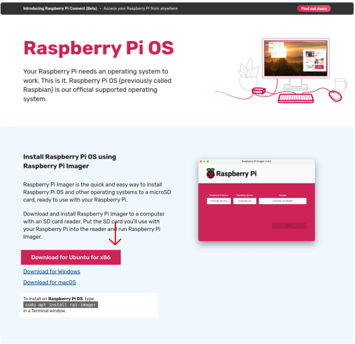 <br>

```
$ cd Downloads
$ sudo dpkg -i imager_[your_version]_amd64.deb  # 다운로드한 파일 이름 확인
```

* 의존성 오류가 발생하면 다음 명령어로 강제 설치하세요.

```
$ sudo apt-get install -f
$ rpi-imager
```

2. `apt`

```
$ sudo apt install rpi-imager
$ rpi-imager
```

### 3.2.3 Ubuntu 22.04 설치

   1. Raspberry Pi Imager 실행
   2. `CHOOSE OS` 클릭
   3. `Other general-purpose OS` 선택
   4. `Ubuntu` 선택
   5. RPi 3/4/400을 지원하는 `Ubuntu Server 22.04.5 LTS (64-bit)` 선택 (데스크탑 OS가 아닌 Server OS 선택)  <br>
   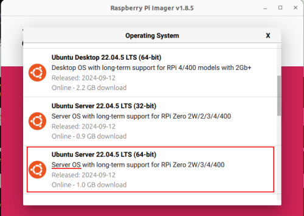
   6. `CHOOSE STORAGE` 클릭 후 micro SD 카드 선택
   7. `Next` 클릭하여 Ubuntu 설치
   8. WiFi 및 SSH 설정을 위해 `Edit Setting` 클릭 <br>
   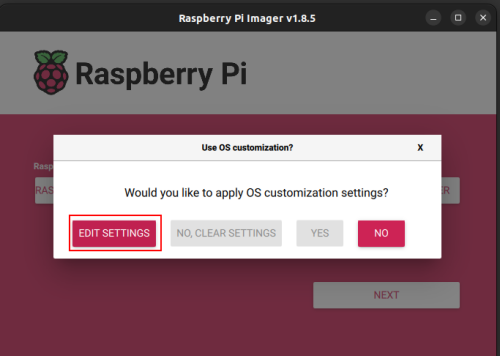
   9. `username and password`, `Configure wireless LAN`, `Wireless LAN country` 설정. 그리고 SERVICES 탭에서 `Enable SSH`를 `Use password authentication`으로 활성화 <br>
   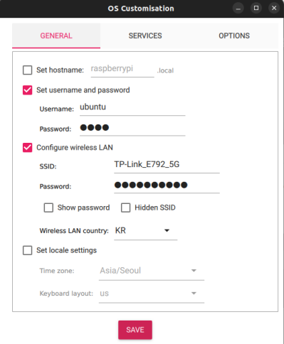
   10. 이 설정 과정을 완료하면 아래 Wi-Fi 설정 단계(4단계까지)를 건너뛸 수 있습니다.


### 3.2.4 Raspberry Pi 설정

> HDMI 케이블은 Raspberry Pi 전원을 켜기 전에 연결해야 합니다. 그렇지 않으면 Raspberry Pi의 HDMI 포트가 비활성화됩니다.

1. Raspberry Pi 부팅
   * HDMI, 전원 및 입력 장치 연결 위치에 대한 자세한 내용은 [여기](https://www.raspberrypi.com/documentation/computers/getting-started.html)를 참조하세요.
   * a. HDMI 케이블을 Raspberry Pi의 HDMI 포트에 연결합니다.
   * b. 입력 장치(일반적으로 키보드)를 Raspberry Pi의 USB 포트에 연결합니다.
   * c. microSD 카드를 Raspberry Pi에 삽입합니다.
   * d. 전원(USB 또는 OpenCR)을 연결하여 Raspberry Pi를 켭니다.
   * e. ID `ubuntu`, 비밀번호 `ubuntu`로 로그인합니다. 로그인하면 비밀번호 변경을 요청받습니다.

    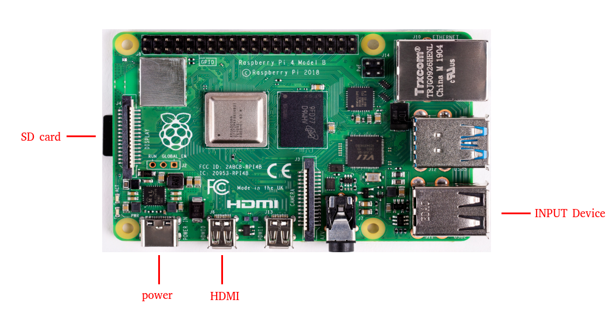

2. 아래 명령어로 네트워크 설정 파일을 엽니다.  
**[TurtleBot3 SBC]**
```
$ sudo nano /etc/netplan/50-cloud-init.yaml
```

3. 'WIFI_SSID'와 `WIFI_PASSWORD`를 실제 WiFi SSID와 비밀번호로 바꾸고 아래 이미지와 일치하도록 내용을 편집합니다.
4. `Ctrl+S`로 저장하고 `Ctrl+X`로 종료합니다.
5. 아래 명령어로 자동 업데이트 설정 파일을 편집합니다.  
**[TurtleBot3 SBC]**
```
$ sudo nano /etc/apt/apt.conf.d/20auto-upgrades
```

6. 업데이트 설정을 아래와 같이 변경합니다.  
**[TurtleBot3 SBC]**
```
APT::Periodic::Update-Package-Lists "0";
APT::Periodic::Unattended-Upgrade "0";
```

7. `Ctrl+S`로 저장하고 `Ctrl+X`로 종료합니다.
8. 부팅 시 네트워크가 없어도 부팅 지연이 발생하지 않도록 `systemd`를 설정합니다. 다음 명령어로 `systemd` 프로세스를 마스킹합니다.  
**[TurtleBot3 SBC]**
```
$ systemctl mask systemd-networkd-wait-online.service
```

9. 절전 및 최대 절전 모드 비활성화  
**[TurtleBot3 SBC]**
```
$ sudo systemctl mask sleep.target suspend.target hibernate.target hybrid-sleep.target
```

10. Raspberry Pi 재부팅  
**[TurtleBot3 SBC]**
```
$ sudo reboot
```

11. Raspberry Pi 재부팅 후 Remote PC에서 SSH로 작업하려면 Remote PC 터미널에서 아래 명령어를 사용하세요. `1단계`에서 설정한 비밀번호를 사용해야 합니다.  
**[Remote PC]**
```
$ ssh ubuntu@{Raspberry Pi의 IP 주소}
```

**SSH를 통한 연결 방법**

1. SSH 설정 파일 편집
**[TurtleBot3 SBC]**
```
$ sudo nano /etc/ssh/sshd_config.d/50-cloud-init.conf
```

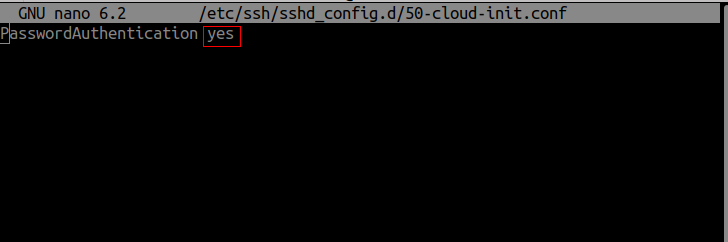

2. net-tools 설치 및 IP 확인
**[TurtleBot3 SBC]**
```
$ reboot
$ sudo apt update
$ sudo apt install net-tools
$ ifconfig
```
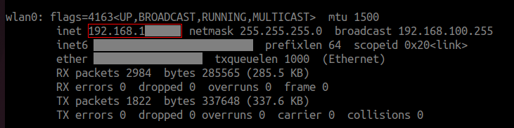

3. Remote PC에서 아래 명령어를 입력하고 Ubuntu 시스템의 비밀번호를 사용하세요.
**[Remote PC]**
```
$ ssh ubuntu@{Raspberry Pi의 IP 주소}
```

### 3.2.5 Raspberry Pi에 패키지 설치

* TurtleBot3 2GB를 사용하는 경우 패키지 빌드를 위해 스왑 메모리를 생성해야 합니다. 그렇지 않으면 메모리가 부족하여 패키지 빌드가 실패할 수 있습니다.

* 2GB 스왑 메모리 생성 **[TurtleBot3 SBC]**
```
$ sudo fallocate -l 2G /swapfile
$ sudo chmod 600 /swapfile
$ sudo mkswap /swapfile
$ sudo swapon /swapfile
```

* 다음 명령어는 시스템 재부팅 시 스왑 파일이 자동으로 활성화되도록 합니다.
```
$ echo '/swapfile none swap sw 0 0' | sudo tee -a /etc/fstab
```

* 스왑 메모리 확인
```
$ free -h
```

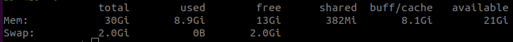

* 1. ROS2 Humble Hawksbill 설치 <br>
**[TurtleBot3 SBC]** <br>
  [공식 ROS2 Humble 설치 가이드](https://docs.ros.org/en/humble/Installation/Ubuntu-Install-Debians.html)의 지침을 따르세요. ROS-Base(Bare Bones) 설치를 권장합니다.

* 2. ROS 패키지 설치 및 빌드  <br>
  `turtlebot3` 패키지 빌드는 1시간 이상 걸릴 수 있습니다. 벽면 전원 공급 장치를 사용하여 시스템에 항상 전원이 공급되도록 하세요.  
**[TurtleBot3 SBC]**  <br>
```
$ sudo apt install python3-argcomplete python3-colcon-common-extensions libboost-system-dev build-essential
$ sudo apt install ros-humble-hls-lfcd-lds-driver
$ sudo apt install ros-humble-turtlebot3-msgs
$ sudo apt install ros-humble-dynamixel-sdk
$ sudo apt install ros-humble-xacro
$ sudo apt install libudev-dev
$ mkdir -p ~/turtlebot3_ws/src && cd ~/turtlebot3_ws/src
$ git clone -b humble https://github.com/ROBOTIS-GIT/turtlebot3.git
$ git clone -b humble https://github.com/ROBOTIS-GIT/ld08_driver.git
$ git clone -b humble https://github.com/ROBOTIS-GIT/coin_d4_driver
$ cd ~/turtlebot3_ws/src/turtlebot3
$ rm -r turtlebot3_cartographer turtlebot3_navigation2
$ cd ~/turtlebot3_ws/
$ echo 'source /opt/ros/humble/setup.bash' >> ~/.bashrc
$ source ~/.bashrc
$ colcon build --symlink-install --parallel-workers 1
$ echo 'source ~/turtlebot3_ws/install/setup.bash' >> ~/.bashrc
$ source ~/.bashrc
```

3. OpenCR USB 포트 설정  
**[TurtleBot3 SBC]**  <br>
```
$ sudo cp `ros2 pkg prefix turtlebot3_bringup`/share/turtlebot3_bringup/script/99-turtlebot3-cdc.rules /etc/udev/rules.d/
$ sudo udevadm control --reload-rules
$ sudo udevadm trigger
```

4. ROS Domain ID 설정 ROS2 DDS 통신에서 동일한 네트워크 환경의 통신을 위해 **Remote PC**와 **TurtleBot3**의 `ROS_DOMAIN_ID`가 일치해야 합니다. 다음 명령어는 TurtleBot3 SBC에 `ROS_DOMAIN_ID`를 할당하는 방법을 보여줍니다.
   * TurtleBot3의 기본 ID는 `30`입니다.
   * Remote PC와 TurtleBot3 SBC의 `ROS_DOMAIN_ID`를 `30`으로 설정하는 것을 권장합니다.
**[TurtleBot3 SBC]** <br>
```
$ echo 'export ROS_DOMAIN_ID=30 #TURTLEBOT3' >> ~/.bashrc
$ source ~/.bashrc
```

> **경고**: 동일한 네트워크에서 다른 사용자와 동일한 ROS_DOMAIN_ID를 사용하지 마세요. 동일한 네트워크 환경에서 사용자 간 통신 충돌이 발생합니다.


### 3.2.6 LDS 설정

| LDS-01 | LDS-02 | LDS-03 |
| --- | --- | --- |
| 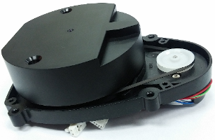 |  |  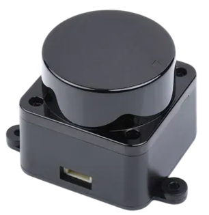 |

* LDS 모델에 따라 적절한 모델(LDS-01, LDS-02, 또는 LDS-03)을 사용하세요.  
**[TurtleBot3 SBC]**
```
$ echo 'export LDS_MODEL=LDS-01' >> ~/.bashrc  # LDS-01 사용 시
$ echo 'export LDS_MODEL=LDS-02' >> ~/.bashrc  # LDS-02 사용 시
$ echo 'export LDS_MODEL=LDS-03' >> ~/.bashrc  # LDS-03 사용 시
```

* 아래 명령어로 변경사항을 적용하세요.  
**[TurtleBot3 SBC]**
```
$ source ~/.bashrc
```

### 3.2.7 Raspberry Pi Camera

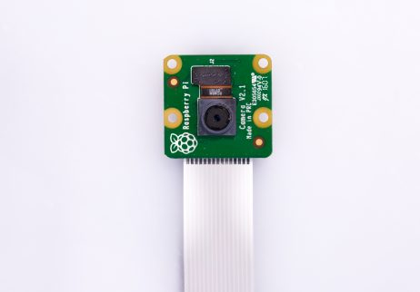

* Raspberry Pi에서 Ubuntu 22.04를 실행하는 TurtleBot3와 함께 RPi 카메라를 사용하는 방법을 소개합니다. RPi 카메라의 출력을 토픽으로 발행하는 방법은 여러 가지가 있습니다. 한 가지 방법은 `camera-ros` 패키지를 사용하는 것이고, 다른 방법은 `v4l2-camera` 패키지를 사용하는 것입니다.

**방법 1. camera-ros 패키지 사용**

* 이 방법은 libcamera 스택을 사용하는 Raspberry Pi 카메라에 적합합니다. 고품질 이미징과 [카메라 설정](https://docs.ros.org/en/ros2_packages/humble/api/camera_ros/)에 대한 세밀한 제어가 필요한 프로젝트에 이상적입니다.
* camera_ros에 대한 자세한 내용은 camera_ros 웹사이트를 참조하세요.

1. 필요한 도구 설치
**[TurtleBot3 SBC]**
```
$ sudo apt update
$ sudo apt install -y python3-pip git python3-jinja2 \
libboost-dev libgnutls28-dev openssl libtiff-dev pybind11-dev \
qtbase5-dev libqt5core5a libqt5widgets5 meson cmake \
python3-yaml python3-ply \
libglib2.0-dev libgstreamer-plugins-base1.0-dev
$ sudo apt install ros-humble-camera-ros
```
* `python3-colcon-meson` : colcon이 libcamera 같은 Meson 기반 패키지를 빌드할 수 있게 함
* `python3-ply` : libcamera의 코드 생성 도구에 필요
* `ros-humble-camera-ros`: libcamera를 사용하는 camera_ros 노드 설치

2. libcamera 소스 클론
이 단계는 Raspberry Pi 카메라 모듈에 대한 완전한 호환성과 최적화된 지원을 제공하는 공식 Raspberry Pi 포크의 libcamera를 클론합니다.
**[TurtleBot3 SBC]**
```
$ git clone -b v0.5.2 https://github.com/raspberrypi/libcamera.git
```

3. libcamera 빌드 및 설치
libcamera를 /usr/local에 설치하여 시스템 전체에서 사용할 수 있도록 합니다.
**[TurtleBot3 SBC]**
```
$ cd libcamera
$ meson setup build --buildtype=release -Dpipelines=rpi/vc4,rpi/pisp -Dipas=rpi/vc4,rpi/pisp -Dv4l2=true -Dgstreamer=enabled -Dtest=false -Dlc-compliance=disabled -Dcam=disabled -Dqcam=disabled -Ddocumentation=disabled -Dpycamera=enabled
$ ninja -C build -j 1
$ sudo ninja -C build install -j 1
$ sudo ldconfig
```
설치 후, 빌드된 libcamera의 설치 경로를 LD_LIBRARY_PATH에 추가하여 사용되도록 합니다.
```
$ export LD_LIBRARY_PATH=/usr/local/lib/aarch64-linux-gnu:$LD_LIBRARY_PATH
```

4. 카메라 노드 실행
제공된 실행 파일을 사용하여 카메라 노드를 실행할 수 있습니다.
**[TurtleBot3 SBC]**
```
$ ros2 launch turtlebot3_bringup camera.launch.py
```

5. 카메라 입력 확인
rqt_image_view(GUI 도구)를 사용하여 카메라 노드가 이미지 데이터를 올바르게 발행하는지 확인할 수 있습니다.
**[Remote PC]**
```
$ rqt_image_view
```

**방법 2. v4l2-camera 패키지 사용**

* 이 방법은 USB 카메라 및 레거시 Raspberry Pi 카메라 설정에 더 적합합니다. V4L2(Video4Linux2) 프레임워크를 기반으로 하여 설정이 더 간단하고 더 넓은 범위의 장치와 호환됩니다. v4l2_camera에 대한 자세한 내용은 v4l2_camera 웹사이트를 참조하세요.

* 참고: 다음 지침은 Ubuntu 22.04를 실행하는 Raspberry Pi 장치 전용입니다.

1. ros-humble-v4l2-camera, raspi-config, ros-humble-image-transport-plugins, v4l-utils 설치
**[TurtleBot3 SBC]**
```
$ sudo apt-get install ros-humble-v4l2-camera raspi-config ros-humble-image-transport-plugins v4l-utils
```
* `ros-humble-v4l2-camera` : 카메라 출력을 토픽으로 발행하는 패키지
* `raspi-config` : Raspberry Pi에서 카메라 장치 연결을 설정하는 도구
* `ros-humble-image-transport-plugins` : image_raw를 압축 이미지로 변환하여 원활한 전송 지원
* `v4l-utils` : 연결을 지원하는 유틸리티

2. raspi-config 실행
`v4l2-camera` 패키지는 레거시 드라이버를 사용합니다. 따라서 레거시 드라이버 사용을 설정해야 합니다. 이 단계가 완료되면 camera-ros 패키지의 카메라 노드가 더 이상 카메라를 감지할 수 없습니다. 이 단계 후에 camera-ros 패키지를 사용하려면 레거시 드라이버를 다시 비활성화해야 합니다.
**[TurtleBot3 SBC]**
```
$ sudo raspi-config
```
`Interface Options`를 선택하세요.

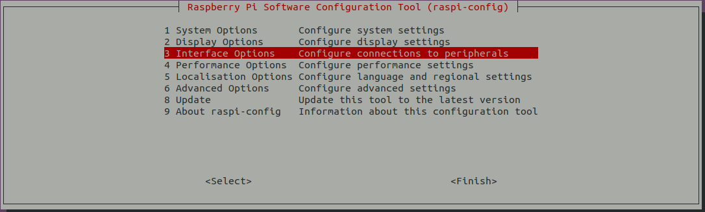

`I1`을 선택하고 레거시 카메라 지원을 활성화합니다. 이렇게 하면 레거시 드라이버인 bcm2835 MMAL을 사용할 수 있습니다.

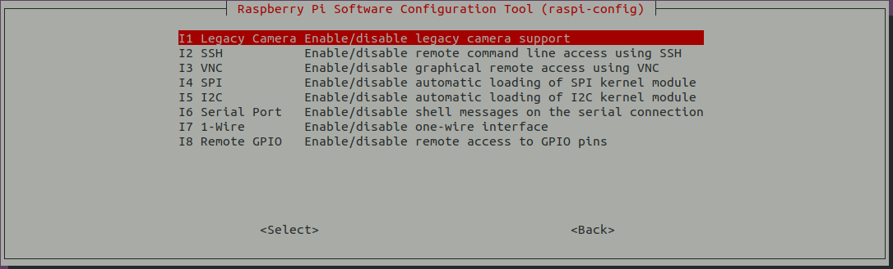

3. 레거시 카메라 스택 활성화
설정 파일 `/boot/firmware/config.txt`를 엽니다.
**[TurtleBot3 SBC]**
```
$ sudo nano /boot/firmware/config.txt
```

4. 다음 줄을 수정하거나 추가합니다
```
  # libcamera 자동 감지 비활성화
  camera_auto_detect=0
  # bcm2835-v4l2용 레거시 카메라 스택 활성화
  start_x=1
```

이 단계 후에 camera-ros 패키지를 사용하려면 설정 파일에서 camera_auto_detect=0, start_x=1, dtoverlay=imx219 줄을 제거하거나 주석 처리해야 합니다.

5. 시스템 재부팅
**[TurtleBot3 SBC]**
```
$ sudo reboot
```

6. 다음 명령어로 카메라 이름을 확인할 수 있습니다.
**[TurtleBot3 SBC]**
```
$ v4l2-ctl --list-devices
```

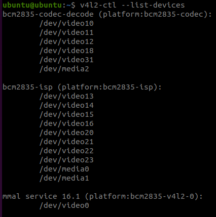

이 경우 카메라 이름은 mmal_service_16.1입니다.


7. v4l2_camera_node 실행
**[TurtleBot3 SBC]**
```
$ ros2 run v4l2_camera v4l2_camera_node
```

8. 카메라 입력 확인
rqt_image_view(GUI 도구)를 사용하여 카메라 노드가 이미지 데이터를 올바르게 발행하는지 확인할 수 있습니다.
**[Remote PC]**

```
$ rqt_image_view
```

> **참고** 카메라 데이터 전송 속도를 최적화하려면 다음 방법을 시도해 보세요.
> - /camera/image_raw/compressed 사용네트워크가 느리거나 대역폭이 제한된 경우 /camera/image_raw 토픽을 직접 구독하면 상당한 지연이 발생할 수 있습니다. rqt_image_view에서 /camera/image_raw/compressed를 선택할 수 있습니다.
> - 해상도 조정높은 해상도는 더 많은 대역폭을 필요로 하여 지연을 유발할 수 있습니다. 해상도를 낮추면 지연을 줄이고 성능을 향상시킬 수 있습니다. 권장 해상도는 320x240으로, 이미지 품질과 전송 속도 사이의 좋은 균형을 제공하며 명령어를 통해 조정할 수 있습니다.

> 자세한 내용 하드웨어 기능 및 소프트웨어 기능에 대한 포괄적인 가이드는 13.More Info - 13.1.Appendixes - Raspberry Pi Camera를 확인하세요.

> 카메라 캘리브레이션 카메라 캘리브레이션과 같은 고급 비전 기능을 사용하려면 여기에서 자세한 지침을 찾을 수 있습니다.

> 문제 해결 "Unable to open camera calibration file" 오류 메시지가 나타나면 여기에서 해결 방법을 확인하세요.

더 유용한 정보는 아래 Ubuntu 블로그 게시물을 참조하세요.

- [Improving Security with Ubuntu](https://ubuntu.com/blog/steps-to-maximise-robotics-security-with-ubuntu)
- [Improving User Experience of TurtleBot3 Waffle Pi](https://ubuntu.com/blog/building-a-better-turtlebot3)
- [How to set up TurtleBot3 Waffle Pi in minutes with Snaps](https://ubuntu.com/blog/how-to-set-up-turtlebot3-in-minutes-with-snaps)

**이것으로 SBC 설정이 완료되었습니다!** 다음 단계: [OpenCR 설정](https://emanual.robotis.com/docs/en/platform/turtlebot3/opencr_setup/#opencr-setup)

---
[TOC](#toc)

# Jazzy

## 3.2 SBC 설정

> **경고**
> - 이 과정은 시간이 오래 걸릴 수 있습니다. 배터리 전원으로 설정을 완료하지 말고, SBC를 벽면 전원 공급 장치에 연결하세요.
> - **이 설정을 완료하려면 HDMI 모니터와 키보드, 마우스 같은 입력 장치가 필요합니다.**
> - webOS Robotics Platform을 사용하려면 [webOS Robotics Platform](https://github.com/ros/meta-ros/wiki/OpenEmbedded-Build-Instructions)에서 추가 안내를 참조하세요. 패키지는 고성능 PC에서 OpenEmbedded를 사용하여 크로스 컴파일되고, SBC에 설치할 이미지 파일이 생성됩니다.

### 3.2.1 microSD 카드와 리더기 준비
* PC에 microSD 슬롯이 없다면 microSD 카드 리더기를 사용하여 복구 이미지를 굽습니다. <br>

  

> microSD 카드 리더기는 TurtleBot3 패키지에 포함되어 있지 않습니다.


### 3.2.2 Raspberry Pi Imager 설치

Raspberry Pi에 Ubuntu Server 24.04를 설치하려면 `Raspberry Pi Imager`를 다운로드하세요. Raspberry Pi Imager가 이미 설치되어 있다면 최신 버전으로 업데이트하세요. Raspberry Pi Imager에 대한 자세한 내용은 [이 문서](https://www.raspberrypi.org/blog/raspberry-pi-imager-imaging-utility/)를 참조하세요.

> [Raspberry Pi Imager 다운로드 (raspberrypi.org)](https://www.raspberrypi.org/software/)

 Raspberry Pi Imager 설치 방법에 대한 자세한 내용을 보려면 여기를 클릭하세요.

deb 또는 apt rpi-imager 릴리스를 설치하세요.

1. `deb`
deb 파일 다운로드 <br>


```
$ cd Downloads
$ sudo dpkg -i imager_[your_version]_amd64.deb  # 다운로드한 파일 이름 확인
```

* 의존성 오류가 발생하면 다음 명령어로 강제 설치하세요.

```
$ sudo apt-get install -f
$ rpi-imager
```

2. `apt`

```
$ sudo apt install rpi-imager
$ rpi-imager
```


### 3.2.3 Ubuntu 24.04 설치

1. Raspberry Pi Imager 실행
2. `CHOOSE OS` 클릭
3. `Other general-purpose OS` 선택
4. `Ubuntu` 선택
5. RPi 3/4/400을 지원하는 `Ubuntu Server 24.04.2 LTS (64-bit)` 선택 (데스크탑 OS가 아닌 Server OS 선택) <br>
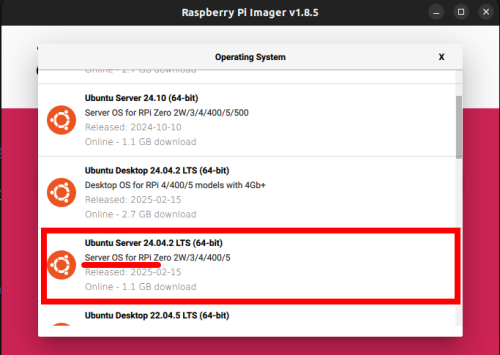
6. `CHOOSE STORAGE` 클릭 후 micro SD 카드 선택
7. `Next` 클릭하여 Ubuntu 설치
8. WiFi 및 SSH 설정을 위해 `Edit Setting` 클릭  <br>

9. `username and password`, `Configure wireless LAN`, `Wireless LAN country` 설정. 그리고 SERVICES 탭에서 `Enable SSH`를 `Use password authentication`으로 활성화  <br>
 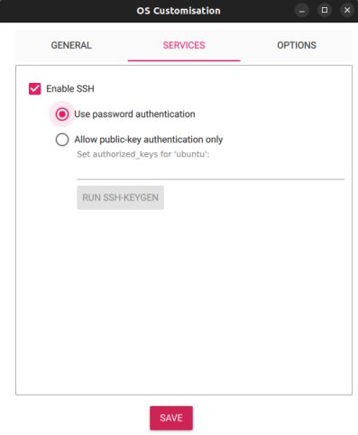
10. 이 설정 과정을 완료하면 아래 Wi-Fi 설정 단계(4단계까지)를 건너뛸 수 있습니다.


### 3.2.4 Raspberry Pi 설정

> HDMI 케이블은 Raspberry Pi 전원을 켜기 전에 연결해야 합니다. 그렇지 않으면 Raspberry Pi의 HDMI 포트가 비활성화됩니다.

1. Raspberry Pi 부팅
  * [HDMI, 전원 및 입력 장치 연결 위치에 대한 자세한 내용은 여기를 참조하세요](https://www.raspberrypi.com/documentation/computers/getting-started.html)
     * a. HDMI 케이블을 Raspberry Pi의 HDMI 포트에 연결합니다.
     * b. 입력 장치(일반적으로 키보드)를 Raspberry Pi의 USB 포트에 연결합니다.
     * c. microSD 카드를 Raspberry Pi에 삽입합니다.
     * d. 전원(USB 또는 OpenCR)을 연결하여 Raspberry Pi를 켭니다.
     * e. ID `ubuntu`, 비밀번호 `ubuntu`로 로그인합니다. 로그인하면 비밀번호 변경을 요청받습니다.


2. 아래 명령어로 네트워크 설정 파일을 엽니다.  
**[TurtleBot3 SBC]**
```
$ sudo nano /etc/netplan/50-cloud-init.yaml
```

3. `WIFI_SSID`와 `WIFI_PASSWORD`를 실제 WiFi SSID와 비밀번호로 바꾸고 아래 이미지와 일치하도록 내용을 편집합니다.
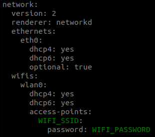

4. `Ctrl+S`로 저장하고 `Ctrl+X`로 종료합니다.

5. 아래 명령어로 자동 업데이트 설정 파일을 편집합니다.  
**[TurtleBot3 SBC]**
```
$ sudo nano /etc/apt/apt.conf.d/20auto-upgrades
```

6. 업데이트 설정을 아래와 같이 변경합니다.  
**[TurtleBot3 SBC]**
```
APT::Periodic::Update-Package-Lists "0";
APT::Periodic::Unattended-Upgrade "0";
```

7. `Ctrl+S`로 저장하고 `Ctrl+X`로 종료합니다.

8. 부팅 시 네트워크가 없어도 부팅 지연이 발생하지 않도록 `systemd`를 설정합니다. 다음 명령어로 `systemd` 프로세스를 마스킹합니다.  
**[TurtleBot3 SBC]**
```
$ systemctl mask systemd-networkd-wait-online.service
```

9. 절전 및 최대 절전 모드 비활성화  
**[TurtleBot3 SBC]**
```
$ sudo systemctl mask sleep.target suspend.target hibernate.target hybrid-sleep.target
```

10. Raspberry Pi 재부팅  
**[TurtleBot3 SBC]**
```
$ sudo reboot
```

11. Raspberry Pi 재부팅 후 Remote PC에서 SSH로 작업하려면 Remote PC 터미널에서 아래 명령어를 사용하세요. `1단계`에서 설정한 비밀번호를 사용해야 합니다.  
**[Remote PC]**
```
$ ssh ubuntu@{Raspberry Pi의 IP 주소}
```

 **SSH를 통한 연결 방법**

1. SSH 설정 파일 편집
**[TurtleBot3 SBC]**
```
$ sudo nano /etc/ssh/sshd_config.d/50-cloud-init.conf
```


net-tools 설치 및 IP 확인
**[TurtleBot3 SBC]**
```
$ reboot
$ sudo apt update
$ sudo apt install net-tools
$ ifconfig
```


Remote PC에서 아래 명령어를 입력하고 Ubuntu 시스템의 비밀번호를 사용하세요.
**[Remote PC]**
```
$ ssh ubuntu@{Raspberry Pi의 IP 주소}
```

## 3.3 Raspberry Pi에 패키지 설치

* TurtleBot3 2GB를 사용하는 경우 패키지 빌드를 위해 스왑 메모리를 생성해야 합니다. 그렇지 않으면 메모리가 부족하여 패키지 빌드가 실패할 수 있습니다.

* 2GB 스왑 메모리 생성 **[TurtleBot3 SBC]**
```
$ sudo fallocate -l 2G /swapfile
$ sudo chmod 600 /swapfile
$ sudo mkswap /swapfile
$ sudo swapon /swapfile
```

* 다음 명령어는 시스템 재부팅 시 스왑 파일이 자동으로 활성화되도록 합니다.
```
$ echo '/swapfile none swap sw 0 0' | sudo tee -a /etc/fstab
```

* 스왑 메모리 확인
```
$ free -h
```


1. ROS 2 Jazzy Jalisco 설치
**[TurtleBot3 SBC]**
[공식 ROS 2 Jazzy 설치 가이드](https://docs.ros.org/en/jazzy/Installation/Ubuntu-Install-Debians.html)의 지침을 따르세요. ROS-Base(Bare Bones) 설치를 권장합니다.

2. ROS 패키지 설치 및 빌드. `turtlebot3` 패키지 빌드는 1시간 이상 걸릴 수 있습니다. 벽면 전원 공급 장치를 사용하여 시스템에 항상 전원이 공급되도록 하세요.  
**[TurtleBot3 SBC]**
```
$ sudo apt install python3-argcomplete python3-colcon-common-extensions libboost-system-dev build-essential
$ sudo apt install ros-jazzy-hls-lfcd-lds-driver
$ sudo apt install ros-jazzy-turtlebot3-msgs
$ sudo apt install ros-jazzy-dynamixel-sdk
$ sudo apt install ros-jazzy-xacro
$ sudo apt install libudev-dev
$ mkdir -p ~/turtlebot3_ws/src && cd ~/turtlebot3_ws/src
$ git clone -b jazzy https://github.com/ROBOTIS-GIT/turtlebot3.git
$ git clone -b jazzy https://github.com/ROBOTIS-GIT/ld08_driver.git
$ git clone -b jazzy https://github.com/ROBOTIS-GIT/coin_d4_driver
$ cd ~/turtlebot3_ws/src/turtlebot3
$ rm -r turtlebot3_cartographer turtlebot3_navigation2
$ cd ~/turtlebot3_ws/
$ echo 'source /opt/ros/jazzy/setup.bash' >> ~/.bashrc
$ source ~/.bashrc
$ colcon build --symlink-install --parallel-workers 1
$ echo 'source ~/turtlebot3_ws/install/setup.bash' >> ~/.bashrc
$ source ~/.bashrc
```

3. OpenCR USB 포트 설정  
**[TurtleBot3 SBC]**
```
$ sudo cp `ros2 pkg prefix turtlebot3_bringup`/share/turtlebot3_bringup/script/99-turtlebot3-cdc.rules /etc/udev/rules.d/; sudo udevadm control --reload-rules; sudo udevadm trigger
```

5. ROS Domain ID 설정 ROS 2 DDS 통신에서 동일한 네트워크 환경의 통신을 위해 **Remote PC**와 **TurtleBot3**의 `ROS_DOMAIN_ID`가 일치해야 합니다. 다음 명령어는 TurtleBot3 SBC에 `ROS_DOMAIN_ID`를 할당하는 방법을 보여줍니다.
   * TurtleBot3의 기본 ID는 `30`입니다.
   * Remote PC와 TurtleBot3 SBC의 `ROS_DOMAIN_ID`를 `30`으로 설정하는 것을 권장합니다.
   **[TurtleBot3 SBC]**
```
$ echo 'export ROS_DOMAIN_ID=30 #TURTLEBOT3' >> ~/.bashrc
$ source ~/.bashrc
```

> **경고**: 동일한 네트워크에서 다른 사용자와 동일한 ROS_DOMAIN_ID를 사용하지 마세요. 동일한 네트워크 환경에서 사용자 간 통신 충돌이 발생합니다.


### LDS 설정

| LDS-01 | LDS-02 | LDS-03 |
| --- | --- | --- |
|  |  |   |

LDS 모델에 따라 적절한 모델(LDS-01, LDS-02, 또는 LDS-03)을 사용하세요.  
**[TurtleBot3 SBC]**

```
$ echo 'export LDS_MODEL=LDS-01' >> ~/.bashrc  # LDS-01 사용 시
$ echo 'export LDS_MODEL=LDS-02' >> ~/.bashrc  # LDS-02 사용 시
$ echo 'export LDS_MODEL=LDS-03' >> ~/.bashrc  # LDS-03 사용 시
```

아래 명령어로 변경사항을 적용하세요.  
**[TurtleBot3 SBC]**

```
$ source ~/.bashrc
```


### 3.3.2 Raspberry Pi Camera


Raspberry Pi에서 Ubuntu 24.04를 실행하는 TurtleBot3와 함께 RPi 카메라를 사용하는 방법을 소개합니다. RPi 카메라의 출력을 토픽으로 발행하는 방법은 여러 가지가 있습니다. 한 가지 방법은 libcamera 스택을 기반으로 하는 `camera-ros` 패키지를 사용하는 것이고, 다른 방법은 V4L2(Video4Linux2) 프레임워크를 사용하는 `v4l2-camera` 패키지를 사용하는 것입니다. Ubuntu 24.04에서는 libcamera를 사용한 카메라 관리를 적극 권장합니다. V4L2에서의 전환은 더 나은 성능과 최신 하드웨어와의 호환성을 위해 libcamera를 사용하는 전반적인 추세와 일치합니다.

 **방법 1. camera-ros 패키지 사용**

이 방법은 libcamera 스택을 사용하는 Raspberry Pi 카메라에 적합합니다. 고품질 이미징과 카메라 설정에 대한 세밀한 제어가 필요한 프로젝트에 이상적입니다. camera_ros에 대한 자세한 내용은 camera_ros 문서를 참조하세요.

1. 필요한 도구 설치
**[TurtleBot3 SBC]**
```
$ sudo apt update
$ sudo apt install -y python3-pip git python3-jinja2 \
libboost-dev libgnutls28-dev openssl libtiff-dev pybind11-dev \
qtbase5-dev libqt5core5a libqt5widgets5 meson cmake \
python3-yaml python3-ply \
libglib2.0-dev libgstreamer-plugins-base1.0-dev
$ sudo apt install ros-jazzy-camera-ros
```

* `python3-colcon-meson` : colcon이 libcamera 같은 Meson 기반 패키지를 빌드할 수 있게 함
* `python3-ply` : libcamera의 코드 생성 도구에 필요
* `ros-jazzy-camera-ros` : libcamera를 사용하는 camera_ros 노드 설치

2. libcamera 소스 클론
이 단계는 Raspberry Pi 카메라 모듈에 대한 완전한 호환성과 최적화된 지원을 제공하는 공식 Raspberry Pi 포크의 libcamera를 클론합니다.
**[TurtleBot3 SBC]**
```
$ git clone -b v0.5.2 https://github.com/raspberrypi/libcamera.git
```

3. libcamera 빌드 및 설치
libcamera를 /usr/local에 설치하여 시스템 전체에서 사용할 수 있도록 합니다.
**[TurtleBot3 SBC]**
```
$ cd libcamera
$ meson setup build --buildtype=release -Dpipelines=rpi/vc4,rpi/pisp -Dipas=rpi/vc4,rpi/pisp -Dv4l2=true -Dgstreamer=enabled -Dtest=false -Dlc-compliance=disabled -Dcam=disabled -Dqcam=disabled -Ddocumentation=disabled -Dpycamera=enabled
$ ninja -C build -j 1
$ sudo ninja -C build install -j 1
$ sudo ldconfig
```

* 설치 후, 빌드된 libcamera의 설치 경로를 LD_LIBRARY_PATH에 추가하여 사용되도록 합니다.
```
$ export LD_LIBRARY_PATH=/usr/local/lib/aarch64-linux-gnu:$LD_LIBRARY_PATH
```

4. 카메라 노드 실행
제공된 실행 파일을 사용하여 카메라 노드를 실행할 수 있습니다.
**[TurtleBot3 SBC]**
```
$ ros2 launch turtlebot3_bringup camera.launch.py
```

5. 카메라 입력 확인
rqt_image_view(GUI 도구)를 사용하여 카메라 노드가 이미지 데이터를 올바르게 발행하는지 확인할 수 있습니다.
**[Remote PC]**
```
$ rqt_image_view
```

 **방법 2. v4l2-camera 패키지 사용**

이 방법은 USB 카메라 및 레거시 Raspberry Pi 카메라 설정에 더 적합합니다. V4L2(Video4Linux2) 프레임워크를 기반으로 하여 설정이 더 간단하고 더 넓은 범위의 장치와 호환됩니다. v4l2_camera에 대한 자세한 내용은 v4l2_camera 문서를 참조하세요.

1. ros-jazzy-v4l2-camera, raspi-config, ros-jazzy-image-transport-plugins, v4l-utils 설치
**[TurtleBot3 SBC]**
```
$ sudo apt-get install ros-jazzy-v4l2-camera raspi-config ros-jazzy-image-transport-plugins v4l-utils
```

* ros-jazzy-v4l2-camera: 카메라 출력을 토픽으로 발행하는 패키지
* raspi-config: Raspberry Pi에서 카메라 장치 연결을 설정하는 도구
* ros-jazzy-image-transport-plugins: image_raw를 압축 이미지로 변환하여 원활한 전송 지원
* v4l-utils: 연결을 지원하는 유틸리티

2. raspi-config 실행
* `v4l2-camera` 패키지는 레거시 드라이버를 사용합니다. 따라서 레거시 드라이버 사용을 설정해야 합니다. 이 단계가 완료되면 camera-ros 패키지의 카메라 노드가 더 이상 카메라를 감지할 수 없습니다. 이 단계 후에 camera-ros 패키지를 사용하려면 레거시 드라이버를 다시 비활성화해야 합니다.
**[TurtleBot3 SBC]**
```
$ sudo raspi-config
```

`Interface Options`를 선택하세요.


I1을 선택하고 레거시 카메라 지원을 활성화합니다. 이렇게 하면 레거시 드라이버인 bcm2835 MMAL을 사용할 수 있습니다. 그런 다음 시스템을 재부팅하여 변경사항을 적용합니다.


3. 다음 명령어로 카메라 이름을 확인할 수 있습니다.
**[TurtleBot3 SBC]**

```
$ v4l2-ctl --list-devices
```
이 경우 카메라 이름은 mmal_service_16.1입니다.


4. v4l2_camera_node 실행
**[TurtleBot3 SBC]**
```
$ ros2 run v4l2_camera v4l2_camera_node
```

5. 카메라 입력 확인
rqt_image_view(GUI 도구)를 사용하여 카메라 노드가 이미지 데이터를 올바르게 발행하는지 확인할 수 있습니다.
**[Remote PC]**
```
$ rqt_image_view
```

> **참고** 카메라 데이터 전송 속도를 최적화하려면 다음 방법을 시도해 보세요.
> - /camera/image_raw/compressed 사용네트워크가 느리거나 대역폭이 제한된 경우 /camera/image_raw 토픽을 직접 구독하면 상당한 지연이 발생할 수 있습니다. rqt_image_view에서 /camera/image_raw/compressed를 선택할 수 있습니다.
> - 해상도 조정높은 해상도는 더 많은 대역폭을 필요로 하여 지연을 유발할 수 있습니다. 해상도를 낮추면 지연을 줄이고 성능을 향상시킬 수 있습니다. 권장 해상도는 320x240으로, 이미지 품질과 전송 속도 사이의 좋은 균형을 제공하며 명령어를 통해 조정할 수 있습니다.

> 자세한 내용 하드웨어 기능 및 소프트웨어 기능에 대한 포괄적인 가이드는 13.More Info - 13.1.Appendixes - Raspberry Pi Camera를 확인하세요.

> 카메라 캘리브레이션 카메라 캘리브레이션과 같은 고급 비전 기능을 사용하려면 여기에서 자세한 지침을 찾을 수 있습니다.

> 문제 해결 "Unable to open camera calibration file" 오류 메시지가 나타나면 여기에서 해결 방법을 확인하세요.

더 유용한 정보는 아래 Ubuntu 블로그 게시물을 참조하세요.

- [Improving Security with Ubuntu](https://ubuntu.com/blog/steps-to-maximise-robotics-security-with-ubuntu)
- [Improving User Experience of TurtleBot3 Waffle Pi](https://ubuntu.com/blog/building-a-better-turtlebot3)
- [How to set up TurtleBot3 Waffle Pi in minutes with Snaps](https://ubuntu.com/blog/how-to-set-up-turtlebot3-in-minutes-with-snaps)

**이것으로 SBC 설정이 완료되었습니다!** 다음 단계: [OpenCR 설정](https://emanual.robotis.com/docs/en/platform/turtlebot3/opencr_setup/#opencr-setup)


---
[TOC](#toc)

# Noetic

## 3.2 SBC 설정

**경고**

- 이 과정은 시간이 오래 걸릴 수 있습니다. 이 섹션을 진행하는 동안 배터리 전원을 사용하지 말고 PC를 DC 벽면 전원 공급 장치에 연결하세요.
- **이 설정을 완료하려면 HDMI 모니터와 키보드, 마우스 같은 입력 장치가 필요합니다.**


### microSD 카드와 리더기 준비

PC에 microSD 슬롯이 없다면 microSD 카드 리더기를 사용하여 복구 이미지를 SD 카드에 굽습니다. 


### TurtleBot3 SBC 이미지 다운로드

하드웨어와 ROS 버전에 맞는 올바른 이미지 파일을 다운로드하세요. Noetic 버전 이미지는 Ubuntu 20.04를 기반으로 생성됩니다.

[Raspberry Pi 3B+ ROS Noetic 이미지 다운로드](https://www.robotis.com/service/download.php?no=2008)

**SHA256**: a7c57e20f2ee4204c95315866f4a274886094f7c63ed390b6d06d95074830309

[Raspberry Pi 4B (2GB 또는 4GB) ROS Noetic 이미지 다운로드](https://www.robotis.com/service/download.php?no=2066)

**SHA256**: 9d48925a78381885916a6f3bb77891adbfae2b271b05fe2ae9a9b7ebd12c46cc

- 이 이미지는 Raspberry Pi 4B 8GB RAM과 호환되지 않을 수 있습니다.

복구 이미지 파일은 사전 통지 없이 수정될 수 있습니다.


### 다운로드한 이미지 파일 압축 풀기

`.img` 파일을 추출하여 로컬 디스크에 저장하세요.


### 이미지 파일 굽기

microSD 카드에 이미지를 굽기 위해 원하는 도구를 선택하세요.
예를 들어, [Raspberry Pi Imager](https://www.raspberrypi.com/software/) 또는 Linux `Disks` 유틸리티를 사용할 수 있습니다.


#### Raspberry Pi Imager

Raspberry Pi Imager에 대한 자세한 내용은 [이 문서](https://www.raspberrypi.org/blog/raspberry-pi-imager-imaging-utility/)를 참조하세요.

[Raspberry Pi Imager 다운로드 (raspberrypi.org)](https://www.raspberrypi.org/software/)

imager의 `.deb` 설치에 의존성 오류가 있는 경우 `snap install`을 사용하세요. (이 버전의 imager는 최신 버전이 아니므로 아래 그림과 약간 다를 수 있습니다) **[Remote PC]**

```
$ sudo snap install rpi-imager

$ rpi-imager
```

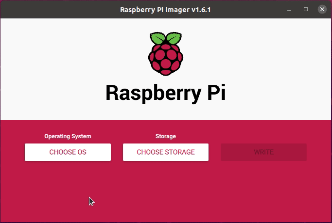

1. `CHOOSE OS` 클릭
2. `Use custom` 클릭 후 로컬 디스크에서 추출한 `.img` 파일 선택
3. `CHOOSE STORAGE` 클릭 후 microSD 카드 선택
4. `WRITE` 클릭하여 이미지 굽기 시작


#### Disks 유틸리티

`Disks` 유틸리티는 최근 Ubuntu Desktop에 포함되어 있습니다. "Disks"를 검색하여 앱을 실행하세요.

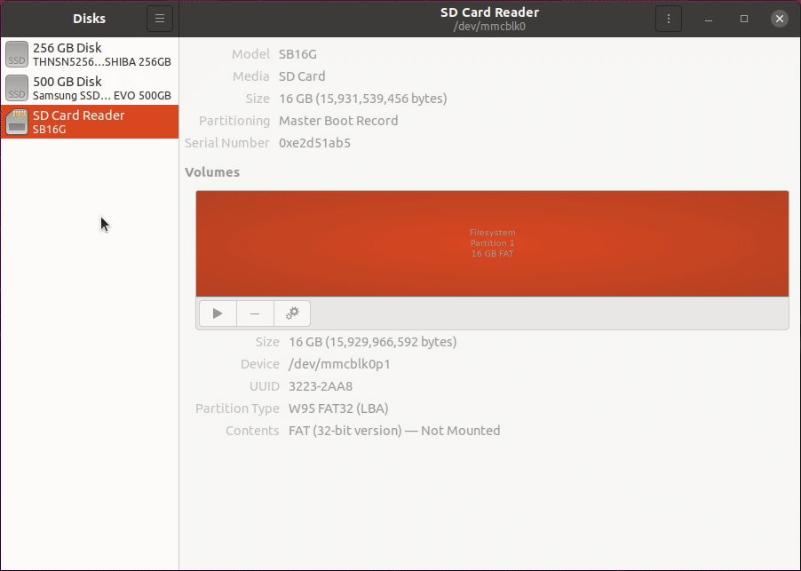

1. 왼쪽 패널에서 microSD 카드 선택
2. `Restore Disk Image` 옵션 선택
3. 로컬 디스크에서 `.img` 파일 열기
4. `Start Restoring...` > `Restore` 버튼 클릭


### 파티션 크기 조정

복구 이미지 파일의 크기를 줄이고 microSD에 이미지를 굽는 시간을 단축하기 위해 복구 파티션이 최소화되어 있습니다. 사용 가능한 할당되지 않은 공간을 사용하려면 파티션 크기를 조정하세요.

**올바르지 않은 디스크나 파티션을 선택하지 않도록 주의하세요. PC의 시스템 디스크를 파티셔닝하면 심각한 시스템 오작동이 발생할 수 있습니다.**

[GParted GUI 도구 다운로드 또는 설치](https://gparted.org/download.php)

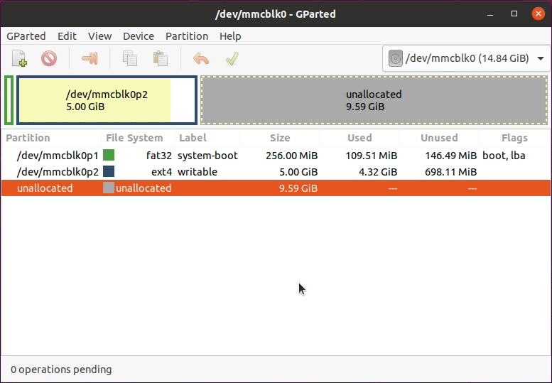

1. 메뉴에서 microSD 카드 선택 (마운트 위치는 시스템에 따라 다를 수 있음)
2. 노란색 파티션을 마우스 오른쪽 버튼으로 클릭
3. `Resize/Move` 옵션 선택
4. 파티션의 오른쪽 가장자리를 맨 오른쪽 끝까지 드래그
5. `Resize/Move` 버튼 클릭
6. 상단의 녹색 체크 `Apply All Operations` 버튼 클릭


### WiFi 네트워크 설정 구성

1. `Alt` + `Ctrl` + `T`로 터미널 창을 열고 microSD 카드의 netplan 디렉토리로 이동합니다. 관리자 권한으로 `50-cloud-init.yaml` 파일 편집을 시작합니다. **[Remote PC]** `$ cd /media/$USER/writable/etc/netplan` `$ sudoedit 50-cloud-init.yaml` WIFI_SSID와 WIFI_PASSWORD를 실제 WiFi SSID와 비밀번호로 바꿉니다. `Ctrl+S`로 저장하고 `Ctrl+X`로 종료합니다.

"No such file or directory" 메시지가 반환되면 microSD가 올바르게 마운트되었는지 확인하세요.

1. Raspberry Pi 부팅  a. 모니터의 HDMI 케이블을 Raspberry Pi의 HDMI 포트에 연결합니다.  b. 입력 장치를 Raspberry Pi의 USB 포트에 연결합니다.
  c. microSD 카드를 삽입합니다.  d. 전원(USB 또는 OpenCR)을 연결하여 Raspberry Pi를 켭니다.  e. ID `ubuntu`, 비밀번호 `turtlebot`으로 로그인합니다.`  

HDMI 케이블은 Raspberry Pi 전원을 켜기 전에 연결해야 합니다. 그렇지 않으면 Raspberry Pi의 HDMI 포트가 비활성화됩니다.


### ROS 네트워크 설정

**참고**: 기존 GPG 만료로 인해 ROS GPG 키와 관련된 apt 오류가 발생하는 경우 GPG 키를 업데이트해야 할 수 있습니다. [ROS GPG Key Expiration Incident](https://discourse.ros.org/t/ros-gpg-key-expiration-incident/20669)를 참조하고 제시된 해결 방법을 진행하세요.

**SBC (Raspberry Pi)** 에서 아래 지침을 따르세요.

1. WiFi IP 주소 확인 **[Turtlebot3 SBC]** `$ ifconfig`
2. `.bashrc` 파일 편집 **[Turtlebot3 SBC]** `$ nano ~/.bashrc`
3. `ROS_MASTER_URI`와 `ROS_HOSTNAME` 설정 섹션을 찾은 다음, IP 주소를 사용자 장치에 맞는 올바른 주소로 수정합니다. **[Turtlebot3 SBC]** `export ROS_MASTER_URI=http://{REMOTE_PC_IP_ADDRESS}:11311` `export ROS_HOSTNAME={RASPBERRY_PI_3_IP_ADDRESS}`
4. `Ctrl+S`로 파일을 저장하고 `Ctrl+X`로 nano 편집기를 종료합니다.
5. 아래 명령어로 변경사항을 적용합니다. **[Turtlebot3 SBC]** `$ source ~/.bashrc`


### NEW LDS-02 설정

| LDS-01 | LDS-02 |
| --- | --- |
|  |  |

TurtleBot3 LDS는 2022년 모델부터 LDS-02로 업데이트되었습니다. TurtleBot3의 **SBC (Raspberry Pi)** 에서 아래 지침을 따르세요.

1. LDS-02 드라이버 설치 및 TurtleBot3 패키지 업데이트 **[Turtlebot3 SBC]** `$ sudo apt update` `$ sudo apt install libudev-dev` `$ cd ~/catkin_ws/src` `$ git clone -b noetic https://github.com/ROBOTIS-GIT/ld08_driver.git` `$ cd ~/catkin_ws/src/turtlebot3 && git pull` `$ rm -r turtlebot3_description/ turtlebot3_teleop/ turtlebot3_navigation/ turtlebot3_slam/ turtlebot3_example/` `$ cd ~/catkin_ws && catkin_make`
2. LDS_MODEL을 bashrc 파일에 내보냅니다. LDS 모델에 따라 `LDS-01` 또는 `LDS-02`를 사용하세요. **[Turtlebot3 SBC]** `$ echo 'export LDS_MODEL=LDS-02' >> ~/.bashrc` `$ source ~/.bashrc`

**이것으로 SBC 설정이 완료되었습니다!** 다음 단계: [OpenCR 설정](https://emanual.robotis.com/docs/en/platform/turtlebot3/opencr_setup/#opencr-setup)

더 유용한 정보는 아래 Ubuntu 블로그를 참조하세요.

- [Improving Security with Ubuntu](https://ubuntu.com/blog/steps-to-maximise-robotics-security-with-ubuntu)
- [Improving User Experience of TurtleBot3 Waffle Pi](https://ubuntu.com/blog/building-a-better-turtlebot3)
