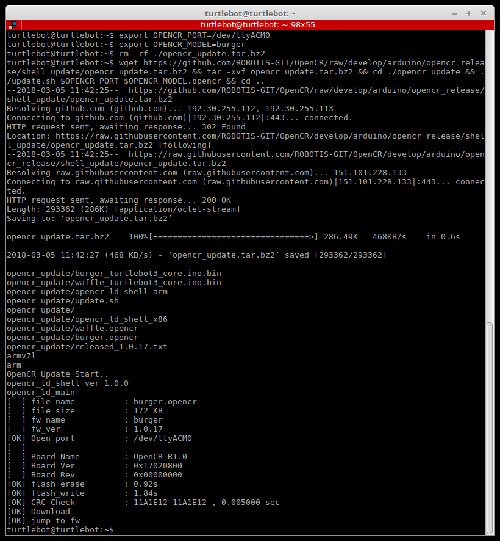
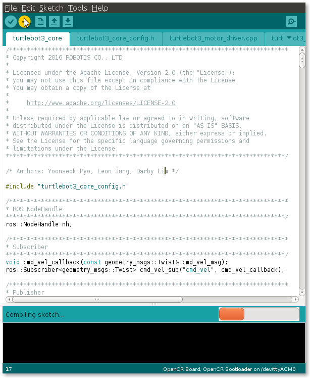

> **출처**: [https://emanual.robotis.com/docs/en/platform/turtlebot3/opencr_setup](https://emanual.robotis.com/docs/en/platform/turtlebot3/opencr_setup)

---
# TOC

1. [Humble](#humble)
2. [Jazzy](#jazzy)
3. [Noetic](#noetic)

---
[TOC](#toc)

# Humble

## 3.3 OpenCR 설정

1. 마이크로 USB 케이블을 이용해 [OpenCR](https://emanual.robotis.com/docs/en/parts/controller/opencr10/)을 Raspberry Pi에 연결하세요.  
   

2. [OpenCR](https://emanual.robotis.com/docs/en/parts/controller/opencr10/) 펌웨어를 업로드하기 위해 Raspberry Pi에 필요한 패키지를 설치하세요.  
   **[TurtleBot3 SBC]**  
   ```
   $ sudo dpkg --add-architecture armhf  
   $ sudo apt-get update  
   $ sudo apt-get install libc6:armhf  
   ```

3. 사용 중인 모델에 따라 **OPENCR_MODEL** 이름을 `burger` 또는 `waffle`로 지정하세요.  
   **[TurtleBot3 SBC]**  
   ```
   $ export OPENCR_PORT=/dev/ttyACM0  
   $ export OPENCR_MODEL=burger
   $ rm -rf ./opencr_update.tar.bz2  
   ```

4. 펌웨어와 필요한 로더를 다운로드한 후 파일을 추출하여 업로드를 준비합니다.  
   **[TurtleBot3 SBC]**  
   ```
   $ wget https://github.com/ROBOTIS-GIT/OpenCR-Binaries/raw/master/turtlebot3/ROS2/latest/opencr_update.tar.bz2   
   $ tar -xvf opencr_update.tar.bz2 
   ```

5. OpenCR에 펌웨어를 업로드합니다.  
   **[TurtleBot3 SBC]**  
   ```
   $ cd ./opencr_update  
   $ ./update.sh $OPENCR_PORT $OPENCR_MODEL.opencr  
   ```

6. TurtleBot3 Burger의 펌웨어 업로드가 성공하면 다음과 같은 화면이 나타납니다.

   

7. 펌웨어 업로드에 실패하면 다음 안내에 따라 복구 모드를 통해 다시 업로드하세요. 복구 모드에서는 [OpenCR](https://emanual.robotis.com/docs/en/parts/controller/opencr10/)의 `STATUS` LED가 주기적으로 깜빡입니다.  
   * `PUSH SW2` 버튼을 누른 상태로 유지합니다.  
   * `Reset` 버튼을 누릅니다.  
   * `Reset` 버튼을 뗍니다.  

   
   
   * `PUSH SW2` 버튼을 놓습니다.


**Arduino IDE를 사용한 펌웨어 업로드**

> [OpenCR](https://emanual.robotis.com/docs/en/parts/controller/opencr10/) 보드 매니저는 Raspberry Pi 또는 NVidia Jetson과 같은 ARM 기반 SBC에서 Arduino IDE를 지원하지 않습니다.
> Arduino IDE를 사용하여 [OpenCR](https://emanual.robotis.com/docs/en/parts/controller/opencr10/) 펌웨어를 업로드하려면 PC에서 아래 지침을 따르세요.

1. Linux를 사용하는 경우 OpenCR용 USB 포트를 구성하세요. 다른 운영 체제(OSX 또는 Windows)에서는 이 단계를 건너뛸 수 있습니다.
   ```
   $ wget https://raw.githubusercontent.com/ROBOTIS-GIT/OpenCR/master/99-opencr-cdc.rules
   $ sudo cp ./99-opencr-cdc.rules /etc/udev/rules.d/
   $ sudo udevadm control --reload-rules
   $ sudo udevadm trigger
   $ sudo apt install libncurses5-dev:i386
   ```
2. Arduino IDE를 설치합니다.
   * [최신 Arduino IDE 다운로드](https://www.arduino.cc/en/software)

3. 설치를 완료한 후 Arduino IDE를 실행합니다.

4. `Ctrl` + `,`를 눌러 환경설정(Preferences) 메뉴를 엽니다.

5. `추가적인 보드 매니저 URLs(Additional Boards Manager URLs)` 항목에 아래 주소를 입력합니다.
   ```
   https://raw.githubusercontent.com/ROBOTIS-GIT/OpenCR/master/arduino/opencr_release/package_opencr_index.json
   ```
   

6. TurtleBot3 펌웨어를 엽니다. 사용 중인 모델에 따라 올바른 펌웨어를 선택하세요.
   * Burger : ***File > Examples > Turtlebot3 ROS2 > turtlebot3_burger***
   * Waffle/Waffle Pi : ***File > Examples > Turtlebot3 ROS2 > turtlebot3_waffle***

7. OpenCR을 PC에 연결하고 ***Tools > Board*** 메뉴에서 ***OpenCR > OpenCR Board***를 선택합니다.

8. ***Tools > Port*** 메뉴에서 OpenCR이 연결된 USB 포트를 선택합니다.

9. `Ctrl` + `U` 또는 업로드 아이콘을 눌러 TurtleBot3 펌웨어 스케치를 업로드합니다.

   
   

10. 펌웨어 업로드에 실패하면 다음 안내에 따라 복구 모드를 통해 다시 업로드하세요. 복구 모드에서는 [OpenCR](https://emanual.robotis.com/docs/en/parts/controller/opencr10/)의 `STATUS` LED가 주기적으로 깜빡입니다.
    * `PUSH SW2` 버튼을 누른 상태로 유지합니다.
    * `Reset` 버튼을 누릅니다.
    * `Reset` 버튼을 뗍니다.

    
    
    * `PUSH SW2` 버튼을 놓습니다.


### 3.3.1 OpenCR 테스트

> **참고**: OpenCR 테스트 중 바퀴가 움직이지 않으면 "[**TurtleBot3 DYNAMIXEL 설정 방법**](https://emanual.robotis.com/docs/en/platform/turtlebot3/faq/#setup-dynamixels-for-turtlebot3)"을 참조하여 DYNAMIXEL 구성을 업데이트하세요.

`PUSH SW 1`과 `PUSH SW 2` 버튼을 이용해 로봇이 제대로 조립되었는지 확인할 수 있습니다. 이 과정은 좌우 DYNAMIXEL 설정과 [OpenCR](https://emanual.robotis.com/docs/en/parts/controller/opencr10/) 보드 펌웨어를 테스트합니다.


1. TurtleBot3 조립을 마친 후 [OpenCR](https://emanual.robotis.com/docs/en/parts/controller/opencr10/)에 전원을 연결하고 전원 스위치를 켜세요. 빨간색 `Power LED`가 켜집니다.
2. 로봇을 넓고 평평한 바닥에 놓으세요. 테스트 시 최소 1미터(약 40인치)의 안전 반경을 확보하는 것이 좋습니다.
3. `PUSH SW 1`을 몇 초간 누르면 로봇이 약 30센티미터(약 12인치) 전진합니다.
4. `PUSH SW 2`를 몇 초간 누르면 로봇이 제자리에서 180도 회전합니다.

---
[TOC](#toc)

# Jazzy

## 3.3 OpenCR 설정

1. 마이크로 USB 케이블을 이용해 [OpenCR](https://emanual.robotis.com/docs/en/parts/controller/opencr10/)을 Raspberry Pi에 연결하세요.  
   

2. [OpenCR](https://emanual.robotis.com/docs/en/parts/controller/opencr10/) 펌웨어를 업로드하기 위해 Raspberry Pi에 필요한 패키지를 설치하세요.  
   **[TurtleBot3 SBC]**  
   ```
   $ sudo dpkg --add-architecture armhf  
   $ sudo apt-get update  
   $ sudo apt-get install libc6:armhf
   ```

3. 사용 중인 모델에 따라 **OPENCR_MODEL** 이름을 `burger` 또는 `waffle`로 지정하세요.  
   **[TurtleBot3 SBC]**  
   ```
   $ export OPENCR_PORT=/dev/ttyACM0  
   $ export OPENCR_MODEL=burger
   $ rm -rf ./opencr_update.tar.bz2
   ```

4. 펌웨어와 필요한 로더를 다운로드한 후 파일을 추출하여 업로드를 준비합니다.  
   **[TurtleBot3 SBC]**  
   ```
   $ wget https://github.com/ROBOTIS-GIT/OpenCR-Binaries/raw/master/turtlebot3/ROS2/latest/opencr_update.tar.bz2   
   $ tar -xvf opencr_update.tar.bz2 
   ```

5. OpenCR에 펌웨어를 업로드합니다.  
   **[TurtleBot3 SBC]**  
   ```
   $ cd ./opencr_update  
   $ ./update.sh $OPENCR_PORT $OPENCR_MODEL.opencr  
   ```

6. TurtleBot3 Burger의 펌웨어 업로드가 성공하면 다음과 같은 화면이 나타납니다.

   

7. 펌웨어 업로드에 실패하면 다음 안내에 따라 복구 모드를 통해 다시 업로드하세요. 복구 모드에서는 [OpenCR](https://emanual.robotis.com/docs/en/parts/controller/opencr10/)의 `STATUS` LED가 주기적으로 깜빡입니다.  
   * `PUSH SW2` 버튼을 누른 상태로 유지합니다.  
   * `Reset` 버튼을 누릅니다.  
   * `Reset` 버튼을 뗍니다.  

   
   
   * `PUSH SW2` 버튼을 놓습니다.


**Arduino IDE를 사용한 펌웨어 업로드**

> [OpenCR](https://emanual.robotis.com/docs/en/parts/controller/opencr10/) 보드 매니저는 Raspberry Pi 또는 NVidia Jetson과 같은 ARM 기반 SBC에서 Arduino IDE를 지원하지 않습니다.
> Arduino IDE를 사용하여 [OpenCR](https://emanual.robotis.com/docs/en/parts/controller/opencr10/) 펌웨어를 업로드하려면 PC에서 아래 지침을 따르세요.

1. Linux를 사용하는 경우 OpenCR용 USB 포트를 구성하세요. 다른 운영 체제(OSX 또는 Windows)에서는 이 단계를 건너뛸 수 있습니다.
   ```
   $ wget https://raw.githubusercontent.com/ROBOTIS-GIT/OpenCR/master/99-opencr-cdc.rules
   $ sudo cp ./99-opencr-cdc.rules /etc/udev/rules.d/
   $ sudo udevadm control --reload-rules
   $ sudo udevadm trigger
   $ sudo apt install libncurses5-dev:i386
   ```
2. Arduino IDE를 설치합니다.
   * [최신 Arduino IDE 다운로드](https://www.arduino.cc/en/software)

3. 설치를 완료한 후 Arduino IDE를 실행합니다.

4. `Ctrl` + `,`를 눌러 환경설정(Preferences) 메뉴를 엽니다.

5. `추가적인 보드 매니저 URLs(Additional Boards Manager URLs)` 항목에 아래 주소를 입력합니다.
   ```
   https://raw.githubusercontent.com/ROBOTIS-GIT/OpenCR/master/arduino/opencr_release/package_opencr_index.json
   ```
   

6. TurtleBot3 펌웨어를 엽니다. 사용 중인 모델에 따라 올바른 펌웨어를 선택하세요.
   * Burger : ***File > Examples > Turtlebot3 ROS2 > turtlebot3_burger***
   * Waffle/Waffle Pi : ***File > Examples > Turtlebot3 ROS2 > turtlebot3_waffle***

7. OpenCR을 PC에 연결하고 ***Tools > Board*** 메뉴에서 ***OpenCR > OpenCR Board***를 선택합니다.

8. ***Tools > Port*** 메뉴에서 OpenCR이 연결된 USB 포트를 선택합니다.

9. `Ctrl` + `U` 또는 업로드 아이콘을 눌러 TurtleBot3 펌웨어 스케치를 업로드합니다.

   
   

10. 펌웨어 업로드에 실패하면 다음 안내에 따라 복구 모드를 통해 다시 업로드하세요. 복구 모드에서는 [OpenCR](https://emanual.robotis.com/docs/en/parts/controller/opencr10/)의 `STATUS` LED가 주기적으로 깜빡입니다.
    * `PUSH SW2` 버튼을 누른 상태로 유지합니다.
    * `Reset` 버튼을 누릅니다.
    * `Reset` 버튼을 뗍니다.

    
    
    * `PUSH SW2` 버튼을 놓습니다.


### 3.3.1 OpenCR 테스트

> **참고**: OpenCR 테스트 중 바퀴가 움직이지 않으면 "**TurtleBot3 DYNAMIXEL 설정 방법**"을 참조하여 DYNAMIXEL 구성을 업데이트하세요.

`PUSH SW 1`과 `PUSH SW 2` 버튼을 이용해 로봇이 제대로 조립되었는지 확인할 수 있습니다. 이 과정은 좌우 DYNAMIXEL 설정과 [OpenCR](https://emanual.robotis.com/docs/en/parts/controller/opencr10/) 보드 펌웨어를 테스트합니다.


1. TurtleBot3 조립을 마친 후 [OpenCR](https://emanual.robotis.com/docs/en/parts/controller/opencr10/)에 전원을 연결하고 전원 스위치를 켜세요. 빨간색 `Power LED`가 켜집니다.
2. 로봇을 넓고 평평한 바닥에 놓으세요. 테스트 시 최소 1미터(약 40인치)의 안전 반경을 확보하는 것이 좋습니다.
3. `PUSH SW 1`을 몇 초간 누르면 로봇이 약 30센티미터(약 12인치) 전진합니다.
4. `PUSH SW 2`를 몇 초간 누르면 로봇이 제자리에서 180도 회전합니다.

---
[TOC](#toc)

# Noetic

## 3.3 OpenCR 설정

1. 마이크로 USB 케이블을 이용해 [OpenCR](https://emanual.robotis.com/docs/en/parts/controller/opencr10/)을 Raspberry Pi에 연결하세요.  
   

2. [OpenCR](https://emanual.robotis.com/docs/en/parts/controller/opencr10/) 펌웨어를 업로드하기 위해 Raspberry Pi에 필요한 패키지를 설치하세요.  
   **[TurtleBot3 SBC]**
   ```
   $ sudo dpkg --add-architecture armhf  
   $ sudo apt-get update  
   $ sudo apt-get install libc6:armhf  
   ```

3. 사용 중인 모델에 따라 **OPENCR_MODEL** 이름을 `burger` 또는 `waffle`로 지정하세요.  
   **[TurtleBot3 SBC]**
   ```
   $ export OPENCR_PORT=/dev/ttyACM0  
   $ export OPENCR_MODEL=burger_noetic  
   $ rm -rf ./opencr_update.tar.bz2 
   ```

4. 펌웨어와 필요한 로더를 다운로드한 후 파일을 추출하여 업로드를 준비합니다.  
   **[TurtleBot3 SBC]**
   ```
   $ wget https://github.com/ROBOTIS-GIT/OpenCR-Binaries/raw/master/turtlebot3/ROS1/latest/opencr_update.tar.bz2   
   $ tar -xvf opencr_update.tar.bz2 
   ```

5. OpenCR에 펌웨어를 업로드합니다.  
   **[TurtleBot3 SBC]**  
   ```
   $ cd ./opencr_update  
   $ ./update.sh $OPENCR_PORT $OPENCR_MODEL.opencr  
   ```

6. TurtleBot3 Burger의 펌웨어 업로드가 성공하면 다음과 같은 화면이 나타납니다.

   

7. 펌웨어 업로드에 실패하면 다음 안내에 따라 복구 모드를 통해 다시 업로드하세요. 복구 모드에서는 [OpenCR](https://emanual.robotis.com/docs/en/parts/controller/opencr10/)의 `STATUS` LED가 주기적으로 깜빡입니다.  
   * `PUSH SW2` 버튼을 누른 상태로 유지합니다.  
   * `Reset` 버튼을 누릅니다.  
   * `Reset` 버튼을 뗍니다.  

   
   
   * `PUSH SW2` 버튼을 놓습니다.


**Arduino IDE를 사용한 펌웨어 업로드**

> [OpenCR](https://emanual.robotis.com/docs/en/parts/controller/opencr10/) 보드 매니저는 Raspberry Pi 또는 NVidia Jetson과 같은 ARM 기반 SBC에서 Arduino IDE를 지원하지 않습니다.
> Arduino IDE를 사용하여 [OpenCR](https://emanual.robotis.com/docs/en/parts/controller/opencr10/) 펌웨어를 업로드하려면 PC에서 아래 지침을 따르세요.

1. Linux를 사용하는 경우 OpenCR용 USB 포트를 구성하세요. 다른 운영 체제(OSX 또는 Windows)에서는 이 단계를 건너뛸 수 있습니다.
   ```
   $ wget https://raw.githubusercontent.com/ROBOTIS-GIT/OpenCR/master/99-opencr-cdc.rules
   $ sudo cp ./99-opencr-cdc.rules /etc/udev/rules.d/
   $ sudo udevadm control --reload-rules
   $ sudo udevadm trigger
   $ sudo apt install libncurses5-dev:i386
   ```
2. Arduino IDE를 설치합니다.
   * [최신 Arduino IDE 다운로드](https://www.arduino.cc/en/software)

3. 설치를 완료한 후 Arduino IDE를 실행합니다.

4. `Ctrl` + `,`를 눌러 환경설정(Preferences) 메뉴를 엽니다.

5. `추가적인 보드 매니저 URLs(Additional Boards Manager URLs)` 항목에 아래 주소를 입력합니다.
   ```
   https://raw.githubusercontent.com/ROBOTIS-GIT/OpenCR/master/arduino/opencr_release/package_opencr_index.json
   ```
   

6. TurtleBot3 펌웨어를 엽니다. 사용 중인 모델에 따라 올바른 펌웨어를 선택하세요.
   * Burger : ***File > Examples > Turtlebot3 ROS2 > turtlebot3_burger***
   * Waffle/Waffle Pi : ***File > Examples > Turtlebot3 ROS2 > turtlebot3_waffle***

7. OpenCR을 PC에 연결하고 ***Tools > Board*** 메뉴에서 ***OpenCR > OpenCR Board***를 선택합니다.

8. ***Tools > Port*** 메뉴에서 OpenCR이 연결된 USB 포트를 선택합니다.

9. `Ctrl` + `U` 또는 업로드 아이콘을 눌러 TurtleBot3 펌웨어 스케치를 업로드합니다.

   
   

10. 펌웨어 업로드에 실패하면 다음 안내에 따라 복구 모드를 통해 다시 업로드하세요. 복구 모드에서는 [OpenCR](https://emanual.robotis.com/docs/en/parts/controller/opencr10/)의 `STATUS` LED가 주기적으로 깜빡입니다.
    * `PUSH SW2` 버튼을 누른 상태로 유지합니다.
    * `Reset` 버튼을 누릅니다.
    * `Reset` 버튼을 뗍니다.

    
    
    * `PUSH SW2` 버튼을 놓습니다.


### 3.3.1 OpenCR 테스트

> **참고**: OpenCR 테스트 중 바퀴가 움직이지 않으면 "**TurtleBot3 DYNAMIXEL 설정 방법**"을 참조하여 DYNAMIXEL 구성을 업데이트하세요.

`PUSH SW 1`과 `PUSH SW 2` 버튼을 이용해 로봇이 제대로 조립되었는지 확인할 수 있습니다. 이 과정은 좌우 DYNAMIXEL 설정과 [OpenCR](https://emanual.robotis.com/docs/en/parts/controller/opencr10/) 보드 펌웨어를 테스트합니다.


1. TurtleBot3 조립을 마친 후 [OpenCR](https://emanual.robotis.com/docs/en/parts/controller/opencr10/)에 전원을 연결하고 전원 스위치를 켜세요. 빨간색 `Power LED`가 켜집니다.
2. 로봇을 넓고 평평한 바닥에 놓으세요. 테스트 시 최소 1미터(약 40인치)의 안전 반경을 확보하는 것이 좋습니다.
3. `PUSH SW 1`을 몇 초간 누르면 로봇이 약 30센티미터(약 12인치) 전진합니다.
4. `PUSH SW 2`를 몇 초간 누르면 로봇이 제자리에서 180도 회전합니다.
