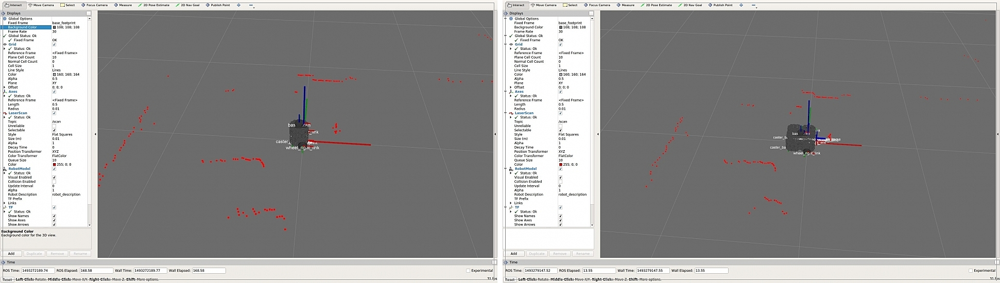

> **출처**: [https://emanual.robotis.com/docs/en/platform/turtlebot3/bringup](https://emanual.robotis.com/docs/en/platform/turtlebot3/bringup)

---

# TOC

1. [Humble](#humble)
2. [Jazzy](#jazzy)
3. [Noetic](#noetic)

---

[TOC](#toc)

# Humble

## 3.5 Bringup


### 3.5.1 TurtleBot3 실행

1. 원격 PC에서 `Ctrl` + `Alt` + `T`로 새 터미널을 열고, Raspberry Pi의 IP 주소를 사용해 SSH로 연결합니다. `Raspberry pi`의 Ubuntu OS `비밀번호`를 입력하세요.  
**[Remote PC]**
```bash
$ ssh ubuntu@{IP_ADDRESS_OF_RASPBERRY_PI}
```

2. TurtleBot3 애플리케이션 실행에 필요한 기본 패키지를 구동합니다. 사용 중인 TurtleBot3 모델을 지정해야 합니다.  
**[TurtleBot3 SBC]**
```bash
$ export TURTLEBOT3_MODEL=burger
$ ros2 launch turtlebot3_bringup robot.launch.py
```

3. TURTLEBOT3_MODEL을 `burger`로 설정하면 터미널 출력은 아래와 같습니다.  
**[TurtleBot3 SBC]**

```bash
$ export TURTLEBOT3_MODEL=burger
$ ros2 launch turtlebot3_bringup robot.launch.py
[INFO] [launch]: All log files can be found below /home/ubuntu/.ros/log/2019-08-19-01-24-19-009803-ubuntu-15310
[INFO] [launch]: Default logging verbosity is set to INFO
urdf_file_name : turtlebot3_burger.urdf
[INFO] [robot_state_publisher-1]: process started with pid [15320]
[INFO] [hlds_laser_publisher-2]: process started with pid [15321]
[INFO] [turtlebot3_ros-3]: process started with pid [15322]
[robot_state_publisher-1] Initialize urdf model from file: /home/ubuntu/turtlebot_ws/install/turtlebot3_description/share/turtlebot3_description/urdf/turtlebot3_burger.urdf
[robot_state_publisher-1] Parsing robot urdf xml string.
[robot_state_publisher-1] Link base_link had 5 children
[robot_state_publisher-1] Link caster_back_link had 0 children
[robot_state_publisher-1] Link imu_link had 0 children
[robot_state_publisher-1] Link base_scan had 0 children
[robot_state_publisher-1] Link wheel_left_link had 0 children
[robot_state_publisher-1] Link wheel_right_link had 0 children
[robot_state_publisher-1] got segment base_footprint
[robot_state_publisher-1] got segment base_link
[robot_state_publisher-1] got segment base_scan
[robot_state_publisher-1] got segment caster_back_link
[robot_state_publisher-1] got segment imu_link
[robot_state_publisher-1] got segment wheel_left_link
[robot_state_publisher-1] got segment wheel_right_link
[turtlebot3_ros-3] [INFO] [turtlebot3_node]: Init TurtleBot3 Node Main
[turtlebot3_ros-3] [INFO] [turtlebot3_node]: Init DynamixelSDKWrapper
[turtlebot3_ros-3] [INFO] [DynamixelSDKWrapper]: Succeeded to open the port(/dev/ttyACM0)!
[turtlebot3_ros-3] [INFO] [DynamixelSDKWrapper]: Succeeded to change the baudrate!
[robot_state_publisher-1] Adding fixed segment from base_footprint to base_link
[robot_state_publisher-1] Adding fixed segment from base_link to caster_back_link
[robot_state_publisher-1] Adding fixed segment from base_link to imu_link
[robot_state_publisher-1] Adding fixed segment from base_link to base_scan
[robot_state_publisher-1] Adding moving segment from base_link to wheel_left_link
[robot_state_publisher-1] Adding moving segment from base_link to wheel_right_link
[turtlebot3_ros-3] [INFO] [turtlebot3_node]: Start Calibration of Gyro
[turtlebot3_ros-3] [INFO] [turtlebot3_node]: Calibration End
[turtlebot3_ros-3] [INFO] [turtlebot3_node]: Add Motors
[turtlebot3_ros-3] [INFO] [turtlebot3_node]: Add Wheels
[turtlebot3_ros-3] [INFO] [turtlebot3_node]: Add Sensors
[turtlebot3_ros-3] [INFO] [turtlebot3_node]: Succeeded to create battery state publisher
[turtlebot3_ros-3] [INFO] [turtlebot3_node]: Succeeded to create imu publisher
[turtlebot3_ros-3] [INFO] [turtlebot3_node]: Succeeded to create sensor state publisher
[turtlebot3_ros-3] [INFO] [turtlebot3_node]: Succeeded to create joint state publisher
[turtlebot3_ros-3] [INFO] [turtlebot3_node]: Add Devices
[turtlebot3_ros-3] [INFO] [turtlebot3_node]: Succeeded to create motor power server
[turtlebot3_ros-3] [INFO] [turtlebot3_node]: Succeeded to create reset server
[turtlebot3_ros-3] [INFO] [turtlebot3_node]: Succeeded to create sound server
[turtlebot3_ros-3] [INFO] [turtlebot3_node]: Run!
[turtlebot3_ros-3] [INFO] [diff_drive_controller]: Init Odometry
[turtlebot3_ros-3] [INFO] [diff_drive_controller]: Run!
```

4. 아래 명령어로 토픽과 서비스를 확인할 수 있습니다.
   * 원격 PC와 TurtleBot3 SBC가 동일한 네트워크 환경에 연결되어 있으면, 원격 PC에서 TurtleBot3 SBC가 발행하는 토픽을 구독할 수 있습니다.

   1. 원격 PC와 TurtleBot3 SBC의 ROS_DOMAIN_ID가 동일한지 확인하세요. 반드시 동일해야 합니다.
     **[Remote PC],[TurtleBot3 SBC]**
```bash
export ROS_DOMAIN_ID=30
```
   2. 원격 PC와 TurtleBot3 SBC의 RMW(ROS Middleware) 구현체가 동일한지 확인하세요.
     **[Remote PC],[TurtleBot3 SBC]**
```bash
 export RMW_IMPLEMENTATION=rmw_fastrtps_cpp
```
   3. WiFi 라우터가 멀티캐스트를 지원하는지 확인하세요. 지원하는 경우, 라우터에서 멀티캐스트를 허용하도록 설정하세요.

5. 토픽 및 서비스 목록은 설치된 ROS 패키지 버전에 따라 다를 수 있습니다.
   * 토픽 목록
   * $ ros2 topic list
```bash
$ ros2 topic list
/battery_state
/cmd_vel
/imu
/joint_states
/magnetic_field
/odom
/parameter_events
/robot_description
/rosout
/scan
/sensor_state
/tf
/tf_static
```

* 서비스 목록
```bash
$ ros2 service list
/diff_drive_controller/describe_parameters
/diff_drive_controller/get_parameter_types
/diff_drive_controller/get_parameters
/diff_drive_controller/list_parameters
/diff_drive_controller/set_parameters
/diff_drive_controller/set_parameters_atomically
/hlds_laser_publisher/describe_parameters
/hlds_laser_publisher/get_parameter_types
/hlds_laser_publisher/get_parameters
/hlds_laser_publisher/list_parameters
/hlds_laser_publisher/set_parameters
/hlds_laser_publisher/set_parameters_atomically
/launch_ros/describe_parameters
/launch_ros/get_parameter_types
/launch_ros/get_parameters
/launch_ros/list_parameters
/launch_ros/set_parameters
/launch_ros/set_parameters_atomically
/motor_power
/reset
/sound
/turtlebot3_node/describe_parameters
/turtlebot3_node/get_parameter_types
/turtlebot3_node/get_parameters
/turtlebot3_node/list_parameters
/turtlebot3_node/set_parameters
/turtlebot3_node/set_parameters_atomically
```

**RViz 실행에 대해 더 알아보기**

# 3.5.3 RViz에서 TurtleBot3 불러오기
   1. TurtleBot3를 실행 상태로 만듭니다.
   2. 새 터미널을 열고 아래 명령어를 입력하여 RViz를 실행합니다.
```bash
$ ros2 launch turtlebot3_bringup rviz2.launch.py
```


---

[TOC](#toc)

# Jazzy

## Bringup


### Bringup TurtleBot3

> Jazzy 버전부터 `cmd_vel` 토픽은 `TwistStamped` 타입을 사용합니다. `Twist` 타입을 사용하려면 bringup 패키지에서 `enable_stamped_cmd_vel` 파라미터를 false로 설정하세요.

1. 원격 PC에서 `Ctrl` + `Alt` + `T`로 새 터미널을 열고, Raspberry Pi의 IP 주소를 사용해 SSH로 연결합니다. `Raspberry pi`의 Ubuntu OS `비밀번호`를 입력하세요.  
**[Remote PC]**
```bash
$ ssh ubuntu@{IP_ADDRESS_OF_RASPBERRY_PI}
```

2. TurtleBot3 애플리케이션 실행에 필요한 기본 패키지를 구동합니다. 사용 중인 TurtleBot3 모델을 지정해야 합니다.  
**[TurtleBot3 SBC]**
```bash
$ export TURTLEBOT3_MODEL=burger
$ ros2 launch turtlebot3_bringup robot.launch.py
```

3. TURTLEBOT3_MODEL을 `burger`로 설정하면 터미널 출력은 아래와 같습니다.  
**[TurtleBot3 SBC]**

```bash
$ export TURTLEBOT3_MODEL=burger
$ ros2 launch turtlebot3_bringup robot.launch.py
[INFO] [launch]: All log files can be found below /home/ubuntu/.ros/log/2019-08-19-01-24-19-009803-ubuntu-15310
[INFO] [launch]: Default logging verbosity is set to INFO
urdf_file_name : turtlebot3_burger.urdf
[INFO] [robot_state_publisher-1]: process started with pid [15320]
[INFO] [hlds_laser_publisher-2]: process started with pid [15321]
[INFO] [turtlebot3_ros-3]: process started with pid [15322]
[robot_state_publisher-1] Initialize urdf model from file: /home/ubuntu/turtlebot_ws/install/turtlebot3_description/share/turtlebot3_description/urdf/turtlebot3_burger.urdf
[robot_state_publisher-1] Parsing robot urdf xml string.
[robot_state_publisher-1] Link base_link had 5 children
[robot_state_publisher-1] Link caster_back_link had 0 children
[robot_state_publisher-1] Link imu_link had 0 children
[robot_state_publisher-1] Link base_scan had 0 children
[robot_state_publisher-1] Link wheel_left_link had 0 children
[robot_state_publisher-1] Link wheel_right_link had 0 children
[robot_state_publisher-1] got segment base_footprint
[robot_state_publisher-1] got segment base_link
[robot_state_publisher-1] got segment base_scan
[robot_state_publisher-1] got segment caster_back_link
[robot_state_publisher-1] got segment imu_link
[robot_state_publisher-1] got segment wheel_left_link
[robot_state_publisher-1] got segment wheel_right_link
[turtlebot3_ros-3] [INFO] [turtlebot3_node]: Init TurtleBot3 Node Main
[turtlebot3_ros-3] [INFO] [turtlebot3_node]: Init DynamixelSDKWrapper
[turtlebot3_ros-3] [INFO] [DynamixelSDKWrapper]: Succeeded to open the port(/dev/ttyACM0)!
[turtlebot3_ros-3] [INFO] [DynamixelSDKWrapper]: Succeeded to change the baudrate!
[robot_state_publisher-1] Adding fixed segment from base_footprint to base_link
[robot_state_publisher-1] Adding fixed segment from base_link to caster_back_link
[robot_state_publisher-1] Adding fixed segment from base_link to imu_link
[robot_state_publisher-1] Adding fixed segment from base_link to base_scan
[robot_state_publisher-1] Adding moving segment from base_link to wheel_left_link
[robot_state_publisher-1] Adding moving segment from base_link to wheel_right_link
[turtlebot3_ros-3] [INFO] [turtlebot3_node]: Start Calibration of Gyro
[turtlebot3_ros-3] [INFO] [turtlebot3_node]: Calibration End
[turtlebot3_ros-3] [INFO] [turtlebot3_node]: Add Motors
[turtlebot3_ros-3] [INFO] [turtlebot3_node]: Add Wheels
[turtlebot3_ros-3] [INFO] [turtlebot3_node]: Add Sensors
[turtlebot3_ros-3] [INFO] [turtlebot3_node]: Succeeded to create battery state publisher
[turtlebot3_ros-3] [INFO] [turtlebot3_node]: Succeeded to create imu publisher
[turtlebot3_ros-3] [INFO] [turtlebot3_node]: Succeeded to create sensor state publisher
[turtlebot3_ros-3] [INFO] [turtlebot3_node]: Succeeded to create joint state publisher
[turtlebot3_ros-3] [INFO] [turtlebot3_node]: Add Devices
[turtlebot3_ros-3] [INFO] [turtlebot3_node]: Succeeded to create motor power server
[turtlebot3_ros-3] [INFO] [turtlebot3_node]: Succeeded to create reset server
[turtlebot3_ros-3] [INFO] [turtlebot3_node]: Succeeded to create sound server
[turtlebot3_ros-3] [INFO] [turtlebot3_node]: Run!
[turtlebot3_ros-3] [INFO] [diff_drive_controller]: Init Odometry
[turtlebot3_ros-3] [INFO] [diff_drive_controller]: Run!
```

4. 아래 명령어로 토픽과 서비스를 확인할 수 있습니다.
   * 원격 PC와 TurtleBot3 SBC가 동일한 네트워크 환경에 연결되어 있으면, 원격 PC에서 TurtleBot3 SBC가 발행하는 토픽을 구독할 수 있습니다.

   1. 원격 PC와 TurtleBot3 SBC의 ROS_DOMAIN_ID가 동일한지 확인하세요. 반드시 동일해야 합니다.
     **[Remote PC],[TurtleBot3 SBC]**
```bash
export ROS_DOMAIN_ID=30
```
   2. 원격 PC와 TurtleBot3 SBC의 RMW(ROS Middleware) 구현체가 동일한지 확인하세요.
     **[Remote PC],[TurtleBot3 SBC]**
```bash
 export RMW_IMPLEMENTATION=rmw_fastrtps_cpp
```
   3. WiFi 라우터가 멀티캐스트를 지원하는지 확인하세요. 지원하는 경우, 라우터에서 멀티캐스트를 허용하도록 설정하세요.

5. 토픽 및 서비스 목록은 설치된 ROS 패키지 버전에 따라 다를 수 있습니다.
   * 토픽 목록
   * $ ros2 topic list
```bash
$ ros2 topic list
/battery_state
/cmd_vel
/imu
/joint_states
/magnetic_field
/odom
/parameter_events
/robot_description
/rosout
/scan
/sensor_state
/tf
/tf_static
```

* 서비스 목록
```bash
$ ros2 service list
/diff_drive_controller/describe_parameters
/diff_drive_controller/get_parameter_types
/diff_drive_controller/get_parameters
/diff_drive_controller/list_parameters
/diff_drive_controller/set_parameters
/diff_drive_controller/set_parameters_atomically
/hlds_laser_publisher/describe_parameters
/hlds_laser_publisher/get_parameter_types
/hlds_laser_publisher/get_parameters
/hlds_laser_publisher/list_parameters
/hlds_laser_publisher/set_parameters
/hlds_laser_publisher/set_parameters_atomically
/launch_ros/describe_parameters
/launch_ros/get_parameter_types
/launch_ros/get_parameters
/launch_ros/list_parameters
/launch_ros/set_parameters
/launch_ros/set_parameters_atomically
/motor_power
/reset
/sound
/turtlebot3_node/describe_parameters
/turtlebot3_node/get_parameter_types
/turtlebot3_node/get_parameters
/turtlebot3_node/list_parameters
/turtlebot3_node/set_parameters
/turtlebot3_node/set_parameters_atomically
```

**RViz 실행에 대해 더 알아보기**

# 3.5.3 RViz에서 TurtleBot3 불러오기
   1. TurtleBot3를 실행 상태로 만듭니다.
   2. 새 터미널을 열고 아래 명령어를 입력하여 RViz를 실행합니다.
```bash
$ ros2 launch turtlebot3_bringup rviz2.launch.py
```


---

[TOC](#toc)

# Noetic

## 3.5 Bringup

### 3.5.1 roscore 실행
 * 원격 PC에서 roscore를 실행합니다.  
**[Remote PC]**

```
$ roscore
```

### 3.5.2 TurtleBot3 실행

1. 원격 PC에서 `Ctrl` + `Alt` + `T`로 새 터미널을 열고 SSH를 사용해 Raspberry Pi에 연결합니다. 기본 비밀번호는 **turtlebot**입니다.  
**[Remote PC]**
```
$ ssh ubuntu@{IP_ADDRESS_OF_RASPBERRY_PI}
```

2. TurtleBot3 애플리케이션 실행에 필요한 기본 패키지를 구동합니다.  
**[Turtlebot3 SBC]**
```
$ export TURTLEBOT3_MODEL=${TB3_MODEL}
$ roslaunch turtlebot3_bringup turtlebot3_robot.launch
```

3. TurtleBot3 모델이 `burger`인 경우, 터미널에 아래와 같은 메시지가 출력됩니다.  
**[Turtlebot3 SBC]**

```
 SUMMARY
 ========

 PARAMETERS
 * /rosdistro: noetic
 * /rosversion: 1.15.8
 * /turtlebot3_core/baud: 115200
 * /turtlebot3_core/port: /dev/ttyACM0
 * /turtlebot3_core/tf_prefix:
 * /turtlebot3_lds/frame_id: base_scan
 * /turtlebot3_lds/port: /dev/ttyUSB0

 NODES
 /
     turtlebot3_core (rosserial_python/serial_node.py)
     turtlebot3_diagnostics (turtlebot3_bringup/turtlebot3_diagnostics)
     turtlebot3_lds (hls_lfcd_lds_driver/hlds_laser_publisher)

 ROS_MASTER_URI=http://192.168.1.2:11311

 process[turtlebot3_core-1]: started with pid [14198]
 process[turtlebot3_lds-2]: started with pid [14199]
 process[turtlebot3_diagnostics-3]: started with pid [14200]
 [INFO] [1531306690.947198]: ROS Serial Python Node
 [INFO] [1531306691.000143]: Connecting to /dev/ttyACM0 at 115200 baud
 [INFO] [1531306693.522019]: Note: publish buffer size is 1024 bytes
 [INFO] [1531306693.525615]: Setup publisher on sensor_state [turtlebot3_msgs/SensorState]
 [INFO] [1531306693.544159]: Setup publisher on version_info [turtlebot3_msgs/VersionInfo]
 [INFO] [1531306693.620722]: Setup publisher on imu [sensor_msgs/Imu]
 [INFO] [1531306693.642319]: Setup publisher on cmd_vel_rc100 [geometry_msgs/Twist]
 [INFO] [1531306693.687786]: Setup publisher on odom [nav_msgs/Odometry]
 [INFO] [1531306693.706260]: Setup publisher on joint_states [sensor_msgs/JointState]
 [INFO] [1531306693.722754]: Setup publisher on battery_state [sensor_msgs/BatteryState]
 [INFO] [1531306693.759059]: Setup publisher on magnetic_field [sensor_msgs/MagneticField]
 [INFO] [1531306695.979057]: Setup publisher on /tf [tf/tfMessage]
 [INFO] [1531306696.007135]: Note: subscribe buffer size is 1024 bytes
 [INFO] [1531306696.009083]: Setup subscriber on cmd_vel [geometry_msgs/Twist]
 [INFO] [1531306696.040047]: Setup subscriber on sound [turtlebot3_msgs/Sound]
 [INFO] [1531306696.069571]: Setup subscriber on motor_power [std_msgs/Bool]
 [INFO] [1531306696.096364]: Setup subscriber on reset [std_msgs/Empty]
 [INFO] [1531306696.390979]: Setup TF on Odometry [odom]
 [INFO] [1531306696.394314]: Setup TF on IMU [imu_link]
 [INFO] [1531306696.397498]: Setup TF on MagneticField [mag_link]
 [INFO] [1531306696.400537]: Setup TF on JointState [base_link]
 [INFO] [1531306696.407813]: --------------------------
 [INFO] [1531306696.411412]: Connected to OpenCR board!
 [INFO] [1531306696.415140]: This core(v1.2.1) is compatible with TB3 Burger
 [INFO] [1531306696.418398]: --------------------------
 [INFO] [1531306696.421749]: Start Calibration of Gyro
 [INFO] [1531306698.953226]: Calibration End
```

**RViz 실행에 대해 더 알아보기**

# 3.5.3 RViz에서 TurtleBot3 불러오기

1. 원격 PC에서 새 터미널을 열고 로봇 상태 퍼블리셔를 실행합니다.
**[Remote PC]**
```
$ roslaunch turtlebot3_bringup turtlebot3_remote.launch
```


2. 새 터미널을 열고 아래 명령어를 입력하여 RViz를 실행합니다.
apt로 TurtleBot3 패키지를 설치한 경우 아래 명령어를 입력하세요.
**[Remote PC]**

```
$ rosrun rviz rviz -d `rospack find turtlebot3_description`/rviz/model.rviz
```

3. git clone으로 TurtleBot3 패키지를 설치한 경우 아래 명령어를 입력하세요. TurtleBot3 모델을 지정해야 합니다.
**[Remote PC]**
```
$ rosrun rviz rviz -d `rospack find turtlebot3_description`/rviz/{burger, waffle_pi}.rviz
```


