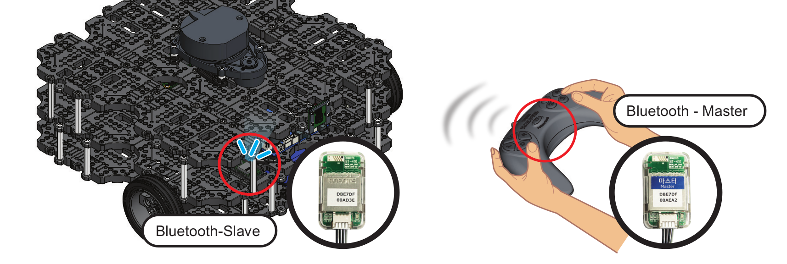
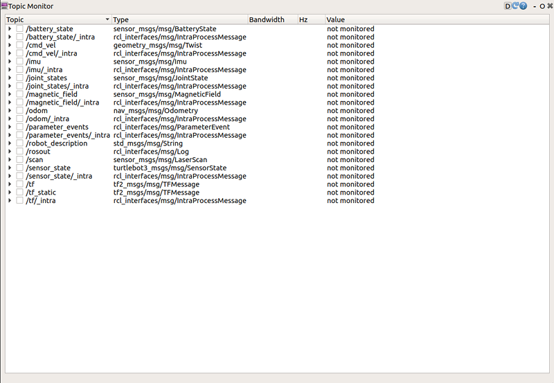
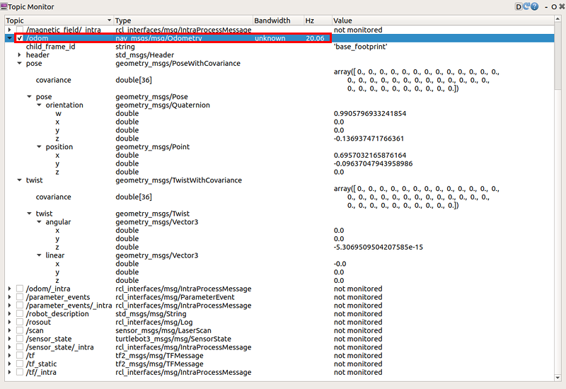
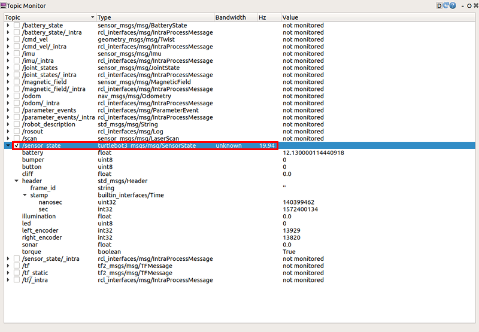
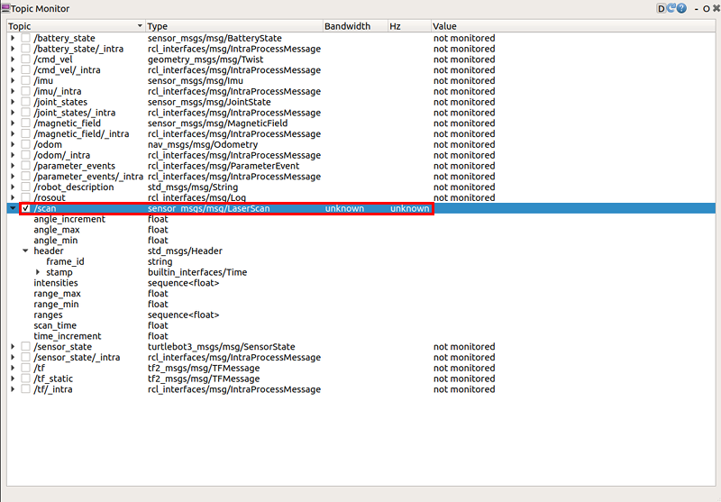

> **출처**: [https://emanual.robotis.com/docs/en/platform/turtlebot3/basic_operation](https://emanual.robotis.com/docs/en/platform/turtlebot3/basic_operation)

---
# TOC

1. [Humble](#humble)
2. [Jazzy](#jazzy)
3. [Noetic](#noetic)

---
[TOC](#toc)
# Humble

## 3.6 기본 작동

### 3.6.1 원격 제어

* TurtleBot3는 원격 제어로 조종할 수 있습니다. 사용 중인 SBC와 ROS 버전에 필요한 ROS 패키지가 지원되는지 확인하세요.

https://youtu.be/Z4s18hlazb4?si=BG1B2EDN6CCOHq8y

> **경고**: 원격 제어 전에 TurtleBot3 SBC에서 [Bringup](https://emanual.robotis.com/docs/en/platform/turtlebot3/bringup/#bringup)을 실행했는지 확인하세요. 또한 테이블 위에서 로봇을 테스트할 때는 로봇이 가장자리로 떨어질 수 있으니 주의하세요.


#### 3.6.1.1 키보드

1. **Remote PC**에서 터미널을 엽니다.
2. 원격 제어 노드를 실행합니다. TURTLEBOT3_MODEL 파라미터가 미리 설정되어 있지 않다면 `${TB3_MODEL}`을 `burger`, `waffle` 또는 `waffle_pi`로 바꾸세요.  
**[Remote PC]**
```
$ export TURTLEBOT3_MODEL=${TB3_MODEL}
$ ros2 run turtlebot3_teleop teleop_keyboard
```

4. 노드가 성공적으로 실행되면 터미널 창에 다음과 같은 안내가 표시됩니다.  
**[Remote PC]**
```
Control Your Turtlebot3
Moving around
     w
 a   s   d
     x
w/x : increase/decrease linear velocity (Burger : ~ 0.22, Waffle and Waffle Pi : ~ 0.26)
a/d : increase/decrease angular velocity (Burger : ~ 2.84, Waffle and Waffle Pi : ~ 1.82)
space key, s : force stop
CTRL-C to quit
```

#### 3.6.1.2 RC-100

[ROBOTIS RC-100B](https://emanual.robotis.com/docs/en/parts/communication/rc-100/) 설정은 TurtleBot3용 OpenCR 펌웨어에 포함되어 있습니다. [BT410](https://emanual.robotis.com/docs/en/parts/communication/bt-410/) 블루투스 모듈과 함께 사용할 수 있습니다. TurtleBot3 Waffle Pi에는 이 컨트롤러와 블루투스 모듈이 포함되어 있습니다. RC-100B 사용 시에는 OpenCR에 직접 연결된 펌웨어 내에서 `turtlebot_core` 노드가 `/cmd_vel` 토픽을 생성하므로 별도 노드를 실행할 필요가 없습니다.



1. BT-410을 OpenCR UART 포트 중 하나에 연결하세요.
2. RC-100으로 TurtleBot3를 조종하세요. 위/아래: 선속도 증가/감소, 왼쪽/오른쪽: 각속도 증가/감소


#### 3.6.1.3 PS3 조이스틱

1. PS3 조이스틱을 블루투스 또는 USB 케이블로 Remote PC에 연결하세요.
2. pip를 사용해 `ds4drv` 패키지를 설치합니다. **[Remote PC]** $ sudo pip install ds4drv
3. 조이스틱 노드를 실행합니다. **[Remote PC]** $ sudo ds4drv$ ros2 run joy joy_node
4. 새 터미널을 열고 원격 제어 노드를 실행합니다. **[Remote PC]** $ ros2 run teleop_twist_joy teleop_node


#### 3.6.1.4 XBOX 360 조이스틱

1. XBOX 360 조이스틱을 무선 어댑터 또는 USB 케이블로 Remote PC에 연결하세요.
2. Remote PC에서 터미널을 엽니다.
3. 조이스틱 노드를 실행합니다. **[Remote PC]** $ ros2 run joy joy_node
4. 새 터미널을 열고 원격 제어 노드를 실행합니다. **[Remote PC]** $ ros2 run teleop_twist_joy teleop_node


### 3.6.2 토픽 모니터

1. PC에서 아래 명령어로 rqt를 실행합니다. 토픽 모니터 창이 표시되지 않으면 `plugin` -> `Topics` -> `Topic Monitor`를 선택하세요.  
**[Remote PC]**
```
$ rqt
```


2. 토픽 모니터가 로드되면 기본적으로 토픽 값이 모니터링되지 않습니다. 각 토픽 옆의 체크박스를 클릭하여 해당 토픽을 모니터링하세요.  <br>

3. 더 자세한 토픽 메시지를 보려면 체크박스 옆의 `▶` 아이콘을 클릭하세요.  <br>

- /battery_state는 현재 배터리 전압 및 잔량과 같은 배터리 상태 관련 메시지를 나타냅니다.  <br>

- /odom은 TurtleBot3의 odometry(주행 거리) 정보를 포함하는 메시지를 나타냅니다. 이 토픽에는 방향 및 위치 인코더 데이터가 있습니다.  <br>

- /sensor_state는 인코더 값, 배터리 및 토크 상태를 포함하는 메시지를 나타냅니다.  <br>

- /scan은 angle_max/min, range_max/min과 같은 LDS 데이터를 포함하는 메시지를 나타냅니다.  <br>



---
[TOC](#toc)
# Jazzy

## 3.6 기본 작동

### 3.6.1 원격 제어

* TurtleBot3는 원격 제어로 조종할 수 있습니다. 사용 중인 SBC와 ROS 버전에 필요한 ROS 패키지가 지원되는지 확인하세요.

https://youtu.be/Z4s18hlazb4?si=BG1B2EDN6CCOHq8y

> **경고**: 원격 제어 전에 TurtleBot3 SBC에서 [Bringup](https://emanual.robotis.com/docs/en/platform/turtlebot3/bringup/#bringup)을 실행했는지 확인하세요. 또한 테이블 위에서 로봇을 테스트할 때는 로봇이 가장자리로 떨어질 수 있으니 주의하세요.


#### 3.6.1.1 키보드

1. **Remote PC**에서 터미널을 엽니다.
2. 원격 제어 노드를 실행합니다. TURTLEBOT3_MODEL 파라미터가 미리 설정되어 있지 않다면 `${TB3_MODEL}`을 `burger`, `waffle` 또는 `waffle_pi`로 바꾸세요.  
**[Remote PC]**
```
$ export TURTLEBOT3_MODEL=${TB3_MODEL}
$ ros2 run turtlebot3_teleop teleop_keyboard
```

4. 노드가 성공적으로 실행되면 터미널 창에 다음과 같은 안내가 표시됩니다.  
**[Remote PC]**
```
Control Your Turtlebot3
Moving around
     w
 a   s   d
     x
w/x : increase/decrease linear velocity (Burger : ~ 0.22, Waffle and Waffle Pi : ~ 0.26)
a/d : increase/decrease angular velocity (Burger : ~ 2.84, Waffle and Waffle Pi : ~ 1.82)
space key, s : force stop
CTRL-C to quit
```

#### 3.6.1.2 RC-100

[ROBOTIS RC-100B](https://emanual.robotis.com/docs/en/parts/communication/rc-100/) 설정은 TurtleBot3용 OpenCR 펌웨어에 포함되어 있습니다. [BT410](https://emanual.robotis.com/docs/en/parts/communication/bt-410/) 블루투스 모듈과 함께 사용할 수 있습니다. TurtleBot3 Waffle Pi에는 이 컨트롤러와 블루투스 모듈이 포함되어 있습니다. RC-100B 사용 시에는 OpenCR에 직접 연결된 펌웨어 내에서 `turtlebot_core` 노드가 `/cmd_vel` 토픽을 생성하므로 별도 노드를 실행할 필요가 없습니다.


1. BT-410을 OpenCR UART 포트 중 하나에 연결하세요.
2. RC-100으로 TurtleBot3를 조종하세요. 위/아래: 선속도 증가/감소, 왼쪽/오른쪽: 각속도 증가/감소


#### 3.6.1.3 PS3 조이스틱

1. PS3 조이스틱을 블루투스 또는 USB 케이블로 Remote PC에 연결하세요.
2. pip를 사용해 `ds4drv` 패키지를 설치합니다. **[Remote PC]** $ sudo pip install ds4drv
3. 조이스틱 노드를 실행합니다. **[Remote PC]** $ sudo ds4drv$ ros2 run joy joy_node
4. 새 터미널을 열고 원격 제어 노드를 실행합니다. **[Remote PC]** $ ros2 run teleop_twist_joy teleop_node


#### 3.6.1.4 XBOX 360 조이스틱

1. XBOX 360 조이스틱을 무선 어댑터 또는 USB 케이블로 Remote PC에 연결하세요.
2. Remote PC에서 터미널을 엽니다.
3. 조이스틱 노드를 실행합니다. **[Remote PC]** $ ros2 run joy joy_node
4. 새 터미널을 열고 원격 제어 노드를 실행합니다. **[Remote PC]** $ ros2 run teleop_twist_joy teleop_node


### 3.6.2 토픽 모니터

1. PC에서 아래 명령어로 rqt를 실행합니다. 토픽 모니터 창이 표시되지 않으면 `plugin` -> `Topics` -> `Topic Monitor`를 선택하세요.  
**[Remote PC]**
```
$ rqt
```


2. 토픽 모니터가 로드되면 기본적으로 토픽 값이 모니터링되지 않습니다. 각 토픽 옆의 체크박스를 클릭하여 해당 토픽을 모니터링하세요.  <br>

3. 더 자세한 토픽 메시지를 보려면 체크박스 옆의 `▶` 아이콘을 클릭하세요.  <br>

- /battery_state는 현재 배터리 전압 및 잔량과 같은 배터리 상태 관련 메시지를 나타냅니다.  <br>

- /odom은 TurtleBot3의 odometry(주행 거리) 정보를 포함하는 메시지를 나타냅니다. 이 토픽에는 방향 및 위치 인코더 데이터가 있습니다.  <br>

- /sensor_state는 인코더 값, 배터리 및 토크 상태를 포함하는 메시지를 나타냅니다.  <br>

- /scan은 angle_max/min, range_max/min과 같은 LDS 데이터를 포함하는 메시지를 나타냅니다.  <br>


---
[TOC](#toc)
# Noetic

## 3.6 기본 작동

### 3.6.1 원격 제어

* TurtleBot3는 원격 제어로 조종할 수 있습니다. 사용 중인 SBC와 ROS 버전에 필요한 ROS 패키지가 지원되는지 확인하세요.

https://youtu.be/Z4s18hlazb4?si=BG1B2EDN6CCOHq8y

> **경고**: 원격 제어 전에 TurtleBot3 SBC에서 [Bringup](https://emanual.robotis.com/docs/en/platform/turtlebot3/bringup/#bringup)을 실행했는지 확인하세요. 또한 테이블 위에서 로봇을 테스트할 때는 로봇이 가장자리로 떨어질 수 있으니 주의하세요.


#### 3.6.1.1 키보드

1. **Remote PC**에서 터미널을 엽니다.
2. 원격 제어 노드를 실행합니다. TURTLEBOT3_MODEL 파라미터가 미리 설정되어 있지 않다면 `${TB3_MODEL}`을 `burger`, `waffle` 또는 `waffle_pi`로 바꾸세요.  
**[Remote PC]**
```
$ export TURTLEBOT3_MODEL=${TB3_MODEL}
$ ros2 run turtlebot3_teleop teleop_keyboard
```

4. 노드가 성공적으로 실행되면 터미널 창에 다음과 같은 안내가 표시됩니다.  
**[Remote PC]**
```
Control Your Turtlebot3
Moving around
     w
 a   s   d
     x
w/x : increase/decrease linear velocity (Burger : ~ 0.22, Waffle and Waffle Pi : ~ 0.26)
a/d : increase/decrease angular velocity (Burger : ~ 2.84, Waffle and Waffle Pi : ~ 1.82)
space key, s : force stop
CTRL-C to quit
```

#### 3.6.1.2 RC-100

[ROBOTIS RC-100B](https://emanual.robotis.com/docs/en/parts/communication/rc-100/) 설정은 TurtleBot3용 OpenCR 펌웨어에 포함되어 있습니다. [BT410](https://emanual.robotis.com/docs/en/parts/communication/bt-410/) 블루투스 모듈과 함께 사용할 수 있습니다. TurtleBot3 Waffle Pi에는 이 컨트롤러와 블루투스 모듈이 포함되어 있습니다. RC-100B 사용 시에는 OpenCR에 직접 연결된 펌웨어 내에서 `turtlebot_core` 노드가 `/cmd_vel` 토픽을 생성하므로 별도 노드를 실행할 필요가 없습니다.


1. BT-410을 OpenCR UART 포트 중 하나에 연결하세요.
2. RC-100으로 TurtleBot3를 조종하세요. 위/아래: 선속도 증가/감소, 왼쪽/오른쪽: 각속도 증가/감소


#### 3.6.1.3 PS3 조이스틱

1. PS3 조이스틱을 블루투스 또는 USB 케이블로 Remote PC에 연결하세요.
2. pip를 사용해 `ds4drv` 패키지를 설치합니다. **[Remote PC]** $ sudo pip install ds4drv
3. 조이스틱 노드를 실행합니다. **[Remote PC]** $ sudo ds4drv$ ros2 run joy joy_node
4. 새 터미널을 열고 원격 제어 노드를 실행합니다. **[Remote PC]** $ ros2 run teleop_twist_joy teleop_node


#### 3.6.1.4 XBOX 360 조이스틱

1. XBOX 360 조이스틱을 무선 어댑터 또는 USB 케이블로 Remote PC에 연결하세요.
2. Remote PC에서 터미널을 엽니다.
3. 조이스틱 노드를 실행합니다. **[Remote PC]** $ ros2 run joy joy_node
4. 새 터미널을 열고 원격 제어 노드를 실행합니다. **[Remote PC]** $ ros2 run teleop_twist_joy teleop_node


### 3.6.2 토픽 모니터

1. PC에서 아래 명령어로 rqt를 실행합니다. 토픽 모니터 창이 표시되지 않으면 `plugin` -> `Topics` -> `Topic Monitor`를 선택하세요.  
**[Remote PC]**
```
$ rqt
```


2. 토픽 모니터가 로드되면 기본적으로 토픽 값이 모니터링되지 않습니다. 각 토픽 옆의 체크박스를 클릭하여 해당 토픽을 모니터링하세요.  <br>

3. 더 자세한 토픽 메시지를 보려면 체크박스 옆의 `▶` 아이콘을 클릭하세요.  <br>

- /battery_state는 현재 배터리 전압 및 잔량과 같은 배터리 상태 관련 메시지를 나타냅니다.  <br>

- /odom은 TurtleBot3의 odometry(주행 거리) 정보를 포함하는 메시지를 나타냅니다. 이 토픽에는 방향 및 위치 인코더 데이터가 있습니다.  <br>

- /sensor_state는 인코더 값, 배터리 및 토크 상태를 포함하는 메시지를 나타냅니다.  <br>

- /scan은 angle_max/min, range_max/min과 같은 LDS 데이터를 포함하는 메시지를 나타냅니다.  <br>

