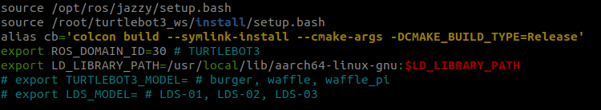

# Docker Container Setup

> **출처**: [https://emanual.robotis.com/docs/en/platform/turtlebot3/docker_container_setup](https://emanual.robotis.com/docs/en/platform/turtlebot3/docker_container_setup)

---


# Docker Container 설정

Docker를 사용하여 TurtleBot3 개발 환경을 설정하면 PC와 SBC를 수동으로 설정할 필요 없이 빠르고 쉽게 시작할 수 있습니다. Docker 컨테이너는 기존의 PC 및 SBC 설정을 대체하여 사용할 수 있습니다.


# 1. Docker 설치

- Ubuntu용 공식 Docker 설치 가이드를 따라 Docker를 설치하세요: [Install Docker Engine on Ubuntu](https://docs.docker.com/engine/install/ubuntu/)
- apt 또는 snap 패키지 매니저를 사용하여 Docker를 설치할 수도 있습니다.


# 2. TurtleBot3 Docker Container 설정

- 컨테이너는 PC든 SBC든 동일한 이미지를 사용하여 생성됩니다.
- `start` 명령어는 Docker Hub에 배포된 이미지를 사용하여 컨테이너를 생성합니다.
- SBC(Raspberry Pi)에서는 Docker 명령어를 실행하기 위해 sudo 권한이 필요합니다.
```
$ cd turtlebot3_ws/src/turtlebot3/docker/${ROS_DISTRO}
$ sudo ./container.sh start
```
- 컨테이너가 생성되면, 컨테이너 안으로 진입합니다.
```
$ sudo ./container.sh enter
```


# 3. bashrc 파일 설정

- Docker 컨테이너 안에서 bashrc 파일을 설정합니다.
- 사용 환경에 맞게 `ROS_DOMAIN_ID`, `TURTLEBOT3_MODEL`, `LDS_MODEL`을 설정하세요.(필요에 따라 해당 줄의 주석을 해제하고 수정하세요.)
```
$ nano ~/.bashrc
```


- `Ctrl` + `S`, `Ctrl` + `X`로 파일을 저장하고 종료합니다. 그런 다음 변경사항을 bashrc에 적용합니다.
```
$ source ~/.bashrc
```


# 4. 설명

**Remote PC에서 Docker 사용:**

- 빌드 없이 원하는 명령어를 바로 실행할 수 있습니다 (예: nav2, slam, teleop 등).
  * Slam
  ```
  $ ros2 launch turtlebot3_cartographer turtlebot3_cartographer.launch.py
  ```

  * Navigation2
  ```
  $ ros2 launch turtlebot3_navigation2 navigation2.launch.py
  ```

  * Teleop
  ```
  $ ros2 run turtlebot3_teleop teleop_keyboard.launch.py
  ```

**SBC에서 Docker 사용:**

- 빌드 없이 bringup을 바로 사용할 수 있습니다.
  - Bringup
  ```
  $ ros2 launch turtlebot3_bringup robot.launch.py
  ```

- PI 카메라를 지원합니다.
  - Camera Launch
  ```
  $ ros2 launch turtlebot3_bringup camera.launch.py
  ```
