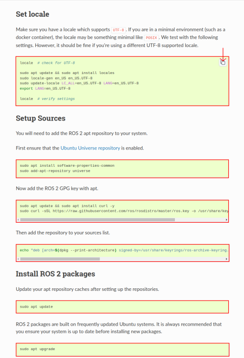
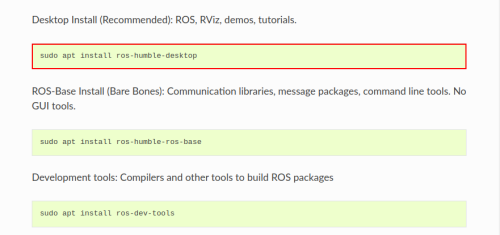
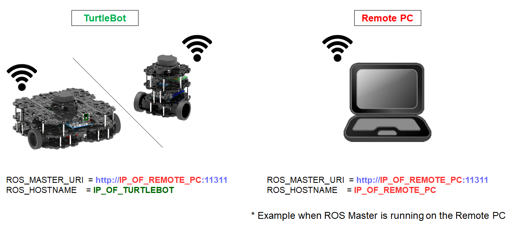
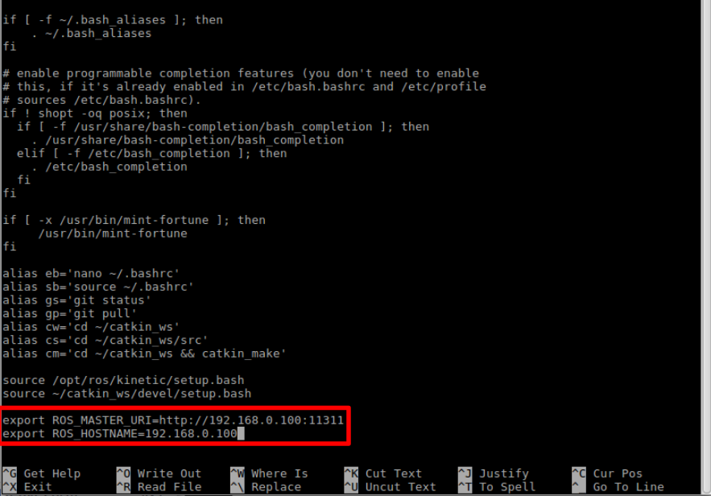

> **출처**: [https://emanual.robotis.com/docs/en/platform/turtlebot3/quick-start](https://emanual.robotis.com/docs/en/platform/turtlebot3/quick-start)

---
# Humble

**현재 ROS 1 Noetic과 ROS 2 Humble이 공식적으로 지원됩니다. 2025년에는 오픈 플랫폼 관리에 추가 리소스가 할당되어 Q1에 Humble 예제 지원을 완료하고 Q2까지 Jazzy로 지원을 확장할 계획입니다. 아래 차트는 각 ROS 배포판에서 지원되는 기능을 개괄적으로 보여줍니다.**

✓ : 사용 가능   ? : 미확인   X : 사용 불가

| 기능 | Noetic | Humble | Jazzy(예정) |
| --- | --- | --- | --- |
| Teleop | ✓ | ✓ | ✓ |
| SLAM | ✓ | ✓ | ✓ |
| Navigation | ✓ | ✓ | ✓ |
| Simulation | ✓ | ✓ | ✓ |
| Manipulation | ✓ | ✓ | X |
| Home Service Challenge | ✓ | X | X |
| Autonomous Driving | ✓ | ✓ | X |
| Machine Learning | X | X | X |


# 3. 빠른 시작 가이드

   * https://youtu.be/2I_29m_Z3WA?si=zKCmMYpevv3eIiGR

## 3.1 PC 설정

> **경고**: 이 장의 내용은 TurtleBot3를 제어하는 데 사용될 `Remote PC`(데스크톱 또는 노트북 PC) 초기화를 위한 것입니다. TurtleBot3 플랫폼 자체에서 이 지침을 수행하지 마세요.

> **호환성 경고**
> - `Jetson Nano`는 네이티브 Ubuntu 20.04를 지원하지 않습니다. 자세한 내용은 [NVIDIA 개발자 포럼](https://forums.developer.nvidia.com/t/when-will-jetpack-move-to-ubuntu-20-04/142517)을 참조하세요.

> **참고**: 이 지침은 `ROS 2 Humble Hawksbill`이 실행되는 `Ubuntu 22.04` Linux 배포판에서 테스트되었습니다.

### 3.1.1 Remote PC에 Ubuntu 다운로드 및 설치
   * 1. 아래 링크에서 PC용 `Ubuntu 22.04 LTS Desktop` 이미지를 다운로드하세요.
     * [Ubuntu 22.04 LTS Desktop 이미지 (64-bit)](https://releases.ubuntu.com/22.04/)
   * 2. 아래 지침에 따라 Ubuntu를 설치하세요.
     * [Install Ubuntu desktop](https://ubuntu.com/tutorials/install-ubuntu-desktop#1-overview)


### 3.1.2 Remote PC에 ROS 2 설치
   * [공식 ROS 2 문서](https://docs.ros.org/en/humble/Installation.html)를 따라 ROS 2 Humble을 설치하세요.
   * 대부분의 Linux 사용자에게는 [Debian 패키지 설치 방법](https://docs.ros.org/en/humble/Installation/Ubuntu-Install-Debians.html)을 적극 권장합니다.

**ROS 2 설치 방법 상세**

1. [Debian 패키지](https://docs.ros.org/en/humble/Installation/Ubuntu-Install-Debians.html) 설치 페이지를 방문하세요.

2. 초록색 상자에 있는 CLI 명령어를 복사하여 터미널에 붙여넣으세요 (ctrl + shift + v)



3. 일반적으로 Remote PC에는 ros-humble-desktop이 권장됩니다.



4. 환경 설정을 bashrc에 추가하세요. **[Remote PC]**

```
echo "source /opt/ros/humble/setup.bash" >> ~/.bashrc  
source ~/.bashrc  
```

### 3.1.3 종속 ROS 2 패키지 설치

1. **Remote PC**에서 `Ctrl` + `Alt` + `T`로 터미널을 엽니다.

2. Gazebo 설치  **[Remote PC]**

```
$ sudo apt install ros-humble-gazebo-*
```

4. Cartographer 설치  **[Remote PC]**

```
$ sudo apt install ros-humble-cartographer
$ sudo apt install ros-humble-cartographer-ros
```

5. Navigation2 설치  **[Remote PC]**

```
$ sudo apt install ros-humble-navigation2
$ sudo apt install ros-humble-nav2-bringup
```


### TurtleBot3 패키지 설치

필요한 TurtleBot3 패키지를 설치합니다.

**[Remote PC]**

```
$ source /opt/ros/humble/setup.bash
$ mkdir -p ~/turtlebot3_ws/src
$ cd ~/turtlebot3_ws/src/
$ git clone -b humble https://github.com/ROBOTIS-GIT/DynamixelSDK.git
$ git clone -b humble https://github.com/ROBOTIS-GIT/turtlebot3_msgs.git
$ git clone -b humble https://github.com/ROBOTIS-GIT/turtlebot3.git
$ sudo apt install python3-colcon-common-extensions
$ cd ~/turtlebot3_ws
$ colcon build --symlink-install
$ echo 'source ~/turtlebot3_ws/install/setup.bash' >> ~/.bashrc
$ source ~/.bashrc
```

### 환경 설정

1. Remote PC의 ROS 환경을 설정합니다.  **[Remote PC]**

```
$ echo 'export ROS_DOMAIN_ID=30 #TURTLEBOT3' >> ~/.bashrc
$ echo 'source /usr/share/gazebo/setup.sh' >> ~/.bashrc
$ echo 'source /opt/ros/humble/setup.bash' >> ~/.bashrc
$ source ~/.bashrc
```

---
# Jazzy

https://youtu.be/2I_29m_Z3WA?si=VK5NZvZkM5J3OBsd

## 3.1 PC 설정

> **경고**: 이 장의 내용은 TurtleBot3를 제어하는 데 사용될 `Remote PC`(데스크톱 또는 노트북 PC) 초기화를 위한 것입니다. TurtleBot3 플랫폼 자체에서 이 지침을 수행하지 마세요.

> **호환성 경고**
> - `Jetson Nano`는 네이티브 Ubuntu 20.04를 지원하지 않습니다. 자세한 내용은 [NVIDIA 개발자 포럼](https://forums.developer.nvidia.com/t/when-will-jetpack-move-to-ubuntu-20-04/142517)을 참조하세요.

> **참고**: 이 지침은 `ROS 2 Jazzy Jalisco`가 실행되는 `Ubuntu 24.04` Linux 배포판에서 테스트되었습니다.


### 3.1.1 Remote PC에 Ubuntu 다운로드 및 설치
   * 1. 아래 링크에서 PC용 `Ubuntu 24.04 LTS Desktop` 이미지를 다운로드하세요.
       [Ubuntu 24.04 LTS Desktop 이미지 (64-bit)](https://releases.ubuntu.com/noble/)
   * 2. 아래 지침에 따라 Ubuntu를 설치하세요.
       [Install Ubuntu desktop](https://ubuntu.com/tutorials/install-ubuntu-desktop#1-overview)

### 3.1.2 Remote PC에 ROS 2 설치
   * [공식 ROS 2 문서](https://docs.ros.org/en/jazzy/Installation.html)를 따라 ROS 2 Jazzy를 설치하세요.
   * 대부분의 Linux 사용자에게는 [Debian 패키지 설치 방법](https://docs.ros.org/en/jazzy/Installation/Ubuntu-Install-Debians.html)을 적극 권장합니다.

**ROS 2 설치 방법 상세**

1. [Debian 패키지](https://docs.ros.org/en/humble/Installation/Ubuntu-Install-Debians.html) 설치 페이지를 방문하세요.

2. 초록색 상자에 있는 CLI 명령어를 복사하여 터미널에 붙여넣으세요 (ctrl + shift + v)


3. 일반적으로 Remote PC에는 ros-humble-desktop이 권장됩니다.


4. 환경 설정을 bashrc에 추가하세요. **[Remote PC]**

```
echo "source /opt/ros/humble/setup.bash" >> ~/.bashrc  
source ~/.bashrc  
```

### 3.1.3 종속 ROS 2 패키지 설치
   * 1. **Remote PC**에서 `Ctrl` + `Alt` + `T`로 터미널을 엽니다.
   * 2. Gazebo Sim 설치  **[Remote PC]**
```
$ sudo apt-get update
$ sudo apt-get install curl lsb-release gnupg
$ sudo curl https://packages.osrfoundation.org/gazebo.gpg --output /usr/share/keyrings/pkgs-osrf-archive-keyring.gpg
$ echo "deb [arch=$(dpkg --print-architecture) signed-by=/usr/share/keyrings/pkgs-osrf-archive-keyring.gpg] http://packages.osrfoundation.org/gazebo/ubuntu-stable $(lsb_release -cs) main" | sudo tee /etc/apt/sources.list.d/gazebo-stable.list > /dev/null
$ sudo apt-get update
$ sudo apt-get install gz-harmonic
```

3. Cartographer 설치  **[Remote PC]**

```
$ sudo apt install ros-jazzy-cartographer
$ sudo apt install ros-jazzy-cartographer-ros
```

4. Navigation2 설치  **[Remote PC]**

```
$ sudo apt install ros-jazzy-navigation2
$ sudo apt install ros-jazzy-nav2-bringup
```


### TurtleBot3 패키지 설치

필요한 TurtleBot3 패키지를 설치합니다.

**[Remote PC]**

```
$ source /opt/ros/jazzy/setup.bash
$ mkdir -p ~/turtlebot3_ws/src
$ cd ~/turtlebot3_ws/src/
$ git clone -b jazzy https://github.com/ROBOTIS-GIT/DynamixelSDK.git
$ git clone -b jazzy https://github.com/ROBOTIS-GIT/turtlebot3_msgs.git
$ git clone -b jazzy https://github.com/ROBOTIS-GIT/turtlebot3.git
$ sudo apt install python3-colcon-common-extensions
$ cd ~/turtlebot3_ws
$ colcon build --symlink-install
$ echo 'source ~/turtlebot3_ws/install/setup.bash' >> ~/.bashrc
$ source ~/.bashrc
```

### 환경 설정

1. Remote PC의 ROS 환경을 설정합니다.  **[Remote PC]**

```
$ echo 'export ROS_DOMAIN_ID=30 #TURTLEBOT3' >> ~/.bashrc
$ echo 'source /opt/ros/jazzy/setup.bash' >> ~/.bashrc
$ source ~/.bashrc
```

---
# Noetic

https://youtu.be/ji2kQXgCjeM?si=p-uhHHO0maF3VZEo

## 3.1 PC 설정

> **경고**: 이 장의 내용은 TurtleBot3를 제어하는 데 사용될 `Remote PC`(데스크톱 또는 노트북 PC) 초기화를 위한 것입니다. TurtleBot3 플랫폼 자체에서 이 지침을 수행하지 마세요.

> **호환성 경고**
> - `Jetson Nano`는 네이티브 Ubuntu 20.04를 지원하지 않습니다. 자세한 내용은 [NVIDIA 개발자 포럼](https://forums.developer.nvidia.com/t/when-will-jetpack-move-to-ubuntu-20-04/142517)을 참조하세요.

> **참고**: 이 지침은 `ROS1 Noetic Ninjemys`가 실행되는 `Ubuntu 20.04` Linux 배포판에서 테스트되었습니다.

### 3.1.1 Remote PC에 Ubuntu 다운로드 및 설치
   * 1. 아래 링크에서 PC용 `Ubuntu 20.04 LTS Desktop` 이미지를 다운로드하세요.
      [Ubuntu 20.04 LTS Desktop 이미지 (64-bit)](https://releases.ubuntu.com/20.04/)
   * 2. 아래 지침에 따라 Ubuntu를 설치하세요.
      [Install Ubuntu desktop](https://www.ubuntu.com/download/desktop/install-ubuntu-desktop)


### 3.1.2 Remote PC에 ROS 설치

   * `Ctrl` + `Alt` + `T`로 터미널을 열고 아래 명령어를 한 번에 하나씩 입력하세요.
   * 설치 스크립트의 내용을 확인하려면 [스크립트 파일](https://raw.githubusercontent.com/ROBOTIS-GIT/robotis_tools/master/install_ros_noetic.sh)을 참조하세요.

**[Remote PC]**

```
$ sudo apt update
$ sudo apt upgrade
$ wget https://raw.githubusercontent.com/ROBOTIS-GIT/robotis_tools/master/install_ros_noetic.sh
$ chmod 755 ./install_ros_noetic.sh 
$ bash ./install_ros_noetic.sh
```

   * 위 설치가 실패하면 [공식 ROS1 Noetic 설치 가이드](http://wiki.ros.org/noetic/Installation/Ubuntu)를 참조하세요.


### 3.1.3 종속 ROS 패키지 설치

**[Remote PC]**

```
$ sudo apt-get install ros-noetic-joy ros-noetic-teleop-twist-joy \
  ros-noetic-teleop-twist-keyboard ros-noetic-laser-proc \
  ros-noetic-rgbd-launch ros-noetic-rosserial-arduino \
  ros-noetic-rosserial-python ros-noetic-rosserial-client \
  ros-noetic-rosserial-msgs ros-noetic-amcl ros-noetic-map-server \
  ros-noetic-move-base ros-noetic-urdf ros-noetic-xacro \
  ros-noetic-compressed-image-transport ros-noetic-rqt* ros-noetic-rviz \
  ros-noetic-gmapping ros-noetic-navigation ros-noetic-interactive-markers
```


### 3.1.4 TurtleBot3 패키지 설치

* 필요한 TurtleBot3 Debian 패키지를 설치합니다.

**[Remote PC]**

```
$ sudo apt install ros-noetic-dynamixel-sdk
$ sudo apt install ros-noetic-turtlebot3-msgs
$ sudo apt install ros-noetic-turtlebot3
```

**소스에서 TurtleBot3 패키지 빌드하기**

   * 중복을 피하기 위해 미리 컴파일된 동일한 패키지가 있다면 제거하세요.
   **[Remote PC]**

```
$ sudo apt remove ros-noetic-dynamixel-sdk
$ sudo apt remove ros-noetic-turtlebot3-msgs
$ sudo apt remove ros-noetic-turtlebot3
```

   * 소스 코드를 직접 다운로드하여 패키지를 빌드해야 하는 경우 아래 명령어를 사용하세요.
   **[Remote PC]**

```
$ mkdir -p ~/catkin_ws/src
$ cd ~/catkin_ws/src/
$ git clone -b noetic https://github.com/ROBOTIS-GIT/DynamixelSDK.git
$ git clone -b noetic https://github.com/ROBOTIS-GIT/turtlebot3_msgs.git
$ git clone -b noetic https://github.com/ROBOTIS-GIT/turtlebot3.git
$ cd ~/catkin_ws && catkin_make
$ echo "source ~/catkin_ws/devel/setup.bash" >> ~/.bashrc
```

### 3.1.5 네트워크 설정



1. PC를 WiFi 네트워크에 연결하고 아래 명령어로 할당된 IP 주소를 확인하세요.
**[Remote PC]**

```
   $ ifconfig
```


2. 아래 명령어로 파일을 열고 ROS IP 설정을 업데이트하세요.
**[Remote PC]**

```
$ nano ~/.bashrc
```

3. Ctrl + END 또는 Alt + /를 눌러 커서를 줄 끝으로 이동합니다. ROS_MASTER_URI와 ROS_HOSTNAME의 localhost 주소를 이전 터미널 창에서 확인한 IP 주소로 수정하세요.



4. 업데이트된 bashrc를 다음 명령어로 적용하세요.
**[Remote PC]**

```
$ source ~/.bashrc
```
