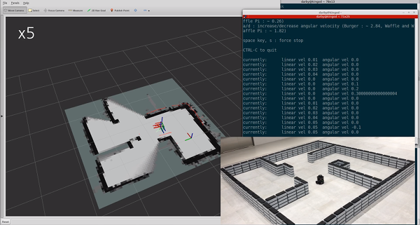
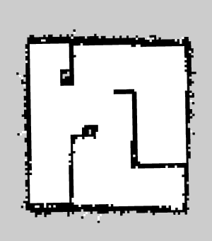

> **출처**: [https://emanual.robotis.com/docs/en/platform/turtlebot3/slam](https://emanual.robotis.com/docs/en/platform/turtlebot3/slam)

---
# TOC

1. [Humble](#humble)
2. [Jazzy](#jazzy)
3. [Noetic](#noetic)

---
[TOC](#toc)
# Humble


# 4. SLAM

> **참고**
> - SLAM은 **Remote PC**에서 실행해야 합니다.
> - 모든 작업을 실행하기 전에 TurtleBot3에서 [Bringup](https://emanual.robotis.com/docs/en/platform/turtlebot3/bringup)을 실행했는지 확인하세요.

**SLAM(Simultaneous Localization and Mapping)** 은 임의의 공간에서 현재 위치를 추정하여 지도를 그리는 기술입니다. 아래 동영상은 TurtleBot3가 SLAM 기술을 사용하여 얼마나 정확하게 지도를 그릴 수 있는지 보여줍니다.

https://youtu.be/lkW4-dG2BCY?si=XSC_G6b_Hu858jNC

## 4.1 SLAM 노드 실행

1. TurtleBot3 SBC에서 `Bringup`이 실행 중이지 않다면, 먼저 Bringup을 실행하세요. **이전에 bringup을 실행했다면 이 단계를 건너뛰세요.**
   * Remote PC에서 `Ctrl` + `Alt` + `T`로 새 터미널을 열고 Raspberry Pi의 IP 주소로 연결합니다. 기본 비밀번호는 ubuntu입니다.
   ```
   $ ssh ubuntu@{IP_ADDRESS_OF_RASPBERRY_PI}
   ```
   * TURTLEBOT3_MODEL 파라미터에 `burger`, `waffle`, `waffle_pi` 중 적절한 키워드를 사용하세요.
   **[TurtleBot3 SBC]**
   ```
   $ export TURTLEBOT3_MODEL=burger
   $ ros2 launch turtlebot3_bringup robot.launch.py
   ```

2. Remote PC에서 `Ctrl` + `Alt` + `T`로 새 터미널을 열고 SLAM 노드를 실행합니다. 기본 SLAM 방식으로 Cartographer가 사용됩니다.  
  **[Remote PC]**
  ```
  $ export TURTLEBOT3_MODEL=burger
  $ ros2 launch turtlebot3_cartographer cartographer.launch.py
  ```

   

**TURTLEBOT3_MODEL 파라미터를 저장하는 방법?**

  * `$ export TURTLEBOT3_MODEL=${TB3_MODEL}` 명령어는 .bashrc 파일에 TURTLEBOT3_MODEL 파라미터가 미리 정의되어 있으면 생략할 수 있습니다.
  * .bashrc 파일은 터미널 창이 생성될 때 자동으로 로드됩니다.

   * TurtleBot3 Burger를 기본 모델로 지정하는 예시.
      **[Remote PC]**
```
$ echo 'export TURTLEBOT3_MODEL=burger' >> ~/.bashrc
$ source ~/.bashrc
```

   * TurtleBot3 Waffle Pi를 기본 모델로 지정하는 예시.
      **[Remote PC]**
```
$ echo 'export TURTLEBOT3_MODEL=waffle_pi' >> ~/.bashrc
$ source ~/.bashrc
```

## 4.2 원격 제어 노드 실행

SLAM 노드가 성공적으로 실행되면 TurtleBot3가 원격 제어를 통해 지도의 미지 영역을 탐색합니다. 선속도와 각속도를 너무 빠르게 변경하는 등의 급격한 움직임은 피하는 것이 중요합니다. TurtleBot3로 지도를 작성할 때는 지도의 모든 구석을 스캔하는 것이 좋습니다.

1. 새 터미널을 열고 Remote PC에서 원격 제어 노드를 실행합니다. `TURTLEBOT3_MODEL` 파라미터에 `burger`, `waffle`, `waffle_pi` 중 적절한 키워드를 사용하세요. **[Remote PC]**

```
$ export TURTLEBOT3_MODEL=burger
$ ros2 run turtlebot3_teleop teleop_keyboard

Control Your TurtleBot3!
---------------------------
Moving around:
       w
  a    s    d
       x

w/x : increase/decrease linear velocity
a/d : increase/decrease angular velocity
space key, s : force stop

CTRL-C to quit
```

2. 탐색을 시작하고 지도를 그립니다.


## 4.3 튜닝 가이드

ROS2의 SLAM은 `Lua` 파일을 통해 설정 옵션을 제공하는 Cartographer ROS를 사용합니다.

아래 옵션은 `turtlebot3_cartographer/config/turtlebot3_lds_2d.lua` 파일에 정의되어 있습니다.
각 옵션에 대한 자세한 내용은 [Cartographer ROS 공식 문서](https://google-cartographer-ros.readthedocs.io/en/latest/algo_walkthrough.html)를 참조하세요.


### 4.3.1 MAP_BUILDER.use_trajectory_builder_2d
   * 이 옵션은 SLAM의 유형을 설정합니다.

### 4.3.2 TRAJECTORY_BUILDER_2D.min_range
   * 이 옵션은 라이다 센서의 최소 사용 가능 범위를 설정합니다.

### 4.3.3 TRAJECTORY_BUILDER_2D.max_range
   * 이 옵션은 라이다 센서의 최대 사용 가능 범위를 설정합니다.

### 4.3.4 TRAJECTORY_BUILDER_2D.missing_data_ray_length
   * 2D에서 Cartographer는 max_range보다 먼 범위를 TRAJECTORY_BUILDER_2D.missing_data_ray_length로 대체합니다.

### 4.3.5 TRAJECTORY_BUILDER_2D.use_imu_data
   * 2D SLAM을 사용하는 경우 추가 정보 소스 없이도 범위 데이터를 실시간으로 처리할 수 있으므로 Cartographer가 IMU를 사용할지 여부를 선택할 수 있습니다.

### 4.3.6 TRAJECTORY_BUILDER_2D.use_online_correlative_scan_matching
   * **Local SLAM**: RealTimeCorrelativeScanMatcher는 센서의 신뢰도에 따라 켜고 끌 수 있습니다.

### 4.3.7 TRAJECTORY_BUILDER_2D.motion_filter.max_angle_radians
   * **Local SLAM**: 서브맵에 너무 많은 스캔이 삽입되는 것을 방지하기 위해, 움직임이 특정 각도를 초과하지 않으면 스캔이 드롭됩니다.

### 4.3.8 POSE_GRAPH.optimize_every_n_nodes
   * **Global SLAM**: POSE_GRAPH.optimize_every_n_nodes를 0으로 설정하면 global SLAM을 비활성화하고 local SLAM의 동작에 집중할 수 있는 유용한 방법입니다.

### 4.3.9 POSE_GRAPH.constraint_builder.min_score
   * **Global SLAM**: 스캔 매치 점수의 임계값으로, 이 값보다 낮으면 매치로 간주하지 않습니다. 낮은 점수는 스캔과 지도가 유사하지 않음을 나타냅니다.

### 4.3.10 POSE_GRAPH.constraint_builder.global_localization_min_score
   * **Global SLAM**: 이 값보다 낮은 전역 위치 추정은 신뢰하지 않는 임계값입니다.

> **참고**: 제약 조건은 RViz에서 시각화할 수 있으므로 global SLAM 튜닝에 매우 유용합니다. 또한 POSE_GRAPH.constraint_builder.log_matches를 설정하여 제약 조건 빌더의 정기적인 보고서를 히스토그램 형식으로 받을 수 있습니다.

## 4.4 지도 저장

지도는 로봇의 [odometry](https://en.wikipedia.org/wiki/Odometry), [tf](http://wiki.ros.org/tf) 및 스캔 정보를 기반으로 그려집니다.
이 지도 데이터는 TurtleBot3가 이동함에 따라 RViz 창에 그려집니다.
원하는 영역의 지도가 완성되면 나중에 사용하기 위해 지도 데이터를 로컬 드라이브에 저장하세요.

1. nav2_map_server 패키지의 **map_saver_cli** 노드를 실행하여 지도 파일을 생성합니다. 지도 파일은 map_saver_cli 노드가 실행된 디렉토리에 저장됩니다. 특정 파일 이름을 지정하지 않으면 기본 파일 이름으로 `map`이 사용되어 `map.pgm`과 `map.yaml`이 생성됩니다.  
**[Remote PC]**
```
$ ros2 run nav2_map_server map_saver_cli -f ~/map
```

`-f` 옵션은 파일이 저장될 폴더 위치와 파일 이름을 지정합니다. 위 명령어를 사용하면 `map.pgm`과 `map.yaml`이 홈 폴더 `~/` (/home/${username})에 저장됩니다.

## 4.5 지도

지도는 ROS에서 일반적으로 사용되는 2차원 **Occupancy Grid Map (OGM)** 을 사용합니다.
저장된 지도는 아래 그림과 같으며, **흰색** 영역은 충돌이 없는 자유 영역, **검은색** 영역은 점유되어 접근할 수 없는 영역, **회색** 영역은 미지의 영역을 나타냅니다.
이 지도는 [내비게이션](https://emanual.robotis.com/docs/en/platform/turtlebot3/navigation)에 사용됩니다.



아래 그림은 TurtleBot3를 사용하여 큰 지도를 생성한 결과를 보여줍니다. 약 350미터를 이동하며 지도를 만드는 데 약 1시간이 걸렸습니다.


---
[TOC](#toc)
# Jazzy


# 4. SLAM

> **참고**
> - SLAM은 **Remote PC**에서 실행해야 합니다.
> - 모든 작업을 실행하기 전에 TurtleBot3에서 [Bringup](https://emanual.robotis.com/docs/en/platform/turtlebot3/bringup)을 실행했는지 확인하세요.

**SLAM(Simultaneous Localization and Mapping)** 은 임의의 공간에서 현재 위치를 추정하여 지도를 그리는 기술입니다. 아래 동영상은 TurtleBot3가 SLAM 기술을 사용하여 얼마나 정확하게 지도를 그릴 수 있는지 보여줍니다.

https://youtu.be/lkW4-dG2BCY?si=XSC_G6b_Hu858jNC

## 4.1 SLAM 노드 실행

1. TurtleBot3 SBC에서 `Bringup`이 실행 중이지 않다면, 먼저 Bringup을 실행하세요. **이전에 bringup을 실행했다면 이 단계를 건너뛰세요.**
   * Remote PC에서 `Ctrl` + `Alt` + `T`로 새 터미널을 열고 Raspberry Pi의 IP 주소로 연결합니다. 기본 비밀번호는 ubuntu입니다.
   ```
   $ ssh ubuntu@{IP_ADDRESS_OF_RASPBERRY_PI}
   ```
   * TURTLEBOT3_MODEL 파라미터에 `burger`, `waffle`, `waffle_pi` 중 적절한 키워드를 사용하세요.
   **[TurtleBot3 SBC]**
   ```
   $ export TURTLEBOT3_MODEL=burger
   $ ros2 launch turtlebot3_bringup robot.launch.py
   ```

2. Remote PC에서 `Ctrl` + `Alt` + `T`로 새 터미널을 열고 SLAM 노드를 실행합니다. 기본 SLAM 방식으로 Cartographer가 사용됩니다.  
  **[Remote PC]**
  ```
  $ export TURTLEBOT3_MODEL=burger
  $ ros2 launch turtlebot3_cartographer cartographer.launch.py
  ```

   

**TURTLEBOT3_MODEL 파라미터를 저장하는 방법?**

  * `$ export TURTLEBOT3_MODEL=${TB3_MODEL}` 명령어는 .bashrc 파일에 TURTLEBOT3_MODEL 파라미터가 미리 정의되어 있으면 생략할 수 있습니다.
  * .bashrc 파일은 터미널 창이 생성될 때 자동으로 로드됩니다.

   * TurtleBot3 Burger를 기본 모델로 지정하는 예시.
      **[Remote PC]**
```
$ echo 'export TURTLEBOT3_MODEL=burger' >> ~/.bashrc
$ source ~/.bashrc
```

   * TurtleBot3 Waffle Pi를 기본 모델로 지정하는 예시.
      **[Remote PC]**
```
$ echo 'export TURTLEBOT3_MODEL=waffle_pi' >> ~/.bashrc
$ source ~/.bashrc
```

## 4.2 원격 제어 노드 실행

SLAM 노드가 성공적으로 실행되면 TurtleBot3가 원격 제어를 통해 지도의 미지 영역을 탐색합니다. 선속도와 각속도를 너무 빠르게 변경하는 등의 급격한 움직임은 피하는 것이 중요합니다. TurtleBot3로 지도를 작성할 때는 지도의 모든 구석을 스캔하는 것이 좋습니다.

1. 새 터미널을 열고 Remote PC에서 원격 제어 노드를 실행합니다. `TURTLEBOT3_MODEL` 파라미터에 `burger`, `waffle`, `waffle_pi` 중 적절한 키워드를 사용하세요. **[Remote PC]**

```
$ export TURTLEBOT3_MODEL=burger
$ ros2 run turtlebot3_teleop teleop_keyboard

Control Your TurtleBot3!
---------------------------
Moving around:
       w
  a    s    d
       x

w/x : increase/decrease linear velocity
a/d : increase/decrease angular velocity
space key, s : force stop

CTRL-C to quit
```

2. 탐색을 시작하고 지도를 그립니다.


## 4.3 튜닝 가이드

ROS2의 SLAM은 `Lua` 파일을 통해 설정 옵션을 제공하는 Cartographer ROS를 사용합니다.

아래 옵션은 `turtlebot3_cartographer/config/turtlebot3_lds_2d.lua` 파일에 정의되어 있습니다.
각 옵션에 대한 자세한 내용은 [Cartographer ROS 공식 문서](https://google-cartographer-ros.readthedocs.io/en/latest/algo_walkthrough.html)를 참조하세요.


### 4.3.1 MAP_BUILDER.use_trajectory_builder_2d
   * 이 옵션은 SLAM의 유형을 설정합니다.

### 4.3.2 TRAJECTORY_BUILDER_2D.min_range
   * 이 옵션은 라이다 센서의 최소 사용 가능 범위를 설정합니다.

### 4.3.3 TRAJECTORY_BUILDER_2D.max_range
   * 이 옵션은 라이다 센서의 최대 사용 가능 범위를 설정합니다.

### 4.3.4 TRAJECTORY_BUILDER_2D.missing_data_ray_length
   * 2D에서 Cartographer는 max_range보다 먼 범위를 TRAJECTORY_BUILDER_2D.missing_data_ray_length로 대체합니다.

### 4.3.5 TRAJECTORY_BUILDER_2D.use_imu_data
   * 2D SLAM을 사용하는 경우 추가 정보 소스 없이도 범위 데이터를 실시간으로 처리할 수 있으므로 Cartographer가 IMU를 사용할지 여부를 선택할 수 있습니다.

### 4.3.6 TRAJECTORY_BUILDER_2D.use_online_correlative_scan_matching
   * **Local SLAM**: RealTimeCorrelativeScanMatcher는 센서의 신뢰도에 따라 켜고 끌 수 있습니다.

### 4.3.7 TRAJECTORY_BUILDER_2D.motion_filter.max_angle_radians
   * **Local SLAM**: 서브맵에 너무 많은 스캔이 삽입되는 것을 방지하기 위해, 움직임이 특정 각도를 초과하지 않으면 스캔이 드롭됩니다.

### 4.3.8 POSE_GRAPH.optimize_every_n_nodes
   * **Global SLAM**: POSE_GRAPH.optimize_every_n_nodes를 0으로 설정하면 global SLAM을 비활성화하고 local SLAM의 동작에 집중할 수 있는 유용한 방법입니다.

### 4.3.9 POSE_GRAPH.constraint_builder.min_score
   * **Global SLAM**: 스캔 매치 점수의 임계값으로, 이 값보다 낮으면 매치로 간주하지 않습니다. 낮은 점수는 스캔과 지도가 유사하지 않음을 나타냅니다.

### 4.3.10 POSE_GRAPH.constraint_builder.global_localization_min_score
   * **Global SLAM**: 이 값보다 낮은 전역 위치 추정은 신뢰하지 않는 임계값입니다.

> **참고**: 제약 조건은 RViz에서 시각화할 수 있으므로 global SLAM 튜닝에 매우 유용합니다. 또한 POSE_GRAPH.constraint_builder.log_matches를 설정하여 제약 조건 빌더의 정기적인 보고서를 히스토그램 형식으로 받을 수 있습니다.

## 4.4 지도 저장

지도는 로봇의 [odometry](https://en.wikipedia.org/wiki/Odometry), [tf](http://wiki.ros.org/tf) 및 스캔 정보를 기반으로 그려집니다.
이 지도 데이터는 TurtleBot3가 이동함에 따라 RViz 창에 그려집니다.
원하는 영역의 지도가 완성되면 나중에 사용하기 위해 지도 데이터를 로컬 드라이브에 저장하세요.

1. nav2_map_server 패키지의 **map_saver_cli** 노드를 실행하여 지도 파일을 생성합니다. 지도 파일은 map_saver_cli 노드가 실행된 디렉토리에 저장됩니다. 특정 파일 이름을 지정하지 않으면 기본 파일 이름으로 `map`이 사용되어 `map.pgm`과 `map.yaml`이 생성됩니다.  
**[Remote PC]**
```
$ ros2 run nav2_map_server map_saver_cli -f ~/map
```

`-f` 옵션은 파일이 저장될 폴더 위치와 파일 이름을 지정합니다. 위 명령어를 사용하면 `map.pgm`과 `map.yaml`이 홈 폴더 `~/` (/home/${username})에 저장됩니다.

## 4.5 지도

지도는 ROS에서 일반적으로 사용되는 2차원 **Occupancy Grid Map (OGM)** 을 사용합니다.
저장된 지도는 아래 그림과 같으며, **흰색** 영역은 충돌이 없는 자유 영역, **검은색** 영역은 점유되어 접근할 수 없는 영역, **회색** 영역은 미지의 영역을 나타냅니다.
이 지도는 [내비게이션](https://emanual.robotis.com/docs/en/platform/turtlebot3/navigation)에 사용됩니다.


아래 그림은 TurtleBot3를 사용하여 큰 지도를 생성한 결과를 보여줍니다. 약 350미터를 이동하며 지도를 만드는 데 약 1시간이 걸렸습니다.


---
[TOC](#toc)
# Noetic

# 4. SLAM

> **참고**
> - SLAM은 **Remote PC**에서 실행해야 합니다.
> - 모든 작업을 실행하기 전에 TurtleBot3에서 [Bringup](https://emanual.robotis.com/docs/en/platform/turtlebot3/bringup)을 실행했는지 확인하세요.

**SLAM(Simultaneous Localization and Mapping)** 은 임의의 공간에서 현재 위치를 추정하여 지도를 그리는 기술입니다. 아래 동영상은 TurtleBot3가 SLAM 기술을 사용하여 얼마나 정확하게 지도를 그릴 수 있는지 보여줍니다.

https://youtu.be/lkW4-dG2BCY?si=XSC_G6b_Hu858jNC

## 4.1 SLAM 노드 실행
1. Remote PC에서 roscore를 실행합니다.
**[Remote PC]**
```
$ roscore
```

2. TurtleBot3 SBC에서 Bringup이 실행 중이지 않다면 Bringup을 실행합니다. 이미 bringup이 실행 중이라면 이 단계를 건너뛰세요.
  * Remote PC에서 `Ctrl` + `Alt` + `T`로 새 터미널을 열고 Raspberry Pi의 IP 주소로 연결합니다. 기본 비밀번호는 turtlebot입니다. TURTLEBOT3_MODEL 파라미터를 사용하여 TurtleBot3 모델(burger, waffle, waffle_pi)을 지정하세요. [Remote PC]
```
$ ssh pi@{IP_ADDRESS_OF_RASPBERRY_PI}
$ export TURTLEBOT3_MODEL=${TB3_MODEL}
$ roslaunch turtlebot3_bringup turtlebot3_robot.launch
```
3. Remote PC에서 `Ctrl` + `Alt` + `T`로 새 터미널을 열고 SLAM 노드를 실행합니다. 기본 SLAM 방식으로 Gmapping이 사용됩니다. TURTLEBOT3_MODEL 파라미터를 사용하여 TurtleBot3 모델(burger, waffle, waffle_pi)을 지정하세요. **[Remote PC]**
```
$ export TURTLEBOT3_MODEL=burger
$ roslaunch turtlebot3_slam turtlebot3_slam.launch
```
**TURTLEBOT3_MODEL 파라미터를 저장하는 방법?**

* `$ export TURTLEBOT3_MODEL=${TB3_MODEL}` 명령어는 시스템의 .bashrc 파일에 TURTLEBOT3_MODEL 파라미터가 미리 정의되어 있으면 생략할 수 있습니다.
* .bashrc 파일은 터미널 창이 생성될 때 자동으로 로드됩니다.

* TurtleBot3 Burger를 기본 모델로 지정하는 예시.
**[Remote PC]**
```
$ echo 'export TURTLEBOT3_MODEL=burger' >> ~/.bashrc
$ source ~/.bashrc
```

* TurtleBot3 Waffle Pi를 기본 모델로 지정하는 예시.
**[Remote PC]**
```
$ echo 'export TURTLEBOT3_MODEL=waffle_pi' >> ~/.bashrc
$ source ~/.bashrc
```
**다른 SLAM 방식 알아보기**

* Gmapping (ROS WIKI, Github)
1. Remote PC에 필요한 패키지를 설치합니다.
  * Gmapping 관련 패키지는 PC 설정 섹션에서 이미 설치되었습니다.
2. Gmapping SLAM 노드를 실행합니다.
**[Remote PC]**
```
$ roslaunch turtlebot3_slam turtlebot3_slam.launch slam_methods:=gmapping
```

* Cartographer (ROS WIKI, Github)
1. Remote PC에서 필요한 패키지를 다운로드하고 빌드합니다.
  * Cartographer는 현재 ROS1 Noetic용 바이너리 설치 방법을 제공하지 않습니다. 다음 안내에 따라 소스 코드를 다운로드하여 빌드하세요. 자세한 내용은 공식 위키 페이지를 참조하세요.
**[Remote PC]**
```
$ sudo apt update
$ sudo apt install -y python3-wstool python3-rosdep ninja-build stow
$ cd ~/catkin_ws/src
$ wstool init src
$ wstool merge -t src https://raw.githubusercontent.com/cartographer-project/cartographer_ros/master/cartographer_ros.rosinstall
$ wstool update -t src
$ sudo rosdep init
$ rosdep update
$ rosdep install --from-paths src --ignore-src --rosdistro=noetic -y
$ src/cartographer/scripts/install_abseil.sh
$ sudo apt remove ros-noetic-abseil-cpp
$ catkin_make_isolated --install --use-ninja
```
1. Cartographer SLAM 노드를 실행합니다.
**[Remote PC]**
```
$ source ~/catkin_ws/install_isolated/setup.bash
$ roslaunch turtlebot3_slam turtlebot3_slam.launch slam_methods:=cartographer
```

* Karto (ROS WIKI, Github)
1. PC에 종속 패키지를 설치합니다.
**[Remote PC]**
```
$ sudo apt install ros-noetic-slam-karto
```
1. Karto SLAM 노드를 실행합니다.
**[Remote PC]**
```
$ roslaunch turtlebot3_slam turtlebot3_slam.launch slam_methods:=karto
```

## 4.2 원격 제어 노드 실행

SLAM 노드가 성공적으로 실행되면 TurtleBot3가 원격 제어를 통해 지도의 미지 영역을 탐색합니다. 선속도와 각속도를 너무 빠르게 변경하는 등의 급격한 움직임은 피하는 것이 중요합니다. TurtleBot3로 지도를 작성할 때는 지도의 모든 구석을 스캔하는 것이 좋습니다.

1. 새 터미널을 열고 Remote PC에서 원격 제어 노드를 실행합니다. `TURTLEBOT3_MODEL` 파라미터에 `burger`, `waffle`, `waffle_pi` 중 적절한 키워드를 사용하세요. **[Remote PC]**

```
$ export TURTLEBOT3_MODEL=burger
$ ros2 run turtlebot3_teleop teleop_keyboard

Control Your TurtleBot3!
---------------------------
Moving around:
       w
  a    s    d
       x

w/x : increase/decrease linear velocity
a/d : increase/decrease angular velocity
space key, s : force stop

CTRL-C to quit
```

2. 탐색을 시작하고 지도를 그립니다.


## 4.3 튜닝 가이드
* Gmapping은 다양한 환경에 맞게 성능을 변경할 수 있는 많은 파라미터를 제공합니다. 특정 파라미터에 대한 자세한 내용은 ROS Wiki 또는 ROS Robot Programming 11장을 참조하세요. 이 튜닝 가이드는 gmapping 파라미터를 구성할 때 유용한 팁을 제공합니다. 환경에 맞게 SLAM 성능을 최적화하려면 이 섹션이 도움이 될 수 있습니다.

아래 파라미터는 `turtlebot3_slam/config/gmapping_params.yaml` 파일에 정의되어 있습니다.

### 4.3.1 maxUrange
이 파라미터는 라이다 센서의 최대 사용 가능 범위를 설정합니다.

### 4.3.2 map_update_interval
이 파라미터는 지도 업데이트 사이의 시간 간격을 정의합니다. 값이 작을수록 지도가 더 자주 업데이트됩니다.
단, 너무 작게 설정하면 지도 계산에 더 많은 처리 성능이 필요합니다.


### 4.3.3 minimumScore
이 파라미터는 센서의 스캔 데이터 매칭 테스트의 성공 또는 실패를 결정하는 최소 점수 값을 설정합니다. 넓은 영역에서 로봇의 예상 위치 오류를 줄일 수 있습니다. 파라미터가 적절히 설정되면 아래와 유사한 출력 정보가 표시됩니다.
```
Average Scan Matching Score=278.965
neff= 100
Registering Scans:Done
update frame 6
update ld=2.95935e-05 ad=0.000302522
Laser Pose= -0.0320253 -5.36882e-06 -3.14142
```

너무 높게 설정하면 아래와 같은 경고가 표시될 수 있습니다.
```
Scan Matching Failed, using odometry. Likelihood=0
lp:-0.0306155 5.75314e-06 -3.14151
op:-0.0306156 5.90277e-06 -3.14151
```

### 4.3.4 linearUpdate
로봇이 이 값보다 더 먼 거리를 이동하면 스캔 프로세스를 실행합니다.

### 4.3.5 angularUpdate
로봇이 이 값보다 더 많이 회전하면 스캔 프로세스를 실행합니다. 이 값은 linearUpdate보다 낮게 설정하는 것이 좋습니다.

## 4.4 지도 저장

지도는 로봇의 [odometry](https://en.wikipedia.org/wiki/Odometry), [tf](http://wiki.ros.org/tf) 및 스캔 정보를 기반으로 그려집니다.
이 지도 데이터는 TurtleBot3가 이동함에 따라 RViz 창에 그려집니다.
원하는 영역의 지도가 완성되면 나중에 사용하기 위해 지도 데이터를 로컬 드라이브에 저장하세요.

1. nav2_map_server 패키지의 **map_saver_cli** 노드를 실행하여 지도 파일을 생성합니다. 지도 파일은 map_saver_cli 노드가 실행된 디렉토리에 저장됩니다. 특정 파일 이름을 지정하지 않으면 기본 파일 이름으로 `map`이 사용되어 `map.pgm`과 `map.yaml`이 생성됩니다.  
**[Remote PC]**
```
$ rosrun map_server map_saver -f ~/map
```

`-f` 옵션은 파일이 저장될 폴더 위치와 파일 이름을 지정합니다. 위 명령어를 사용하면 `map.pgm`과 `map.yaml`이 홈 폴더 `~/` (/home/${username})에 저장됩니다.

## 4.5 지도

지도는 ROS에서 일반적으로 사용되는 2차원 **Occupancy Grid Map (OGM)** 을 사용합니다.
저장된 지도는 아래 그림과 같으며, **흰색** 영역은 충돌이 없는 자유 영역, **검은색** 영역은 점유되어 접근할 수 없는 영역, **회색** 영역은 미지의 영역을 나타냅니다.
이 지도는 [내비게이션](https://emanual.robotis.com/docs/en/platform/turtlebot3/navigation)에 사용됩니다.


아래 그림은 TurtleBot3를 사용하여 큰 지도를 생성한 결과를 보여줍니다. 약 350미터를 이동하며 지도를 만드는 데 약 1시간이 걸렸습니다.
