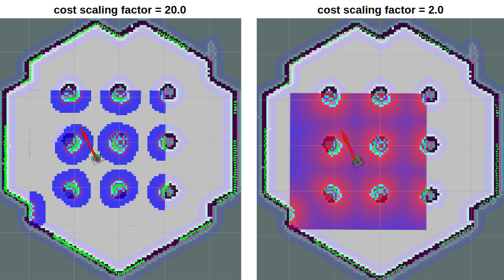
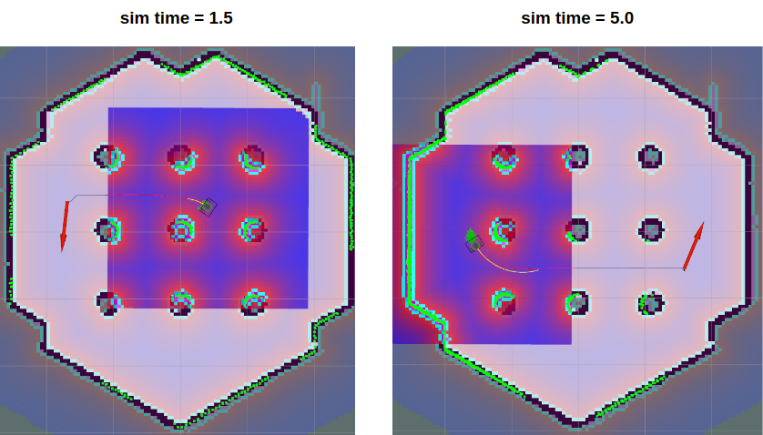

> **출처**: [https://emanual.robotis.com/docs/en/platform/turtlebot3/navigation](https://emanual.robotis.com/docs/en/platform/turtlebot3/navigation)

---
# TOC

1. [Humble](#humble)
2. [Jazzy](#jazzy)
3. [Noetic](#noetic)

---
[TOC](#toc)
# Humble

# 5. Navigation

> **경고**: 이 지침을 따르는 동안 TurtleBot3가 예기치 않게 움직이거나 회전할 수 있습니다. 로봇을 바닥의 안전한 위치에 놓으세요.

> **참고**
> - Navigation은 Remote PC에서 실행해야 합니다.
> - 다음 작업을 실행하기 전에 TurtleBot3에서 [Bringup](https://emanual.robotis.com/docs/en/platform/turtlebot3/bringup/)을 실행했는지 확인하세요.
> - Navigation은 [SLAM](https://emanual.robotis.com/docs/en/platform/turtlebot3/slam/)에서 생성된 지도를 사용합니다. Navigation을 실행하기 전에 지도를 준비하세요.

**Navigation**은 주어진 환경에서 로봇을 한 위치에서 지정된 목적지로 이동하는 데 사용됩니다. 이를 위해 해당 환경의 가구, 물체, 벽을 설명하는 기하학 정보가 포함된 지도가 필요합니다. 이전 SLAM 섹션에서 설명한 대로, 센서로 얻은 거리 정보와 로봇 자체의 위치 정보를 사용하여 지도가 생성되었습니다.

## 5.1 Navigation 노드 실행

https://youtu.be/_-bv8VPwkZs?si=jakasqcERW7Cwk8L

1. TurtleBot3 SBC에서 `Bringup`이 실행 중이지 않다면 Bringup을 실행합니다.
  * Remote PC에서 `Ctrl+Alt+T`로 새 터미널을 열고 Raspberry Pi의 IP 주소로 연결합니다. 기본 비밀번호는 `ubuntu`입니다.<br>
  **[Remote PC]**
```
$ ssh ubuntu@{IP_ADDRESS_OF_RASPBERRY_PI}
$ export TURTLEBOT3_MODEL=${TB3_MODEL}
$ ros2 launch turtlebot3_bringup robot.launch.py
```

2. Remote PC에서 `Ctrl` + `Alt` + `T`로 새 터미널을 열고 Navigation 노드를 실행합니다. ROS 2는 [Navigation2](https://navigation.ros.org/)를 사용합니다.
  `TURTLEBOT3_MODEL` 파라미터를 사용하여 TurtleBot3 모델(`burger`, `waffle`, `waffle_pi`)을 지정하세요.<br>
  **[Remote PC]**
```
$ export TURTLEBOT3_MODEL=burger
$ ros2 launch turtlebot3_navigation2 navigation2.launch.py map:=$HOME/map.yaml
```

**TURTLEBOT3_MODEL 파라미터를 저장하는 방법?**
* `$ export TURTLEBOT3_MODEL=${TB3_MODEL}` 명령어는 .bashrc 파일에 TURTLEBOT3_MODEL 파라미터가 미리 정의되어 있으면 생략할 수 있습니다.
* `.bashrc` 파일은 터미널 창이 생성될 때 자동으로 로드됩니다.
  * `TurtleBot3 Burger`를 기본 모델로 지정하는 예시.<br>
**[Remote PC]**
```
$ echo 'export TURTLEBOT3_MODEL=burger' >> ~/.bashrc
$ source ~/.bashrc
```

  * `TurtleBot3 Waffle Pi`를 기본 모델로 지정하는 예시.<br>
**[Remote PC]**
```
$ echo 'export TURTLEBOT3_MODEL=waffle_pi' >> ~/.bashrc
$ source ~/.bashrc
```

## 5.2 초기 위치 추정

**초기 위치 추정(Initial Pose Estimation)** 은 Navigation에 중요한 AMCL 파라미터를 초기화하므로 Navigation 실행 전에 반드시 수행해야 합니다. TurtleBot3는 표시된 지도와 겹치는 LDS 센서 데이터를 사용하여 지도 상에 올바르게 위치해야 합니다.

1. RViz2 메뉴에서 `2D Pose Estimate` 버튼을 클릭합니다.

2. 실제 로봇이 위치한 지도 지점을 클릭하고 큰 녹색 화살표를 로봇이 향하는 방향으로 드래그합니다.

3. LDS 센서 데이터가 저장된 지도에 오버레이될 때까지 1단계와 2단계를 반복합니다.


4. 키보드 원격 제어 노드를 실행하여 지도 상에 로봇을 정확히 위치시킵니다.<br>
**[Remote PC]**
```
$ ros2 run turtlebot3_teleop teleop_keyboard
```

5. 로봇을 앞뒤로 약간 움직여 주변 환경 정보를 수집하고 지도 상의 TurtleBot3 예상 위치(작은 녹색 화살표로 표시)를 좁힙니다.
 

6. Navigation 중 여러 노드에서 서로 다른 **cmd_vel** 값이 발행되는 것을 방지하기 위해 `Ctrl` + `C`로 키보드 원격 제어 노드를 종료합니다.

## 5.3 Navigation 목표 설정

1. RViz2 메뉴에서 `Navigation2 Goal` 버튼을 클릭합니다.
2. 지도에서 로봇의 목적지를 설정할 지점을 클릭하고 녹색 화살표를 로봇이 향할 방향으로 드래그합니다.
  * 이 녹색 화살표는 로봇의 목적지를 지정하는 마커입니다.
  * 화살표의 시작점은 목적지의 `x`, `y` 좌표이고, 각도 `θ`는 화살표의 방향에 따라 결정됩니다.
  * x, y, θ가 설정되는 즉시 TurtleBot3가 목적지를 향해 이동을 시작합니다.


https://youtu.be/dndO3_HvDtw?si=GtYLsHglnrKRYifT

**Navigation2에 대해 더 알아보기**
  * 로봇은 전역 경로 계획자(global path planner)를 기반으로 Navigation2 Goal에 도달하기 위한 경로를 생성합니다. 그런 다음 로봇은 경로를 따라 이동합니다. 경로에 장애물이 있으면 Navigation2는 지역 경로 계획자(local path planner)를 사용하여 장애물을 회피합니다.
  * Navigation2 Goal까지의 경로를 생성할 수 없으면 Navigation2 Goal 설정이 실패할 수 있습니다. 로봇이 목표 위치에 도달하기 전에 멈추려면 TurtleBot3의 현재 위치를 Navigation2 Goal로 설정하세요.
  * [공식 ROS2 Navigation2 Wiki](https://navigation.ros.org/)

## 5.4 튜닝 가이드

Navigation2 스택은 다양한 로봇의 성능을 변경할 수 있는 많은 파라미터를 제공합니다. ROS1 Navigation과 유사하지만, 자세한 내용은 [Navigation2 설정 가이드](https://navigation.ros.org/configuration/index.html) 또는 [Kaiyu Zheng의 ROS Navigation Tuning Guide](http://kaiyuzheng.me/documents/navguide.pdf)를 참조하세요.


### 5.4.1 Costmap 파라미터

#### 5.4.1.1 inflation_layer.inflation_radius

- `turtlebot3_navigation2/param/${TB3_MODEL}.yaml`에 정의됨
- 이 파라미터는 감지된 장애물 주변의 접근 불가 영역(inflation area)을 정의합니다. 생성된 경로는 이 영역을 교차하지 않도록 계획됩니다. 이 값을 로봇 반경보다 약간 크게 설정하는 것이 안전합니다. 자세한 내용은 [costmap_2d wiki](http://wiki.ros.org/costmap_2d#Inflation)를 참조하세요.


#### 5.4.1.2 inflation_layer.cost_scaling_factor

- `turtlebot3_navigation2/param/${TB3_MODEL}.yaml`에 정의됨
- 이는 costmap 값에 곱해지는 반비례 요소입니다. 이 파라미터가 증가하면 costmap 값이 감소합니다.



로봇이 장애물 사이를 통과하는 최적의 경로는 장애물 사이의 중간 경로를 취하는 것입니다. 이 파라미터에 더 작은 값을 설정하면 장애물로부터 더 먼 경로가 생성됩니다.

### 5.4.2 dwb_controller

#### 5.4.2.1 max_vel_x
- `turtlebot3_navigation2/param/${TB3_MODEL}.yaml`에 정의됨
- 이 값은 병진 속도의 최대값을 설정합니다.

#### 5.4.2.2 min_vel_x
- `turtlebot3_navigation2/param/${TB3_MODEL}.yaml`에 정의됨
- 이 값은 병진 속도의 최소값을 설정합니다. 음수로 설정하면 로봇이 후진할 수 있습니다.

#### 5.4.2.3 max_vel_y
- `turtlebot3_navigation2/param/${TB3_MODEL}.yaml`에 정의됨
- 로봇의 최대 y 속도(m/s)입니다.

#### 5.4.2.4 min_vel_y
- `turtlebot3_navigation2/param/${TB3_MODEL}.yaml`에 정의됨
- 로봇의 최소 y 속도(m/s)입니다.

#### 5.4.2.5 max_vel_theta
- `turtlebot3_navigation2/param/${TB3_MODEL}.yaml`에 정의됨
- 최대 회전 속도를 설정하는 값입니다. 로봇은 이보다 빠르게 회전할 수 없습니다.

#### 5.4.2.6 min_speed_theta
- `turtlebot3_navigation2/param/${TB3_MODEL}.yaml`에 정의됨
- 최소 회전 속도를 설정하는 값입니다. 로봇은 이보다 느리게 회전할 수 없습니다.

#### 5.4.2.7 max_speed_xy
- `turtlebot3_navigation2/param/${TB3_MODEL}.yaml`에 정의됨
- 로봇의 최대 병진 속도의 절대값(m/s)입니다.

#### 5.4.2.8 min_speed_xy
- `turtlebot3_navigation2/param/${TB3_MODEL}.yaml`에 정의됨
- 로봇의 최소 병진 속도의 절대값(m/s)입니다.

#### 5.4.2.9 acc_lim_x
- `turtlebot3_navigation2/param/${TB3_MODEL}.yaml`에 정의됨
- 로봇의 x 방향 가속도 제한(m/s^2)입니다.

#### 5.4.2.10 acc_lim_y
- `turtlebot3_navigation2/param/${TB3_MODEL}.yaml`에 정의됨
- 로봇의 y 방향 가속도 제한(m/s^2)입니다.

#### 5.4.2.11 acc_lim_theta
- `turtlebot3_navigation2/param/${TB3_MODEL}.yaml`에 정의됨
- 로봇의 회전 가속도 제한(rad/s^2)입니다.

#### 5.4.2.12 decel_lim_x
- `turtlebot3_navigation2/param/${TB3_MODEL}.yaml`에 정의됨
- 로봇의 x 방향 감속도 제한(m/s^2)입니다.

#### 5.4.2.13 decel_lim_y
- `turtlebot3_navigation2/param/${TB3_MODEL}.yaml`에 정의됨
- 로봇의 y 방향 감속도 제한(m/s^2)입니다.

#### 5.4.2.14 decel_lim_theta
- `turtlebot3_navigation2/param/${TB3_MODEL}.yaml`에 정의됨
- 로봇의 theta 방향 감속도 제한(rad/s^2)입니다.

#### 5.4.2.15 xy_goal_tolerance
- `turtlebot3_navigation2/param/${TB3_MODEL}.yaml`에 정의됨
- 로봇이 목표 자세에 도달했을 때 허용되는 x,y 거리입니다.

#### 5.4.2.16 yaw_goal_tolerance
- `turtlebot3_navigation2/param/${TB3_MODEL}.yaml`에 정의됨
- 로봇이 목표 자세에 도달했을 때 허용되는 요 각도입니다.

#### 5.4.2.17 transform_tolerance
- `turtlebot3_navigation2/param/${TB3_MODEL}.yaml`에 정의됨
- tf 메시지의 지연 허용 범위입니다.

#### 5.4.2.18 sim_time
- `turtlebot3_navigation2/param/${TB3_MODEL}.yaml`에 정의됨
- 이 값은 전방 시뮬레이션 시간(초)을 설정합니다. 너무 작게 설정하면 로봇이 좁은 공간을 통과하기 어려워지고, 너무 크게 설정하면 동적 회전이 제한됩니다. 아래 이미지에서 시뮬레이션 경로를 나타내는 노란색 선의 길이 차이를 확인할 수 있습니다.



---
[TOC](#toc)
# Jazzy

# 5. Navigation

> **경고**: 이 지침을 따르는 동안 TurtleBot3가 예기치 않게 움직이거나 회전할 수 있습니다. 로봇을 바닥의 안전한 위치에 놓으세요.

> **참고**
> - Navigation은 Remote PC에서 실행해야 합니다.
> - 다음 작업을 실행하기 전에 TurtleBot3에서 [Bringup](https://emanual.robotis.com/docs/en/platform/turtlebot3/bringup/)을 실행했는지 확인하세요.
> - Navigation은 [SLAM](https://emanual.robotis.com/docs/en/platform/turtlebot3/slam/)에서 생성된 지도를 사용합니다. Navigation을 실행하기 전에 지도를 준비하세요.

**Navigation**은 주어진 환경에서 로봇을 한 위치에서 지정된 목적지로 이동하는 데 사용됩니다. 이를 위해 해당 환경의 가구, 물체, 벽을 설명하는 기하학 정보가 포함된 지도가 필요합니다. 이전 SLAM 섹션에서 설명한 대로, 센서로 얻은 거리 정보와 로봇 자체의 위치 정보를 사용하여 지도가 생성되었습니다.

## 5.1 Navigation 노드 실행

https://youtu.be/_-bv8VPwkZs?si=jakasqcERW7Cwk8L

> Jazzy 버전부터 cmd_vel 토픽은 TwistStamped 타입을 사용합니다.
> Twist 타입을 사용하려면 turtlebot3_bringup과 turtlebot3_navigation2 패키지 모두에서 enable_stamped_cmd_vel 파라미터를 false로 설정하세요.

1. TurtleBot3 SBC에서 `Bringup`이 실행 중이지 않다면 Bringup을 실행합니다.
  * Remote PC에서 `Ctrl+Alt+T`로 새 터미널을 열고 Raspberry Pi의 IP 주소로 연결합니다. 기본 비밀번호는 `ubuntu`입니다.
  **[Remote PC]**
```
$ ssh ubuntu@{IP_ADDRESS_OF_RASPBERRY_PI}
$ export TURTLEBOT3_MODEL=${TB3_MODEL}
$ ros2 launch turtlebot3_bringup robot.launch.py
```

2. Remote PC에서 `Ctrl` + `Alt` + `T`로 새 터미널을 열고 Navigation 노드를 실행합니다. ROS 2는 [Navigation2](https://navigation.ros.org/)를 사용합니다.
  `TURTLEBOT3_MODEL` 파라미터를 사용하여 TurtleBot3 모델(`burger`, `waffle`, `waffle_pi`)을 지정하세요.
  **[Remote PC]**
```
$ export TURTLEBOT3_MODEL=burger
$ ros2 launch turtlebot3_navigation2 navigation2.launch.py map:=$HOME/map.yaml
```

**TURTLEBOT3_MODEL 파라미터를 저장하는 방법?**
* `$ export TURTLEBOT3_MODEL=${TB3_MODEL}` 명령어는 .bashrc 파일에 TURTLEBOT3_MODEL 파라미터가 미리 정의되어 있으면 생략할 수 있습니다.
* `.bashrc` 파일은 터미널 창이 생성될 때 자동으로 로드됩니다.
  * `TurtleBot3 Burger`를 기본 모델로 지정하는 예시.
**[Remote PC]**
```
$ echo 'export TURTLEBOT3_MODEL=burger' >> ~/.bashrc
$ source ~/.bashrc
```

  * `TurtleBot3 Waffle Pi`를 기본 모델로 지정하는 예시.
**[Remote PC]**
```
$ echo 'export TURTLEBOT3_MODEL=waffle_pi' >> ~/.bashrc
$ source ~/.bashrc
```

## 5.2 초기 위치 추정

**초기 위치 추정(Initial Pose Estimation)** 은 Navigation에 중요한 AMCL 파라미터를 초기화하므로 Navigation 실행 전에 반드시 수행해야 합니다. TurtleBot3는 표시된 지도와 겹치는 LDS 센서 데이터를 사용하여 지도 상에 올바르게 위치해야 합니다.

1. RViz2 메뉴에서 `2D Pose Estimate` 버튼을 클릭합니다.

2. 실제 로봇이 위치한 지도 지점을 클릭하고 큰 녹색 화살표를 로봇이 향하는 방향으로 드래그합니다.

3. LDS 센서 데이터가 저장된 지도에 오버레이될 때까지 1단계와 2단계를 반복합니다.


4. 키보드 원격 제어 노드를 실행하여 지도 상에 로봇을 정확히 위치시킵니다.
**[Remote PC]**
```
$ ros2 run turtlebot3_teleop teleop_keyboard
```

5. 로봇을 앞뒤로 약간 움직여 주변 환경 정보를 수집하고 지도 상의 TurtleBot3 예상 위치(작은 녹색 화살표로 표시)를 좁힙니다.
 

6. Navigation 중 여러 노드에서 서로 다른 **cmd_vel** 값이 발행되는 것을 방지하기 위해 `Ctrl` + `C`로 키보드 원격 제어 노드를 종료합니다.

## 5.3 Navigation 목표 설정

1. RViz2 메뉴에서 `Navigation2 Goal` 버튼을 클릭합니다.
2. 지도에서 로봇의 목적지를 설정할 지점을 클릭하고 녹색 화살표를 로봇이 향할 방향으로 드래그합니다.
  * 이 녹색 화살표는 로봇의 목적지를 지정하는 마커입니다.
  * 화살표의 시작점은 목적지의 `x`, `y` 좌표이고, 각도 `θ`는 화살표의 방향에 따라 결정됩니다.
  * x, y, θ가 설정되는 즉시 TurtleBot3가 목적지를 향해 이동을 시작합니다.


https://youtu.be/dndO3_HvDtw?si=GtYLsHglnrKRYifT

**Navigation2에 대해 더 알아보기**
  * 로봇은 전역 경로 계획자(global path planner)를 기반으로 Navigation2 Goal에 도달하기 위한 경로를 생성합니다. 그런 다음 로봇은 경로를 따라 이동합니다. 경로에 장애물이 있으면 Navigation2는 지역 경로 계획자(local path planner)를 사용하여 장애물을 회피합니다.
  * Navigation2 Goal까지의 경로를 생성할 수 없으면 Navigation2 Goal 설정이 실패할 수 있습니다. 로봇이 목표 위치에 도달하기 전에 멈추려면 TurtleBot3의 현재 위치를 Navigation2 Goal로 설정하세요.
  * [공식 ROS2 Navigation2 Wiki](https://navigation.ros.org/)

## 5.4 튜닝 가이드

Navigation2 스택은 다양한 로봇의 성능을 변경할 수 있는 많은 파라미터를 제공합니다. ROS1 Navigation과 유사하지만, 자세한 내용은 [Navigation2 설정 가이드](https://navigation.ros.org/configuration/index.html) 또는 [Kaiyu Zheng의 ROS Navigation Tuning Guide](http://kaiyuzheng.me/documents/navguide.pdf)를 참조하세요.


### 5.4.1 Costmap 파라미터

#### 5.4.1.1 inflation_layer.inflation_radius

- `turtlebot3_navigation2/param/${TB3_MODEL}.yaml`에 정의됨
- 이 파라미터는 감지된 장애물 주변의 접근 불가 영역(inflation area)을 정의합니다. 생성된 경로는 이 영역을 교차하지 않도록 계획됩니다. 이 값을 로봇 반경보다 약간 크게 설정하는 것이 안전합니다. 자세한 내용은 [costmap_2d wiki](http://wiki.ros.org/costmap_2d#Inflation)를 참조하세요.


#### 5.4.1.2 inflation_layer.cost_scaling_factor

- `turtlebot3_navigation2/param/${TB3_MODEL}.yaml`에 정의됨
- 이는 costmap 값에 곱해지는 반비례 요소입니다. 이 파라미터가 증가하면 costmap 값이 감소합니다.


로봇이 장애물 사이를 통과하는 최적의 경로는 장애물 사이의 중간 경로를 취하는 것입니다. 이 파라미터에 더 작은 값을 설정하면 장애물로부터 더 먼 경로가 생성됩니다.

### 5.4.2 dwb_controller

#### 5.4.2.1 max_vel_x
- `turtlebot3_navigation2/param/${TB3_MODEL}.yaml`에 정의됨
- 이 값은 병진 속도의 최대값을 설정합니다.

#### 5.4.2.2 min_vel_x
- `turtlebot3_navigation2/param/${TB3_MODEL}.yaml`에 정의됨
- 이 값은 병진 속도의 최소값을 설정합니다. 음수로 설정하면 로봇이 후진할 수 있습니다.

#### 5.4.2.3 max_vel_y
- `turtlebot3_navigation2/param/${TB3_MODEL}.yaml`에 정의됨
- 로봇의 최대 y 속도(m/s)입니다.

#### 5.4.2.4 min_vel_y
- `turtlebot3_navigation2/param/${TB3_MODEL}.yaml`에 정의됨
- 로봇의 최소 y 속도(m/s)입니다.

#### 5.4.2.5 max_vel_theta
- `turtlebot3_navigation2/param/${TB3_MODEL}.yaml`에 정의됨
- 최대 회전 속도를 설정하는 값입니다. 로봇은 이보다 빠르게 회전할 수 없습니다.

#### 5.4.2.6 min_speed_theta
- `turtlebot3_navigation2/param/${TB3_MODEL}.yaml`에 정의됨
- 최소 회전 속도를 설정하는 값입니다. 로봇은 이보다 느리게 회전할 수 없습니다.

#### 5.4.2.7 max_speed_xy
- `turtlebot3_navigation2/param/${TB3_MODEL}.yaml`에 정의됨
- 로봇의 최대 병진 속도의 절대값(m/s)입니다.

#### 5.4.2.8 min_speed_xy
- `turtlebot3_navigation2/param/${TB3_MODEL}.yaml`에 정의됨
- 로봇의 최소 병진 속도의 절대값(m/s)입니다.

#### 5.4.2.9 acc_lim_x
- `turtlebot3_navigation2/param/${TB3_MODEL}.yaml`에 정의됨
- 로봇의 x 방향 가속도 제한(m/s^2)입니다.

#### 5.4.2.10 acc_lim_y
- `turtlebot3_navigation2/param/${TB3_MODEL}.yaml`에 정의됨
- 로봇의 y 방향 가속도 제한(m/s^2)입니다.

#### 5.4.2.11 acc_lim_theta
- `turtlebot3_navigation2/param/${TB3_MODEL}.yaml`에 정의됨
- 로봇의 회전 가속도 제한(rad/s^2)입니다.

#### 5.4.2.12 decel_lim_x
- `turtlebot3_navigation2/param/${TB3_MODEL}.yaml`에 정의됨
- 로봇의 x 방향 감속도 제한(m/s^2)입니다.

#### 5.4.2.13 decel_lim_y
- `turtlebot3_navigation2/param/${TB3_MODEL}.yaml`에 정의됨
- 로봇의 y 방향 감속도 제한(m/s^2)입니다.

#### 5.4.2.14 decel_lim_theta
- `turtlebot3_navigation2/param/${TB3_MODEL}.yaml`에 정의됨
- 로봇의 theta 방향 감속도 제한(rad/s^2)입니다.

#### 5.4.2.15 xy_goal_tolerance
- `turtlebot3_navigation2/param/${TB3_MODEL}.yaml`에 정의됨
- 로봇이 목표 자세에 도달했을 때 허용되는 x,y 거리입니다.

#### 5.4.2.16 yaw_goal_tolerance
- `turtlebot3_navigation2/param/${TB3_MODEL}.yaml`에 정의됨
- 로봇이 목표 자세에 도달했을 때 허용되는 요 각도입니다.

#### 5.4.2.17 transform_tolerance
- `turtlebot3_navigation2/param/${TB3_MODEL}.yaml`에 정의됨
- tf 메시지의 지연 허용 범위입니다.

#### 5.4.2.18 sim_time
- `turtlebot3_navigation2/param/${TB3_MODEL}.yaml`에 정의됨
- 이 값은 전방 시뮬레이션 시간(초)을 설정합니다. 너무 작게 설정하면 로봇이 좁은 공간을 통과하기 어려워지고, 너무 크게 설정하면 동적 회전이 제한됩니다. 아래 이미지에서 시뮬레이션 경로를 나타내는 노란색 선의 길이 차이를 확인할 수 있습니다.


---
[TOC](#toc)
# Noetic

# 5. Navigation

> **경고**: 이 지침을 따르는 동안 TurtleBot3가 예기치 않게 움직이거나 회전할 수 있습니다. 로봇을 바닥의 안전한 위치에 놓으세요.

> **참고**
> - Navigation은 Remote PC에서 실행해야 합니다.
> - 다음 작업을 실행하기 전에 TurtleBot3에서 [Bringup](https://emanual.robotis.com/docs/en/platform/turtlebot3/bringup/)을 실행했는지 확인하세요.
> - Navigation은 [SLAM](https://emanual.robotis.com/docs/en/platform/turtlebot3/slam/)에서 생성된 지도를 사용합니다. Navigation을 실행하기 전에 지도를 준비하세요.

**Navigation**은 주어진 환경에서 로봇을 한 위치에서 지정된 목적지로 이동하는 데 사용됩니다. 이를 위해 해당 환경의 가구, 물체, 벽을 설명하는 기하학 정보가 포함된 지도가 필요합니다. 이전 SLAM 섹션에서 설명한 대로, 센서로 얻은 거리 정보와 로봇 자체의 위치 정보를 사용하여 지도가 생성되었습니다.

## 5.1 Navigation 노드 실행

https://youtu.be/_-bv8VPwkZs?si=jakasqcERW7Cwk8L

1. TurtleBot3 SBC에서 `Bringup`이 실행 중이지 않다면 Bringup을 실행합니다.
  * Remote PC에서 `Ctrl+Alt+T`로 새 터미널을 열고 Raspberry Pi의 IP 주소로 연결합니다. 기본 비밀번호는 `ubuntu`입니다.
  **[Remote PC]**
```
$ ssh ubuntu@{IP_ADDRESS_OF_RASPBERRY_PI}
$ export TURTLEBOT3_MODEL=${TB3_MODEL}
$ ros2 launch turtlebot3_bringup robot.launch.py
```

2. Remote PC에서 `Ctrl` + `Alt` + `T`로 새 터미널을 열고 Navigation 노드를 실행합니다. ROS 2는 [Navigation2](https://navigation.ros.org/)를 사용합니다.
  `TURTLEBOT3_MODEL` 파라미터를 사용하여 TurtleBot3 모델(`burger`, `waffle`, `waffle_pi`)을 지정하세요.
  **[Remote PC]**
```
$ export TURTLEBOT3_MODEL=burger
$ ros2 launch turtlebot3_navigation2 navigation2.launch.py map:=$HOME/map.yaml
```

**TURTLEBOT3_MODEL 파라미터를 저장하는 방법?**
* `$ export TURTLEBOT3_MODEL=${TB3_MODEL}` 명령어는 .bashrc 파일에 TURTLEBOT3_MODEL 파라미터가 미리 정의되어 있으면 생략할 수 있습니다.
* `.bashrc` 파일은 터미널 창이 생성될 때 자동으로 로드됩니다.
  * `TurtleBot3 Burger`를 기본 모델로 지정하는 예시.
**[Remote PC]**
```
$ echo 'export TURTLEBOT3_MODEL=burger' >> ~/.bashrc
$ source ~/.bashrc
```

  * `TurtleBot3 Waffle Pi`를 기본 모델로 지정하는 예시.
**[Remote PC]**
```
$ echo 'export TURTLEBOT3_MODEL=waffle_pi' >> ~/.bashrc
$ source ~/.bashrc
```

## 5.2 초기 위치 추정

**초기 위치 추정(Initial Pose Estimation)** 은 Navigation에 중요한 AMCL 파라미터를 초기화하므로 Navigation 실행 전에 반드시 수행해야 합니다. TurtleBot3는 표시된 지도와 겹치는 LDS 센서 데이터를 사용하여 지도 상에 올바르게 위치해야 합니다.

1. RViz2 메뉴에서 `2D Pose Estimate` 버튼을 클릭합니다.

2. 실제 로봇이 위치한 지도 지점을 클릭하고 큰 녹색 화살표를 로봇이 향하는 방향으로 드래그합니다.

3. LDS 센서 데이터가 저장된 지도에 오버레이될 때까지 1단계와 2단계를 반복합니다.


4. 키보드 원격 제어 노드를 실행하여 지도 상에 로봇을 정확히 위치시킵니다.
**[Remote PC]**
```
$ ros2 run turtlebot3_teleop teleop_keyboard
```

5. 로봇을 앞뒤로 약간 움직여 주변 환경 정보를 수집하고 지도 상의 TurtleBot3 예상 위치(작은 녹색 화살표로 표시)를 좁힙니다.
 

6. Navigation 중 여러 노드에서 서로 다른 **cmd_vel** 값이 발행되는 것을 방지하기 위해 `Ctrl` + `C`로 키보드 원격 제어 노드를 종료합니다.

## 5.3 Navigation 목표 설정

1. RViz2 메뉴에서 `Navigation2 Goal` 버튼을 클릭합니다.


2. 지도에서 로봇의 목적지를 설정할 지점을 클릭하고 녹색 화살표를 로봇이 향할 방향으로 드래그합니다.
  * 이 녹색 화살표는 로봇의 목적지를 지정하는 마커입니다.
  * 화살표의 시작점은 목적지의 `x`, `y` 좌표이고, 각도 `θ`는 화살표의 방향에 따라 결정됩니다.
  * x, y, θ가 설정되는 즉시 TurtleBot3가 목적지를 향해 이동을 시작합니다.


https://youtu.be/dndO3_HvDtw?si=GtYLsHglnrKRYifT

**Navigation2에 대해 더 알아보기**
  * 로봇은 전역 경로 계획자(global path planner)를 기반으로 Navigation2 Goal에 도달하기 위한 경로를 생성합니다. 그런 다음 로봇은 경로를 따라 이동합니다. 경로에 장애물이 있으면 Navigation2는 지역 경로 계획자(local path planner)를 사용하여 장애물을 회피합니다.
  * Navigation2 Goal까지의 경로를 생성할 수 없으면 Navigation2 Goal 설정이 실패할 수 있습니다. 로봇이 목표 위치에 도달하기 전에 멈추려면 TurtleBot3의 현재 위치를 Navigation2 Goal로 설정하세요.
  * 공식 ROS2 Navigation2 Wiki

## 5.4 튜닝 가이드

Navigation2 스택은 다양한 로봇의 성능을 변경할 수 있는 많은 파라미터를 제공합니다. ROS1 Navigation과 유사하지만, 자세한 내용은 [Navigation2 설정 가이드](https://navigation.ros.org/configuration/index.html) 또는 [Kaiyu Zheng의 ROS Navigation Tuning Guide](http://kaiyuzheng.me/documents/navguide.pdf)를 참조하세요.


### 5.4.1 Costmap 파라미터

#### 5.4.1.1 inflation_layer.inflation_radius

- `turtlebot3_navigation2/param/${TB3_MODEL}.yaml`에 정의됨
- 이 파라미터는 감지된 장애물 주변의 접근 불가 영역(inflation area)을 정의합니다. 생성된 경로는 이 영역을 교차하지 않도록 계획됩니다. 이 값을 로봇 반경보다 약간 크게 설정하는 것이 안전합니다. 자세한 내용은 [costmap_2d wiki](http://wiki.ros.org/costmap_2d#Inflation)를 참조하세요.


#### 5.4.1.2 inflation_layer.cost_scaling_factor

- `turtlebot3_navigation2/param/${TB3_MODEL}.yaml`에 정의됨
- 이는 costmap 값에 곱해지는 반비례 요소입니다. 이 파라미터가 증가하면 costmap 값이 감소합니다.


로봇이 장애물 사이를 통과하는 최적의 경로는 장애물 사이의 중간 경로를 취하는 것입니다. 이 파라미터에 더 작은 값을 설정하면 장애물로부터 더 먼 경로가 생성됩니다.

### 5.4.2 dwb_controller

#### 5.4.2.1 max_vel_x
- `turtlebot3_navigation2/param/${TB3_MODEL}.yaml`에 정의됨
- 이 값은 병진 속도의 최대값을 설정합니다.

#### 5.4.2.2 min_vel_x
- `turtlebot3_navigation2/param/${TB3_MODEL}.yaml`에 정의됨
- 이 값은 병진 속도의 최소값을 설정합니다. 음수로 설정하면 로봇이 후진할 수 있습니다.

#### 5.4.2.3 max_vel_y
- `turtlebot3_navigation2/param/${TB3_MODEL}.yaml`에 정의됨
- 로봇의 최대 y 속도(m/s)입니다.

#### 5.4.2.4 min_vel_y
- `turtlebot3_navigation2/param/${TB3_MODEL}.yaml`에 정의됨
- 로봇의 최소 y 속도(m/s)입니다.

#### 5.4.2.5 max_vel_theta
- `turtlebot3_navigation2/param/${TB3_MODEL}.yaml`에 정의됨
- 최대 회전 속도를 설정하는 값입니다. 로봇은 이보다 빠르게 회전할 수 없습니다.

#### 5.4.2.6 min_speed_theta
- `turtlebot3_navigation2/param/${TB3_MODEL}.yaml`에 정의됨
- 최소 회전 속도를 설정하는 값입니다. 로봇은 이보다 느리게 회전할 수 없습니다.

#### 5.4.2.7 max_speed_xy
- `turtlebot3_navigation2/param/${TB3_MODEL}.yaml`에 정의됨
- 로봇의 최대 병진 속도의 절대값(m/s)입니다.

#### 5.4.2.8 min_speed_xy
- `turtlebot3_navigation2/param/${TB3_MODEL}.yaml`에 정의됨
- 로봇의 최소 병진 속도의 절대값(m/s)입니다.

#### 5.4.2.9 acc_lim_x
- `turtlebot3_navigation2/param/${TB3_MODEL}.yaml`에 정의됨
- 로봇의 x 방향 가속도 제한(m/s^2)입니다.

#### 5.4.2.10 acc_lim_y
- `turtlebot3_navigation2/param/${TB3_MODEL}.yaml`에 정의됨
- 로봇의 y 방향 가속도 제한(m/s^2)입니다.

#### 5.4.2.11 acc_lim_theta
- `turtlebot3_navigation2/param/${TB3_MODEL}.yaml`에 정의됨
- 로봇의 회전 가속도 제한(rad/s^2)입니다.

#### 5.4.2.12 decel_lim_x
- `turtlebot3_navigation2/param/${TB3_MODEL}.yaml`에 정의됨
- 로봇의 x 방향 감속도 제한(m/s^2)입니다.

#### 5.4.2.13 decel_lim_y
- `turtlebot3_navigation2/param/${TB3_MODEL}.yaml`에 정의됨
- 로봇의 y 방향 감속도 제한(m/s^2)입니다.

#### 5.4.2.14 decel_lim_theta
- `turtlebot3_navigation2/param/${TB3_MODEL}.yaml`에 정의됨
- 로봇의 theta 방향 감속도 제한(rad/s^2)입니다.

#### 5.4.2.15 xy_goal_tolerance
- `turtlebot3_navigation2/param/${TB3_MODEL}.yaml`에 정의됨
- 로봇이 목표 자세에 도달했을 때 허용되는 x,y 거리입니다.

#### 5.4.2.16 yaw_goal_tolerance
- `turtlebot3_navigation2/param/${TB3_MODEL}.yaml`에 정의됨
- 로봇이 목표 자세에 도달했을 때 허용되는 요 각도입니다.

#### 5.4.2.17 transform_tolerance
- `turtlebot3_navigation2/param/${TB3_MODEL}.yaml`에 정의됨
- tf 메시지의 지연 허용 범위입니다.

#### 5.4.2.18 sim_time
- `turtlebot3_navigation2/param/${TB3_MODEL}.yaml`에 정의됨
- 이 값은 전방 시뮬레이션 시간(초)을 설정합니다. 너무 작게 설정하면 로봇이 좁은 공간을 통과하기 어려워지고, 너무 크게 설정하면 동적 회전이 제한됩니다. 아래 이미지에서 시뮬레이션 경로를 나타내는 노란색 선의 길이 차이를 확인할 수 있습니다.


