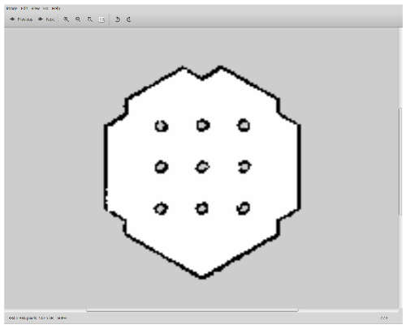

> **출처**: [https://emanual.robotis.com/docs/en/platform/turtlebot3/slam_simulation](https://emanual.robotis.com/docs/en/platform/turtlebot3/slam_simulation)

---
# TOC

1. [Humble](#humble)
2. [Jazzy](#jazzy)
3. [Noetic](#noetic)

---
[TOC](#toc)
# Humble

## 6.2 SLAM Simulation

Gazebo 시뮬레이터에서 SLAM을 사용하면 가상 세계에서 다양한 환경과 로봇 모델을 선택하거나 생성할 수 있습니다. 로봇을 직접 구동하는 대신 시뮬레이션 환경을 준비한다는 점만 다를 뿐, SLAM Simulation은 실제 TurtleBot3에서의 [SLAM](https://emanual.robotis.com/docs/en/platform/turtlebot3/slam/#slam) 작동과 매우 유사합니다.

다음 지침은 이전 섹션의 사전 요구사항이 필요하므로, 먼저 [Simulation](https://emanual.robotis.com/docs/en/platform/turtlebot3/simulation/) 섹션을 검토하세요.


### 6.2.1 Simulation World 실행

세 가지 Gazebo 환경이 준비되어 있지만, SLAM으로 지도를 생성하려면 **TurtleBot3 World** 또는 **TurtleBot3 House**를 사용하는 것이 좋습니다. 다음 명령어 중 하나를 사용하여 Gazebo 환경을 로드하세요.

이 튜토리얼에서는 TurtleBot3 World를 사용합니다. `TURTLEBOT3_MODEL` 파라미터를 사용하여 TurtleBot3 모델(`burger`, `waffle`, `waffle_pi`)을 지정하세요.

```
$ export TURTLEBOT3_MODEL=burger
$ ros2 launch turtlebot3_gazebo turtlebot3_world.launch.py
```
**TurtleBot3 House 로드 방법에 대해 더 알아보기** TURTLEBOT3_MODEL 파라미터를 사용하여 TurtleBot3 모델(burger, waffle, waffle_pi)을 지정하세요.
```
$ export TURTLEBOT3_MODEL=burger
$ ros2 launch turtlebot3_gazebo turtlebot3_house.launch.py
```

### 6.2.2 SLAM 노드 실행

Remote PC에서 `Ctrl` + `Alt` + `T`로 새 터미널을 열고 SLAM 노드를 실행합니다. 기본적으로 Cartographer SLAM 방식이 사용됩니다.
`TURTLEBOT3_MODEL` 파라미터를 사용하여 TurtleBot3 모델(`burger`, `waffle`, `waffle_pi`)을 지정하세요.

```
$ export TURTLEBOT3_MODEL=burger
$ ros2 launch turtlebot3_cartographer cartographer.launch.py use_sim_time:=True
```


### 6.2.3 원격 제어 노드 실행

Remote PC에서 `Ctrl` + `Alt` + `T`로 새 터미널을 열고 Remote PC에서 원격 제어 노드를 실행합니다.
`TURTLEBOT3_MODEL` 파라미터를 사용하여 TurtleBot3 모델(`burger`, `waffle`, `waffle_pi`)을 지정하세요.

```
$ export TURTLEBOT3_MODEL=burger
$ ros2 run turtlebot3_teleop teleop_keyboard

 Control Your TurtleBot3!
 ---------------------------
 Moving around:
        w
   a    s    d
        x

 w/x : increase/decrease linear velocity
 a/d : increase/decrease angular velocity
 space key, s : force stop

 CTRL-C to quit
```


### 6.2.4 지도 저장

지도가 생성되면 Remote PC에서 `Ctrl` + `Alt` + `T`로 새 터미널을 열고 지도를 저장합니다.


```
$ ros2 run nav2_map_server map_saver_cli -f ~/map
```



> 저장된 map.pgm 파일

---
[TOC](#toc)
# Jazzy

## 6.2 SLAM Simulation

Gazebo 시뮬레이터에서 SLAM을 사용하면 가상 세계에서 다양한 환경과 로봇 모델을 선택하거나 생성할 수 있습니다. 로봇을 직접 구동하는 대신 시뮬레이션 환경을 준비한다는 점만 다를 뿐, SLAM Simulation은 실제 TurtleBot3에서의 [SLAM](https://emanual.robotis.com/docs/en/platform/turtlebot3/slam/#slam) 작동과 매우 유사합니다.

다음 지침은 이전 섹션의 사전 요구사항이 필요하므로, 먼저 [Simulation](https://emanual.robotis.com/docs/en/platform/turtlebot3/simulation/) 섹션을 검토하세요.


### 6.2.1 Simulation World 실행

세 가지 Gazebo 환경이 준비되어 있지만, SLAM으로 지도를 생성하려면 **TurtleBot3 World** 또는 **TurtleBot3 House**를 사용하는 것이 좋습니다. 다음 명령어 중 하나를 사용하여 Gazebo 환경을 로드하세요.

이 튜토리얼에서는 TurtleBot3 World를 사용합니다. `TURTLEBOT3_MODEL` 파라미터를 사용하여 TurtleBot3 모델(`burger`, `waffle`, `waffle_pi`)을 지정하세요.

```
$ export TURTLEBOT3_MODEL=burger
$ ros2 launch turtlebot3_gazebo turtlebot3_world.launch.py
```
**TurtleBot3 House 로드 방법에 대해 더 알아보기** TURTLEBOT3_MODEL 파라미터를 사용하여 TurtleBot3 모델(burger, waffle, waffle_pi)을 지정하세요.
```
$ export TURTLEBOT3_MODEL=burger
$ ros2 launch turtlebot3_gazebo turtlebot3_house.launch.py
```

### 6.2.2 SLAM 노드 실행

Remote PC에서 `Ctrl` + `Alt` + `T`로 새 터미널을 열고 SLAM 노드를 실행합니다. 기본적으로 Cartographer SLAM 방식이 사용됩니다.
`TURTLEBOT3_MODEL` 파라미터를 사용하여 TurtleBot3 모델(`burger`, `waffle`, `waffle_pi`)을 지정하세요.

```
$ export TURTLEBOT3_MODEL=burger
$ ros2 launch turtlebot3_cartographer cartographer.launch.py use_sim_time:=True
```


### 6.2.3 원격 제어 노드 실행

Remote PC에서 `Ctrl` + `Alt` + `T`로 새 터미널을 열고 Remote PC에서 원격 제어 노드를 실행합니다.
`TURTLEBOT3_MODEL` 파라미터를 사용하여 TurtleBot3 모델(`burger`, `waffle`, `waffle_pi`)을 지정하세요.

```
$ export TURTLEBOT3_MODEL=burger
$ ros2 run turtlebot3_teleop teleop_keyboard

 Control Your TurtleBot3!
 ---------------------------
 Moving around:
        w
   a    s    d
        x

 w/x : increase/decrease linear velocity
 a/d : increase/decrease angular velocity
 space key, s : force stop

 CTRL-C to quit
```


### 6.2.4 지도 저장

지도가 생성되면 Remote PC에서 `Ctrl` + `Alt` + `T`로 새 터미널을 열고 지도를 저장합니다.


```
$ ros2 run nav2_map_server map_saver_cli -f ~/map
```


> 저장된 map.pgm 파일

---
[TOC](#toc)
# Noetic

## 6.2 SLAM Simulation

Gazebo 시뮬레이터에서 SLAM을 사용하면 가상 세계에서 다양한 환경과 로봇 모델을 선택하거나 생성할 수 있습니다. 로봇을 직접 구동하는 대신 시뮬레이션 환경을 준비한다는 점만 다를 뿐, SLAM Simulation은 실제 TurtleBot3에서의 [SLAM](https://emanual.robotis.com/docs/en/platform/turtlebot3/slam/#slam) 작동과 매우 유사합니다.

다음 지침은 이전 섹션의 사전 요구사항이 필요하므로, 먼저 [Simulation](https://emanual.robotis.com/docs/en/platform/turtlebot3/simulation/) 섹션을 검토하세요.


### 6.2.1 Simulation World 실행

세 가지 Gazebo 환경이 준비되어 있지만, SLAM으로 지도를 생성하려면 **TurtleBot3 World** 또는 **TurtleBot3 House**를 사용하는 것이 좋습니다. 다음 명령어 중 하나를 사용하여 Gazebo 환경을 로드하세요.

이 튜토리얼에서는 TurtleBot3 World를 사용합니다. `TURTLEBOT3_MODEL` 파라미터를 사용하여 TurtleBot3 모델(`burger`, `waffle`, `waffle_pi`)을 지정하세요.

```
$ export TURTLEBOT3_MODEL=burger
$ roslaunch turtlebot3_gazebo turtlebot3_world.launch
```
**TurtleBot3 House 로드 방법에 대해 더 알아보기** TURTLEBOT3_MODEL 파라미터를 사용하여 TurtleBot3 모델(burger, waffle, waffle_pi)을 지정하세요.
```
$ export TURTLEBOT3_MODEL=burger
$ roslaunch turtlebot3_gazebo turtlebot3_house.launch
```

### 6.2.2 SLAM 노드 실행

Remote PC에서 `Ctrl` + `Alt` + `T`로 새 터미널을 열고 SLAM 노드를 실행합니다. 기본적으로 Gmapping SLAM 방식이 사용됩니다.
`TURTLEBOT3_MODEL` 파라미터를 사용하여 TurtleBot3 모델(`burger`, `waffle`, `waffle_pi`)을 지정하세요.

```
$ export TURTLEBOT3_MODEL=burger
$ roslaunch turtlebot3_slam turtlebot3_slam.launch slam_methods:=gmapping
```


### 6.2.3 원격 제어 노드 실행

Remote PC에서 `Ctrl` + `Alt` + `T`로 새 터미널을 열고 Remote PC에서 원격 제어 노드를 실행합니다.
`TURTLEBOT3_MODEL` 파라미터를 사용하여 TurtleBot3 모델(`burger`, `waffle`, `waffle_pi`)을 지정하세요.

```
$ export TURTLEBOT3_MODEL=burger
$ roslaunch turtlebot3_teleop turtlebot3_teleop_key.launch

 Control Your TurtleBot3!
 ---------------------------
 Moving around:
        w
   a    s    d
        x

 w/x : increase/decrease linear velocity
 a/d : increase/decrease angular velocity
 space key, s : force stop

 CTRL-C to quit
```


### 6.2.4 지도 저장

지도가 생성되면 Remote PC에서 `Ctrl` + `Alt` + `T`로 새 터미널을 열고 지도를 저장합니다.


```
$ rosrun map_server map_saver -f ~/map
```


> 저장된 map.pgm 파일
