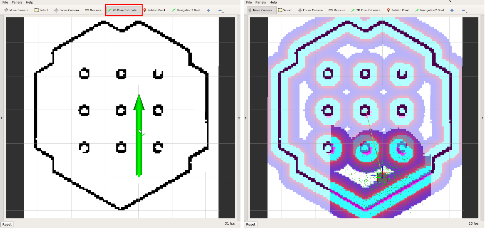
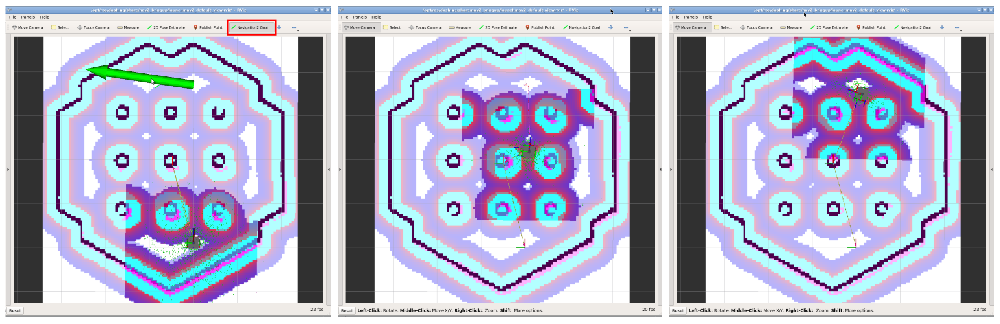
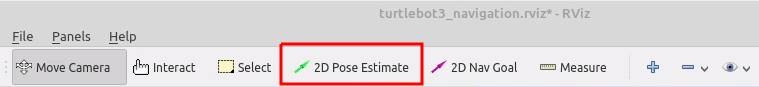
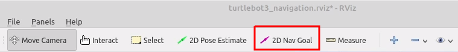
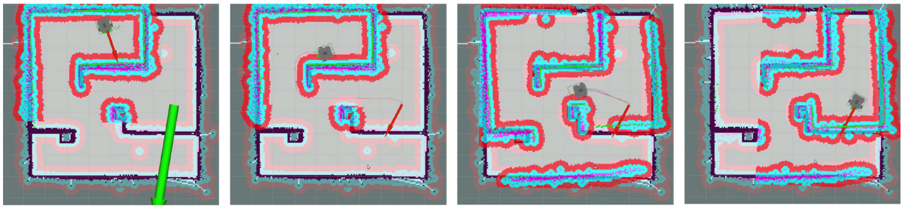

> **출처**: [https://emanual.robotis.com/docs/en/platform/turtlebot3/nav_simulation](https://emanual.robotis.com/docs/en/platform/turtlebot3/nav_simulation)

---
# TOC

1. [Humble](#humble)
2. [Jazzy](#jazzy)
3. [Noetic](#noetic)

---
[TOC](#toc)
# Humble

## 6.3 Navigation Simulation

Gazebo 시뮬레이터의 SLAM과 마찬가지로, 가상의 Navigation 세계에서 다양한 환경과 로봇 모델을 선택하거나 생성할 수 있습니다. 그러나 Navigation을 실행하기 전에 완전한 지도가 준비되어야 합니다. 로봇을 직접 구동하는 대신 시뮬레이션 환경을 준비한다는 점만 다를 뿐, Navigation Simulation은 실제 TurtleBot3 [Navigation](https://emanual.robotis.com/docs/en/platform/turtlebot3/navigation/#navigation)과 매우 유사합니다.


### 6.3.1 Simulation World 실행

이전 섹션에서 실행된 모든 애플리케이션을 `Ctrl` + `C`로 종료하세요.

이전 [SLAM](https://emanual.robotis.com/docs/en/platform/turtlebot3/slam/#slam) 섹션에서는 TurtleBot3 World를 사용하여 지도를 생성했습니다. Navigation에도 동일한 Gazebo 환경이 사용됩니다.

`TURTLEBOT3_MODEL` 파라미터를 사용하여 TurtleBot 모델(`burger`, `waffle`, `waffle_pi`)을 지정하세요.

```
$ export TURTLEBOT3_MODEL=burger
$ ros2 launch turtlebot3_gazebo turtlebot3_world.launch.py
```

**TurtleBot3 House 로드 방법에 대해 더 알아보기**
```
$ export TURTLEBOT3_MODEL=burger
$ ros2 launch turtlebot3_gazebo turtlebot3_house.launch.py
```

### 6.3.2 Navigation 노드 실행

Remote PC에서 `Ctrl` + `Alt` + `T`로 새 터미널을 열고 Navigation2 노드를 실행합니다.

```
$ export TURTLEBOT3_MODEL=burger
$ ros2 launch turtlebot3_navigation2 navigation2.launch.py use_sim_time:=True map:=$HOME/map.yaml
```


### 6.3.3 초기 위치 추정

**초기 위치 추정(Initial Pose Estimation)** 은 정확한 Navigation에 중요한 AMCL 파라미터를 초기화하므로 Navigation 실행 전에 반드시 수행해야 합니다. TurtleBot3는 표시된 지도와 깔끔하게 겹치는 LDS 센서 데이터를 사용하여 지도 상에 올바르게 위치해야 합니다.

1. RViz2 메뉴에서 `2D Pose Estimate` 버튼을 클릭합니다.

2. 실제 로봇이 위치한 지도 지점을 클릭하고 큰 녹색 화살표를 로봇이 향하는 방향으로 드래그합니다.

3. LDS 센서 데이터가 저장된 지도에 오버레이될 때까지 1단계와 2단계를 반복합니다. <br>


4. 키보드 원격 제어 노드를 실행하여 지도 상에 로봇을 정확히 위치시킵니다.
```
$ ros2 run turtlebot3_teleop teleop_keyboard
```

5. 로봇을 앞뒤로 약간 움직여 주변 환경 정보를 수집하고 작은 녹색 화살표로 표시된 지도 상의 TurtleBot3 예상 위치를 좁힙니다. <br>
 

6. Navigation 중 여러 노드에서 서로 다른 **cmd_vel** 값이 발행되는 것을 방지하기 위해 teleop 노드 터미널에서 `Ctrl` + `C`를 입력하여 키보드 원격 제어 노드를 종료합니다.


### 6.3.4 Navigation 목표 설정

1. RViz2 메뉴에서 `Navigation2 Goal` 버튼을 클릭합니다.
2. 지도에서 로봇의 목적지를 설정할 지점을 클릭하고 녹색 화살표를 로봇이 향할 방향으로 드래그합니다.
   * 이 녹색 화살표는 로봇의 목적지를 지정하는 마커입니다.
   * 화살표의 시작점은 목적지의 `x`, `y` 좌표이고, 각도 `θ`는 화살표의 방향에 따라 결정됩니다.
   * x, y, θ가 설정되는 즉시 TurtleBot3가 목적지를 향해 이동을 시작합니다.



https://youtu.be/_-bv8VPwkZs?si=_2jsxtkvyDixrabo

**Navigation2에 대해 더 알아보기**
   * 로봇은 전역 경로 계획자(global path planner)를 기반으로 Navigation2 Goal에 도달하기 위한 경로를 생성합니다. 그런 다음 로봇은 경로를 따라 이동합니다. 경로에 장애물이 있으면 Navigation2는 지역 경로 계획자(local path planner)를 사용하여 장애물을 회피합니다.
   * Navigation2 Goal까지의 경로를 생성할 수 없으면 Navigation2 Goal 설정이 실패할 수 있습니다. 로봇이 목표 위치에 도달하기 전에 멈추려면 TurtleBot3의 현재 위치를 Navigation2 Goal로 설정하세요.
   * [공식 ROS2 Navigation2 Wiki](https://navigation.ros.org/)

---
[TOC](#toc)
# Jazzy

## 6.3 Navigation Simulation

Gazebo 시뮬레이터의 SLAM과 마찬가지로, 가상의 Navigation 세계에서 다양한 환경과 로봇 모델을 선택하거나 생성할 수 있습니다. 그러나 Navigation을 실행하기 전에 완전한 지도가 준비되어야 합니다. 로봇을 직접 구동하는 대신 시뮬레이션 환경을 준비한다는 점만 다를 뿐, Navigation Simulation은 실제 TurtleBot3 [Navigation](https://emanual.robotis.com/docs/en/platform/turtlebot3/navigation/#navigation)과 매우 유사합니다.


### 6.3.1 Simulation World 실행

이전 섹션에서 실행된 모든 애플리케이션을 `Ctrl` + `C`로 종료하세요.

이전 [SLAM](https://emanual.robotis.com/docs/en/platform/turtlebot3/slam/#slam) 섹션에서는 TurtleBot3 World를 사용하여 지도를 생성했습니다. Navigation에도 동일한 Gazebo 환경이 사용됩니다.

`TURTLEBOT3_MODEL` 파라미터를 사용하여 TurtleBot 모델(`burger`, `waffle`, `waffle_pi`)을 지정하세요.

```
$ export TURTLEBOT3_MODEL=burger
$ ros2 launch turtlebot3_gazebo turtlebot3_world.launch.py
```

**TurtleBot3 House 로드 방법에 대해 더 알아보기**
```
$ export TURTLEBOT3_MODEL=burger
$ ros2 launch turtlebot3_gazebo turtlebot3_house.launch.py
```

### 6.3.2 Navigation 노드 실행

Remote PC에서 `Ctrl` + `Alt` + `T`로 새 터미널을 열고 Navigation2 노드를 실행합니다.

```
$ export TURTLEBOT3_MODEL=burger
$ ros2 launch turtlebot3_navigation2 navigation2.launch.py use_sim_time:=True map:=$HOME/map.yaml
```


### 6.3.3 초기 위치 추정

**초기 위치 추정(Initial Pose Estimation)** 은 정확한 Navigation에 중요한 AMCL 파라미터를 초기화하므로 Navigation 실행 전에 반드시 수행해야 합니다. TurtleBot3는 표시된 지도와 깔끔하게 겹치는 LDS 센서 데이터를 사용하여 지도 상에 올바르게 위치해야 합니다.

1. RViz2 메뉴에서 `2D Pose Estimate` 버튼을 클릭합니다.

2. 실제 로봇이 위치한 지도 지점을 클릭하고 큰 녹색 화살표를 로봇이 향하는 방향으로 드래그합니다.

3. LDS 센서 데이터가 저장된 지도에 오버레이될 때까지 1단계와 2단계를 반복합니다. <br>


4. 키보드 원격 제어 노드를 실행하여 지도 상에 로봇을 정확히 위치시킵니다.
```
$ ros2 run turtlebot3_teleop teleop_keyboard
```

5. 로봇을 앞뒤로 약간 움직여 주변 환경 정보를 수집하고 작은 녹색 화살표로 표시된 지도 상의 TurtleBot3 예상 위치를 좁힙니다. <br>
 

6. Navigation 중 여러 노드에서 서로 다른 **cmd_vel** 값이 발행되는 것을 방지하기 위해 teleop 노드 터미널에서 `Ctrl` + `C`를 입력하여 키보드 원격 제어 노드를 종료합니다.


### 6.3.4 Navigation 목표 설정

1. RViz2 메뉴에서 `Navigation2 Goal` 버튼을 클릭합니다.
2. 지도에서 로봇의 목적지를 설정할 지점을 클릭하고 녹색 화살표를 로봇이 향할 방향으로 드래그합니다.
   * 이 녹색 화살표는 로봇의 목적지를 지정하는 마커입니다.
   * 화살표의 시작점은 목적지의 `x`, `y` 좌표이고, 각도 `θ`는 화살표의 방향에 따라 결정됩니다.
   * x, y, θ가 설정되는 즉시 TurtleBot3가 목적지를 향해 이동을 시작합니다.


https://youtu.be/_-bv8VPwkZs?si=_2jsxtkvyDixrabo

**Navigation2에 대해 더 알아보기**
   * 로봇은 전역 경로 계획자(global path planner)를 기반으로 Navigation2 Goal에 도달하기 위한 경로를 생성합니다. 그런 다음 로봇은 경로를 따라 이동합니다. 경로에 장애물이 있으면 Navigation2는 지역 경로 계획자(local path planner)를 사용하여 장애물을 회피합니다.
   * Navigation2 Goal까지의 경로를 생성할 수 없으면 Navigation2 Goal 설정이 실패할 수 있습니다. 로봇이 목표 위치에 도달하기 전에 멈추려면 TurtleBot3의 현재 위치를 Navigation2 Goal로 설정하세요.
   * [공식 ROS2 Navigation2 Wiki](https://navigation.ros.org/)


---
[TOC](#toc)
# Noetic

## 6.3 Navigation Simulation

Gazebo 시뮬레이터의 SLAM과 마찬가지로, 가상의 Navigation 세계에서 다양한 환경과 로봇 모델을 선택하거나 생성할 수 있습니다. 그러나 Navigation을 실행하기 전에 완전한 지도가 준비되어야 합니다. 로봇을 직접 구동하는 대신 시뮬레이션 환경을 준비한다는 점만 다를 뿐, Navigation Simulation은 실제 TurtleBot3 [Navigation](https://emanual.robotis.com/docs/en/platform/turtlebot3/navigation/#navigation)과 매우 유사합니다.


### 6.3.1 Simulation World 실행

이전 섹션에서 실행된 모든 애플리케이션을 `Ctrl` + `C`로 종료하세요.

이전 [SLAM](https://emanual.robotis.com/docs/en/platform/turtlebot3/slam/#slam) 섹션에서는 TurtleBot3 World를 사용하여 지도를 생성했습니다. Navigation에도 동일한 Gazebo 환경이 사용됩니다.
`TURTLEBOT3_MODEL` 파라미터를 사용하여 TurtleBot 모델(`burger`, `waffle`, `waffle_pi`)을 지정하세요.
```
$ export TURTLEBOT3_MODEL=burger
$ roslaunch turtlebot3_gazebo turtlebot3_world.launch
```

**TurtleBot3 House 로드 방법에 대해 더 알아보기**
```
$ export TURTLEBOT3_MODEL=burger
$ roslaunch turtlebot3_gazebo turtlebot3_house.launch
```

### 6.3.2 Navigation 노드 실행

Remote PC에서 `Ctrl` + `Alt` + `T`로 새 터미널을 열고 Navigation2 노드를 실행합니다.

```
$ export TURTLEBOT3_MODEL=burger
$ roslaunch turtlebot3_navigation turtlebot3_navigation.launch map_file:=$HOME/map.yaml
```


### 6.3.3 초기 위치 추정

**초기 위치 추정(Initial Pose Estimation)** 은 올바른 Navigation에 중요한 AMCL 파라미터를 초기화하므로 Navigation 실행 전에 반드시 수행해야 합니다. TurtleBot3는 표시된 지도와 깔끔하게 겹치는 LDS 센서 데이터를 사용하여 지도 상에 올바르게 위치해야 합니다.

1. RViz2 메뉴에서 `2D Pose Estimate` 버튼을 클릭합니다.



2. 실제 로봇이 위치한 지도 지점을 클릭하고 큰 녹색 화살표를 로봇이 향하는 방향으로 드래그합니다.

3. LDS 센서 데이터가 저장된 지도에 오버레이될 때까지 1단계와 2단계를 반복합니다.

4. 키보드 원격 제어 노드를 실행하여 지도 상에 로봇을 정확히 위치시킵니다.
**[Remote PC]**
```
$ roslaunch turtlebot3_teleop turtlebot3_teleop_key.launch
```

5. 로봇을 앞뒤로 약간 움직여 주변 환경 정보를 수집하고 작은 녹색 화살표로 표시된 지도 상의 TurtleBot3 예상 위치를 좁힙니다. <br>
 

6. Navigation 중 여러 노드에서 서로 다른 **cmd_vel** 값이 발행되는 것을 방지하기 위해 teleop 노드 터미널에서 `Ctrl` + `C`를 입력하여 키보드 원격 제어 노드를 종료합니다.


### 6.3.4 Navigation 목표 설정

1. RViz2 메뉴에서 `Navigation2 Goal` 버튼을 클릭합니다.



2. 지도에서 로봇의 목적지를 설정할 지점을 클릭하고 녹색 화살표를 로봇이 향할 방향으로 드래그합니다.
   * 이 녹색 화살표는 로봇의 목적지를 지정하는 마커입니다.
   * 화살표의 시작점은 목적지의 `x`, `y` 좌표이고, 각도 `θ`는 화살표의 방향에 따라 결정됩니다.
   * x, y, θ가 설정되는 즉시 TurtleBot3가 목적지를 향해 이동을 시작합니다.



https://youtu.be/VYlMywwYALU?si=xtigL0xT-MxvU4iL
