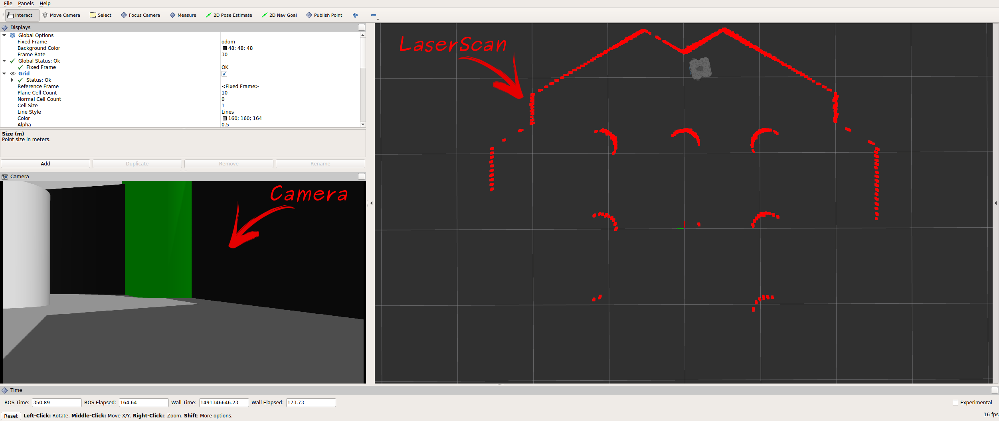
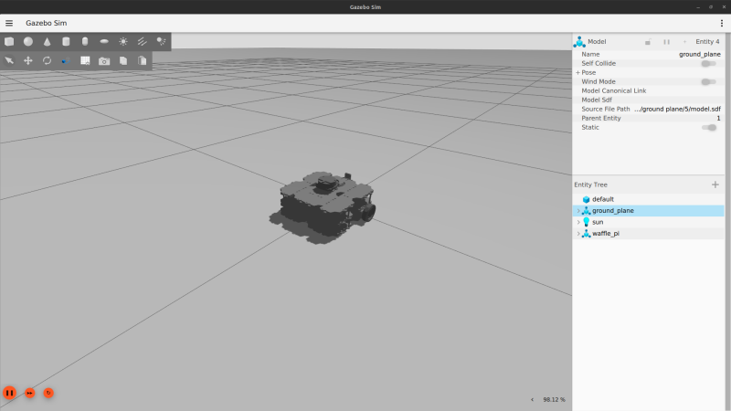
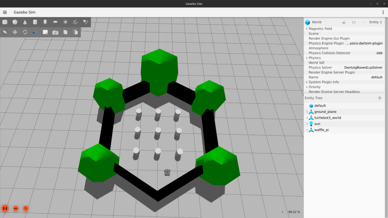
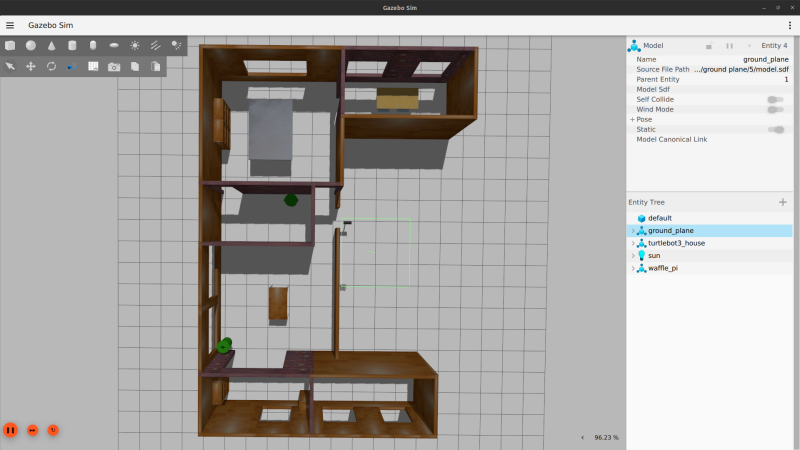
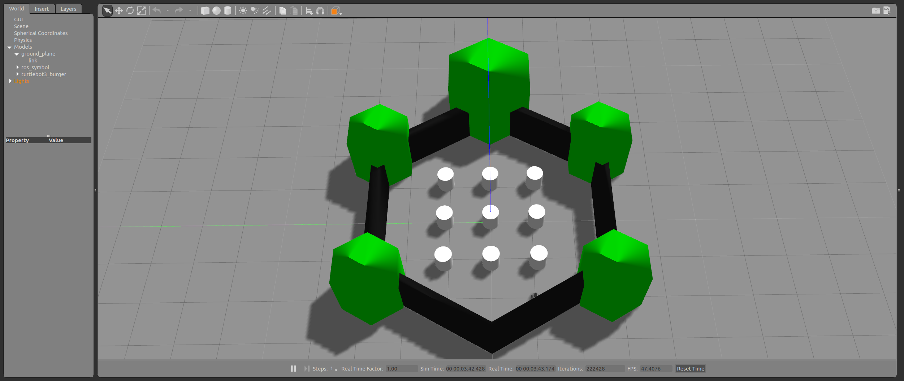

> **출처**: [https://emanual.robotis.com/docs/en/platform/turtlebot3/simulation](https://emanual.robotis.com/docs/en/platform/turtlebot3/simulation)

---
# TOC

1. [Humble](#humble)
2. [Jazzy](#jazzy)
3. [Noetic](#noetic)

---
[TOC](#toc)
# Humble

# 6. Simulation

**참고**

- Simulation은 **Remote PC**에서 실행해야 합니다.
- Remote PC에서 Simulation을 처음 실행할 때는 환경 설정에 시간이 다소 걸릴 수 있습니다.


**TurtleBot3 Simulation에 대해 더 알아보기**
  * TurtleBot3는 가상 로봇으로 개발할 수 있는 시뮬레이션 개발 환경을 지원합니다. 이를 위한 두 가지 개발 환경이 있습니다. 하나는 RViz에서 3D 시각화를 사용하는 fake node 방식이고, 다른 하나는 3D 로봇 시뮬레이터 Gazebo입니다.
     * fake node 시뮬레이션은 로봇 모델과 움직임을 테스트하는 데 적합하지만, 센서를 지원하지 않습니다.
     * SLAM 또는 Navigation을 수행해야 하는 경우 IMU, LDS, 카메라와 같은 센서를 지원하는 Gazebo가 더 적합한 솔루션입니다.
     * Gazebo 튜토리얼: http://gazebosim.org/tutorials

## 6.1 Gazebo Simulation

https://youtu.be/UzOoJ6a_mOg?si=nw5X17eLeQre-Veq

> e-Manual의 내용은 사전 통지 없이 업데이트될 수 있으며, 동영상 콘텐츠는 최신 버전이 아닐 수 있습니다.

이 Gazebo Simulation은 **ROS Gazebo 패키지**를 사용합니다. 이 지침을 실행하기 전에 ROS 2 Humble용 Gazebo 버전이 설치되어 있어야 합니다.


### 6.1.1 Simulation 패키지 설치

  * **TurtleBot3 Simulation 패키지**는 `turtlebot3` 및 `turtlebot3_msgs` 패키지가 필요합니다. 이러한 필수 패키지가 없으면 Simulation을 실행할 수 없습니다. 필수 패키지와 종속 패키지를 설치하지 않은 경우 [PC 설정](https://emanual.robotis.com/docs/en/platform/turtlebot3/quick-start/) 지침을 따르세요.

```
$ cd ~/turtlebot3_ws/src/
$ git clone -b humble https://github.com/ROBOTIS-GIT/turtlebot3_simulations.git
$ cd ~/turtlebot3_ws && colcon build --symlink-install
```

### 6.1.2 Simulation World 실행

TurtleBot3를 위한 세 가지 시뮬레이션 환경이 준비되어 있습니다. 이 중 하나를 선택하여 Gazebo를 실행하세요.

**새로운 월드를 실행하기 전에 다른 Simulation world를 완전히 종료했는지 확인하세요.**

1. Empty World  <br>

```
$ export TURTLEBOT3_MODEL=burger
$ ros2 launch turtlebot3_gazebo empty_world.launch.py
```

2. TurtleBot3 World  <br>

```
$ export TURTLEBOT3_MODEL=waffle
$ ros2 launch turtlebot3_gazebo turtlebot3_world.launch.py
```

3. TurtleBot3 House   <br>

```
$ export TURTLEBOT3_MODEL=waffle_pi
$ ros2 launch turtlebot3_gazebo turtlebot3_house.launch.py
```

> **참고**: TurtleBot3 House를 처음 실행하는 경우, 네트워크 상태에 따라 지도 다운로드에 수 분 이상 걸릴 수 있습니다.


### 6.1.3 TurtleBot3 작동

키보드로 TurtleBot3를 원격 조종하려면 새 터미널 창에서 아래 명령어로 원격 제어 노드를 실행하세요.

```
$ ros2 run turtlebot3_teleop teleop_keyboard
```

**자율 충돌 회피 실행 방법에 대해 더 알아보기**

* 장애물로부터 안전한 거리를 유지하고 충돌을 피하기 위해 회전하는 간단한 충돌 회피 노드가 TurtleBot3 시뮬레이션 패키지와 함께 제공됩니다.
* TurtleBot3 world에서 TurtleBot3를 자율 주행하려면 아래 지침을 따르세요.

1. teleop 노드를 실행 중인 터미널에서 Ctrl + C를 입력하여 turtlebot3_teleop_key 노드를 종료합니다.
2. 터미널에 아래 명령어를 입력합니다.
```
$ ros2 run turtlebot3_gazebo turtlebot3_drive
```

**시뮬레이션 데이터 시각화 방법(RViz2)에 대해 더 알아보기**

RViz2는 시뮬레이션이 실행되는 동안 발행된 토픽을 시각화합니다. 새 터미널 창에서 다음 명령어로 RViz2를 실행할 수 있습니다.
```
$ ros2 launch turtlebot3_bringup rviz2.launch.py
```



---
[TOC](#toc)
# Jazzy

# 6. Simulation
> **참고**
> Simulation은 Remote PC에서 실행해야 합니다.
> Remote PC에서 Simulation을 처음 실행할 때는 환경 설정에 시간이 다소 걸릴 수 있습니다.

**TurtleBot3 Simulation에 대해 더 알아보기**
* TurtleBot3는 가상 로봇으로 개발할 수 있는 시뮬레이션 개발 환경을 지원합니다. 이를 위한 두 가지 개발 환경이 있습니다. 하나는 RViz에서 3D 시각화를 사용하는 fake node 방식이고, 다른 하나는 3D 로봇 시뮬레이터 Gazebo입니다.
   * fake node 시뮬레이션은 로봇 모델과 움직임을 테스트하는 데 적합하지만, 센서를 지원하지 않습니다.
   * SLAM 또는 Navigation을 수행해야 하는 경우 IMU, LDS, 카메라와 같은 센서를 지원하는 Gazebo가 더 적합한 솔루션입니다.
   * Gazebo 튜토리얼: https://gazebosim.org/docs/harmonic/tutorials/

## 6.1 Gazebo Simulation

https://youtu.be/oqT6umwqLk8?si=hO4zdLtQMFn_6ztC

이 Gazebo Simulation은 ros-gz 패키지를 사용합니다. 이 지침을 실행하기 전에 ROS 2 Humble용 Gazebo 버전이 설치되어 있어야 합니다.

### 6.1.1 Simulation 패키지 설치
TurtleBot3 Simulation 패키지는 turtlebot3 및 turtlebot3_msgs 패키지가 필요합니다. 이러한 필수 패키지가 없으면 Simulation을 실행할 수 없습니다.
필수 패키지와 종속 패키지를 설치하지 않은 경우 PC 설정 지침을 따르세요.
```
$ cd ~/turtlebot3_ws/src/
$ git clone -b jazzy https://github.com/ROBOTIS-GIT/turtlebot3_simulations.git
$ cd ~/turtlebot3_ws && colcon build --symlink-install
```

### 6.1.2 Simulation World 실행

* TurtleBot3를 위한 세 가지 시뮬레이션 환경이 준비되어 있습니다. 이 중 하나를 선택하여 Gazebo를 실행하세요.
> 새로운 월드를 실행하기 전에 다른 Simulation world를 완전히 종료했는지 확인하세요.

1. Empty World
```
$ export TURTLEBOT3_MODEL=burger
$ ros2 launch turtlebot3_gazebo empty_world.launch.py
```


2. TurtleBot3 World
```
$ export TURTLEBOT3_MODEL=waffle
$ ros2 launch turtlebot3_gazebo turtlebot3_world.launch.py
```


3. TurtleBot3 House
```
$ export TURTLEBOT3_MODEL=waffle_pi
$ ros2 launch turtlebot3_gazebo turtlebot3_house.launch.py
```


> 참고: TurtleBot3 House를 처음 실행하는 경우, 네트워크 상태에 따라 지도 다운로드에 수 분 이상 걸릴 수 있습니다.

### 6.1.3 TurtleBot3 작동
* 키보드로 TurtleBot3를 원격 조종하려면 새 터미널 창에서 아래 명령어로 원격 제어 노드를 실행하세요.
```
$ ros2 run turtlebot3_teleop teleop_keyboard
```

**시뮬레이션 데이터 시각화 방법(RViz2)에 대해 더 알아보기**

RViz2는 시뮬레이션이 실행되는 동안 발행된 토픽을 시각화합니다. 새 터미널 창에서 다음 명령어로 RViz2를 실행할 수 있습니다.
```
$ ros2 launch turtlebot3_bringup rviz2.launch.py
```


---
[TOC](#toc)
# Noetic

# 6. Simulation

* 참고
   * Simulation은 Remote PC에서 실행해야 합니다.
   * Remote PC에서 Simulation을 처음 실행할 때는 환경 설정에 추가 시간이 필요할 수 있습니다.

**TurtleBot3 Simulation에 대해 더 알아보기**
* TurtleBot3는 가상 로봇으로 개발할 수 있는 시뮬레이션 개발 환경을 지원합니다. 이를 위한 두 가지 개발 환경이 있습니다. 하나는 RViz에서 3D 시각화를 사용하는 fake node 방식이고, 다른 하나는 3D 로봇 시뮬레이터 Gazebo입니다.
   * fake node 시뮬레이션은 로봇 모델과 움직임을 테스트하는 데 적합하지만, 센서를 지원하지 않습니다.
   * SLAM 또는 Navigation을 수행해야 하는 경우 IMU, LDS, 카메라와 같은 센서를 지원하는 Gazebo가 더 적합한 솔루션입니다.
   * Gazebo 튜토리얼: http://gazebosim.org/tutorials

## 6.1 Gazebo Simulation

https://youtu.be/UzOoJ6a_mOg?si=u6h1KzKuqWPk2ZdT

> e-Manual의 내용은 사전 통지 없이 업데이트될 수 있으며, 동영상 콘텐츠는 최신 버전이 아닐 수 있습니다.

## 6.1.1 Simulation 패키지 설치
   * TurtleBot3 Simulation 패키지는 turtlebot3 및 turtlebot3_msgs 패키지가 필요합니다. 이러한 필수 패키지가 없으면 Simulation을 실행할 수 없습니다.
   * 필수 패키지와 종속 패키지를 모두 설치하지 않은 경우 PC 설정 지침을 따르세요.
**[Remote PC]**
```
$ cd ~/catkin_ws/src/
$ git clone -b noetic https://github.com/ROBOTIS-GIT/turtlebot3_simulations.git
$ cd ~/catkin_ws && catkin_make
```

## 6.1.2 Simulation World 실행
TurtleBot3를 위한 세 가지 시뮬레이션 환경이 준비되어 있습니다. 이 중 하나를 선택하여 Gazebo를 실행하세요.

새로운 월드를 실행하기 전에 다른 Simulation world를 완전히 종료했는지 확인하세요.

1. Empty World <br>

**[Remote PC]**
```
$ export TURTLEBOT3_MODEL=burger
$ roslaunch turtlebot3_gazebo turtlebot3_empty_world.launch
```

2. TurtleBot3 World <br>

**[Remote PC]**
```
$ export TURTLEBOT3_MODEL=waffle
$ roslaunch turtlebot3_gazebo turtlebot3_world.launch
```

3. TurtleBot3 House <br>

**[Remote PC]**
```
$ export TURTLEBOT3_MODEL=waffle_pi
$ roslaunch turtlebot3_gazebo turtlebot3_house.launch
```

> * 참고: TurtleBot3 House를 처음 실행하는 경우, 네트워크 상태에 따라 지도 다운로드에 수 분 이상 걸릴 수 있습니다.

### 6.1.3 TurtleBot3 작동
키보드로 TurtleBot3를 원격 조종하려면 새 터미널 창에서 원격 제어 노드를 실행하세요.
**[Remote PC]**
```
$ roslaunch turtlebot3_teleop turtlebot3_teleop_key.launch
```

**자율 충돌 회피 실행 방법에 대해 더 알아보기**

장애물로부터 안전한 거리를 유지하고 충돌을 피하기 위해 회전하는 간단한 충돌 회피 노드가 TB3 패키지에 포함되어 있습니다. TurtleBot3 world 시뮬레이션에서 TurtleBot3를 자율 주행하려면 아래 지침을 따르세요.

1. teleop 노드를 실행 중인 터미널에서 Ctrl + C를 입력하여 turtlebot3_teleop_key 노드를 종료합니다.
2. 터미널에 다음 명령어를 입력합니다.
**[Remote PC]**
```
$ roslaunch turtlebot3_gazebo turtlebot3_simulation.launch
```
**시뮬레이션 데이터 시각화 방법(RViz)에 대해 더 알아보기**
RViz는 시뮬레이션이 실행되는 동안 발행된 토픽을 시각화합니다. 새 터미널 창에서 아래 명령어를 입력하여 RViz를 실행할 수 있습니다.
**[Remote PC]**
```
$ roslaunch turtlebot3_gazebo turtlebot3_gazebo_rviz.launch
```

