> **출처**: [https://emanual.robotis.com/docs/en/platform/turtlebot3/home_service_challenge](https://emanual.robotis.com/docs/en/platform/turtlebot3/home_service_challenge)

---
# TOC

1. [Humble](#humble)
2. [Noetic](#noetic)

---
[TOC](#toc)
# Humble

## 7.10 TurtleBot3 Home Service Challenge

> **참고** :
> - 이 지침은 `Ubuntu 22.04` 및 `ROS2 Humble Hawksbill`에서 테스트되었습니다.
> - 자세한 내용은 [OpenMANIPULATOR e-Manual](https://emanual.robotis.com/docs/en/platform/openmanipulator/) 및 [[ROS 2] Turtlebot3 Manipulation](https://emanual.robotis.com/docs/en/platform/turtlebot3/manipulation)을 참조하세요.

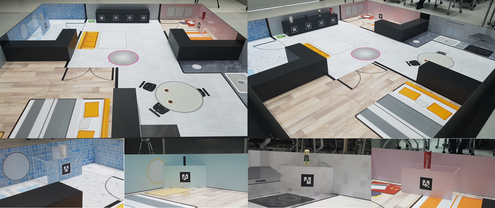

> Home Service Challenge 경기장 및 물체

https://youtu.be/1rkN_F6ODo4?si=4erdIhSQrP17NejO

### 7.10.1 시작하기

> **참고** : PC에 Home Service Challenge 패키지를 설치하기 전에 다음 지침을 먼저 완료하세요.
> - [TurtleBot3 PC 설정](https://emanual.robotis.com/docs/en/platform/turtlebot3/quick-start/#pc-setup)
> - [TurtleBot3 SBC 설정](https://emanual.robotis.com/docs/en/platform/turtlebot3/sbc_setup/#sbc-setup)
> - [TB3 및 OpenMANIPULATOR-X](https://emanual.robotis.com/docs/en/platform/turtlebot3/manipulation/#software-setup) 패키지
> **사전 요구사항** :
> - ROS 2 Humble이 설치된 노트북 또는 데스크탑 PC.
> - 이 지침은 Gazebo 시뮬레이션을 기반으로 합니다.

**Remote PC Setup** Home Service Challenge 패키지를 설치합니다.
**[Remote PC]**

```
$ cd ~/turtlebot3_ws/src/
$ git clone -b humble https://github.com/ROBOTIS-GIT/turtlebot3_home_service_challenge.git
$ cd ~/turtlebot3_ws && colcon build --symlink-install
```


### 7.10.2 Simulation

Gazebo에서 OpenMANIPULATOR-X가 장착된 TurtleBot3를 시뮬레이션합니다. **[Remote PC]**

1. Gazebo 시뮬레이션을 실행합니다.
```
$ ros2 launch turtlebot3_manipulation_gazebo turtlebot3_home_service_challenge.launch.py
```


2. Gazebo용 Nav2를 실행하고 Rviz에서 `2D Pose Estimate`를 설정합니다.
```
$ ros2 launch turtlebot3_home_service_challenge_tools navigation2.launch.py
```


3. Home Service Challenge 임무를 수행하는 데 사용되는 핵심 패키지를 실행합니다.
```
$ ros2 launch turtlebot3_home_service_challenge_core core_node.launch.py
```
> * 참고: core_node에는 ArUco 마커 감지, 주차 및 매니퓰레이터 제어를 위한 노드가 포함되어 있으며, core_node는 이를 사용하여 시나리오 통합 제어를 수행합니다. core_node는 시나리오 순서에 따라 동작을 수행하고 제어합니다. core_node를 실행한 후 rviz에서 ArUco 마커의 TF를 볼 수 있으며 시나리오를 실행할 수 있습니다. 자세한 설명과 시나리오 실행은 Missions를 참조하세요.


### 7.10.3 실제 로봇

**실제 로봇 준비**

- OpenMANIPULATOR-X가 장착된 TurtleBot3로 시나리오를 실행하려면 아래 목록을 확인하세요. 사용자 정의 지도를 생성한 다음 SLAM으로 지도를 생성하고 저장합니다. Rpi-camera를 설정합니다.
  - 사용자 정의 지도를 생성한 다음 [SLAM](https://emanual.robotis.com/docs/en/platform/turtlebot3/manipulation/#slam)으로 지도를 생성하고 저장합니다.
  - [Rpi-camera](https://emanual.robotis.com/docs/en/platform/turtlebot3/sbc_setup/#raspberry-pi-camera)를 설정합니다.

**실제 로봇으로 Home Service Challenge 실행**

1. 하드웨어 bringup을 실행합니다. **[TurtleBot SBC]** $ ros2 launch turtlebot3_manipulation_bringup hardware.launch.py
2. 카메라 노드를 실행합니다. **[TurtleBot SBC]** $ ros2 run camera_ros camera_node --ros-args -p format:='RGB888' -p width:=320 -p height:=240
3. Nav2를 실행하고 Rviz에서 2D Pose Estimate를 설정합니다. 사용자 정의 지도를 사용하려면 launch 인수와 함께 실행합니다. **[Remote PC]** $ ros2 launch turtlebot3_home_service_challenge_tools navigation2.launch.py map_yaml_file:=$HOME/map.yaml
4. Home Service Challenge 임무를 수행하는 데 사용되는 핵심 패키지를 실행합니다. launch 인수로 실행 모드와 ArUco 마커 크기를 지정합니다. **[Remote PC]** $ ros2 launch turtlebot3_home_service_challenge_core core_node.launch.py launch_mode:='actual' marker_size:=0.04

**인수**
`launch_mode`
- 기본값: simulation
- 설명: Home Service Challenge를 시뮬레이션으로 실행할지 실제 로봇으로 실행할지 선택합니다.

`marker_size`
- 기본값: 0.088
- 설명: 사용자 정의 지도에서 사용되는 ArUco 마커의 크기를 지정합니다.

> 참고: core_node에는 ArUco 마커 감지, 주차 및 매니퓰레이터 제어를 위한 노드가 포함되어 있으며, core_node는 이를 사용하여 시나리오 통합 제어를 수행합니다. core_node는 시나리오 순서에 따라 동작을 수행하고 제어합니다. core_node를 실행한 후 rviz에서 ArUco 마커의 TF를 볼 수 있으며 시나리오를 실행할 수 있습니다. 자세한 설명과 시나리오 실행은 Missions를 참조하세요.


### 7.10.4 Missions


#### 7.10.4.1 명령어

Home Service Challenge 중에 다음 명령어를 사용합니다.
**[Remote PC]**
**개별 동작**

- ArUco 마커 앞에 주차: `$MARKER_ID` 정수에 마커의 ID를 입력합니다.
```
$ ros2 topic pub -1 /manipulator_control std_msgs/msg/String "{data: 'pick_target'}"
$ ros2 topic pub -1 /manipulator_control std_msgs/msg/String "{data: 'place_target'}"
```

> 참고: 이 명령어를 사용할 때는 `scenario.yaml` 파일에 있는 ArUco 마커 ID 중 하나를 반드시 포함하세요. 제공된 지도에는 ID 0부터 7까지 있습니다. 시나리오에 대한 자세한 내용은 이 섹션 아래의 Configuration 설명을 참조하세요.

* 매니퓰레이터 제어: 매니퓰레이터를 사용하여 물체를 집거나 놓습니다. $ ros2 topic pub -1 /manipulator_control std_msgs/msg/String "{data: 'pick_target'}" $ ros2 topic pub -1 /manipulator_control std_msgs/msg/String "{data: 'place_target'}"

**시나리오 실행** TurtleBot3는 작성된 시나리오를 기반으로 `$SCENARIO_NAME`에 대한 **개별 동작**을 수행합니다.

```
$ ros2 topic pub -1 /scenario_selection std_msgs/msg/String "{data: '$SCENARIO_NAME'}"
```

> **참고** : 이 명령어를 사용할 때는 `scenario.yaml` 파일에 있는 시나리오 이름 중 하나를 반드시 포함하세요. 제공된 시나리오 파일에는 `room1`부터 `room4`까지 있습니다. 시나리오에 대한 자세한 내용은 이 섹션 아래의 Details 설명을 참조하세요.


#### 7.10.4.2 Configuration

주어진 환경에 따라 설정 파일의 데이터를 수정합니다.
**[Remote PC]**

* `scenario.yaml` : 이 파일에는 시나리오 데이터가 포함됩니다. 시뮬레이션에서 처음에 TurtleBot 전면에는 ID 0부터 3까지의 마커가 있으며, 이들은 target_marker_id로 할당됩니다. 각 방에는 ID 4부터 7까지의 마커가 있습니다.
  * 파일 경로 : /turtlebot3_home_service_challenge/turtlebot3_home_service_challenge_core/config/scenario.yaml
  * 스크립트
```
scenario:
  room1:  # SCENARIO_NAME
    target_marker_id: 0  # ArUco Marker's ID
    goal_pose: [0.9, 0.5, 0.0, 0.0, 0.0, 0.7071, 0.7071]  # 목표 마커가 위치한 방의 좌표 및 방향
    goal_marker_id: 4  # ArUco Marker's ID
    end_pose: [0.0, 0.0, 0.0, 0.0, 0.0, 0.0, 1.0]  # 돌아갈 위치의 좌표 및 방향
```

* `turtlebot3_hsc_manipulation.srdf` : 이 설정 파일에는 매니퓰레이터의 위치 데이터가 포함됩니다. 관절 값을 변경하거나 새 `group_state`를 추가하여 매니퓰레이터의 포즈를 지정할 수 있습니다.
   * 파일 경로 : /turtlebot3_home_service_challenge/turtlebot3_home_service_challenge_tools/config/turtlebot3_hsc_manipulation.srdf
   * 스크립트
```
<group_state name="target" group="arm">
    <joint name="joint1" value="0"/>
    <joint name="joint2" value="0.9076"/>
    <joint name="joint3" value="-0.9425"/>
    <joint name="joint4" value="0.0873"/>
</group_state>
```

#### 7.10.4.3 Home Service Mission 상세 정보

Home Service Challenge의 목표는 주어진 규칙에 따라 네 개의 서로 다른 물체를 거실에서 특정 장소로 옮기고 시작 지점으로 돌아오는 것입니다. (데모 실행에 사용된 토픽: `/scenario_selection`)

데모 패키지를 사용하여 Home Service Challenge에서 물체를 옮기는 과정은 다음과 같습니다.

1. 목표물에 접근합니다. 정밀한 목표물 접근을 위해 AR 마커에서 목표물의 위치를 계산하여 TurtleBot3의 바퀴를 직접 제어합니다. (사용 토픽: /target_marker_id, /cmd_vel) 안정적인 성능을 위해 두 번 시도합니다.


2. OpenMANIPULATOR-X의 그리퍼로 목표물을 집습니다. MoveIt 패키지를 사용하여 관절 공간 제어, 작업 공간 제어 및 그리퍼 제어를 수행하여 목표 물체를 집습니다. (사용 토픽: /manipulator_control) MoveIt 다이어그램
manipulation_diagram.png

3. 물체를 놓을 다음 방으로 이동합니다.
- Nav2 패키지를 사용하여 yaml 파일에 저장된 다음 방에 도달합니다.

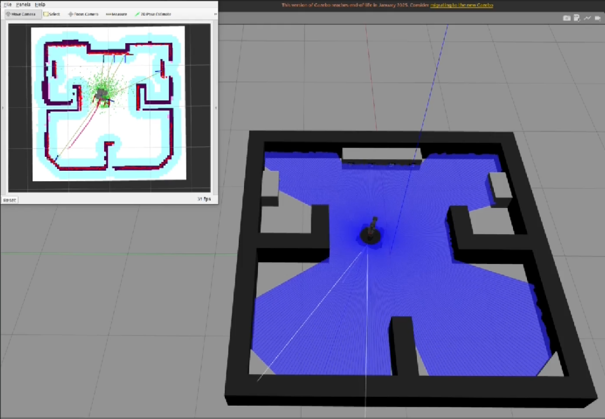

5. 목표물에 접근합니다.
6. 그리퍼를 사용하여 물체를 놓습니다.
7. Nav2 패키지를 사용하여 시작 지점으로 돌아갑니다.

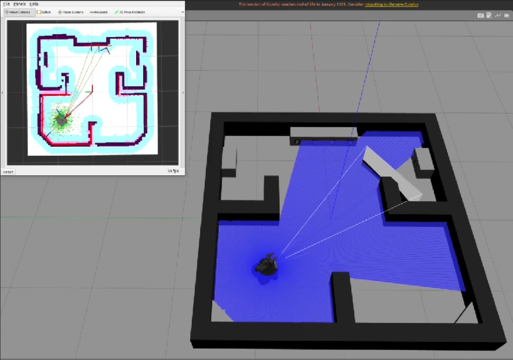

---
[TOC](#toc)
# Noetic

## 7.10 TurtleBot3 Home Service Challenge

> **참고** :
> - 이 지침은 `Ubuntu 20.04` 및 `ROS1 Noetic Ninjemys`에서 테스트되었습니다.
> - 자세한 내용은 [OpenMANIPULATOR e-Manual](https://emanual.robotis.com/docs/en/platform/openmanipulator/) 및 [[ROS 1] Turtlebot3 Manipulation](https://emanual.robotis.com/docs/en/platform/turtlebot3/manipulation)을 참조하세요.
> - Home Service Challenge noetic 패키지는 주로 **Gazebo 시뮬레이션**에서 테스트되었습니다.
> - 실제 로봇도 테스트 및 업데이트될 예정입니다.


> Home Service Challenge 경기장 및 물체

https://youtu.be/lnLHSz7mGIA?si=-Tz5UwLntrFPc3mP

### 7.10.1 시작하기

**참고** : PC에 Home Service Challenge 패키지를 설치하기 전에 다음 지침을 먼저 완료하세요.

- [TurtleBot3 PC 설정](https://emanual.robotis.com/docs/en/platform/turtlebot3/quick-start/#pc-setup)
- [TurtleBot3 SBC 설정](https://emanual.robotis.com/docs/en/platform/turtlebot3/sbc_setup/#sbc-setup)
- [OpenMANIPULATOR-X](https://emanual.robotis.com/docs/en/platform/openmanipulator_x/quick_start_guide/#install-ros-packages) 패키지


#### 7.10.1.1 사전 요구사항

`Remote PC`

- ROS 1 Noetic이 설치된 노트북 또는 데스크탑 PC.
- 이 지침은 Gazebo 시뮬레이션을 기반으로 합니다.


#### 7.10.1.2 Remote PC 설정

1. **[Remote PC]** Home Service Challenge 패키지를 설치합니다.
```
$ cd ~/catkin_ws/src/
$ git clone -b noetic https://github.com/ROBOTIS-GIT/turtlebot3_home_service_challenge.git
$ git clone -b noetic-devel https://github.com/machinekoder/ar_track_alvar
$ cd ~/catkin_ws && catkin_make
```

2. **[Remote PC]** RViz에서 OpenMANIPULATOR가 장착된 TurtleBot3 Waffle(또는 Waffle Pi)을 로드합니다.
```
$ export TURTLEBOT3_MODEL=${TB3_MODEL}
$ roslaunch turtlebot3_manipulation_description turtlebot3_manipulation_view.launch use_gui:=true
```

> 참고: 명령어를 실행하기 전에 ${TB3_MODEL}을 waffle, waffle_pi로 지정하세요. Export TURTLEBOT3_MODEL 지침에 따라 영구 export 설정을 지정하세요.

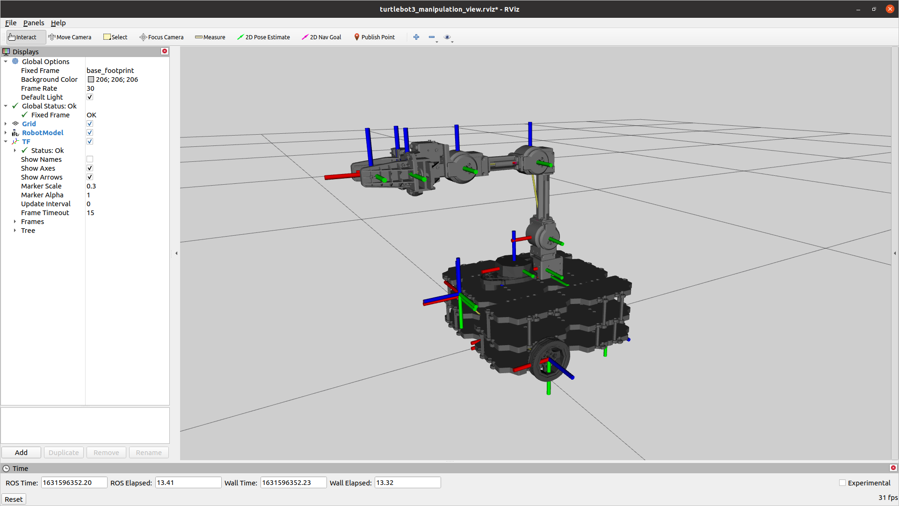

### 7.10.2 실제 로봇 준비

> **참고** : 실제 로봇은 ROS 2 Humble부터 지원됩니다.


### 7.10.3 Missions


#### 7.10.3.1 데모 및 매니저 패키지 실행

1. **[Remote PC]** Gazebo 시뮬레이션을 실행합니다.
```
$ roslaunch turtlebot3_home_service_challenge_simulation competition.launch
```

2. **[Remote PC]** Gazebo용 시뮬레이션 데모를 실행합니다.
```
$ roslaunch turtlebot3_home_service_challenge_tools turtlebot3_home_service_challenge_demo_simulation.launch
```


3. **[Remote PC]** Home Service Challenge 임무를 수행하는 데 사용되는 매니저 패키지를 실행합니다.
```
$ roslaunch turtlebot3_home_service_challenge_manager manager.launch
```


#### 7.10.3.2 명령어

**[Remote PC]** Home Service Challenge 중에 다음 명령어를 사용합니다.

- **Ready** : TurtleBot3가 임무를 시작할 준비를 합니다.
```
$ rostopic pub -1 /tb3_hsc/command std_msgs/String ready_mission
```

- **Start** : TurtleBot3가 임무를 시작합니다.
```
$ rostopic pub -1 /tb3_hsc/command std_msgs/String start_mission
```

- **Stop** : TurtleBot3가 임무 실행을 중지합니다.
```
$ rostopic pub -1 /tb3_hsc/command std_msgs/String stop_mission
```

- **Restart** : TurtleBot3가 주어진 시나리오로 임무를 다시 시작합니다.
```
$ rostopic pub -1 /tb3_hsc/command std_msgs/String restart_mission:SCENARIO_NAME
```

> 참고: 이 명령어를 사용할 때는 `scenario.yaml` 파일에 있는 시나리오 이름 중 하나를 반드시 포함하세요. 시나리오에 대한 자세한 내용은 이 섹션 아래의 Configuration 설명을 참조하세요.


#### 7.10.3.3 작동 테스트

**[Remote PC]** 탐색 또는 매니퓰레이션 기능을 테스트하려면 다음 토픽을 발행합니다.

- Navigation
```
$ rostopic pub -1 /tb3_hsc/command std_msgs/String nav_start
```


```
$ rostopic pub -1 /tb3_hsc/command std_msgs/String nav_ar_marker_0
```


```
$ rostopic pub -1 /tb3_hsc/command std_msgs/String nav_ar_marker_1
```


```
$ rostopic pub -1 /tb3_hsc/command std_msgs/String nav_ar_marker_2
```


```
$ rostopic pub -1 /tb3_hsc/command std_msgs/String nav_ar_marker_3
```


- Manipulation
```
$ rostopic pub -1 /tb3_hsc/command std_msgs/String arm_home
```


```
$ rostopic pub -1 /tb3_hsc/command std_msgs/String arm_joint
```
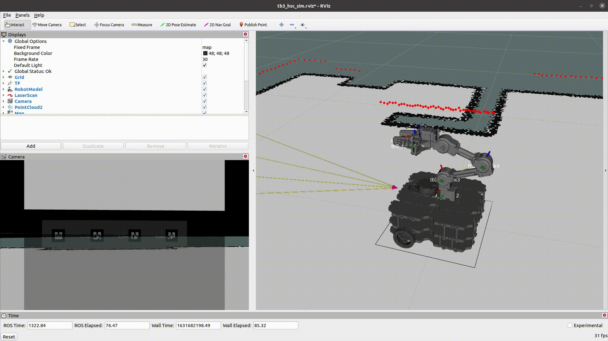

```
$ rostopic pub -1 /tb3_hsc/command std_msgs/String arm_task
```


```
$ rostopic pub -1 /tb3_hsc/command std_msgs/String open_gripper
```
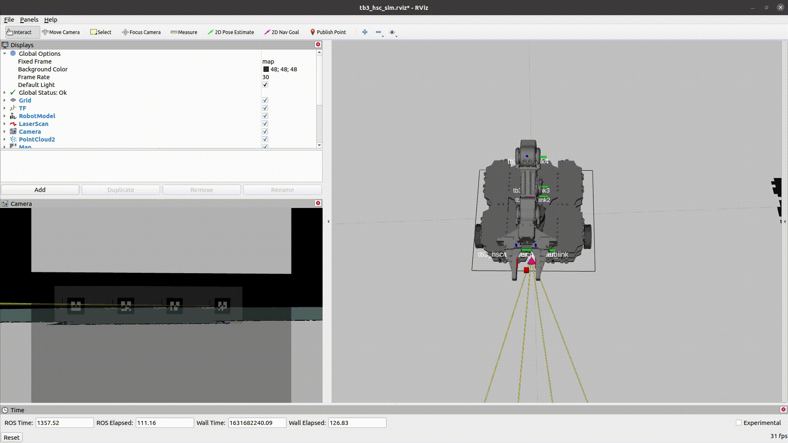

```
$ rostopic pub -1 /tb3_hsc/command std_msgs/String close_gripper
```


#### 7.10.3.4 Configuration

**[Remote PC]** 주어진 환경에 따라 설정 파일의 데이터를 수정합니다.

* `scenario.yaml` : 이 파일에는 시나리오 데이터가 포함됩니다.
  * 파일 경로 : /turtlebot3_home_service_challenge_manager/script/scenario.yaml
  * 스크립트
```
SCENARIO_NAME: # start - scenario - finish
  task: TASK_NAME
  args: [0, 1, 2]
  timeout: 10 #초, 0 : 시간 제한 없음
  next_scenario: find_object
  scenario_on_failure: standby
  retry_times: 0 #회, 0 : 재시도 없음
```
* `room.yaml` : 이 파일에는 Home Service Challenge 경기장의 데이터가 포함됩니다.
  * 파일 경로 : /turtlebot3_home_service_challenge_manager/config/room.yaml
  * 스크립트
```
room_1:
  name: toilet
  object:
    marker: ar_marker_0
    position: [0.25, 0, 0.15]
  target:
    marker: ar_marker_4
    position: [0.25, 0, 0.15]
  x: [1.5, 0.6]
  y: [1.5, 0.2]
```
* `config.yaml` : 이 설정 파일에는 매니저 패키지의 데이터가 포함됩니다.
  * 파일 경로 : /turtlebot3_home_service_challenge_manager/config/config.yaml


#### 7.10.3.5 Home Service Mission 상세 정보

Home Service Challenge의 목표는 주어진 규칙에 따라 네 개의 서로 다른 물체를 거실에서 특정 장소로 옮기고 시작 지점으로 돌아오는 것입니다.

데모 패키지를 사용하여 Home Service Challenge에서 물체를 옮기는 과정은 다음과 같습니다.

1. 거실의 목표물로 이동합니다. Navigation 패키지를 사용하여 목표물을 찾고 도달합니다.

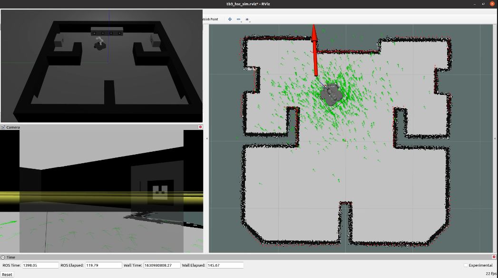

2. 목표물에 접근합니다. 정밀한 목표물 접근을 위해 AR 마커에서 목표물의 위치를 계산하여 TurtleBot3의 바퀴를 직접 제어합니다. (사용 토픽: /tb3_hsc/cmd_vel) 안정적인 성능을 위해 지정된 횟수만큼 폐루프 및 제어 시스템을 사용할 수 있습니다.

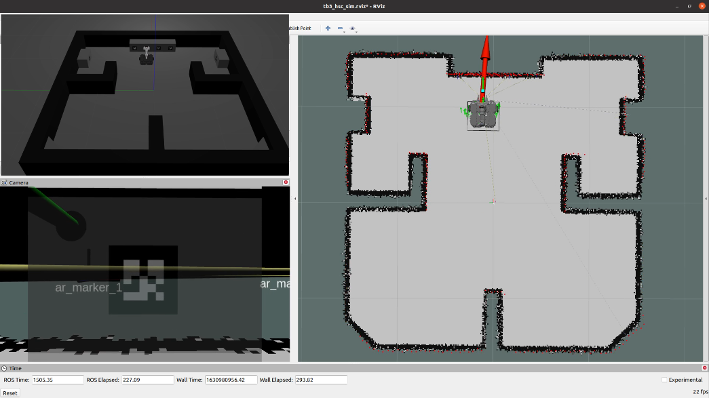

3. OpenMANIPULATOR-X의 그리퍼로 목표물을 집습니다. moveit 패키지를 사용하여 목표 물체를 집습니다. (관절 공간 제어, 작업 공간 제어 및 그리퍼 제어) MoveIt 다이어그램

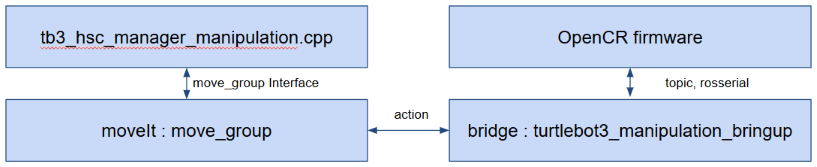

4. 물체를 놓을 다음 방으로 이동합니다. (사용 토픽: `/tb3_hsc/cmd_vel`) 목표물에서 뒤로 이동할 때 매니저 프로그램이 /tb3_hsc/cmd_vel 토픽을 사용하여 바퀴를 직접 제어합니다.

5. 물체를 놓을 장소로 이동합니다. Navigation 패키지를 사용하여 다음 목표물을 찾고 도달합니다.

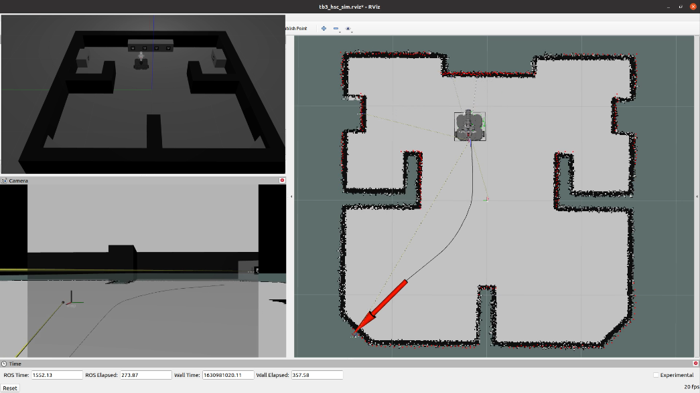

6. 목표물에 접근합니다.

7. 그리퍼를 사용하여 물체를 놓습니다.

8. Navigation 패키지를 사용하여 시작 지점으로 돌아갑니다.

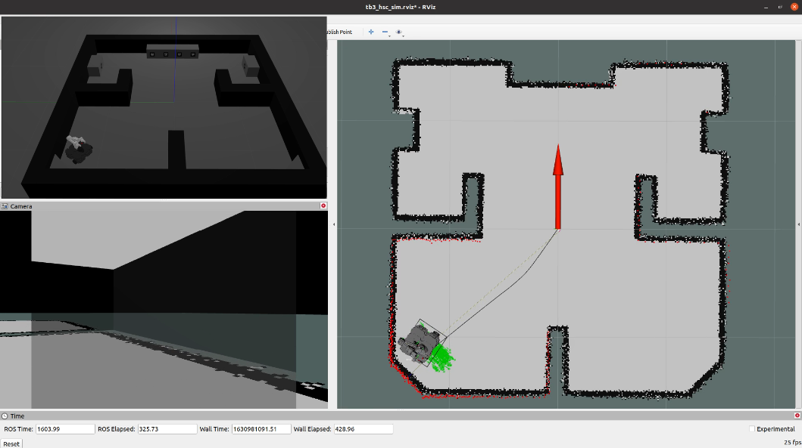


### 7.10.4 Simulation

Gazebo에서 OpenMANIPULATOR-X가 장착된 TurtleBot3를 시뮬레이션합니다.

1. **[Remote PC]** Gazebo를 실행합니다.
```
$ roslaunch turtlebot3_home_service_challenge_simulation competition.launch
```


2. **[Remote PC]** Gazebo용 시뮬레이션 데모를 실행합니다.
```
$ roslaunch turtlebot3_home_service_challenge_tools turtlebot3_home_service_challenge_demo_simulation.launch
```


3. **[Remote PC]** Home Service Manager를 실행합니다.
```
$ roslaunch turtlebot3_home_service_challenge_manager manager.launch
```

4. Home Service Challenge 명령어를 사용합니다. Commands를 참조하세요.
