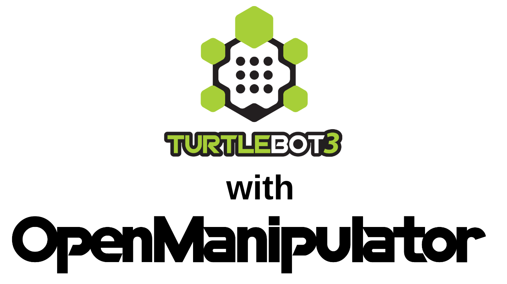
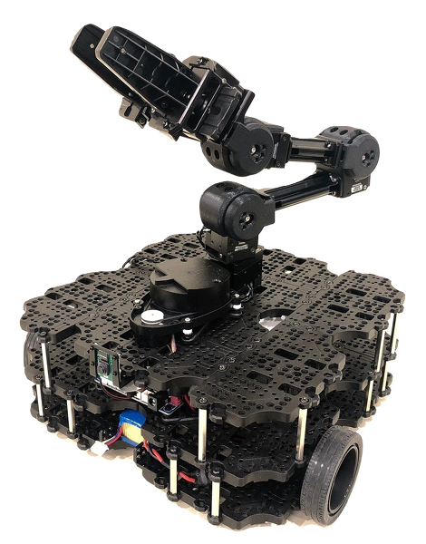
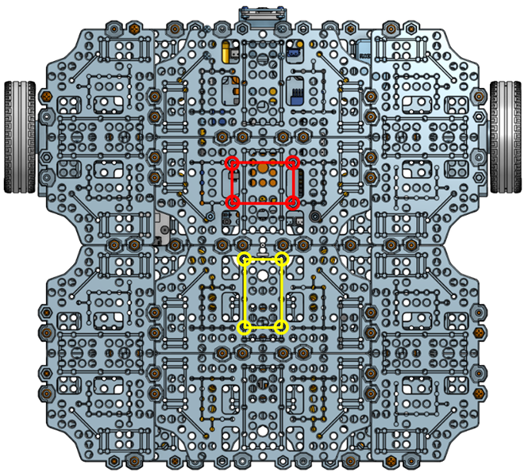
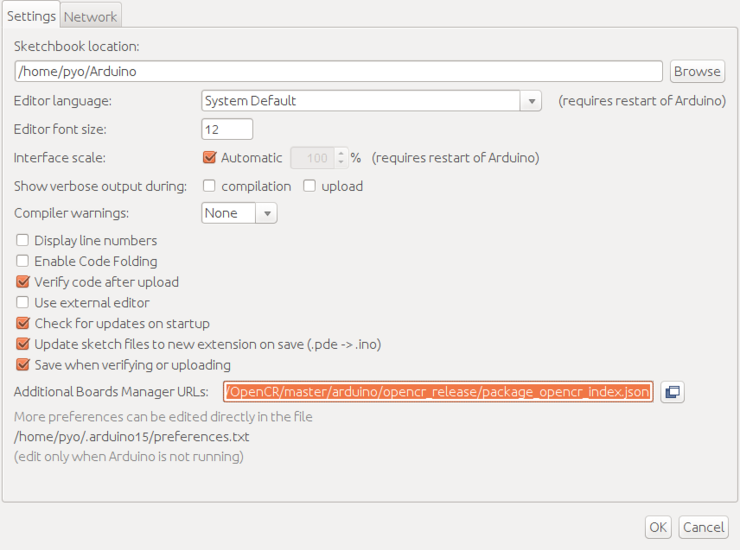
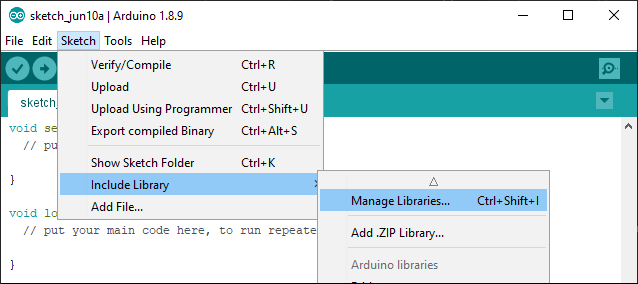
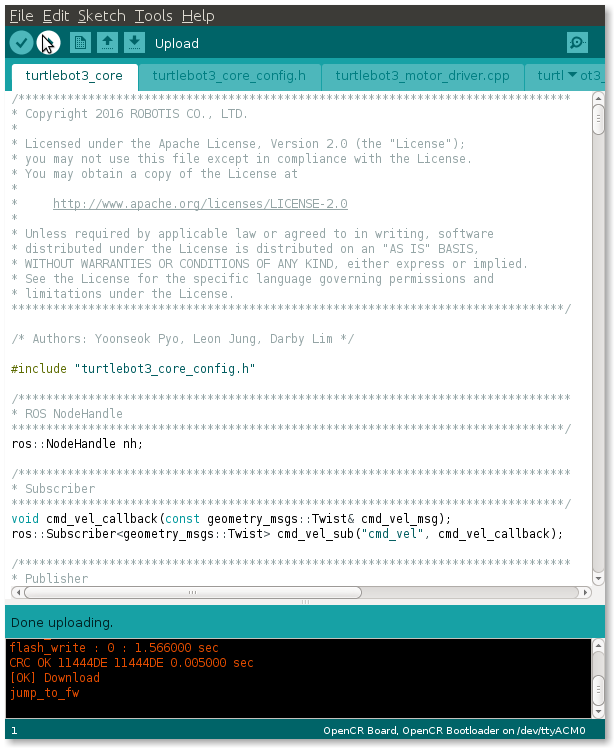
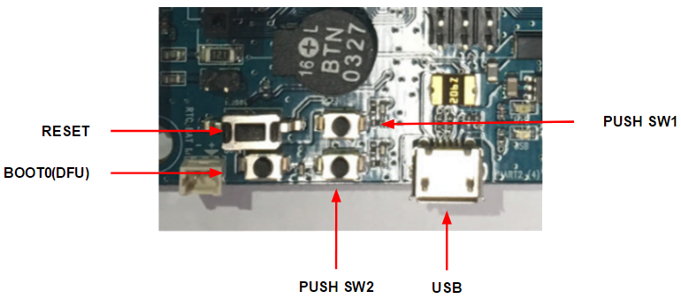
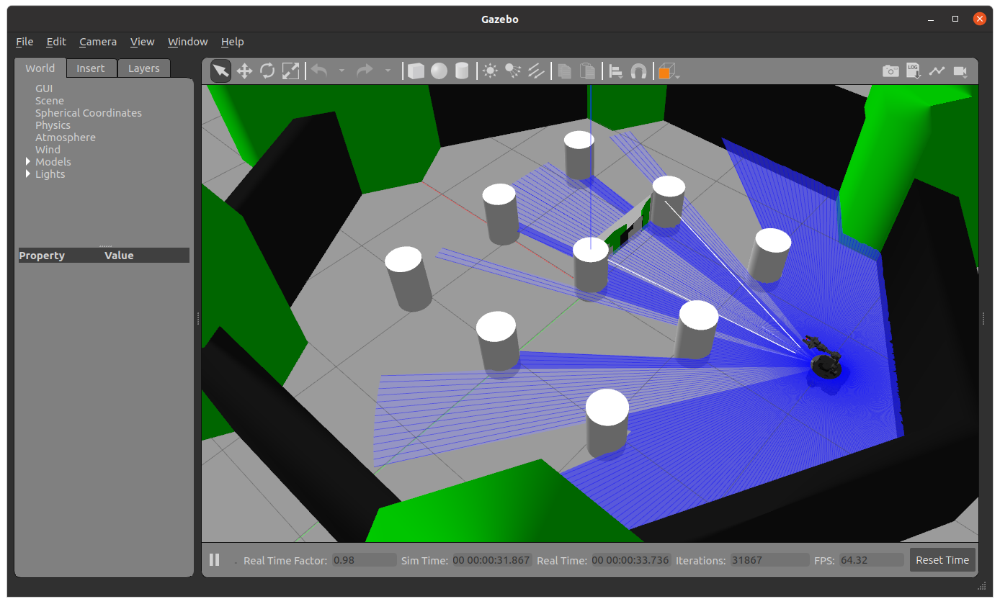
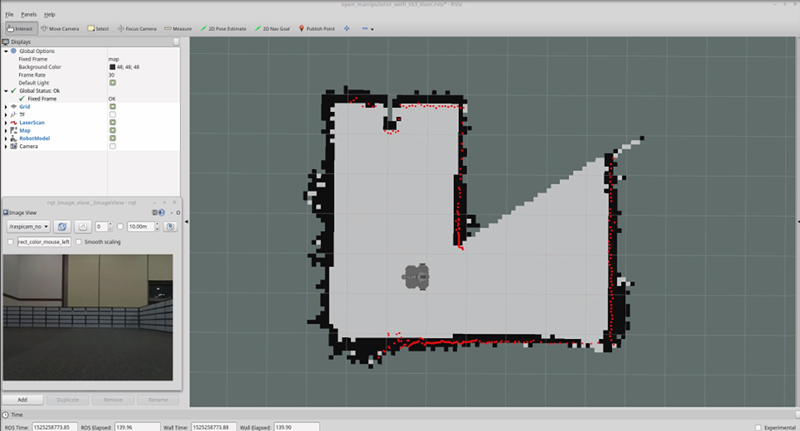
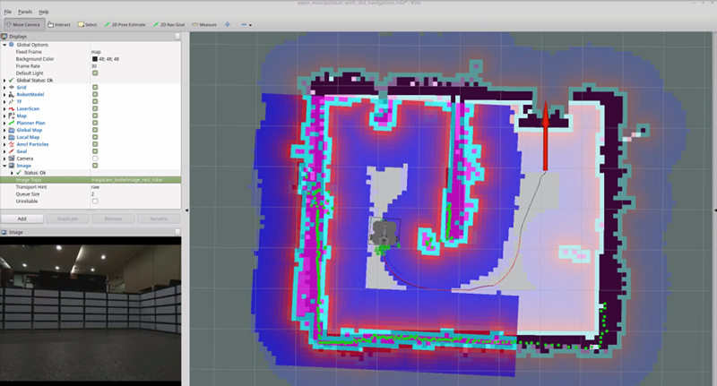

> **출처**: [https://emanual.robotis.com/docs/en/platform/turtlebot3/manipulation](https://emanual.robotis.com/docs/en/platform/turtlebot3/manipulation)

---
# TOC

1. [Humble](#humble)
2. [Noetic](#noetic)

---
[TOC](#toc)
# Humble

# 7. Manipulation

> **참고** :
> - 이 지침은 `Ubuntu 22.04` 및 `ROS2 Humble Hawksbill`에서 테스트되었습니다.
> - OpenMANIPULATOR-X 작동에 대한 더 자세한 정보는 [OpenMANIPULATOR-X](https://emanual.robotis.com/docs/en/platform/openmanipulator/) eManual 페이지를 참조하세요.

> e-Manual의 내용은 사전 공지 없이 변경될 수 있습니다. 포함된 일부 동영상 지침은 e-Manual의 내용과 다를 수 있습니다.

## 7.1 TurtleBot3 with OpenMANIPULATOR



* ROBOTIS의 OpenMANIPULATOR-X는 DYNAMIXEL 액추에이터를 사용하는 저가형 매니퓰레이터로, 3D 프린팅 가능한 부품과 ROS를 지원합니다.
* OpenMANIPULATOR-X는 TurtleBot3 플랫폼에 필수적인 SLAM 및 Navigation 기능을 갖춘 `모바일 매니퓰레이터`로서 TurtleBot3 Waffle과 호환됩니다.

* https://youtu.be/Qhvk5cnX2hM?si=kdWlSmFP9ta3l5Jv
* https://youtu.be/P82pZsqpBg0?si=0775bFW_WgB71_zu

> e-Manual의 내용은 사전 공지 없이 변경될 수 있습니다. 일부 동영상 내용은 e-Manual의 내용과 다를 수 있습니다.

## 7.2 Software Setup

> **참고** : ROS2 Humble용 TurtleBot3 Manipulation은 `turtlebot3_manipulation` 패키지가 필요합니다. 아래 지침에 따라 필요한 패키지와 의존성을 설치하세요.

> **TurtleBot3 Simulation Package는 turtlebot3 및 turtlebot3_msgs 패키지가 필요합니다. 이러한 필수 패키지가 없으면 TurtleBot3 Manipulator를 실행할 수 없습니다. 필요한 패키지와 의존 패키지를 설치하지 않았다면 Quick Start Guide 지침을 따르세요.**

1. 아래 ssh 명령어를 사용하여 **TurtleBot3 SBC**에 연결합니다.
**[Remote PC]**
```
$ ssh ubuntu@{IP_ADDRESS_OF_TURTLEBOT3}
```

3. TurtleBot3 Manipulation용 패키지를 설치합니다.
**[TurtleBot3 SBC]**
```
$ sudo apt install ros-humble-hardware-interface ros-humble-xacro ros-humble-ros2-control ros-humble-ros2-controllers ros-humble-gripper-controllers
$ cd ~/turtlebot3_ws/src/
$ git clone -b humble https://github.com/ROBOTIS-GIT/turtlebot3_manipulation.git
$ cd ~/turtlebot3_ws && colcon build --symlink-install
```

4. **Remote PC**에서 터미널을 열고 다음 명령어를 사용하여 필요한 패키지를 설치합니다.
**[Remote PC]**
```
$ sudo apt install ros-humble-dynamixel-sdk ros-humble-ros2-control ros-humble-ros2-controllers ros-humble-gripper-controllers ros-humble-moveit*
$ cd ~/turtlebot3_ws/src/
$ git clone -b humble https://github.com/ROBOTIS-GIT/turtlebot3_manipulation.git
$ cd ~/turtlebot3_ws && colcon build --symlink-install
```
## 7.3 Hardware Assembly

- [CAD 파일](http://www.robotis.com/service/download.php?no=767) (TurtleBot3 Waffle Pi + OpenMANIPULATOR)



1. `LDS-01` 또는 `LDS-02` LiDAR 센서를 분리하여 TurtleBot3 전면에 설치합니다. 빨간색 원은 권장 볼트 구멍을 나타냅니다.
2. `OpenMANIPULATOR-X`를 TurtleBot3에 설치합니다. 노란색 원은 권장 볼트 구멍을 나타냅니다.




## 7.4 OpenCR Setup

> **참고** : OpenMANIPULATOR-X를 사용하려면 **쉘 스크립트** 또는 **Arduino IDE**를 사용하여 OpenCR에 특정 펌웨어를 업로드해야 합니다.
> 1. **쉘 스크립트**는 사전 빌드된 바이너리 파일을 사용하므로 펌웨어 업로드에 권장됩니다.
> 2. **Arduino IDE**는 제공된 소스 코드를 빌드하고 생성된 바이너리 파일을 업로드합니다. OpenCR Arduino 보드 매니저는 Raspberry Pi 또는 Jetson Nano와 같은 ARM 기반 프로세서를 지원하지 않습니다.

> **경고** OpenCR 펌웨어를 업로드하기 전에 모든 DYNAMIXEL 모터를 OpenCR에 연결하세요.

* OpenMANIPULATOR-X가 TurtleBot3에 올바르게 장착된 후, 연결된 DYNAMIXEL을 제어하려면 OpenCR 펌웨어를 업데이트해야 합니다. 아래 펌웨어 업데이트 지침을 따르세요.

1. Raspberry Pi(SBC)에서 OpenCR 펌웨어 파일을 다운로드하고 다음 명령어로 올바른 펌웨어를 업로드합니다.
**[TurtleBot3 SBC]**
```
$ export OPENCR_PORT=/dev/ttyACM0
$ export OPENCR_MODEL=turtlebot3_manipulation
$ rm -rf ./opencr_update.tar.bz2
$ wget https://github.com/ROBOTIS-GIT/OpenCR-Binaries/raw/master/turtlebot3/ROS2/latest/opencr_update.tar.bz2
$ tar -xvf opencr_update.tar.bz2
$ cd ./opencr_update
$ ./update.sh $OPENCR_PORT $OPENCR_MODEL.opencr
```

2. 펌웨어가 OpenCR에 성공적으로 업로드되면, 펌웨어 업로드에 사용된 터미널에 **jump_to_fw**가 출력됩니다.


### 7.4.1 Arduino IDE

> OpenCR 보드 매니저는 **Raspberry Pi 또는 NVidia Jetson과 같은 ARM 기반 SBC에서 Arduino IDE를 지원하지 않습니다**. Arduino IDE를 사용하여 OpenCR 펌웨어를 업로드하려면 PC에서 아래 지침을 따르세요.

> **참고** : OpenMANIPULATOR-X를 사용하려면 **쉘 스크립트** 또는 **Arduino IDE**를 사용하여 OpenCR에 전용 펌웨어를 업로드해야 합니다.

**Arduino IDE를 사용한 펌웨어 업로드에 대해**

1. Linux를 사용하는 경우 OpenCR용 USB 포트를 구성하세요. 다른 OS(OSX 또는 Windows)의 경우 2단계 "Arduino IDE 설치"로 건너뛸 수 있습니다.
```
$ wget https://raw.githubusercontent.com/ROBOTIS-GIT/OpenCR/master/99-opencr-cdc.rules
$ sudo cp ./99-opencr-cdc.rules /etc/udev/rules.d/
$ sudo udevadm control --reload-rules
$ sudo udevadm trigger
$ sudo apt install libncurses5-dev:i386
```
2. Arduino IDE를 설치합니다.
   * 최신 Arduino IDE를 다운로드하세요.
3. 설치가 완료되면 Arduino IDE를 실행합니다.
4. `Ctrl` + `,`를 눌러 환경설정(Preferences) 메뉴를 엽니다.
5. 추가 보드 매니저 URLs(Additional Boards Manager URLs)에 아래 주소를 입력합니다.
```
https://raw.githubusercontent.com/ROBOTIS-GIT/OpenCR/master/arduino/opencr_release/package_opencr_index.json
```


6. Sketch > Include Library > Manage Libraries...를 선택하여 DYNAMIXEL2Arduino 라이브러리를 설치합니다.



7. 라이브러리 매니저에서 DYNAMIXEL2Arduino를 검색하고 라이브러리를 설치합니다.


8. TurtleBot3 Manipulation 예제를 엽니다.
   * File > Examples > turtlebot3 > turtlebot3_manipulation > turtlebot3_manipulation
9. OpenCR의 마이크로 USB를 PC에 연결하고 Arduino IDE에서 Tools > Board > OpenCR > OpenCR Board를 선택합니다.
10. Tools > Port 메뉴에서 OpenCR에 연결된 포트를 선택합니다.
11. Ctrl + U 또는 업로드 아이콘을 사용하여 TurtleBot3 펌웨어 스케치를 업로드합니다.



12. 펌웨어 업로드가 실패하면 복구 모드로 펌웨어 업로드를 시도하세요. 다음 순서로 OpenCR의 복구 모드를 활성화합니다. 복구 모드에서 OpenCR의 STATUS LED가 주기적으로 깜박입니다.
   * PUSH SW2 버튼을 길게 누릅니다.
   * Reset 버튼을 누릅니다.
   * Reset 버튼에서 손을 뗍니다.
   * PUSH SW2 버튼에서 손을 뗍니다.



## 7.5 Bringup

> Gazebo를 사용한 TurtleBot3 Manipulation 시뮬레이션을 실행하려면 [Simulation](https://emanual.robotis.com/docs/en/platform/turtlebot3/manipulation#simulation) 섹션으로 건너뛰세요.
> 다음 명령어는 OpenMANIPULATOR-X가 장착된 실제 TurtleBot3 하드웨어를 구동합니다.

1. **TurtleBot3 SBC**에서 터미널을 엽니다.
2. 다음 명령어를 사용하여 TurtleBot3 Manipulation을 구동합니다.
**[TurtleBot3 SBC]**

```
$ ros2 launch turtlebot3_manipulation_bringup hardware.launch.py
```

> **위험**
> **로봇 관절 사이의 끼임 위험에 주의하세요!!!**
> Turtlebot3 Manipulation bringup이 실행되면 **OpenMANIPULATOR-X가 초기 포즈로 이동합니다**. 초기 이동 중 물리적 손상을 방지하기 위해 OpenMANIPULATOR-X를 아래 이미지와 유사한 포즈로 놓는 것이 좋습니다.
> 


## 7.6 Simulation
* 아래 지침에 따라 Gazebo를 사용하여 TurtleBot3 Manipulation을 시뮬레이션합니다.

### 7.6.1 Simulation Package 설치
* TurtleBot3 Manipulation Gazebo 시뮬레이션용 패키지를 설치합니다.
**[Remote PC]**
```
$ cd ~/turtlebot3_ws/src/
$ git clone -b humble https://github.com/ROBOTIS-GIT/turtlebot3_simulations.git
$ cd ~/turtlebot3_ws && colcon build --symlink-install
```

### 7.6.2 Gazebo 실행 방법
* 다음 명령어로 Gazebo 월드에서 OpenMANIPULATOR-X가 장착된 TurtleBot3를 구동합니다.
**[Remote PC]**

```
$ ros2 launch turtlebot3_manipulation_gazebo gazebo.launch.py
```



> **팁**
> RViz와 함께 실행하려면 아래와 같이 `start_rviz` 파라미터를 추가하세요.
> **[Remote PC]**
> ```
> $ ros2 launch turtlebot3_manipulation_gazebo gazebo.launch.py start_rviz:=true
> ```

* Gazebo 시뮬레이션에서 TurtleBot3를 제어하려면 먼저 MoveIt의 서보 서버 노드를 실행해야 합니다.
**[Remote PC]**
```
$ ros2 launch turtlebot3_manipulation_moveit_config servo.launch.py
```

키보드 원격 제어 노드를 실행합니다.
**[Remote PC]**

```
$ ros2 run turtlebot3_manipulation_teleop turtlebot3_manipulation_teleop
```

> **팁**
> 다음 키를 사용하여 TurtleBot3를 제어합니다.
> ```
> Use o|k|l|; keys to move turtlebot base and use 'space' key to stop the base
> Use s|x|z|c|a|d|f|v keys to Cartesian jog
> Use 1|2|3|4|q|w|e|r keys to joint jog.
> 'ESC' to quit.
> ```

### 7.6.3 MoveIt으로 Simulation

* Gazebo에서 OpenMANIPULATOR-X를 작동하기 위해 MoveIt을 사용하려면 먼저 다른 Gazebo 및 RViz 도구를 종료하세요. 아래 명령어를 입력하여 MoveIt 구성으로 RViz를 실행합니다.
**[Remote PC]**

```
$ ros2 launch turtlebot3_manipulation_moveit_config moveit_gazebo.launch.py
```

RViz의 MoveIt Interface가 Gazebo 시뮬레이터와 함께 실행됩니다.


## 7.7 실제 OpenMANIPULATOR 작동

실제 하드웨어 작동에는 TurtleBot3 SBC에서의 [Bringup](https://emanual.robotis.com/docs/en/platform/turtlebot3/manipulation#bringup)이 필요합니다.

다음 명령어를 사용하여 TurtleBot3 Manipulation을 구동합니다. **[TurtleBot3 SBC]**

```
$ ros2 launch turtlebot3_manipulation_bringup hardware.launch.py
```

아래 명령어를 입력하여 RViz에서 MoveIt을 실행합니다. **[Remote PC]**

```
$ ros2 launch turtlebot3_manipulation_moveit_config moveit_core.launch.py
```

키보드 원격 제어 노드로 로봇을 작동하려면 RViz를 종료해야 합니다. 그런 다음 별도 터미널 창에서 서보 서버 노드와 원격 제어 노드를 실행합니다. **[Remote PC]**

```
$ ros2 launch turtlebot3_manipulation_moveit_config servo.launch.py
```

**[Remote PC]**

```
$ ros2 run turtlebot3_manipulation_teleop turtlebot3_manipulation_teleop
```


## 7.8 SLAM

> 다음 지침을 사용하기 전에 [SLAM](http://emanual.robotis.com/docs/en/platform/turtlebot3/slam/#slam) 매뉴얼을 반드시 읽으세요.


### 7.8.1 TurtleBot3 Bringup

다음 명령어를 사용하여 TurtleBot3 Manipulation `Actual` 또는 `Simulation`을 구동합니다. `Actual` **[TurtleBot3 SBC]**

```
$ ros2 launch turtlebot3_manipulation_bringup hardware.launch.py
```

또는 `Simulation` **[Remote PC]**

```
$ ros2 launch turtlebot3_manipulation_gazebo gazebo.launch.py
```


### 7.8.2 SLAM 노드 실행

다음 명령어를 사용하여 **slam 노드**를 실행합니다. **[Remote PC]**

```
$ ros2 launch turtlebot3_manipulation_cartographer cartographer.launch.py
```


### 7.8.3 Teleoperation 노드 실행

1. 서보 서버 노드를 실행합니다.
**[Remote PC]**
```
$ ros2 launch turtlebot3_manipulation_moveit_config servo.launch.py
```

3. 다음 명령어를 사용하여 **teleop 노드**를 실행합니다.
**[Remote PC]**
```
$ ros2 run turtlebot3_manipulation_teleop turtlebot3_manipulation_teleop
```

5. `O`, `K`, `L`, `;` 키를 사용하여 TurtleBot3 플랫폼을 구동합니다.


### 7.8.4 지도 저장

1. **Remote PC**에서 터미널을 엽니다.
2. nav2_map_server를 실행하여 RViz의 현재 지도를 저장합니다.
**[Remote PC]**
```
$ ros2 run nav2_map_server map_saver_cli -f ~/map
```



## 7.9 Navigation

> 다음 지침을 사용하기 전에 [Navigation](https://emanual.robotis.com/docs/en/platform/turtlebot3/navigation/#navigation) 매뉴얼을 반드시 읽으세요.


### 7.9.1 TurtleBot3 Bringup

다음 명령어를 사용하여 TurtleBot3 Manipulation `Actual` 또는 `Simulation`을 구동합니다. `Actual`
**[TurtleBot3 SBC]**
```
$ ros2 launch turtlebot3_manipulation_bringup hardware.launch.py
```

또는 `Simulation`

**[Remote PC]**
```
$ ros2 launch turtlebot3_manipulation_gazebo gazebo.launch.py
```


### 7.9.2 Navigation 노드 실행
**[Remote PC]**

1. **Remote PC**에서 터미널을 엽니다.
2. 다음 명령어를 사용하여 navigation 파일을 실행합니다.
```
$ ros2 launch turtlebot3_manipulation_navigation2 navigation2.launch.py map_yaml_file:=$HOME/map.yaml
```


